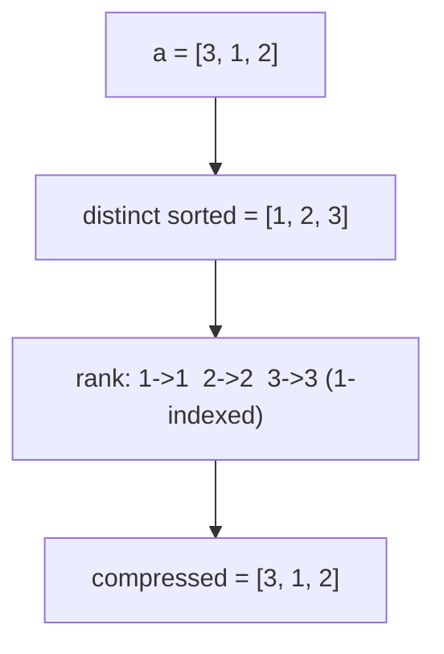
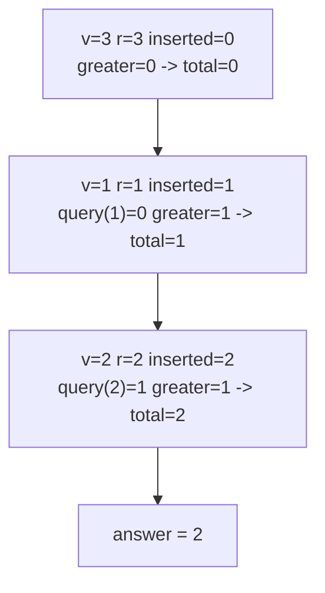
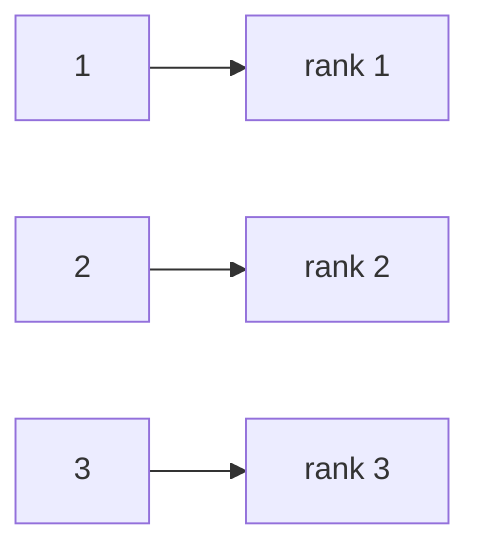

# Count Inversions with Coordinate Compression + Fenwick

| Field | Value |
|---|---|
| Source | Classic (CSES "Inversions" style / interview staple) |
| Difficulty | Medium |
| Primary topic | **Coordinate compression** |
| Secondary topic | Fenwick tree (BIT), inversion counting |
| Key constraint | $1 \le n \le 2 \cdot 10^5$, values up to $10^9$ (possibly negative) |

An **inversion** is a pair of indices $i < j$ with $a_i > a_j$ — a place where the array is "out of
order". We count all inversions in $O(n \log n)$ by sweeping left to right and, for each new
element, asking the BIT how many already-inserted values are **greater**. Because raw values are
huge, we **compress** them first.

---

## Statement

Given an array $a$ of $n$ integers, count the pairs $(i, j)$ with $i < j$ and $a_i > a_j$.

### Example

```text
Input:  a = [3, 1, 2]
Output: 2

Pairs (0-indexed):
(0,1): 3 > 1  -> inversion
(0,2): 3 > 2  -> inversion
(1,2): 1 > 2  -> not an inversion
Total inversions = 2
```

---

## WHY: An Inversion Is "Smaller Came Later"

Sweep **left to right**, inserting each value into a frequency structure as we pass it. When we
reach $a_j$, every value already inserted sits at some index $i < j$. The number of those that are
**greater than $a_j$** is exactly the count of inversions whose *right* end is $j$. Summing over all
$j$ counts every inversion once.


"How many inserted values are greater than $a_j$" is a **suffix** query over value-space, which a
Fenwick tree handles in $O(\log n)$ — but only once values are compressed to small ranks. With
values up to $10^9$ (or negative) we cannot index a BIT directly, so compression is mandatory.



---

## Solution

Compress to 1-indexed ranks, then sweep left to right. At each step add `(already inserted) - (those
≤ current)` greater elements, which equals `i - query(rank)`.

```python
import bisect

def count_inversions(a):
    sorted_unique = sorted(set(a))
    m = len(sorted_unique)
    bit = [0] * (m + 1)                      # 1-indexed Fenwick

    def update(i, delta):
        while i <= m:
            bit[i] += delta
            i += i & (-i)

    def query(i):                            # prefix sum [1..i]
        s = 0
        while i > 0:
            s += bit[i]
            i -= i & (-i)
        return s

    inversions = 0
    inserted = 0
    for v in a:
        r = bisect.bisect_left(sorted_unique, v) + 1     # 1-indexed rank
        # already inserted minus those <= v  =  those strictly greater than v
        inversions += inserted - query(r)
        update(r, 1)
        inserted += 1
    return inversions
```

```cpp
#include <bits/stdc++.h>
using namespace std;

long long countInversions(const vector<long long>& a) {
    vector<long long> sortedUnique = a;
    sort(sortedUnique.begin(), sortedUnique.end());
    sortedUnique.erase(unique(sortedUnique.begin(), sortedUnique.end()),
                       sortedUnique.end());
    int m = (int)sortedUnique.size();
    vector<long long> bit(m + 1, 0);         // 1-indexed Fenwick

    auto update = [&](int i, long long delta) {
        for (; i <= m; i += i & (-i)) bit[i] += delta;
    };
    auto query = [&](int i) -> long long {
        long long s = 0;
        for (; i > 0; i -= i & (-i)) s += bit[i];
        return s;
    };

    long long inversions = 0;
    long long inserted = 0;
    for (long long v : a) {
        int r = int(lower_bound(sortedUnique.begin(), sortedUnique.end(), v)
                    - sortedUnique.begin()) + 1;          // 1-indexed rank
        inversions += inserted - query(r);   // strictly greater than v
        update(r, 1);
        inserted += 1;
    }
    return inversions;
}
```

---

## Trace — `a = [3, 1, 2]`

Ranks (1-indexed): `3->3, 1->1, 2->2`. Sweep left to right.

| step | v | rank r | inserted (before) | query(r) = (<= v) | greater = inserted - query(r) | running inversions |
|---|---|---|---|---|---|---|
| 1 | 3 | 3 | 0 | 0 | 0 | 0 |
| 2 | 1 | 1 | 1 | 0 | 1 | 1 |
| 3 | 2 | 2 | 2 | 1 | 1 | 2 |

Total inversions = **2**.



Compression mapping for this array:



Why each new element's contribution is a suffix count:


---

## Math & Complexity

Total inversions decompose by right endpoint $j$:

$$
\text{inv} = \sum_{j} \big|\{\, i < j : a_i > a_j \,\}\big|
           = \sum_{j} \big(\, (\#\text{inserted}) - \#\{\,i<j : a_i \le a_j\,\} \,\big).
$$

| Quantity | Value |
|---|---|
| Compression | $O(n \log n)$ |
| $n$ BIT updates + queries | $O(n \log n)$ |
| **Total time** | $O(n \log n)$ |
| Space | $O(n)$ |

The maximum inversion count is $\binom{n}{2} \approx 2 \cdot 10^{10}$ for $n = 2 \cdot 10^5$, which
overflows 32-bit integers — accumulate in `long long`.

---

## Takeaway

Inversions = "smaller values that appear later". Sweep one direction, count greater-already-seen
with a Fenwick tree, and **compress values first** so the BIT is $O(n)$ wide no matter how large or
negative the inputs are.
