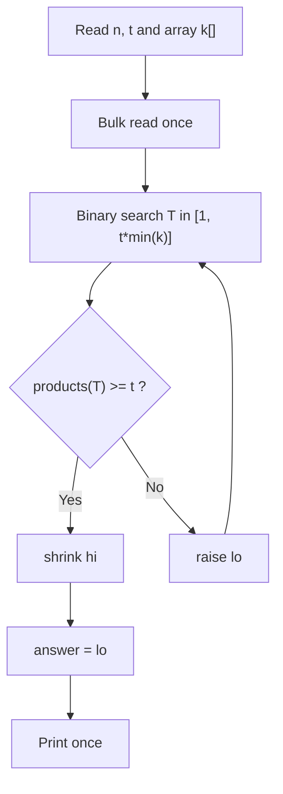
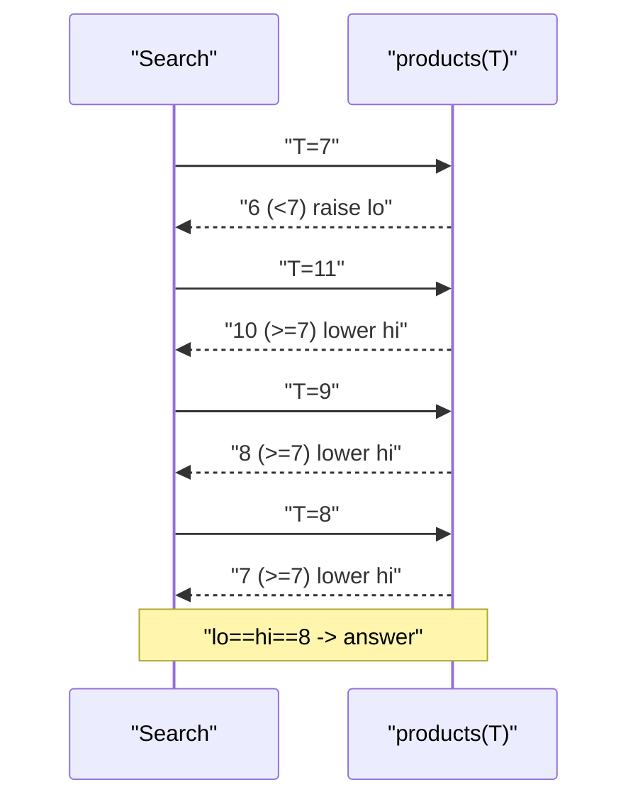
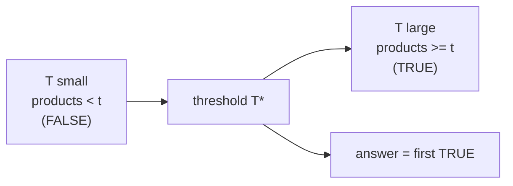

# CSES 1620 — Factory Machines (Fast I/O + Binary Search on Answer)

| Field | Value |
|---|---|
| Source | CSES Problem Set |
| Problem ID | 1620 |
| Link | https://cses.fi/problemset/task/1620 |
| Difficulty | Easy–Medium |
| Primary topic | **Fast I/O** |
| Secondary topic | Binary search on the answer |
| Key constraint | $1 \le n \le 2\cdot10^5$, $1 \le t \le 10^9$, machine times up to $10^9$ |

This problem is a clean excuse to practice **fast input** of a possibly large array plus a single **fast output** of one number. The algorithm is short (binary search on the answer); the writeup focuses on reading the data quickly and printing the result once.

---

## Statement

There are $n$ machines. Machine $i$ takes $k_i$ seconds to make one product. You must make a total of $t$ products. Multiple machines work in parallel. What is the **minimum time** needed to make at least $t$ products?

In time $T$, machine $i$ produces $\left\lfloor T / k_i \right\rfloor$ products. The total at time $T$ is non-decreasing in $T$, so we binary-search the smallest $T$ with total $\ge t$.

### Example

```text
Input:
3 7
3 2 5

Output:
8
```

At $T = 8$: machine 1 makes $\lfloor 8/3 \rfloor = 2$, machine 2 makes $\lfloor 8/2 \rfloor = 4$, machine 3 makes $\lfloor 8/5 \rfloor = 1$. Total $= 7 \ge 7$. At $T = 7$ the total is $2+3+1 = 6 < 7$. So the answer is $8$.

---

## WHY Fast I/O Matters Here

$n$ can be $2\cdot10^5$. That alone is small, but the **pattern** generalizes: read all integers in one bulk call, compute, then print one line. Using `input()` per token in Python or leaving `sync_with_stdio` on in C++ adds a constant factor that bites on the larger sibling problems. We also must use `long long` in C++: the upper bound on $T$ is about $t \cdot \min(k_i) \le 10^9 \cdot 10^9 = 10^{18}$, which overflows 32-bit.



---

## Solution (Paired Python + C++)

```python
import sys

def main():
    data = sys.stdin.buffer.read().split()
    idx = 0
    n = int(data[idx]); idx += 1
    t = int(data[idx]); idx += 1
    k = [int(data[idx + i]) for i in range(n)]
    idx += n

    def products(T):
        total = 0
        for ki in k:
            total += T // ki
            if total >= t:      # early exit avoids overflow-like blowups
                return total
        return total

    lo, hi = 1, min(k) * t      # hi: slowest machine alone makes t products
    while lo < hi:
        mid = (lo + hi) // 2
        if products(mid) >= t:
            hi = mid
        else:
            lo = mid + 1
    sys.stdout.write(str(lo) + '\n')

main()
```

```cpp
#include <bits/stdc++.h>
using namespace std;

int main() {
    ios_base::sync_with_stdio(false);
    cin.tie(nullptr);

    long long n, t;
    cin >> n >> t;
    vector<long long> k(n);
    long long mn = LLONG_MAX;
    for (long long i = 0; i < n; ++i) {
        cin >> k[i];
        mn = min(mn, k[i]);
    }

    auto products = [&](long long T) -> long long {
        long long total = 0;
        for (long long ki : k) {
            total += T / ki;
            if (total >= t) return total;   // early exit
        }
        return total;
    };

    long long lo = 1, hi = mn * t;          // up to 1e9 * 1e9 = 1e18, needs long long
    while (lo < hi) {
        long long mid = lo + (hi - lo) / 2;
        if (products(mid) >= t) hi = mid;
        else lo = mid + 1;
    }
    cout << lo << '\n';
    return 0;
}
```

---

## Trace

Input `n=3, t=7, k=[3,2,5]`. `min(k)=2`, so `hi = 2*7 = 14`, `lo = 1`.

```text
lo=1  hi=14  mid=7   products(7)=2+3+1=6   < 7 -> lo=8
lo=8  hi=14  mid=11  products(11)=3+5+2=10 >=7 -> hi=11
lo=8  hi=11  mid=9   products(9)=3+4+1=8   >=7 -> hi=9
lo=8  hi=9   mid=8   products(8)=2+4+1=7   >=7 -> hi=8
lo=8  hi=8   stop -> answer 8
```



The monotonic predicate that binary search relies on:



---

## Math & Complexity

Total products at time $T$:

$$P(T) = \sum_{i=1}^{n} \left\lfloor \frac{T}{k_i} \right\rfloor.$$

$P$ is non-decreasing, so $\{T : P(T) \ge t\}$ is an upper interval and the smallest such $T$ is well-defined. Search space upper bound:

$$T^\star \le t \cdot \min_i k_i \le 10^9 \cdot 10^9 = 10^{18}.$$

- Binary search iterations: $O(\log(t \cdot \min k)) \approx 60$.
- Each predicate evaluation: $O(n)$.
- Total time: $O(n \log(t \cdot \min k))$.
- I/O: one bulk read of $n+2$ integers, one write.

---

## Takeaway

Even when the algorithm is the "interesting" part, **bulk-read the input and print the single answer once**. Use `long long` whenever a product of two values near $10^9$ can appear — here the binary-search upper bound reaches $10^{18}$.
