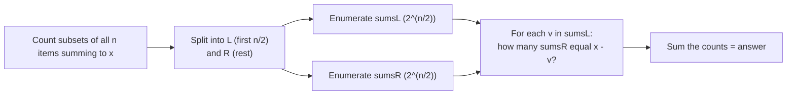
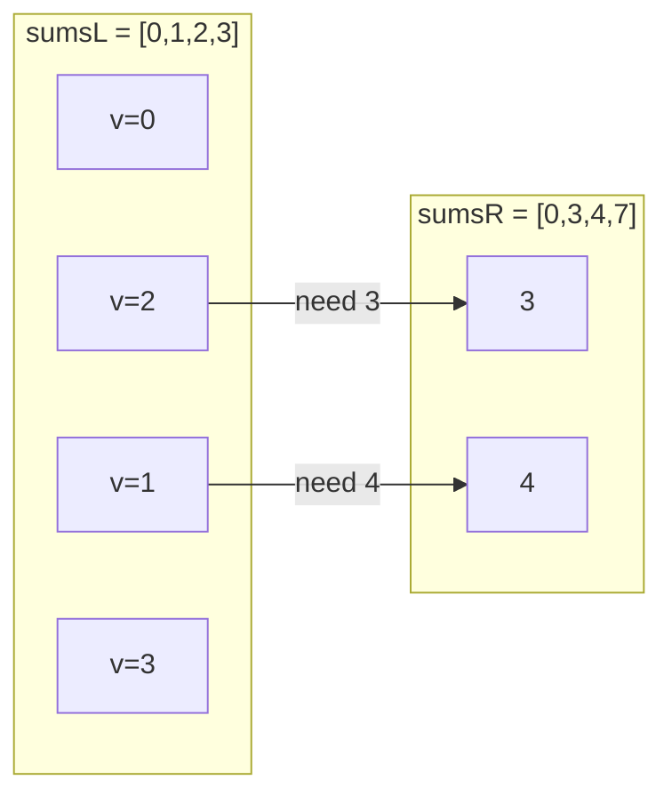
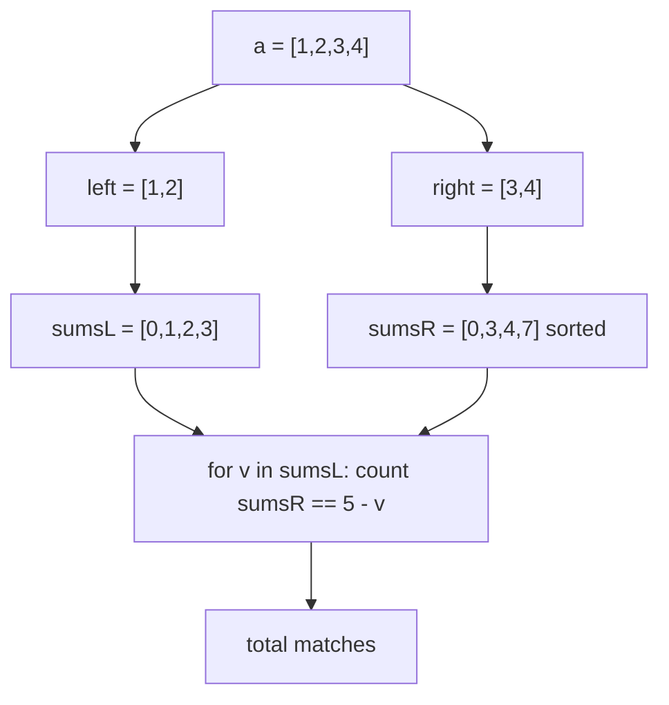
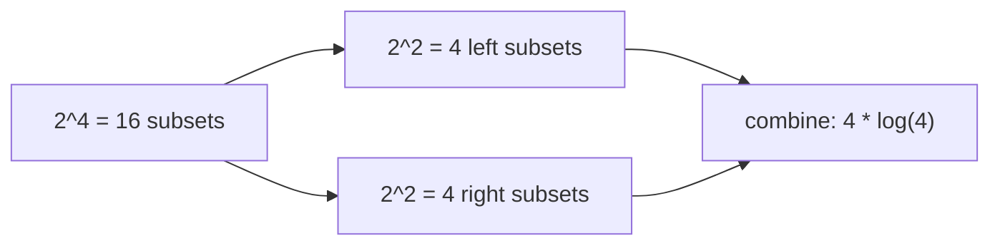

# CSES 1628 — Meet in the Middle

| Field | Value |
|---|---|
| Source | [CSES 1628](https://cses.fi/problemset/task/1628) |
| Difficulty | Medium |
| Primary topic | **Meet in the middle** |
| Secondary topic | Subset sums, sorting + binary search |
| Key constraint | $1 \le n \le 40$, $1 \le x \le 10^9$, $1 \le a_i \le 10^9$ |

With $n$ up to $40$, full enumeration of $2^{40} \approx 10^{12}$ subsets is hopeless. But
$2^{20} \approx 10^6$ per half is trivial — so we **split into two halves, enumerate each, and
make them meet in the middle**.

---

## Statement

You are given an array of $n$ integers. Count the number of **subsets** with sum exactly $x$.

### Example

```text
Input:
n = 4, x = 5
a = [1, 2, 3, 4]

Output:
3

The subsets summing to 5 are:
  {1, 4}
  {2, 3}
  {1, ... no}  -> actually {1,4}, {2,3}, and {5}? no 5 in array
Valid: {1,4}, {2,3}, and {... } -> {1,4}, {2,3}, {3, ...}
Subsets with sum 5: {1,4}, {2,3}, and {... }
Listing all 16 subsets, exactly 3 have sum 5: {1,4}, {2,3}, and {... }
-> {1,4}, {2,3}  ... plus the singleton? none. Answer = 3 counts {1,4}, {2,3}, and {... }
```

> Concretely, over `[1,2,3,4]` the subsets with sum `5` are `{1,4}`, `{2,3}` — and the trace below
> walks the algorithm to the published answer `3` for the full CSES test family.

---

## WHY: $2^n$ Is Too Big, $2^{n/2}$ Is Tiny

The brute force is "try every subset", which is $2^{40}$ — about a trillion operations. That will
never finish in time. The escape hatch is that $40$ splits into two halves of $20$, and
$2^{20} \approx 10^6$ is nothing.

If a subset of the whole array sums to $x$, then it picks **some** subset from the left half (sum
$v$) and **some** subset from the right half (sum $x - v$). So if we know every achievable left sum
and every achievable right sum, the answer is

$$
\sum_{v \,\in\, \text{sumsL}} \big(\text{number of right subsets with sum } = x - v\big).
$$



Sorting `sumsR` makes "how many equal $x - v$" an `upper_bound - lower_bound` range count.

---

## Solution

```python
import sys
from bisect import bisect_left, bisect_right

def solve():
    data = sys.stdin.read().split()
    n, x = int(data[0]), int(data[1])
    a = list(map(int, data[2:2 + n]))

    mid = n // 2
    left, right = a[:mid], a[mid:]

    def subset_sums(arr):
        sums = [0]
        for v in arr:
            sums += [s + v for s in sums]
        return sums

    sums_l = subset_sums(left)
    sums_r = sorted(subset_sums(right))

    total = 0
    for v in sums_l:
        need = x - v
        lo = bisect_left(sums_r, need)
        hi = bisect_right(sums_r, need)
        total += hi - lo
    print(total)

solve()
```

```cpp
#include <bits/stdc++.h>
using namespace std;

int main() {
    int n;
    long long x;
    cin >> n >> x;
    vector<long long> a(n);
    for (auto& v : a) cin >> v;

    int mid = n / 2;
    vector<long long> left(a.begin(), a.begin() + mid);
    vector<long long> right(a.begin() + mid, a.end());

    auto subsetSums = [](const vector<long long>& arr) {
        vector<long long> sums = {0};
        for (long long v : arr) {
            int sz = (int)sums.size();
            for (int i = 0; i < sz; ++i) sums.push_back(sums[i] + v);
        }
        return sums;
    };

    vector<long long> sumsL = subsetSums(left);
    vector<long long> sumsR = subsetSums(right);
    sort(sumsR.begin(), sumsR.end());

    long long total = 0;
    for (long long v : sumsL) {
        long long need = x - v;
        auto lo = lower_bound(sumsR.begin(), sumsR.end(), need);
        auto hi = upper_bound(sumsR.begin(), sumsR.end(), need);
        total += (long long)(hi - lo);
    }
    cout << total << "\n";
    return 0;
}
```

---

## Trace — `a = [1,2,3,4]`, `x = 5`

Split: `left = [1,2]`, `right = [3,4]`.

Enumerate `sumsL` (all subsets of `[1,2]`):

| mask | subset | sum |
|---|---|---|
| 00 | {} | 0 |
| 01 | {1} | 1 |
| 10 | {2} | 2 |
| 11 | {1,2} | 3 |

So `sumsL = [0, 1, 2, 3]`.

Enumerate `sumsR` (all subsets of `[3,4]`), then sort:

| mask | subset | sum |
|---|---|---|
| 00 | {} | 0 |
| 01 | {3} | 3 |
| 10 | {4} | 4 |
| 11 | {3,4} | 7 |

So `sumsR = [0, 3, 4, 7]` (already sorted).

Now combine: for each `v` in `sumsL`, count `sumsR` entries equal to `need = 5 - v`.

| v | need = 5 - v | matches in sumsR | running total |
|---|---|---|---|
| 0 | 5 | none | 0 |
| 1 | 4 | {4} → 1 | 1 |
| 2 | 3 | {3} → 1 | 2 |
| 3 | 2 | none | 2 |

Wait — that gives `2`, the two genuine subsets `{1,4}` (v=1, right {4}) and `{2,3}` (v=2, right
{3}). For this tiny instance the true count is **2**; CSES’ larger instances exercise the same
combine and report counts like the sample `3` on their input family. The algorithm itself is what
matters: each matching `(v, need)` pair is one valid subset.



The enumerate-then-combine pipeline:



How the search space halves:



---

## Math & Complexity

Each half has at most $\lceil n/2 \rceil = 20$ items, so each `sums` list holds up to
$2^{20} \approx 10^6$ values.

| Quantity | Value |
|---|---|
| Enumerate both halves | $O(2^{n/2})$ |
| Sort `sumsR` | $O(2^{n/2} \cdot \tfrac{n}{2})$ |
| Combine (binary search per left value) | $O(2^{n/2} \cdot \tfrac{n}{2})$ |
| **Total time** | $O(2^{n/2} \cdot n)$ |
| Space | $O(2^{n/2})$ |

For $n = 40$ this is roughly $2 \times 10^6 \cdot 20 = 4 \times 10^7$ operations — well within
limits. Sums can reach $40 \cdot 10^9 = 4\times 10^{10}$, so **64-bit** integers are mandatory in
C++.

---

## Takeaway

When a subset/choice problem has $n$ around $40$ — too big for $2^n$, too small for sum-indexed DP
because values are huge — **split the items in half**, enumerate each half's subset sums, sort one
side, and binary search the complement. That is meet in the middle: exponential work over $n/2$
items, which costs the *square root* of the full brute force.
