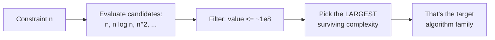
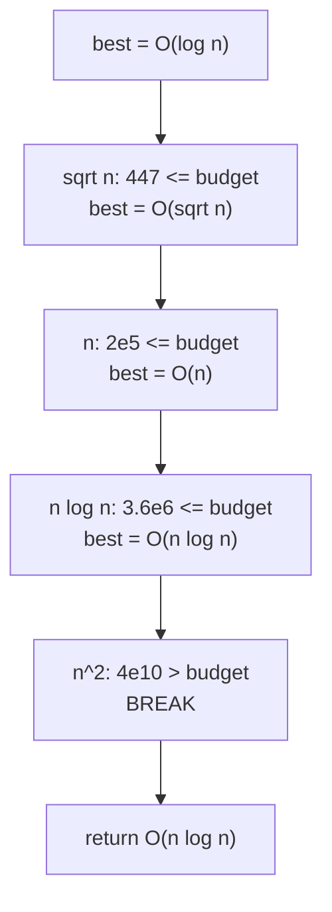
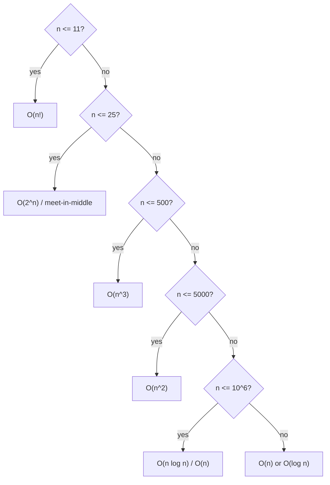

# Estimate Complexity From Constraints

| Field | Value |
|---|---|
| **Module** | basics |
| **Topic** | Time & space complexity — reading constraints |
| **Difficulty** | Easy → Medium (foundational skill) |
| **Core idea** | Map the input bound $n$ to the largest complexity that fits in ~1 second |
| **Time (solution check)** | $O(1)$ per estimate |
| **Space** | $O(1)$ |
| **Prereqs** | Big-O notation, the growth hierarchy |

---

## Problem Statement

You are given the constraints of an algorithmic problem (the maximum input size $n$, possibly extra dimensions, a time limit, and number of test cases). **Without writing the actual algorithm**, decide which **algorithmic complexity class** is the target — i.e. the slowest growth rate that still finishes within the time limit.

This is the meta-skill you apply at the *start* of every contest problem: the constraints tell you which family of solutions to even consider.

### Example

```text
Input constraints:
  n <= 200000
  time limit = 1 second
  single test case

Question: What is the largest feasible complexity?

Answer:
  n = 2e5, budget ~ 1e8 .. a few e8.
  O(n^2) = 4e10  -> too slow.
  O(n log n) = 2e5 * 18 ~ 3.6e6 -> easily fits.
  => Target O(n log n) (sorting, segment tree, two-pointer + sort, etc.)
```

---

## Why This Works

A judge performs on the order of **$10^8$ simple operations per second**. So for a 1-second limit, you have a **budget** of roughly $10^8$ (give or take a constant). To pick a complexity:

1. Plug the maximum $n$ into each candidate complexity.
2. The largest one whose value stays under a few $\times 10^8$ is your target.

The reason this is reliable: complexity classes are spaced **multiplicatively far apart** (see the hierarchy), so the "right" answer is almost always unambiguous — one class overshoots the budget wildly, the next undershoots comfortably.



---

## Approach (paired implementations)

We build a small estimator: given $n$ and a time budget, it returns the largest complexity from a candidate list whose estimated op-count fits.

```python
import math

def feasible_complexity(n, budget=2 * 10**8):
    # candidates ordered from slowest-growing to fastest-growing
    candidates = [
        ("O(log n)", lambda n: max(1, math.ceil(math.log2(n)))),
        ("O(sqrt n)", lambda n: int(math.isqrt(n))),
        ("O(n)",      lambda n: n),
        ("O(n log n)",lambda n: n * max(1, math.ceil(math.log2(n)))),
        ("O(n^2)",    lambda n: n * n),
        ("O(n^3)",    lambda n: n * n * n),
        ("O(2^n)",    lambda n: 2 ** n if n < 63 else float("inf")),
    ]
    best = "O(log n)"
    for name, f in candidates:
        if f(n) <= budget:
            best = name      # still feasible -> remember the slower (bigger) one
        else:
            break            # everything after grows faster -> stop
    return best

print(feasible_complexity(200000))   # O(n log n)
print(feasible_complexity(500))      # O(n^3)
print(feasible_complexity(20))       # O(2^n)
```

```cpp
#include <bits/stdc++.h>
using namespace std;

string feasible_complexity(long long n, double budget = 2e8) {
    // candidates ordered from slowest-growing to fastest-growing
    vector<pair<string, function<double(long long)>>> candidates = {
        {"O(log n)",   [](long long n){ return max(1.0, ceil(log2((double)n))); }},
        {"O(sqrt n)",  [](long long n){ return (double)(long long)sqrtl((long double)n); }},
        {"O(n)",       [](long long n){ return (double)n; }},
        {"O(n log n)", [](long long n){ return (double)n * max(1.0, ceil(log2((double)n))); }},
        {"O(n^2)",     [](long long n){ return (double)n * (double)n; }},
        {"O(n^3)",     [](long long n){ return (double)n * (double)n * (double)n; }},
        {"O(2^n)",     [](long long n){ return n < 63 ? pow(2.0,(double)n)
                                                       : numeric_limits<double>::infinity(); }},
    };
    string best = "O(log n)";
    for (auto& [name, f] : candidates) {
        if (f(n) <= budget) {
            best = name;     // still feasible -> remember the slower (bigger) one
        } else {
            break;           // everything after grows faster -> stop
        }
    }
    return best;
}

int main() {
    cout << feasible_complexity(200000) << "\n";  // O(n log n)
    cout << feasible_complexity(500) << "\n";      // O(n^3)
    cout << feasible_complexity(20) << "\n";       // O(2^n)
    return 0;
}
```

For multi-dimensional constraints, combine dimensions the way the algorithm nests them, then compare against the same budget:

```python
def combined_ok(dims_product, budget=2 * 10**8):
    # dims_product = how the algorithm multiplies its dimensions, e.g. n*m or n*n*m
    return dims_product <= budget, dims_product

print(combined_ok(1000 * 1000))         # (True, 1_000_000)  -> O(n*m) fine
print(combined_ok(1000 * 1000 * 1000))  # (False, 1e9)       -> too slow
```

```cpp
#include <bits/stdc++.h>
using namespace std;

pair<bool, double> combined_ok(double dims_product, double budget = 2e8) {
    // dims_product = how the algorithm multiplies its dimensions, e.g. n*m or n*n*m
    return {dims_product <= budget, dims_product};
}

int main() {
    auto a = combined_ok(1000.0 * 1000.0);            // (1, 1e6)  -> O(n*m) fine
    auto b = combined_ok(1000.0 * 1000.0 * 1000.0);   // (0, 1e9)  -> too slow
    cout << a.first << " " << a.second << "\n";
    cout << b.first << " " << b.second << "\n";
    return 0;
}
```

---

## Trace

Run `feasible_complexity(200000)` with budget $2\times10^8$:

| Candidate | Value at $n=2\times10^5$ | $\le 2\times10^8$? | `best` after step |
|---|---|---|---|
| $O(\log n)$ | $18$ | yes | `O(log n)` |
| $O(\sqrt n)$ | $447$ | yes | `O(sqrt n)` |
| $O(n)$ | $2\times10^5$ | yes | `O(n)` |
| $O(n\log n)$ | $\approx 3.6\times10^6$ | yes | `O(n log n)` |
| $O(n^2)$ | $4\times10^{10}$ | **no** | — (break) |

Loop stops at the first failure; the last feasible class is **`O(n log n)`**.



The decision tree a human uses for the common breakpoints:



---

## Math & Complexity

The budget model: with $\approx 10^8$ ops/sec and a limit of $L$ seconds, feasibility requires
$$\text{ops}(n) \;\lesssim\; 10^8 \cdot L \cdot \frac{1}{\kappa},$$
where $\kappa \ge 1$ is the **constant factor** of one "operation" (heavier for modular arithmetic, recursion, pointer chasing). Because classes are multiplicatively separated, the chosen class is robust to the exact value of $\kappa$:

$$\frac{\text{ops}_{\text{quadratic}}}{\text{ops}_{\text{linearithmic}}} = \frac{n^2}{n\log n} = \frac{n}{\log n},$$

which for $n = 2\times10^5$ is about $1.1\times10^4$ — a four-orders-of-magnitude gap, far larger than any reasonable constant factor. The estimator itself is $O(\#\text{candidates}) = O(1)$ time and $O(1)$ space.

| Constraint pattern | Combine as | Target |
|---|---|---|
| single $n \le 10^5$ | $n$ | $O(n\log n)$ |
| grid $n,m \le 10^3$ | $n\cdot m$ | $O(nm)$ |
| $n \le 500$, all-pairs | $n^3$ | $O(n^3)$ (Floyd–Warshall) |
| $n \le 40$, subsets | $2^{n/2}$ | meet-in-the-middle |
| huge $n \le 10^{18}$ | $\log n$ | binary search / number theory |

---

## Takeaway

- **Constraints encode the intended complexity.** Read $n$ before designing.
- Use the **$10^8$/sec budget**: plug $n$ in, keep the largest class under a few $\times 10^8$.
- The wide multiplicative spacing of complexity classes makes the choice **robust** to constant factors.
- For multiple dimensions, **multiply them as the algorithm nests them**, and mind sum-of-$n$ rules across test cases.
