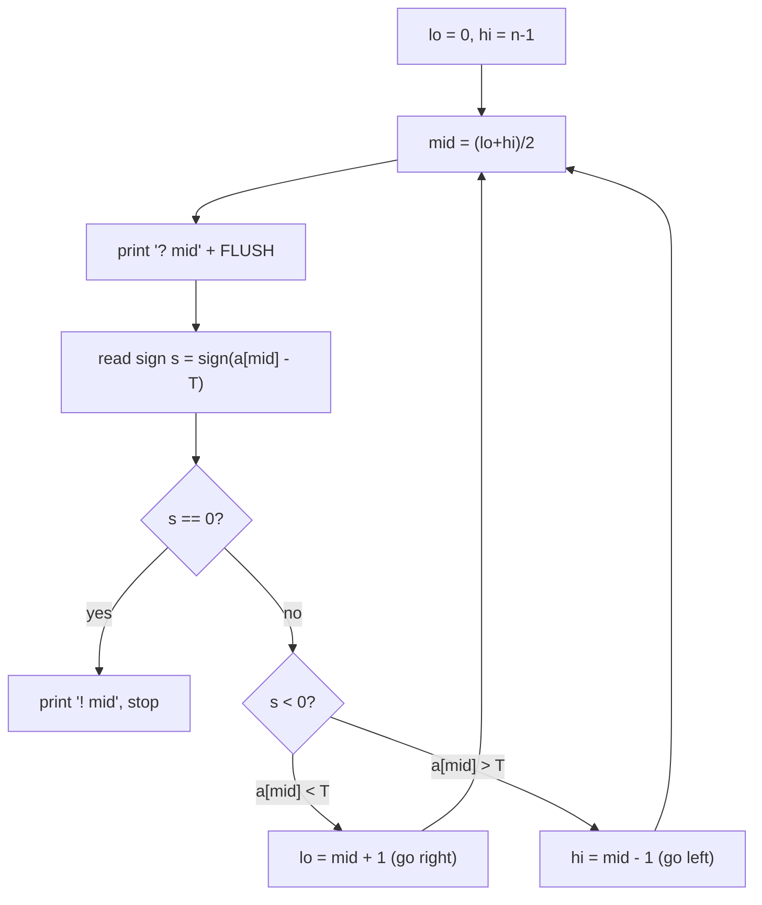
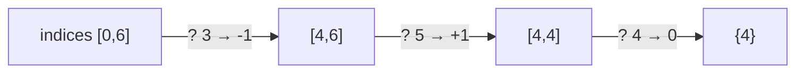

# Find a Hidden Index via Comparison Queries (Interactive)

| Meta | Value |
|------|-------|
| **Problem** | Locate a hidden index in an array using comparison queries |
| **Source** | Self-contained (interactive) |
| **Link** | — |
| **Difficulty** | Medium |
| **Topics** | Interactive, Binary Search, Comparisons |
| **Time** | $O(\log n)$ |
| **Queries** | $\lceil \log_2 n \rceil$ |

---

## Problem Statement

There is a hidden array of length $n$ that is **strictly increasing**, and the judge has
secretly chosen a **target value** $T$ that appears at exactly one index $p$ (so
$a[p] = T$). You cannot read the array directly. Instead, each round you ask a **comparison
query** `? i` and the judge replies with the sign of $a[i] - T$:

- `-1` if $a[i] < T$ (the target lies to the **right** of $i$),
- `0`  if $a[i] = T$ (index $i$ **is** the answer),
- `1`  if $a[i] > T$ (the target lies to the **left** of $i$).

Find $p$ within $\lceil \log_2 n \rceil$ queries, **flushing** after each query. When found,
print `! p`.

```text
n = 7, hidden array = [2, 4, 6, 9, 13, 20, 21], target T = 13  (answer p = 4)

>> ? 3        (compare a[3] = 9 with T)
<< -1         (a[3] < T, target is to the right)
>> ? 5        (compare a[5] = 20 with T)
<< 1          (a[5] > T, target is to the left)
>> ? 4        (compare a[4] = 13 with T)
<< 0          (match!)
>> ! 4        (declare the index)
```

---

## Approach (WHY)

Because the array is **strictly increasing**, the comparison sign is **monotone in the
index**: all indices left of $p$ answer `-1`, index $p$ answers `0`, and all indices right of
$p$ answer `1`. A single boundary separates "too small" from "too big" — the textbook setup
for **binary search on indices**. We keep an inclusive index interval $[lo, hi]$ known to
contain $p$, probe the middle index, and discard the half the reply rules out.

We never see actual values; we only learn *relative order* via the sign. That is enough,
because the order is all binary search needs. The cost is $\lceil \log_2 n \rceil$ queries, and
the only operational hazard is forgetting to **flush**, which would deadlock the dialogue.



---

## Code

```python
import sys

def find_hidden_index(n):
    lo, hi = 0, n - 1
    while lo <= hi:
        mid = (lo + hi) // 2
        print(f"? {mid}", flush=True)        # FLUSH every comparison query
        s = int(sys.stdin.readline())        # sign of a[mid] - T
        if s == 0:                           # a[mid] == T: found the index
            print(f"! {mid}", flush=True)
            return mid
        elif s < 0:                          # a[mid] < T: target is to the right
            lo = mid + 1
        else:                                # a[mid] > T: target is to the left
            hi = mid - 1
```

```cpp
#include <bits/stdc++.h>
using namespace std;

long long find_hidden_index(long long n) {
    long long lo = 0, hi = n - 1;
    while (lo <= hi) {
        long long mid = lo + (hi - lo) / 2;
        cout << "? " << mid << endl;         // endl FLUSHES every comparison query
        long long s;
        cin >> s;                            // sign of a[mid] - T
        if (s == 0) {                        // a[mid] == T: found the index
            cout << "! " << mid << endl;
            return mid;
        } else if (s < 0) {                  // a[mid] < T: target is to the right
            lo = mid + 1;
        } else {                             // a[mid] > T: target is to the left
            hi = mid - 1;
        }
    }
    return -1;
}
```

A defensive variant exits on an error sentinel `-9` (e.g. invalid index or budget exceeded):

```python
import sys

s = int(sys.stdin.readline())
if s == -9:                  # judge rejected the query
    sys.exit(0)              # stop immediately to avoid a deadlock
```

```cpp
#include <bits/stdc++.h>
using namespace std;

int main() {
    long long s;
    cin >> s;
    if (s == -9) {           // judge rejected the query
        return 0;            // stop immediately to avoid a deadlock
    }
    return 0;
}
```

---

## Trace / Transcript

Hidden array `[2,4,6,9,13,20,21]`, $T = 13$, answer $p = 4$. Indices $[0,6]$ shrink as:

| Round | $lo$ | $hi$ | $mid$ | $a[mid]$ | Query | Sign | New interval |
|-------|------|------|-------|----------|-------|------|--------------|
| 1 | 0 | 6 | 3 | 9  | `? 3` | `-1` | $[4,6]$ |
| 2 | 4 | 6 | 5 | 20 | `? 5` | `1`  | $[4,4]$ |
| 3 | 4 | 4 | 4 | 13 | `? 4` | `0`  | done → `! 4` |

```mermaid
sequenceDiagram
    participant S as Solution
    participant J as Judge (target T = 13)
    S->>J: ? 3
    Note right of S: FLUSH
    J->>S: -1 (a[3]=9 &lt; T)
    S->>J: ? 5
    Note right of S: FLUSH
    J->>S: 1 (a[5]=20 &gt; T)
    S->>J: ? 4
    Note right of S: FLUSH
    J->>S: 0 (a[4]=13 == T)
    S->>J: ! 4
```

```mermaid
sequenceDiagram
    participant S as Solution
    participant J as Judge
    Note over S,J: monotone sign means one boundary index p
    S->>J: ? mid
    alt a[mid] &lt; T
        J->>S: -1
        Note over S: lo = mid + 1
    else a[mid] == T
        J->>S: 0
        Note over S: print '! mid' and exit
    else a[mid] &gt; T
        J->>S: 1
        Note over S: hi = mid - 1
    end
```



---

## Math / Complexity

The interval of candidate indices has size $m = hi - lo + 1$ and at least halves per query,
so after $k$ queries it is at most $n / 2^{k}$. We finish once that is below $1$:

$$
\frac{n}{2^{k}} < 1 \iff k = \left\lceil \log_2 n \right\rceil .
$$

Worst case $\lceil \log_2 n \rceil$ queries, $O(\log n)$ time, $O(1)$ space. With $n = 10^6$
that is just $20$ comparison queries.

---

## Takeaway

When you can only **compare** (not read) and the underlying order is **monotone**, the
comparison sign *is* your binary-search predicate. Binary-search the **index**, flush every
comparison, and stop on the `0` reply — locating the hidden index in $\lceil \log_2 n \rceil$
queries.
