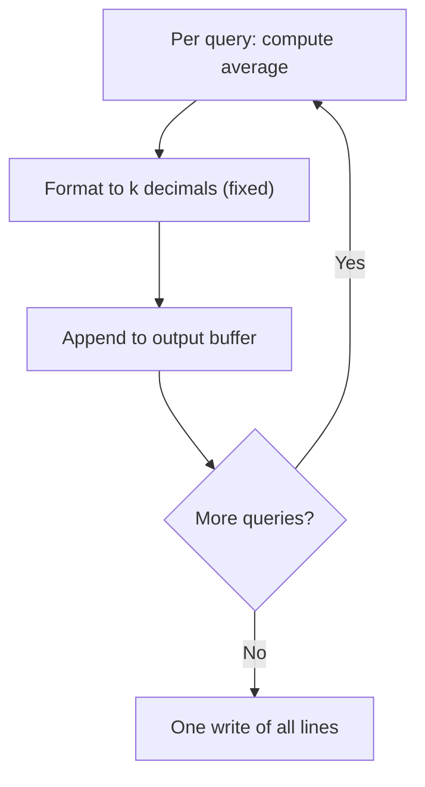
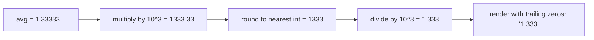
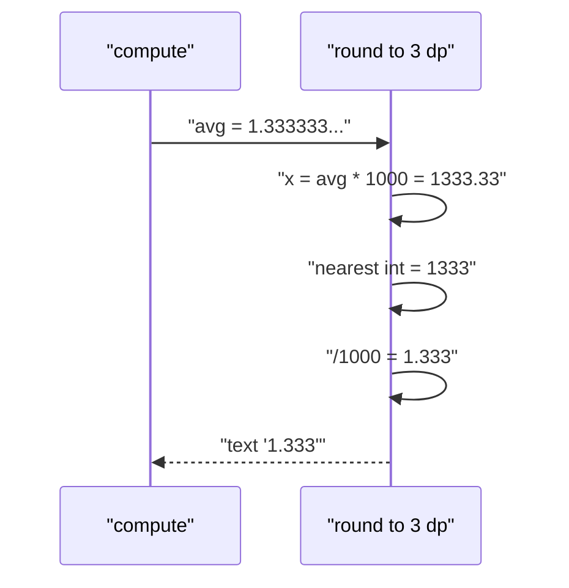
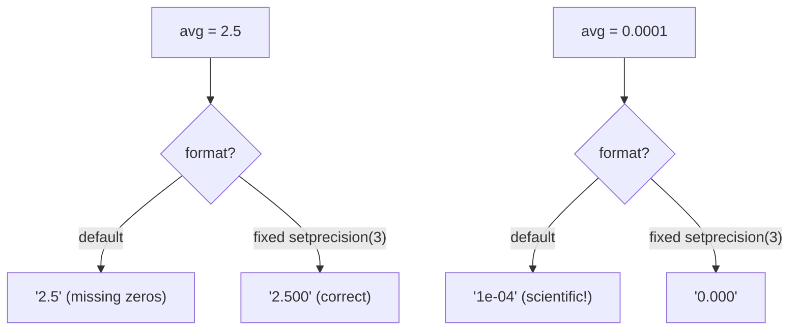

# Formatted Float Output — Averages to Fixed Decimals

| Field | Value |
|---|---|
| Source | Self-contained drill |
| Difficulty | Easy |
| Primary topic | **Floating-point output formatting** |
| Secondary topic | Rounding, fixed precision, fast batched output |
| Key constraint | $1 \le q \le 10^5$ queries, each with $1 \le n \le 10^5$ integers, $|a_i| \le 10^9$ |

Many problems ask for an answer "to $k$ decimal places". Getting the **format and rounding** right — and printing all answers efficiently — is the skill drilled here.

---

## Statement

You are given $q$ independent queries. Each query gives an integer $n$ followed by $n$ integers. For each query print the **average** of its integers, rounded to exactly **3 decimal places** (fixed notation, never scientific).

### Example

```text
Input:
3
4 1 2 3 4
3 1 1 2
2 5 2

Output:
2.500
1.333
3.500
```

Query 1: $(1+2+3+4)/4 = 2.5 \to$ `2.500`. Query 2: $4/3 = 1.3333\ldots \to$ `1.333`. Query 3: $7/2 = 3.5 \to$ `3.500`.

---

## WHY: Formatting + Batching Both Matter

Two failure modes:

1. **Wrong format** — default printing may show `2.5` instead of `2.500`, drop trailing zeros, or switch to scientific notation like `1.3e+00`. You must force *fixed* notation with a set precision.
2. **Slow output** — with $q = 10^5$ answers, flushing per line (`endl`) or many small writes is wasteful. Build one buffer, write once.



How fixed precision maps a real number to text:



---

## Solution (Paired Python + C++)

```python
import sys

def main():
    data = sys.stdin.buffer.read().split()
    idx = 0
    q = int(data[idx]); idx += 1
    out = []
    for _ in range(q):
        n = int(data[idx]); idx += 1
        s = 0
        for i in range(n):
            s += int(data[idx + i])
        idx += n
        avg = s / n
        out.append(f"{avg:.3f}")     # fixed, exactly 3 decimals, rounded
    sys.stdout.write('\n'.join(out) + '\n')

main()
```

```cpp
#include <bits/stdc++.h>
using namespace std;

int main() {
    ios_base::sync_with_stdio(false);
    cin.tie(nullptr);
    int q;
    cin >> q;
    cout << fixed << setprecision(3);    // set once: sticky for the whole stream
    ostringstream out;
    out << fixed << setprecision(3);     // format the buffer too
    while (q--) {
        int n;
        cin >> n;
        long long s = 0, x;
        for (int i = 0; i < n; ++i) { cin >> x; s += x; }
        double avg = (double)s / n;
        out << avg << '\n';
    }
    cout << out.str();                   // single write
    return 0;
}
```

> Note: `setprecision(3)` **with** `fixed` means "3 digits after the decimal point". **Without** `fixed`, `setprecision(3)` would mean "3 significant digits" — a common bug.

---

## Trace

Input: `q=3`; queries `[1,2,3,4]`, `[1,1,2]`, `[5,2]`.

```text
q=3
query 1: n=4, s=10, avg=2.5      -> "2.500"
query 2: n=3, s=4,  avg=1.33333  -> round(1333.33)=1333 -> "1.333"
query 3: n=2, s=7,  avg=3.5      -> "3.500"
out = ["2.500","1.333","3.500"]
write "2.500\n1.333\n3.500\n"
```

The rounding step in detail for query 2:



`fixed` vs default formatting:



---

## Math & Complexity

For query $j$ with values $a_1,\dots,a_{n_j}$ the average is

$$\bar{a}_j = \frac{1}{n_j}\sum_{i=1}^{n_j} a_i.$$

Printing with $k=3$ decimals outputs

$$\widehat{a}_j = \frac{\mathrm{round}\!\left(\bar{a}_j \cdot 10^{k}\right)}{10^{k}},$$

so the absolute representation error is bounded by half a unit in the last place:

$$\left|\widehat{a}_j - \bar{a}_j\right| \le \frac{1}{2}\cdot 10^{-k} = 0.0005.$$

A `double` carries ~15–16 significant decimal digits, far more than the 3 we print, so for sums up to $n\cdot\max|a_i| \le 10^5\cdot10^9 = 10^{14}$ the average is represented accurately enough that 3-decimal rounding is exact in practice. (Accumulate the sum in `long long` first to avoid floating error in the summation itself.)

- Time: $O\!\left(\sum_j n_j\right)$ total over all queries.
- Output: $O(q)$ lines, written in **one** syscall.


---

## Takeaway

Force **`fixed` + `setprecision(k)`** in C++ (or `f"{x:.kf}"` in Python) so you get exactly $k$ decimals with proper rounding and no scientific notation. Sum integers in **`long long`** before dividing, and **batch all answers** into one write to keep $10^5$ queries fast.
