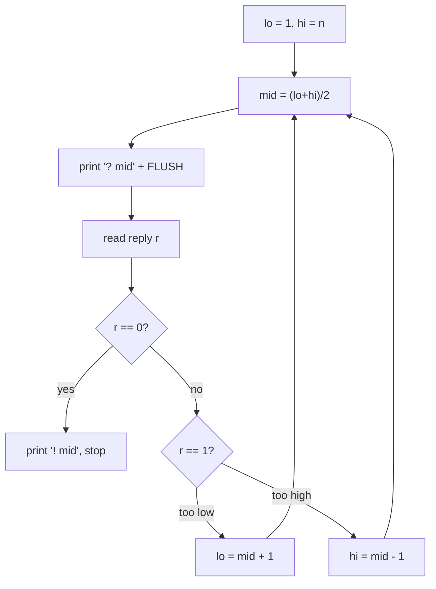
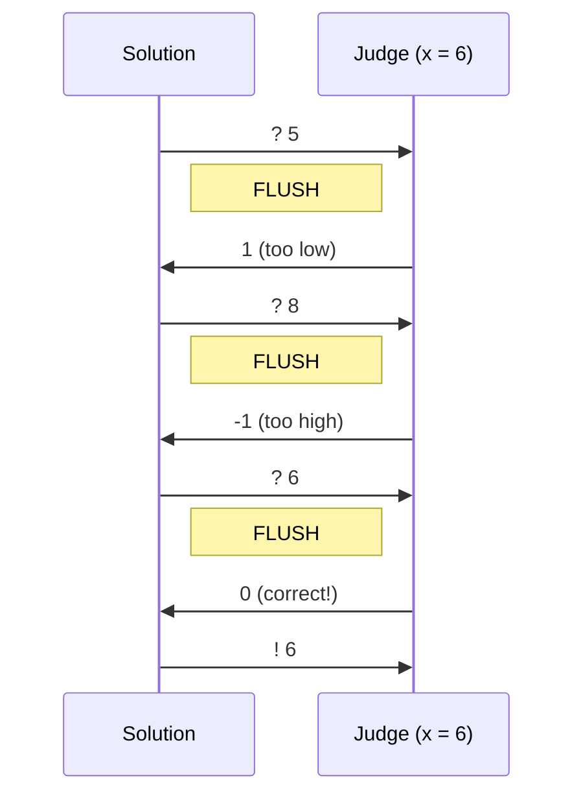
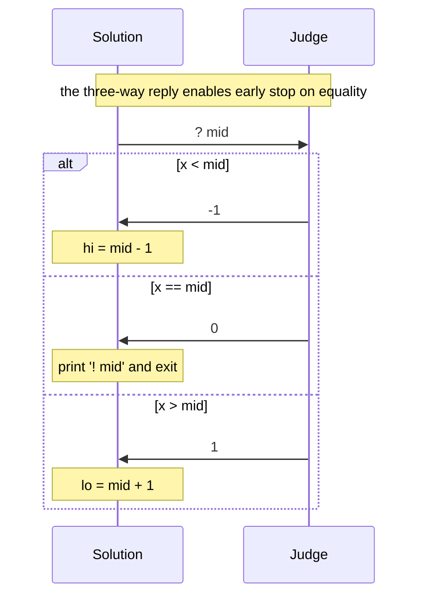
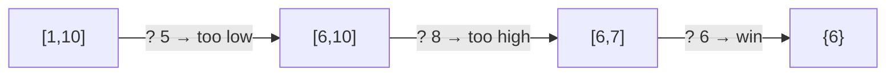

# Guess the Number (Interactive Binary Search)

| Meta | Value |
|------|-------|
| **Problem** | Guess the hidden number using a higher/lower oracle |
| **Source** | LeetCode 374 (framed interactively) |
| **Link** | https://leetcode.com/problems/guess-number-higher-or-lower/ |
| **Difficulty** | Easy |
| **Topics** | Interactive, Binary Search |
| **Time** | $O(\log n)$ |
| **Queries** | $\lceil \log_2 n \rceil$ |

---

## Problem Statement

The judge secretly picks a number $x \in [1, n]$. You play a guessing game: each round you
**print a guess** `? g` and the judge **answers**:

- `-1` if $x < g$ (your guess is **too high**),
- `1`  if $x > g$ (your guess is **too low**),
- `0`  if $x = g$ (you **win** — then print `! g` and stop).

You must find $x$ within $\lceil \log_2 n \rceil$ guesses, **flushing** after every query.

```text
n = 10, secret x = 6

>> ? 5        (you guess 5)
<< 1          (too low, x > 5)
>> ? 8        (you guess 8)
<< -1         (too high, x < 8)
>> ? 6        (you guess 6)
<< 0          (correct!)
>> ! 6        (declare the answer)
```

---

## Approach (WHY)

The oracle is **monotone**: every number below $x$ answers "too low" and every number above
answers "too high". That single monotone boundary is exactly the precondition for **binary
search**. Maintain an inclusive interval $[lo, hi]$ that is *guaranteed* to contain $x$.
Guessing the midpoint and reading the reply lets us throw away **half** the interval each
round, so we converge in $\lceil \log_2 n \rceil$ queries — only 30 even for $n = 10^9$.

Why not linear scan? It costs up to $n$ queries and would blow any realistic budget. Binary
search is both optimal (matches the information-theoretic $\log_2 n$ lower bound) and dead
simple, provided we **flush every guess** so the judge actually receives it.



---

## Code

```python
import sys

def guess_the_number(n):
    lo, hi = 1, n
    while lo <= hi:
        mid = (lo + hi) // 2
        print(f"? {mid}", flush=True)        # FLUSH after every guess
        r = int(sys.stdin.readline())
        if r == 0:                           # x == mid: win
            print(f"! {mid}", flush=True)
            return mid
        elif r == 1:                         # x > mid: too low
            lo = mid + 1
        else:                                # x < mid: too high
            hi = mid - 1
```

```cpp
#include <bits/stdc++.h>
using namespace std;

long long guess_the_number(long long n) {
    long long lo = 1, hi = n;
    while (lo <= hi) {
        long long mid = lo + (hi - lo) / 2;
        cout << "? " << mid << endl;         // endl FLUSHES after every guess
        long long r;
        cin >> r;
        if (r == 0) {                        // x == mid: win
            cout << "! " << mid << endl;
            return mid;
        } else if (r == 1) {                 // x > mid: too low
            lo = mid + 1;
        } else {                             // x < mid: too high
            hi = mid - 1;
        }
    }
    return -1;
}
```

If the judge can also send an error sentinel (e.g. `-2` for "out of budget"), bail out at once
instead of guessing again:

```python
import sys

r = int(sys.stdin.readline())
if r == -2:                  # error / budget exceeded
    sys.exit(0)              # never query after a sentinel
```

```cpp
#include <bits/stdc++.h>
using namespace std;

int main() {
    long long r;
    cin >> r;
    if (r == -2) {           // error / budget exceeded
        return 0;            // never query after a sentinel
    }
    return 0;
}
```

---

## Trace / Transcript

For $n = 10$, secret $x = 6$, the interval shrinks $[1,10] \to [6,10] \to [6,7] \to \{6\}$:

| Round | $lo$ | $hi$ | $mid$ | Query | Reply | New interval |
|-------|------|------|-------|-------|-------|--------------|
| 1 | 1 | 10 | 5 | `? 5` | `1` (too low) | $[6,10]$ |
| 2 | 6 | 10 | 8 | `? 8` | `-1` (too high) | $[6,7]$ |
| 3 | 6 | 7  | 6 | `? 6` | `0` (win) | done → `! 6` |







---

## Math / Complexity

Each guess replaces the interval of size $m = hi - lo + 1$ with one of size at most
$\lfloor m/2 \rfloor$. Starting from $n$, after $k$ guesses the interval has size at most
$n / 2^{k}$, and we are done once that drops below $1$:

$$
\frac{n}{2^{k}} < 1 \iff k > \log_2 n \iff k = \left\lceil \log_2 n \right\rceil .
$$

So the worst case is $\lceil \log_2 n \rceil$ queries and $O(\log n)$ time; space is $O(1)$.
This matches the information-theoretic bound, since each three-way answer yields at most
$\log_2 3$ bits but we only *need* to isolate one of $n$ values.

---

## Takeaway

A **monotone higher/lower oracle is binary search in disguise**. Keep an inclusive interval
that provably contains the answer, halve it per query, **flush every guess**, and stop on the
equality reply — all within the tight $\lceil \log_2 n \rceil$ budget.
