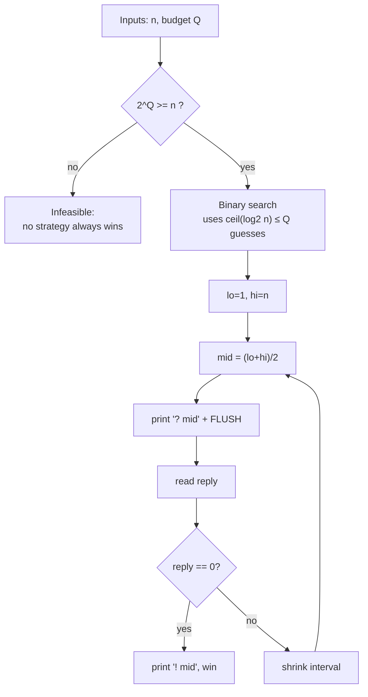
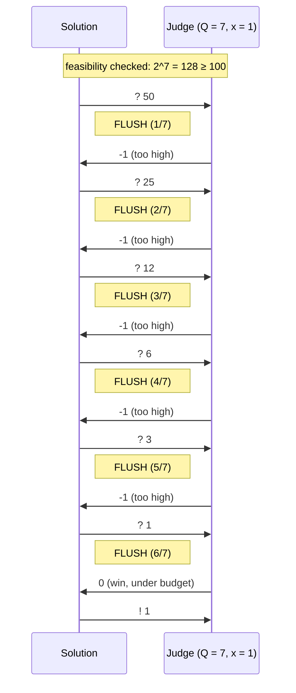
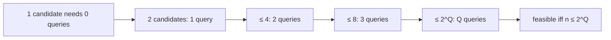

# Guessing Game with a Fixed Query Budget (Interactive Feasibility)

| Meta | Value |
|------|-------|
| **Problem** | Guess a hidden number within a fixed number of queries; reason about feasibility |
| **Source** | Self-contained (interactive) |
| **Link** | — |
| **Difficulty** | Medium |
| **Topics** | Interactive, Binary Search, Query-Budget Reasoning |
| **Time** | $O(\log n)$ |
| **Queries** | $\le Q$, succeeds iff $Q \ge \lceil \log_2 n \rceil$ |

---

## Problem Statement

The judge hides $x \in [1, n]$ and grants you a **budget** of exactly $Q$ queries. Each round
you print a guess `? g`; the judge replies:

- `-1` if $x < g$ (too high),
- `1`  if $x > g$ (too low),
- `0`  if $x = g$ (win).

You **must** identify $x$ using **at most $Q$ queries** and then print `! x`. If $Q$ is too
small to guarantee success, no strategy can always win — so first you must decide
**feasibility**: a winning strategy exists **iff** $Q \ge \lceil \log_2 n \rceil$. When
feasible, optimal play is binary search, which never exceeds the budget. Flush after every
guess.

```text
n = 100, budget Q = 7   (feasible, since ceil(log2 100) = 7)

>> ? 50
<< 1          (too low)
>> ? 75
<< -1         (too high)
>> ? 62
<< 1          (too low)
... at most 7 guesses guarantee the answer
```

---

## Approach (WHY)

The crux is **information**. Each three-way reply, *used optimally*, halves the set of
still-possible values. Starting from $n$ candidates, $Q$ queries can distinguish at most
$2^{Q}$ of them in the worst case (the binary-search decision tree of depth $Q$ has $2^{Q}$
leaves). Hence a guaranteed win is possible **iff**

$$
2^{Q} \ge n \iff Q \ge \left\lceil \log_2 n \right\rceil .
$$

So before playing we **check feasibility**; if it fails we report that no strategy guarantees
success. If it holds, binary search — which uses exactly $\lceil \log_2 n \rceil \le Q$
guesses — is an explicit winning strategy. Each guess must be **flushed**, or the dialogue
deadlocks and we lose to a timeout instead of to the math.



---

## Code

```python
import sys

def feasible(n, Q):
    # A guaranteed strategy exists iff 2^Q >= n  <=>  Q >= ceil(log2 n).
    return (1 << Q) >= n

def guessing_game(n, Q):
    if not feasible(n, Q):
        print(f"! IMPOSSIBLE", flush=True)   # budget too small to guarantee a win
        return None
    lo, hi, used = 1, n, 0
    while lo <= hi:
        mid = (lo + hi) // 2
        print(f"? {mid}", flush=True)        # FLUSH after every guess
        used += 1
        r = int(sys.stdin.readline())
        if r == 0:                           # win within budget (used <= Q)
            print(f"! {mid}", flush=True)
            return mid
        elif r == 1:                         # x > mid: too low
            lo = mid + 1
        else:                                # x < mid: too high
            hi = mid - 1
```

```cpp
#include <bits/stdc++.h>
using namespace std;

bool feasible(long long n, long long Q) {
    // A guaranteed strategy exists iff 2^Q >= n  <=>  Q >= ceil(log2 n).
    return (1LL << Q) >= n;
}

long long guessing_game(long long n, long long Q) {
    if (!feasible(n, Q)) {
        cout << "! IMPOSSIBLE" << endl;       // budget too small to guarantee a win
        return -1;
    }
    long long lo = 1, hi = n, used = 0;
    while (lo <= hi) {
        long long mid = lo + (hi - lo) / 2;
        cout << "? " << mid << endl;          // endl FLUSHES after every guess
        used++;
        long long r;
        cin >> r;
        if (r == 0) {                         // win within budget (used <= Q)
            cout << "! " << mid << endl;
            return mid;
        } else if (r == 1) {                  // x > mid: too low
            lo = mid + 1;
        } else {                              // x < mid: too high
            hi = mid - 1;
        }
    }
    return -1;
}
```

To compute the **minimum** feasible budget directly (instead of testing a given $Q$):

```python
def min_budget(n):
    # smallest Q with 2^Q >= n, i.e. ceil(log2 n)
    q = 0
    while (1 << q) < n:
        q += 1
    return q
```

```cpp
#include <bits/stdc++.h>
using namespace std;

long long min_budget(long long n) {
    // smallest Q with 2^Q >= n, i.e. ceil(log2 n)
    long long q = 0;
    while ((1LL << q) < n) {
        q++;
    }
    return q;
}
```

---

## Trace / Transcript

$n = 100$, $Q = 7$. Since $2^7 = 128 \ge 100$, it is **feasible** with one query to spare.
Worst-case secret $x = 1$ still falls in $\le 7$ guesses:

| Round | $lo$ | $hi$ | $mid$ | Reply (worst $x=1$) | New interval | Used / $Q$ |
|-------|------|------|-------|---------------------|--------------|------------|
| 1 | 1 | 100 | 50 | `-1` too high | $[1,49]$  | 1 / 7 |
| 2 | 1 | 49  | 25 | `-1` too high | $[1,24]$  | 2 / 7 |
| 3 | 1 | 24  | 12 | `-1` too high | $[1,11]$  | 3 / 7 |
| 4 | 1 | 11  | 6  | `-1` too high | $[1,5]$   | 4 / 7 |
| 5 | 1 | 5   | 3  | `-1` too high | $[1,2]$   | 5 / 7 |
| 6 | 1 | 2   | 1  | `0` win       | done      | 6 / 7 |



```mermaid
sequenceDiagram
    participant S as Solution
    participant J as Judge
    Note over S,J: when the budget is too small
    S->>J: feasibility test 2^Q ≥ n
    alt 2^Q &lt; n
        Note over S: no strategy can always win
        S->>J: ! IMPOSSIBLE
    else 2^Q &gt;= n
        Note over S: proceed with binary search
        S->>J: ? mid ... (≤ Q guesses)
    end
```



---

## Math / Complexity

A decision tree of depth $Q$ over three-way (or even two-way) replies has at most $2^{Q}$
distinguishable leaves, so it can pin down at most $2^{Q}$ distinct secrets. Therefore:

$$
\text{guaranteed win} \iff n \le 2^{Q} \iff Q \ge \lceil \log_2 n \rceil .
$$

When feasible, binary search uses exactly $\lceil \log_2 n \rceil$ guesses in the worst case —
**optimal**, matching the lower bound. Time is $O(\log n)$, space $O(1)$, and the feasibility
test itself is $O(\log n)$ (or $O(1)$ with a bit-length call).

---

## Takeaway

A query budget turns an interactive problem into a **feasibility question** first: you can
always win **iff** $2^{Q} \ge n$. When it holds, binary search is the optimal explicit
strategy, hitting exactly $\lceil \log_2 n \rceil \le Q$ flushed guesses; when it fails, no
algorithm can guarantee success — recognize that *before* you start querying.
