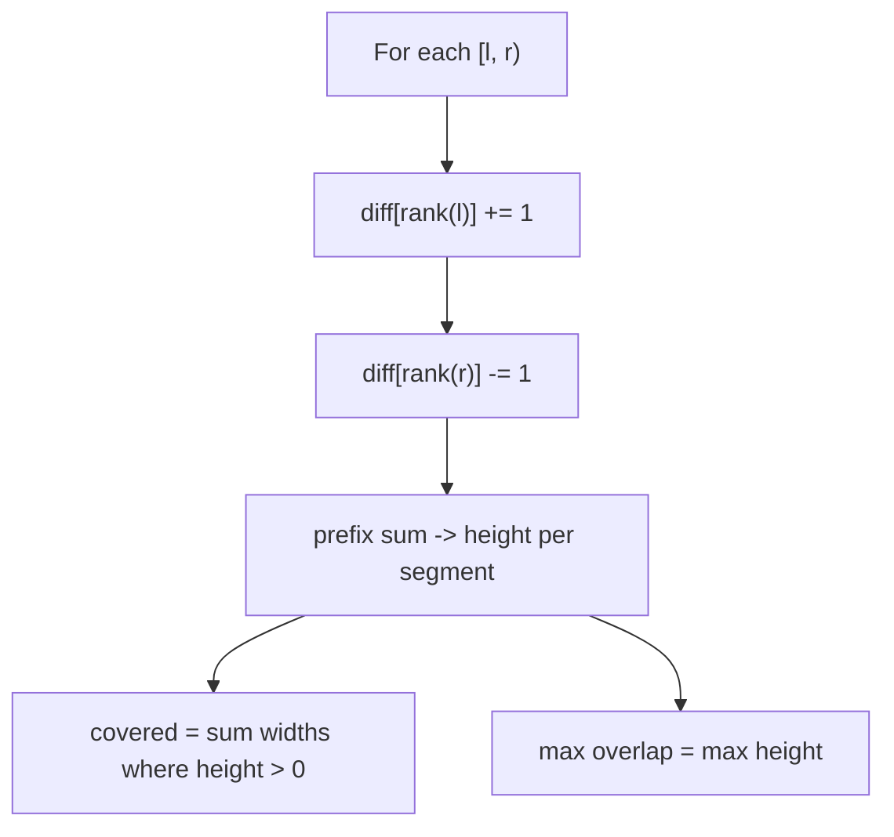
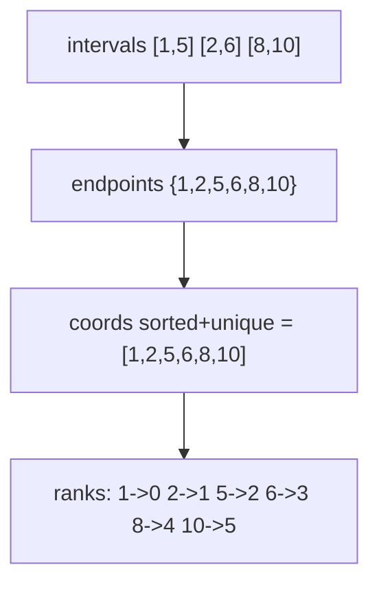
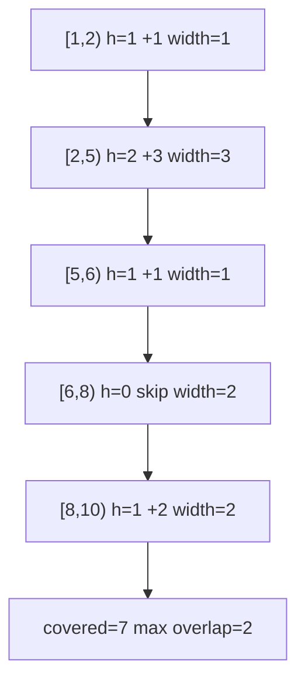
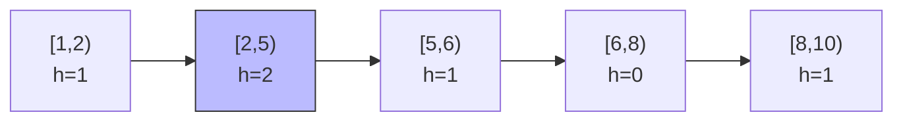
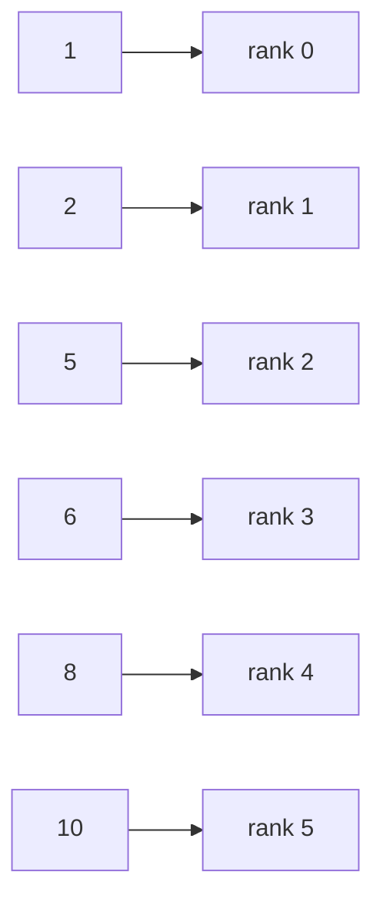

# Interval Coverage & Max Overlap with Coordinate Compression

| Field | Value |
|---|---|
| Source | Classic sweep-line (interval union length / max overlap) |
| Difficulty | Medium |
| Primary topic | **Coordinate compression** |
| Secondary topic | Sweep line, difference array |
| Key constraint | $1 \le n \le 2 \cdot 10^5$ intervals, endpoints up to $10^9$ |

Given intervals with enormous endpoints, we want the **total covered length** of their union and the
**maximum overlap** (most intervals stacked at any point). We cannot lay a $10^9$-wide array on the
line, but only the **endpoints** matter — so we **compress** them and sweep the segments between
consecutive distinct coordinates.

---

## Statement

Given $n$ half-open intervals $[\ell_i, r_i)$, compute:

1. the total length of their **union** (covered length), and
2. the **maximum overlap** — the largest number of intervals containing a single point.

### Example

```text
Input:  intervals = [[1, 5], [2, 6], [8, 10]]
Output: covered length = 7, max overlap = 2

Number line:
 1   2       5 6     8      10
 [---------)              (union piece 1: [1,6) length 5)
     [---------)
                         [------)   (union piece 2: [8,10) length 2)

Covered length = 5 + 2 = 7
Max overlap    = 2 (on [2,5) two intervals stack)
```

---

## WHY: Only Endpoints Change the Coverage

Between two consecutive **distinct** endpoints the "stack height" (number of active intervals) is
**constant** — nothing starts or ends inside such a gap. So the line is partitioned into at most
$2n - 1$ uniform **segments**, and we only need to know each segment's height. Collect all
endpoints, compress them to ranks, and treat each `[coords[k], coords[k+1])` as one segment of real
width `coords[k+1] - coords[k]`.


We track height changes with a **difference array** over compressed indices: an interval $[\ell, r)$
adds $+1$ at `rank(l)` and $-1$ at `rank(r)`. A prefix sum then gives the active count on every
segment. Covered length sums the **real widths** of segments with height $> 0$; max overlap is the
peak height.





---

## Solution

Compress endpoints, build a difference array over the segment indices, prefix-sum it to get heights,
then accumulate widths and the peak.

```python
def coverage_and_overlap(intervals):
    coords = sorted({x for l, r in intervals for x in (l, r)})
    rank = {v: i for i, v in enumerate(coords)}
    m = len(coords)
    diff = [0] * m                           # diff over segment starts

    for l, r in intervals:
        diff[rank[l]] += 1
        diff[rank[r]] -= 1

    covered = 0
    max_overlap = 0
    height = 0
    for k in range(m - 1):                   # segment [coords[k], coords[k+1])
        height += diff[k]
        max_overlap = max(max_overlap, height)
        if height > 0:
            covered += coords[k + 1] - coords[k]
    return covered, max_overlap
```

```cpp
#include <bits/stdc++.h>
using namespace std;

pair<long long, long long> coverageAndOverlap(
        const vector<pair<long long, long long>>& intervals) {
    vector<long long> coords;
    for (auto& iv : intervals) {
        coords.push_back(iv.first);
        coords.push_back(iv.second);
    }
    sort(coords.begin(), coords.end());
    coords.erase(unique(coords.begin(), coords.end()), coords.end());
    int m = (int)coords.size();
    vector<long long> diff(m, 0);            // diff over segment starts

    auto rankOf = [&](long long v) -> int {
        return int(lower_bound(coords.begin(), coords.end(), v) - coords.begin());
    };
    for (auto& iv : intervals) {
        diff[rankOf(iv.first)] += 1;
        diff[rankOf(iv.second)] -= 1;
    }

    long long covered = 0, maxOverlap = 0, height = 0;
    for (int k = 0; k + 1 < m; ++k) {        // segment [coords[k], coords[k+1])
        height += diff[k];
        maxOverlap = max(maxOverlap, height);
        if (height > 0) covered += coords[k + 1] - coords[k];
    }
    return {covered, maxOverlap};
}
```

---

## Trace — `intervals = [[1,5], [2,6], [8,10]]`

Coords `[1, 2, 5, 6, 8, 10]`. Difference array after processing all intervals:
`diff` indices for `1,2,5,6,8,10` get `+1` at starts (1,2,8) and `-1` at ends (5,6,10).

| k | segment [coords[k], coords[k+1]) | diff[k] | height (after) | width | covered? |
|---|---|---|---|---|---|
| 0 | [1, 2) | +1 | 1 | 1 | yes (+1) |
| 1 | [2, 5) | +1 | 2 | 3 | yes (+3) |
| 2 | [5, 6) | -1 | 1 | 1 | yes (+1) |
| 3 | [6, 8) | -1 | 0 | 2 | no |
| 4 | [8, 10) | +1 | 1 | 2 | yes (+2) |

Covered = $1 + 3 + 1 + 2 = 7$; max height reached = **2**.



The height profile across compressed segments (peak = max overlap):



Endpoint → rank mapping used for the difference array:



---

## Math & Complexity

With compressed coordinates $c_0 < c_1 < \dots < c_{m-1}$ and per-segment height $h_k$ from the
prefix sum of the difference array:

$$
\text{covered} = \sum_{k=0}^{m-2} [\,h_k > 0\,]\,(c_{k+1} - c_k), \qquad
\text{maxOverlap} = \max_{k} h_k .
$$

| Quantity | Value |
|---|---|
| Compress endpoints | $O(n \log n)$ |
| Build diff + sweep segments | $O(n)$ |
| **Total time** | $O(n \log n)$ |
| Space | $O(n)$ |

Endpoints up to $10^9$ with up to $2 \cdot 10^5$ intervals make covered length exceed 32 bits — use
`long long`.

---

## Takeaway

For union length and overlap of intervals with huge endpoints, **compress the endpoints** and sweep
the constant-height segments between them. A difference array over compressed indices turns both the
total covered length and the maximum overlap into a single linear pass.
