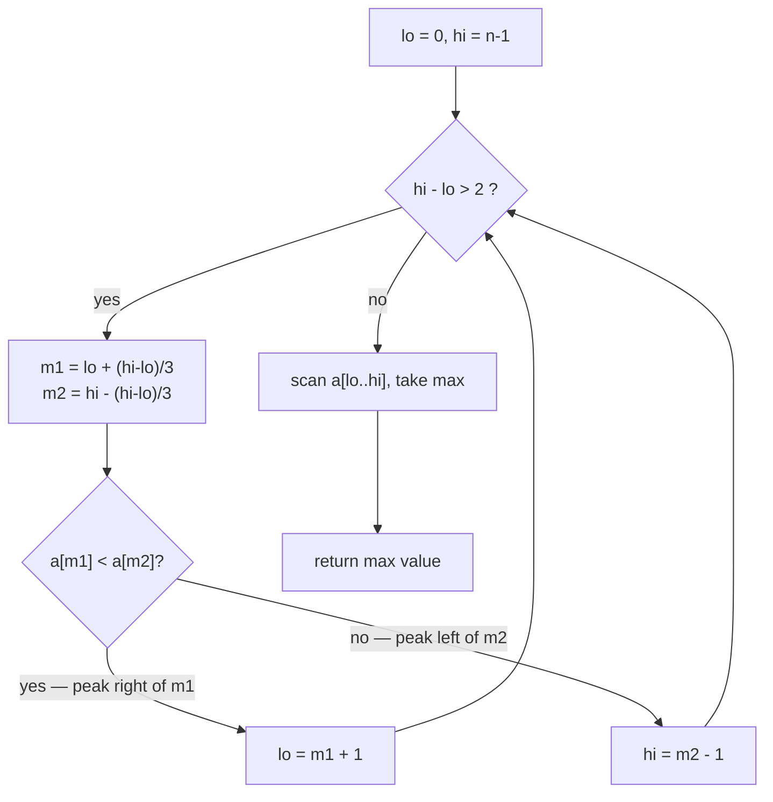
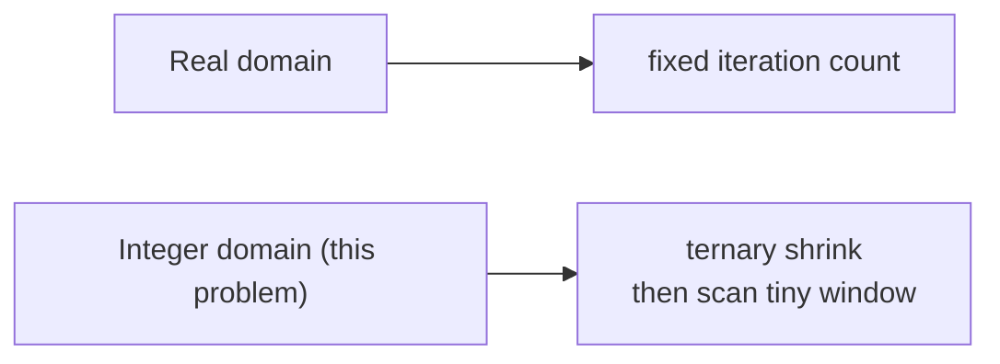
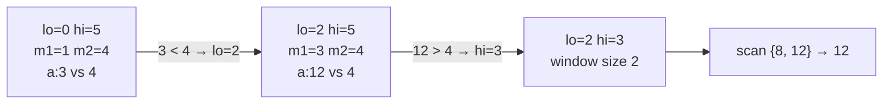
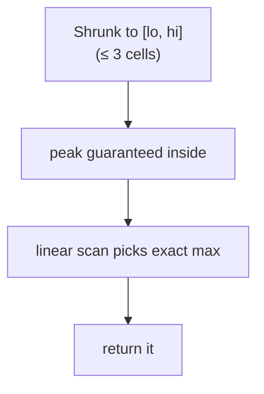
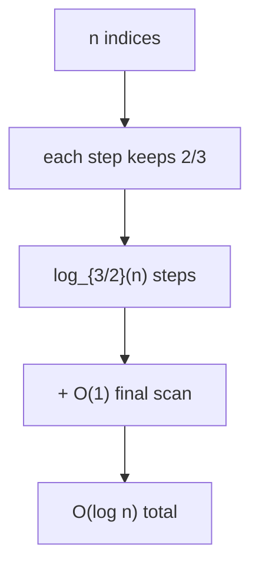

# Maximize a Unimodal (Bitonic) Integer Array

| Field | Value |
|-------|-------|
| Source | Self-contained (classic technique) |
| Difficulty | Easy–Medium |
| Topics | Ternary search, unimodal / bitonic arrays, integer search |
| Link | — (illustrative problem) |

---

## Problem Statement

You are given an integer array `a` that is **bitonic**: it strictly increases to a single maximum and
then strictly decreases. Return the **maximum value** in $O(\log n)$ time (and, optionally, its index).

```text
Input:  a = [1, 3, 8, 12, 4, 2]
Output: 12          (peak at index 3)

Input:  a = [2, 5, 9, 7, 1]
Output: 9           (peak at index 2)

Input:  a = [10, 20, 30]
Output: 30          (still increasing at the end → peak is last)

Input:  a = [30, 20, 10]
Output: 30          (already decreasing → peak is first)
```

Constraints: $1 \le n \le 10^5$, the array is bitonic (strictly up then strictly down, with the
monotone parts possibly empty at the ends).

---

## Approach (WHY)

The array values form a **unimodal function** `f(i) = a[i]` with a single maximum. We apply an
**integer ternary search**: probe two interior indices, discard the worse third, and once the window
shrinks to a few cells, linearly scan it for the true maximum.

The integer subtlety: rounding `m1`/`m2` and moving `lo`/`hi` by ±1 can otherwise leave the peak just
outside the window, so the **final small scan** is essential.



The bitonic shape we are climbing:

```text
value
  |          12              <- single maximum
  |        8     4
  |      3          2
  |    1
  +-------------------------> index
   0   1  2  3   4  5
```

Contrast with the real case — integers force the shrink-then-scan structure:



---

## Code

```python
def max_bitonic(a):
    # a is strictly increasing then strictly decreasing; return its maximum value.
    lo, hi = 0, len(a) - 1
    while hi - lo > 2:
        m1 = lo + (hi - lo) // 3
        m2 = hi - (hi - lo) // 3
        if a[m1] < a[m2]:
            lo = m1 + 1        # peak is right of m1
        else:
            hi = m2 - 1        # peak is left of m2
    best = a[lo]
    for i in range(lo + 1, hi + 1):
        if a[i] > best:
            best = a[i]
    return best


if __name__ == "__main__":
    print(max_bitonic([1, 3, 8, 12, 4, 2]))   # 12
    print(max_bitonic([2, 5, 9, 7, 1]))        # 9
    print(max_bitonic([10, 20, 30]))           # 30
    print(max_bitonic([30, 20, 10]))           # 30
```

```cpp
#include <bits/stdc++.h>
using namespace std;

long long max_bitonic(const vector<long long>& a) {
    // a is strictly increasing then strictly decreasing; return its maximum value.
    long long lo = 0, hi = (long long)a.size() - 1;
    while (hi - lo > 2) {
        long long m1 = lo + (hi - lo) / 3;
        long long m2 = hi - (hi - lo) / 3;
        if (a[m1] < a[m2])
            lo = m1 + 1;       // peak is right of m1
        else
            hi = m2 - 1;       // peak is left of m2
    }
    long long best = a[lo];
    for (long long i = lo + 1; i <= hi; ++i)
        if (a[i] > best)
            best = a[i];
    return best;
}

int main() {
    cout << max_bitonic({1, 3, 8, 12, 4, 2}) << "\n";  // 12
    cout << max_bitonic({2, 5, 9, 7, 1}) << "\n";       // 9
    cout << max_bitonic({10, 20, 30}) << "\n";          // 30
    cout << max_bitonic({30, 20, 10}) << "\n";          // 30
    return 0;
}
```

---

## Trace

Take `a = [1, 3, 8, 12, 4, 2]` (n = 6, indices 0..5).

| Step | lo | hi | hi-lo | m1 | m2 | a[m1] | a[m2] | Decision |
|------|----|----|-------|----|----|-------|-------|----------|
| 1 | 0 | 5 | 5 | 1 | 4 | 3 | 4 | `3 < 4` → `lo = m1+1 = 2` |
| 2 | 2 | 5 | 3 | 3 | 4 | 12 | 4 | `12 < 4`? no → `hi = m2-1 = 3` |
| 3 | 2 | 3 | 1 | — | — | — | — | `hi - lo = 1 ≤ 2`, stop |

Final scan of indices `2..3`: `a[2]=8`, `a[3]=12` → max = **12**. ✓



Why the final scan matters — the window can hold the peak plus a neighbour:



---

## Math & Complexity

Let $n$ be the array length.

- **Time:** the ternary loop discards roughly a third of the window per step, so it runs
  $O(\log_{3/2} n)$ times; the final scan touches at most $3$ cells. Total $O(\log n)$.
- **Space:** $O(1)$ extra.

$$
T(n) = T\!\left(\tfrac{2}{3}n\right) + O(1) = O(\log n).
$$



---

## Takeaway

A bitonic array is a **unimodal** sequence; its maximum is the unique peak. Use **integer ternary
search** — shrink the index window with two probes, then scan the tiny leftover — to find it in
$O(\log n)$ instead of an $O(n)$ sweep. Never forget the final small scan, the hallmark of the integer
variant.
