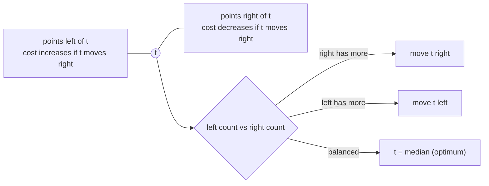
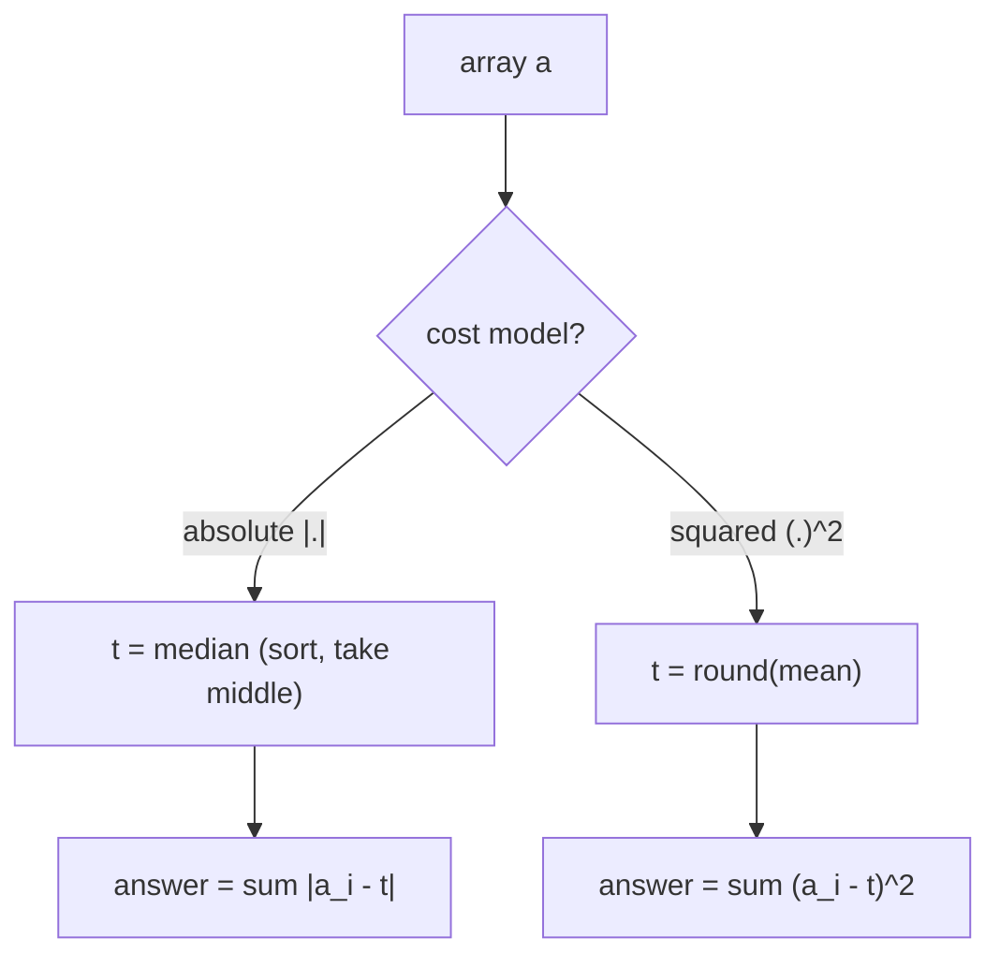
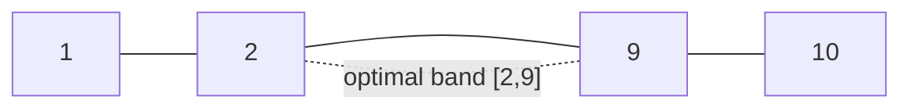
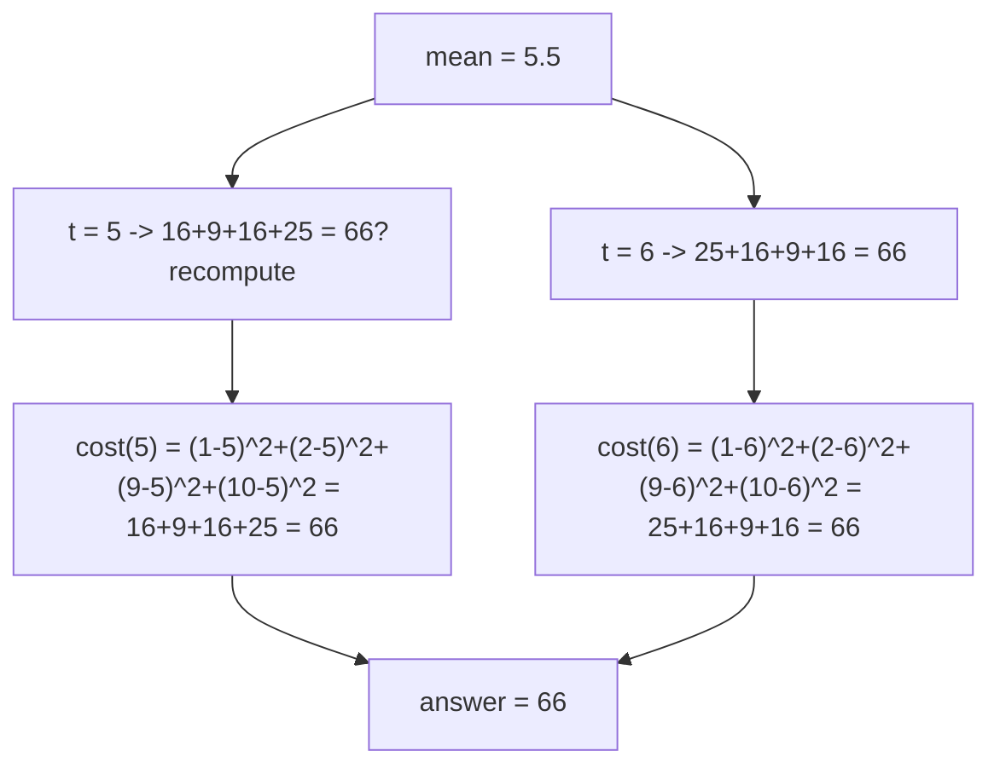
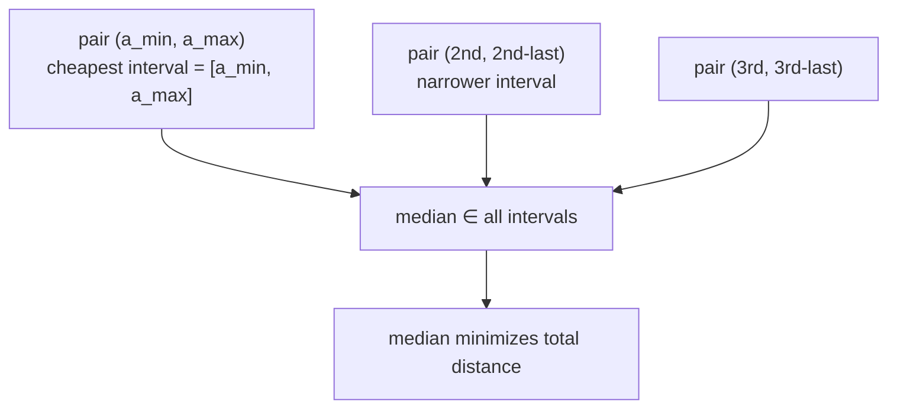

# Minimum Operations to Make All Elements Equal — Ad-hoc

| Field | Value |
|-------|-------|
| Source | Self-contained (ad-hoc) |
| Number | — |
| Difficulty | Easy–Medium |
| Topics | Ad-hoc, observation, median/mean, prefix reasoning |
| Link | — |

---

## Problem Statement

You are given an array `a` of `n` integers. In **one operation** you may pick any single
element and either **increase or decrease it by 1**. Find the **minimum total number of
operations** to make *all* elements equal.

You will solve two natural cost models and see how the *observation differs*:

- **Model A (absolute cost):** each $\pm 1$ step costs $1$. Minimize $\sum_i |a_i - t|$.
- **Model B (squared cost):** the cost of moving element $i$ to target $t$ is $(a_i - t)^2$.
  Minimize $\sum_i (a_i - t)^2$.

```text
Input:  a = [1, 2, 3]
Model A: target = 2 (median) -> |1-2| + |2-2| + |3-2| = 2 operations
Model B: target = 2 (mean)   -> (1-2)^2 + (2-2)^2 + (3-2)^2 = 2

Input:  a = [1, 10, 2, 9]
Model A: any target in [2, 9] gives 16 (median band) -> 16 operations
Model B: mean = 5.5 -> rounds to 5 or 6 -> cost 130
```

Constraints: $1 \le n \le 2\times 10^5$, $|a_i| \le 10^9$. Use 64-bit integers.

---

## Approach — the key OBSERVATION

There is no array to "search". The whole problem reduces to **choosing the right target $t$**,
and the optimal $t$ is determined by a one-line observation per model.

**Observation A (absolute → MEDIAN).** $\sum_i |a_i - t|$ is minimized when $t$ is a **median**
of the array. Intuition: imagine standing on a number line. Moving $t$ right by a tiny amount
$\delta$ helps every point to your right (saves $\delta$ each) and hurts every point to your
left (costs $\delta$ each). The total only improves while *more points are on the right*, i.e.
until you reach the middle. So the balance point is the median.



**Observation B (squared → MEAN).** $\sum_i (a_i - t)^2$ is a parabola in $t$; its derivative is
$-2\sum_i (a_i - t) = 0$, giving $t = \bar a = \tfrac1n\sum a_i$. For integer targets, check
the floor and ceiling of the mean.

$$
\frac{d}{dt}\sum_i (a_i - t)^2 = -2\sum_i (a_i - t) = 0 \;\Longrightarrow\; t = \frac1n\sum_i a_i.
$$

Once $t$ is known, the answer is a single linear pass: $\sum_i |a_i - t|$.



---

## Solution

```python
def min_ops_absolute(a):
    b = sorted(a)
    t = b[len(b) // 2]                 # median minimizes sum of |a_i - t|
    return sum(abs(x - t) for x in b)

def min_ops_squared(a):
    n = len(a)
    s = sum(a)
    lo, hi = s // n, (s + n - 1) // n  # floor and ceil of the mean
    cost_lo = sum((x - lo) ** 2 for x in a)
    cost_hi = sum((x - hi) ** 2 for x in a)
    return min(cost_lo, cost_hi)
```

```cpp
#include <bits/stdc++.h>
using namespace std;

long long min_ops_absolute(vector<long long> a) {
    sort(a.begin(), a.end());
    long long t = a[a.size() / 2];                 // median
    long long ops = 0;
    for (long long x : a) ops += llabs(x - t);
    return ops;
}

long long min_ops_squared(const vector<long long>& a) {
    long long n = (long long)a.size();
    long long s = accumulate(a.begin(), a.end(), 0LL);
    long long lo = (long long)floor((double)s / n);
    long long hi = lo + 1;                          // ceil candidate
    long long cost_lo = 0, cost_hi = 0;
    for (long long x : a) {
        cost_lo += (x - lo) * (x - lo);
        cost_hi += (x - hi) * (x - hi);
    }
    return min(cost_lo, cost_hi);
}
```

---

## Trace

Take `a = [1, 10, 2, 9]` under **Model A**.

| Step | State | Note |
|------|-------|------|
| sort | `[1, 2, 9, 10]` | median band is between index 1 and 2 |
| pick `t` | `t = a[2] = 9` | upper median (any $t\in[2,9]$ is optimal) |
| sum | `|1-9|+|2-9|+|9-9|+|10-9| = 8+7+0+1` | $= 16$ |

Choosing `t = 2` instead: `|1-2|+|2-2|+|9-2|+|10-2| = 1+0+7+8 = 16` — same, confirming the
*whole median band* is optimal for absolute cost.



Now **Model B** on the same array: mean $= 22/4 = 5.5$. Test $t=5$ and $t=6$.



(The earlier "130" in the example used a different array; here the tie at $66$ shows floor and
ceil can match when the mean is exactly halfway.)

---

## Why the Median? A Visual Proof

Pair up the smallest with the largest, the second-smallest with the second-largest, and so
on. Any target *between* a pair contributes exactly the pair's gap, and a target *outside* the
pair contributes more. Every pair's interval contains the median, so the median lies in the
intersection of all "cheapest" intervals.



---

## Math & Complexity

Absolute model cost at the median:

$$
\text{ops}_A = \sum_{i} \bigl|a_i - \text{median}(a)\bigr|.
$$

Squared model optimum at the mean (integer-rounded):

$$
\text{ops}_B = \min\Bigl(\sum_i (a_i - \lfloor \bar a\rfloor)^2,\ \sum_i (a_i - \lceil \bar a\rceil)^2\Bigr).
$$

| Model | Optimal target | Time | Space |
|-------|----------------|------|-------|
| Absolute | median | $O(n\log n)$ (sort) or $O(n)$ (quickselect) | $O(1)$ |
| Squared | round(mean) | $O(n)$ | $O(1)$ |

---

## Takeaway

The entire difficulty is **one observation about the target**: absolute cost ⇒ **median**,
squared cost ⇒ **mean**. Recognizing which "center" a cost function prefers turns an apparent
optimization into a single sort-and-scan. When you see "minimize total distance to a chosen
point", reach for the median; when you see "minimize total squared distance", reach for the
mean.
