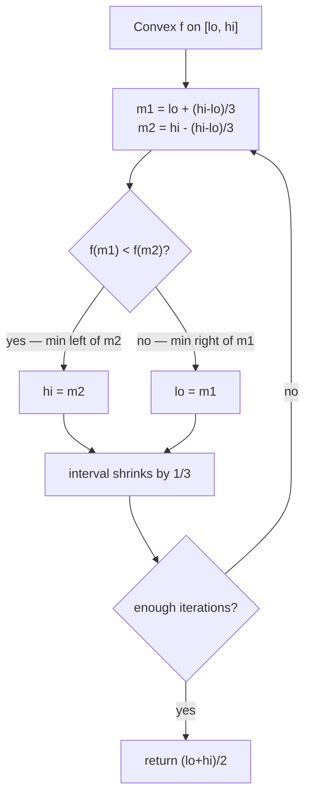
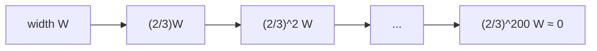
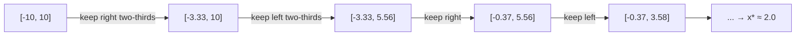
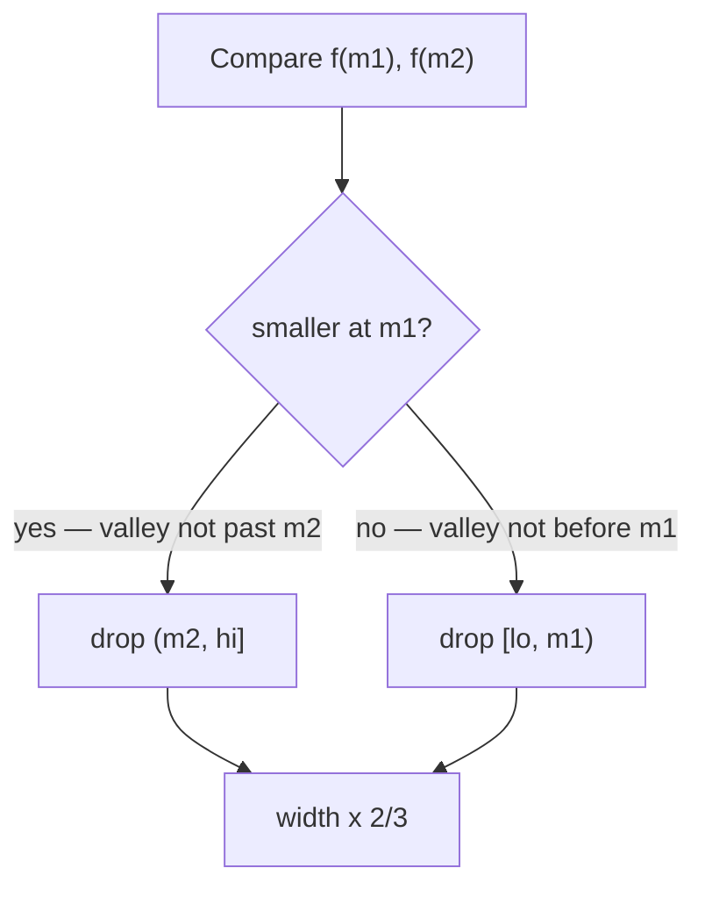

# Minimize a Convex Function with Ternary Search

| Field | Value |
|-------|-------|
| Source | Self-contained (classic technique) |
| Difficulty | Easy–Medium |
| Topics | Ternary search, unimodal / convex functions, numerical optimization |
| Link | — (illustrative problem) |

---

## Problem Statement

You are given a **convex** (hence unimodal, single-valley) real function $f$ and an interval
$[lo, hi]$. Return the point $x^\star \in [lo, hi]$ that **minimizes** $f$, to within an absolute error
of $10^{-6}$.

A convex function curves upward: it decreases to a single minimum and then increases. There is no
closed-form root to binary-search, so we shrink the interval directly on the function values.

```text
Example f(x) = (x - 2)^2 + 3   over   [-10, 10]

Expected:
  x*  ≈ 2.000000
  f(x*) ≈ 3.000000

Example f(x) = x^2 + 4x + 7    over   [-10, 10]
  vertex at x = -b/2a = -2
  x*  ≈ -2.000000
  f(x*) ≈ 3.000000
```

Assume $f$ is given as a black-box function we may evaluate at any point.

---

## Approach (WHY)

Because $f$ is convex it is **unimodal with a minimum**: moving toward $x^\star$ strictly decreases the
value, moving away strictly increases it. So if we probe two interior points $m_1 < m_2$ and find
$f(m_1) < f(m_2)$, the minimum **cannot** lie in $(m_2, hi]$ — that outer third is discarded. Symmetric
reasoning handles the other case.



The convex valley we are descending into:

```text
f(x)
  |  *                       *
  |    *                   *
  |      *               *
  |         *         *
  |            *   *
  |              V            <- single minimum x*
  +---------------------------> x
   lo                       hi
```

We run a **fixed iteration count** rather than an epsilon loop, for predictable precision and no
infinite-loop risk. After $k$ iterations the width is $(2/3)^k (hi - lo)$; $\approx 200$ iterations push
it far below `double` resolution.



---

## Code

```python
def minimize_convex(f, lo, hi, iters=200):
    # Returns x in [lo, hi] minimizing the convex (unimodal) function f.
    for _ in range(iters):
        m1 = lo + (hi - lo) / 3.0
        m2 = hi - (hi - lo) / 3.0
        if f(m1) < f(m2):
            hi = m2          # minimum lies left of m2
        else:
            lo = m1          # minimum lies right of m1
    return (lo + hi) / 2.0


if __name__ == "__main__":
    f = lambda x: (x - 2.0) ** 2 + 3.0
    x = minimize_convex(f, -10.0, 10.0)
    print("%.6f %.6f" % (x, f(x)))   # 2.000000 3.000000
```

```cpp
#include <bits/stdc++.h>
using namespace std;

double minimize_convex(function<double(double)> f, double lo, double hi, int iters = 200) {
    // Returns x in [lo, hi] minimizing the convex (unimodal) function f.
    for (int i = 0; i < iters; ++i) {
        double m1 = lo + (hi - lo) / 3.0;
        double m2 = hi - (hi - lo) / 3.0;
        if (f(m1) < f(m2))
            hi = m2;         // minimum lies left of m2
        else
            lo = m1;         // minimum lies right of m1
    }
    return (lo + hi) / 2.0;
}

int main() {
    function<double(double)> f = [](double x) { return (x - 2.0) * (x - 2.0) + 3.0; };
    double x = minimize_convex(f, -10.0, 10.0);
    printf("%.6f %.6f\n", x, f(x));   // 2.000000 3.000000
    return 0;
}
```

---

## Trace

`f(x) = (x - 2)^2 + 3` on `[-10, 10]`. The first few iterations (showing how the interval homes in on
$x^\star = 2$):

| Iter | lo | hi | m1 | m2 | f(m1) | f(m2) | Keep |
|------|------|------|--------|--------|--------|--------|------|
| 1 | -10.000 | 10.000 | -3.333 | 3.333 | 31.44 | 4.78 | `f(m1) > f(m2)` → `lo = m1` |
| 2 | -3.333 | 10.000 | 1.111 | 5.556 | 3.79 | 15.64 | `f(m1) < f(m2)` → `hi = m2` |
| 3 | -3.333 | 5.556 | -0.370 | 2.593 | 8.62 | 3.35 | `f(m1) > f(m2)` → `lo = m1` |
| 4 | -0.370 | 5.556 | 1.605 | 3.580 | 3.16 | 5.50 | `f(m1) < f(m2)` → `hi = m2` |
| … | … | … | … | … | … | … | converging to 2.0 |

After ~200 iterations `lo` and `hi` coincide near `2.000000`, and `f` near `3.000000`. ✓



Why we *keep* a third based on the comparison:



---

## Math & Complexity

Let $W = hi - lo$ and target precision $\varepsilon$. Each iteration multiplies the width by $2/3$, so
after $k$ iterations the width is $(2/3)^k W$. To reach $\varepsilon$:

$$
k \ge \frac{\ln\!\big(W / \varepsilon\big)}{\ln(3/2)}.
$$

- **Time:** $O\!\big(\log(W/\varepsilon)\big)$ function evaluations (we use a fixed $\approx 200$). Each
  evaluation is $O(1)$ here, but multiply by the cost of `f` in general.
- **Space:** $O(1)$.


---

## Takeaway

When you must minimize a **convex / unimodal** real function with no easy derivative test, ternary
search the interval: probe two interior points, drop the worse outer third, and repeat a fixed number
of iterations for guaranteed precision in $O(\log(W/\varepsilon))$ evaluations.
