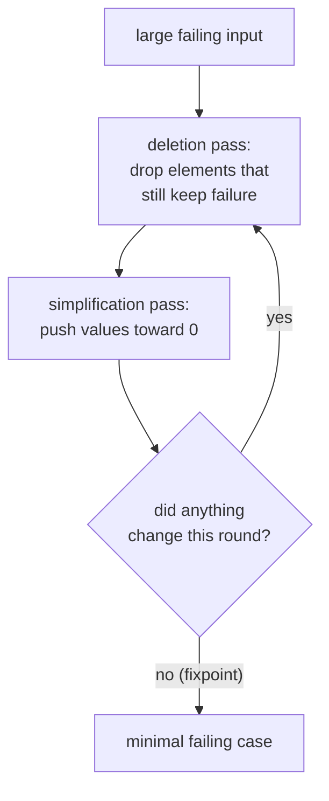
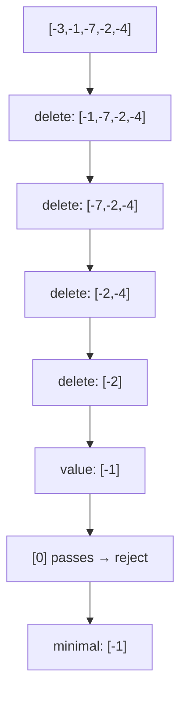
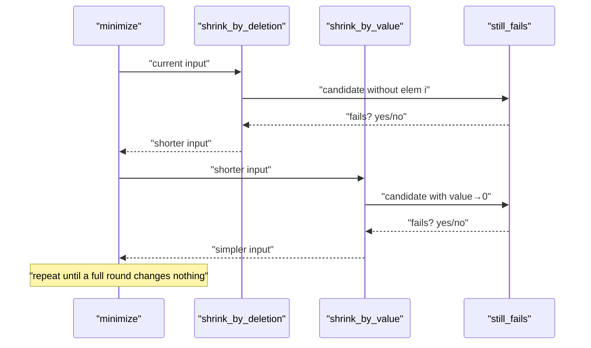
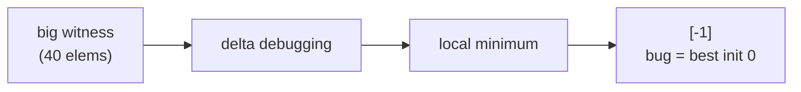

# Minimize a Failing Test Case — Shrinking / Delta Debugging

| Field | Value |
|-------|-------|
| Source | Technique / Self-contained |
| Topic | Stress testing, test-case minimization |
| Difficulty | Medium |
| Skills | Delta debugging, shrinking, reproducible failures |
| Goal | Turn a large counterexample into a minimal reproducing input |

---

## Problem Statement

Stress testing found a counterexample: an array of, say, 40 numbers where your fast solution
disagrees with the brute. Forty numbers is too many to debug by hand. Build a **shrinker** that,
given a failing input, repeatedly transforms it into a **smaller** input that *still fails*, until
no further reduction is possible — leaving you a **minimal reproducing case**.

We reuse the max-subarray pair from the harness: a correct brute and a deliberately buggy fast
solution that wrongly initializes `best = 0` (so it breaks on all-negative arrays).

```text
Found failing input (40 elements):
  [3, -1, 2, 0, 5, -2, -7, -4, ... , 1, -3]

After shrinking:
  [-7]          # a single negative element: brute = -7, buggy fast = 0
```

A predicate `still_fails(arr)` returns `True` exactly when the input still triggers the
disagreement.

---

## Approach (WHY)

The core abstraction is a single boolean **predicate**: "does this input still reproduce the
bug?" Shrinking is *any* search that makes the input smaller while keeping the predicate `True`.
Two complementary moves:

1. **Element deletion** — try removing each element; keep any removal that preserves the failure.
   This shrinks the *length*.
2. **Value simplification** — try replacing each value with a "simpler" one (e.g. drive it toward
   $0$); keep it if the failure survives. This shrinks the *magnitude*, making numbers readable.

Iterate both passes until a full sweep changes nothing (a **fixpoint**). The result is a *local*
minimum: no single deletion or simplification keeps the failure. This is the essence of
**delta debugging** — never try to *understand* the bug, just keep shrinking the witness.



---

## Code

The two solutions whose disagreement defines "failure" (fast has the `best = 0` bug):

```python
def max_subarray_brute(arr):
    best = arr[0]
    for i in range(len(arr)):
        running = 0
        for j in range(i, len(arr)):
            running += arr[j]
            best = max(best, running)
    return best

def max_subarray_buggy(arr):
    best = 0                       # BUG: should be arr[0]
    cur = 0
    for x in arr:
        cur = max(x, cur + x)
        best = max(best, cur)
    return best
```

```cpp
#include <bits/stdc++.h>
using namespace std;

long long max_subarray_brute(const vector<long long> &arr) {
    long long best = arr[0];
    for (size_t i = 0; i < arr.size(); i++) {
        long long running = 0;
        for (size_t j = i; j < arr.size(); j++) {
            running += arr[j];
            best = max(best, running);
        }
    }
    return best;
}

long long max_subarray_buggy(const vector<long long> &arr) {
    long long best = 0;            // BUG: should be arr[0]
    long long cur = 0;
    for (long long x : arr) {
        cur = max(x, cur + x);
        best = max(best, cur);
    }
    return best;
}
```

The predicate:

```python
def still_fails(arr):
    if not arr:
        return False               # empty input is not a valid test
    return max_subarray_brute(arr) != max_subarray_buggy(arr)
```

```cpp
#include <bits/stdc++.h>
using namespace std;

bool still_fails(const vector<long long> &arr) {
    if (arr.empty()) return false;          // empty input is not a valid test
    return max_subarray_brute(arr) != max_subarray_buggy(arr);
}
```

The deletion pass:

```python
def shrink_by_deletion(arr):
    changed = True
    while changed:
        changed = False
        for i in range(len(arr)):
            candidate = arr[:i] + arr[i+1:]
            if still_fails(candidate):
                arr = candidate            # accept smaller failing case
                changed = True
                break
    return arr
```

```cpp
#include <bits/stdc++.h>
using namespace std;

vector<long long> shrink_by_deletion(vector<long long> arr) {
    bool changed = true;
    while (changed) {
        changed = false;
        for (size_t i = 0; i < arr.size(); i++) {
            vector<long long> candidate = arr;
            candidate.erase(candidate.begin() + i);
            if (still_fails(candidate)) {
                arr = candidate;           // accept smaller failing case
                changed = true;
                break;
            }
        }
    }
    return arr;
}
```

The value-simplification pass (drive each value toward 0):

```python
def shrink_by_value(arr):
    changed = True
    while changed:
        changed = False
        for i in range(len(arr)):
            if arr[i] == 0:
                continue
            step = 1 if arr[i] < 0 else -1   # move one step toward 0
            candidate = arr[:]
            candidate[i] += step
            if still_fails(candidate):
                arr = candidate
                changed = True
    return arr
```

```cpp
#include <bits/stdc++.h>
using namespace std;

vector<long long> shrink_by_value(vector<long long> arr) {
    bool changed = true;
    while (changed) {
        changed = false;
        for (size_t i = 0; i < arr.size(); i++) {
            if (arr[i] == 0) continue;
            long long step = (arr[i] < 0) ? 1 : -1;   // move one step toward 0
            vector<long long> candidate = arr;
            candidate[i] += step;
            if (still_fails(candidate)) {
                arr = candidate;
                changed = true;
            }
        }
    }
    return arr;
}
```

The full shrinker (alternate both passes to a fixpoint):

```python
def minimize(arr):
    while True:
        before = list(arr)
        arr = shrink_by_deletion(arr)
        arr = shrink_by_value(arr)
        if arr == before:                  # no change ⇒ minimal
            return arr
```

```cpp
#include <bits/stdc++.h>
using namespace std;

vector<long long> minimize(vector<long long> arr) {
    while (true) {
        vector<long long> before = arr;
        arr = shrink_by_deletion(arr);
        arr = shrink_by_value(arr);
        if (arr == before) return arr;     // no change ⇒ minimal
    }
}
```

---

## Trace

Start from a found counterexample `[3, -1, -7, 2, -4]` (brute = 3, buggy = 3 → wait, this one
*passes*; the real failure needs the maximum to be negative). Take instead
`[-3, -1, -7, -2, -4]` where brute = $-1$ but buggy = $0$.

Deletion pass — try dropping each element while the failure (all-negative ⇒ brute $&lt;$ 0,
buggy = 0) persists:

| candidate | brute | buggy | still fails? | action |
|-----------|-------|-------|--------------|--------|
| `[-1, -7, -2, -4]` | -1 | 0 | yes | accept |
| `[-7, -2, -4]` | -2 | 0 | yes | accept |
| `[-2, -4]` | -2 | 0 | yes | accept |
| `[-2]` | -2 | 0 | yes | accept |
| `[]` | — | — | no (empty) | reject, stop |

Now value pass on `[-2]` — push toward 0:

| candidate | brute | buggy | still fails? | action |
|-----------|-------|-------|--------------|--------|
| `[-1]` | -1 | 0 | yes | accept |
| `[0]` | 0 | 0 | no | reject |

Fixpoint reached: the minimal failing case is `[-1]`. A single negative element is the smallest
witness that "buggy initializes `best = 0` and so refuses to pick a negative best" — the bug is
now obvious.







---

## Math & Complexity

Let the failing input have length $n$ and maximum absolute value $V$. One deletion sweep makes
$n$ predicate calls; the loop restarts after each successful deletion, so reaching a length of
$k$ costs $O\!\left(n + (n-1) + \dots + k\right) = O(n^2)$ predicate calls in the worst case. Each
predicate runs the $O(m^2)$ brute on the *current* length $m$, so deletion shrinking is

$$
O\!\left(\sum_{m=k}^{n} m \cdot m^2\right) = O\!\left(n^4\right)
$$

in the absolute worst case — but in practice $n$ collapses quickly, so it is far cheaper. Value
shrinking toward $0$ takes $O(V)$ single-step reductions per element (or $O(\log V)$ with binary
search instead of unit steps), each costing one predicate call.

| Pass | Predicate calls | Note |
|------|-----------------|------|
| Deletion (one sweep) | $O(n)$ | repeats to fixpoint |
| Value (linear, one elem) | $O(V)$ | use binary search → $O(\log V)$ |
| Full minimize | until fixpoint | local minimum, not global |

The output is a **local** minimum: no single deletion or unit value-step keeps the failure. That
is almost always small enough to read, even though it is not provably the globally smallest
failing input.

---

## Takeaway

> Shrinking is **delta debugging**: define one predicate — "does this still fail?" — then greedily
> delete elements and simplify values while the predicate stays `True`, alternating passes to a
> fixpoint. You never reason about the bug; you just minimize its witness until the cause (here, a
> single negative element exposing `best = 0`) is impossible to miss.
