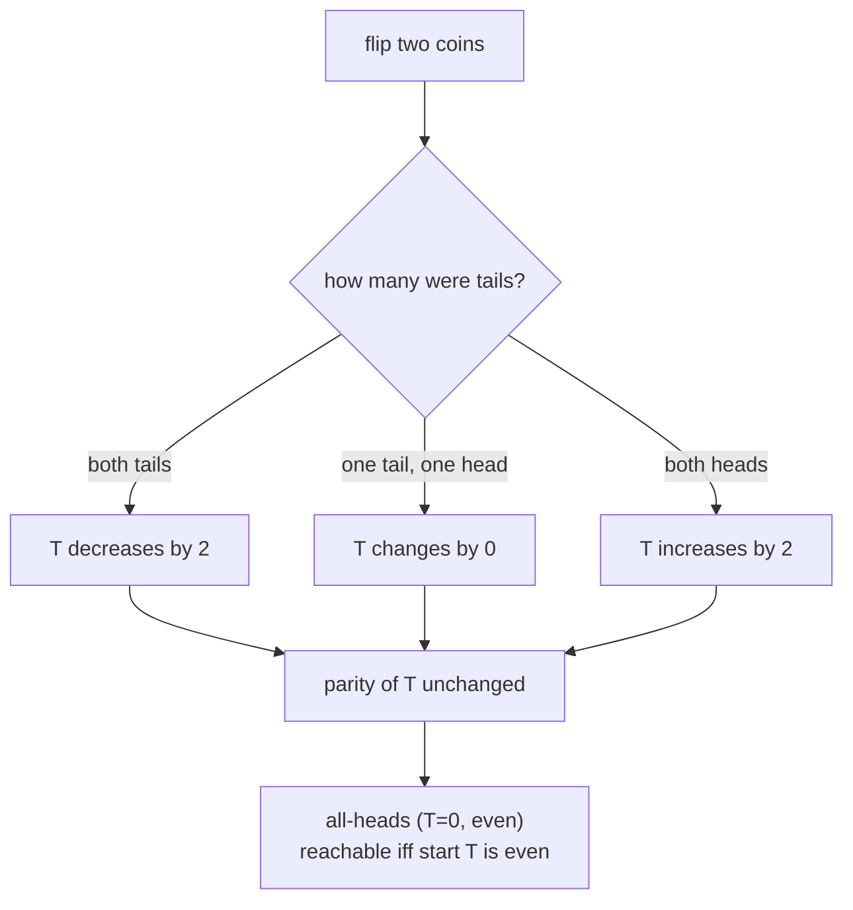
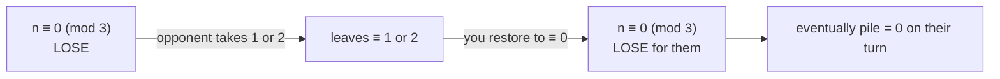
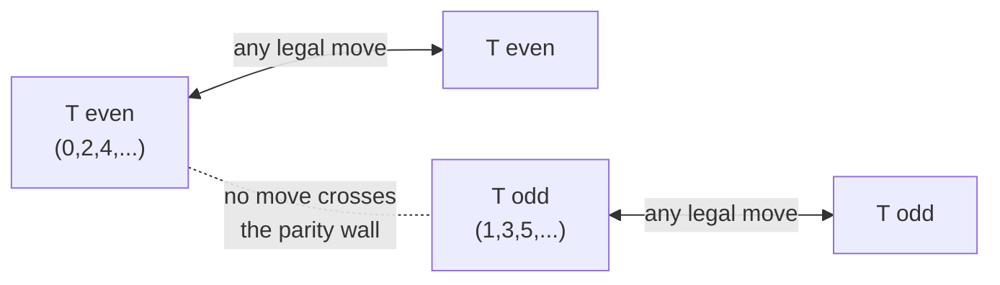
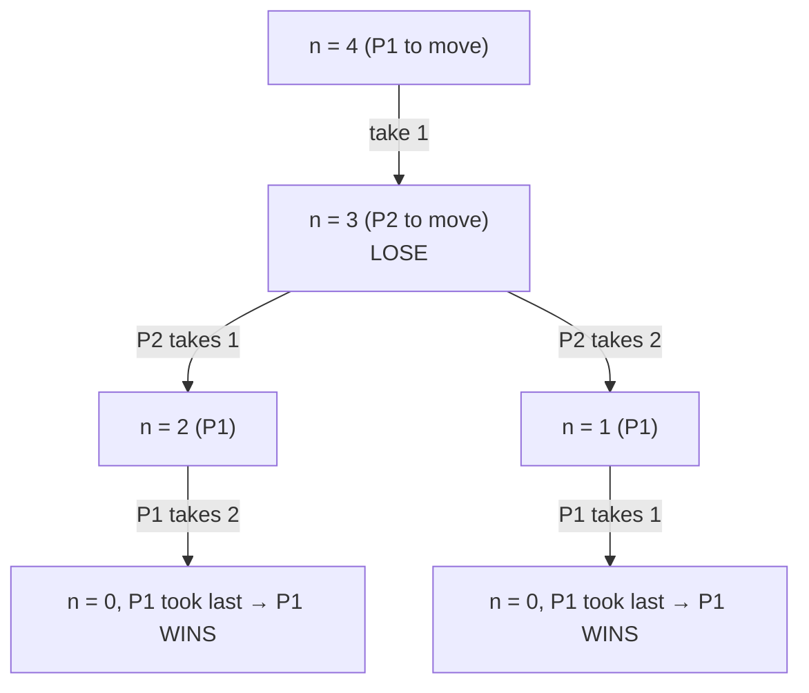
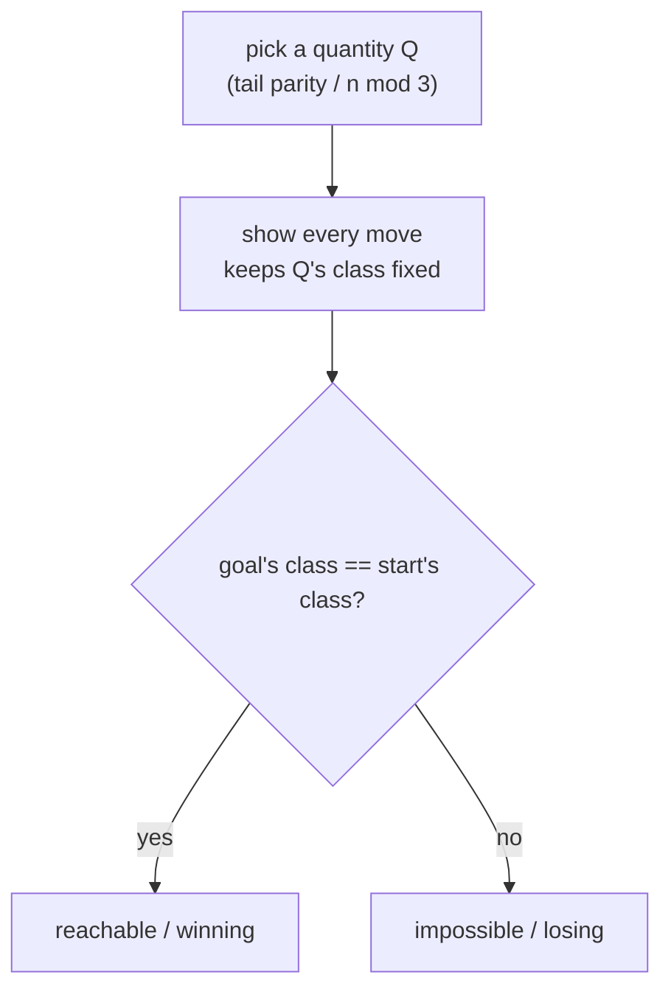

# Parity Game — Invariant Observation

| Field | Value |
|-------|-------|
| Source | Self-contained (ad-hoc) |
| Number | — |
| Difficulty | Easy–Medium |
| Topics | Ad-hoc, parity, invariant, game theory, feasibility |
| Link | — |

---

## Problem Statement

We study two classic puzzles that are *both* solved by a single **parity** observation — the
quantity "odd or even" never changes in a way that lets you cross from one class to the other.

**Part 1 — Coin-flip feasibility.** You have `n` coins in a row, each showing Heads (`1`) or
Tails (`0`). In one move you must flip **exactly two** coins (any two). Decide whether you can
reach the all-Heads configuration.

**Part 2 — Last-stone game.** A pile has `n` stones. Two players alternate; on a turn a player
removes `1` or `2` stones. The player who takes the **last** stone **wins**. Assuming optimal
play, decide whether the **first** player wins.

```text
Part 1:
Input:  coins = [1, 0, 0, 1]   (two tails)
Output: True   (flip the two tails together -> all heads)

Input:  coins = [1, 1, 0, 1]   (one tail)
Output: False  (flipping two coins always changes the tail-count by an even number)

Part 2:
Input:  n = 4 -> Output: True   (first player wins)
Input:  n = 3 -> Output: False  (n % 3 == 0 -> first player loses)
```

---

## Approach — the key OBSERVATION

### Part 1: tail-count parity is an INVARIANT

Let $T$ = number of tails. A move flips exactly two coins, so it changes $T$ by $-2$, $0$, or
$+2$ — **always an even amount**. Therefore the **parity of $T$ never changes**. All-Heads has
$T = 0$ (even), so it is reachable **iff** the starting tail-count is even.



$$
\text{reachable} \iff \Bigl(\sum_i [\,\text{coin}_i = \text{Tails}\,]\Bigr) \equiv 0 \pmod 2.
$$

### Part 2: losing positions are multiples of 3

Work out the small cases — a tiny table reveals everything.

| `n` | who wins | reason |
|-----|----------|--------|
| 0 | 2nd (no move) | previous player took last stone |
| 1 | 1st | take 1 |
| 2 | 1st | take 2 |
| 3 | 2nd | any move leaves 1 or 2 → opponent wins |
| 4 | 1st | take 1, leave 3 (a loss for opponent) |
| 5 | 1st | take 2, leave 3 |
| 6 | 2nd | any move leaves 4 or 5 → opponent wins |

The losing positions for the player to move are exactly $n \equiv 0 \pmod 3$. The winning
strategy: always move to make the remaining count a multiple of 3.



$$
\text{first player wins} \iff n \not\equiv 0 \pmod 3.
$$

---

## Solution

```python
def coins_reachable_all_heads(coins):
    tails = sum(1 for c in coins if c == 0)
    return tails % 2 == 0          # tail-count parity is invariant under flipping two coins

def last_stone_first_wins(n):
    return n % 3 != 0              # losing positions are exactly the multiples of 3
```

```cpp
#include <bits/stdc++.h>
using namespace std;

bool coins_reachable_all_heads(const vector<int>& coins) {
    long long tails = 0;
    for (int c : coins) if (c == 0) tails++;
    return tails % 2 == 0;          // parity invariant
}

bool last_stone_first_wins(long long n) {
    return n % 3 != 0;              // multiples of 3 are losing positions
}
```

---

## Trace

**Part 1** on `coins = [1, 0, 0, 1]`:

| Step | Action | Tail count `T` | Parity |
|------|--------|----------------|--------|
| start | `[1,0,0,1]` | 2 | even |
| flip the two tails | `[1,1,1,1]` | 0 | even |

Parity stayed even throughout, and we landed on $T=0$ → reachable.

Now `coins = [1, 1, 0, 1]` starts at $T = 1$ (odd). No sequence of even-sized changes can reach
$T = 0$, so it is impossible — the parity wall is never crossed.



**Part 2** on `n = 4`: first player takes 1, leaving 3 (a multiple of 3 → loss for opponent).



---

## Why Parity / Invariants Settle It Instantly

Both parts share a structure: define a quantity, show every legal move keeps it inside one
class, and observe the goal lives in a particular class.



No game tree, no simulation — the invariant *is* the proof.

---

## Math & Complexity

$$
\text{Part 1: reachable} \iff T \equiv 0 \pmod 2, \qquad
\text{Part 2: P1 wins} \iff n \not\equiv 0 \pmod 3.
$$

| Part | Work | Time | Space |
|------|------|------|-------|
| 1 (coin parity) | count tails, check $\bmod 2$ | $O(n)$ | $O(1)$ |
| 2 (stone game) | one $\bmod 3$ test | $O(1)$ | $O(1)$ |

---

## Takeaway

Before simulating a game or searching for a sequence of moves, ask: **is there a quantity that
every move preserves (an invariant) or shifts predictably (parity mod $k$)?** If the goal lives
in a different class than the start, the task is *impossible*; in combinatorial games, the
classes split positions into *wins* and *losses*. A single modular check then replaces an
entire search.
