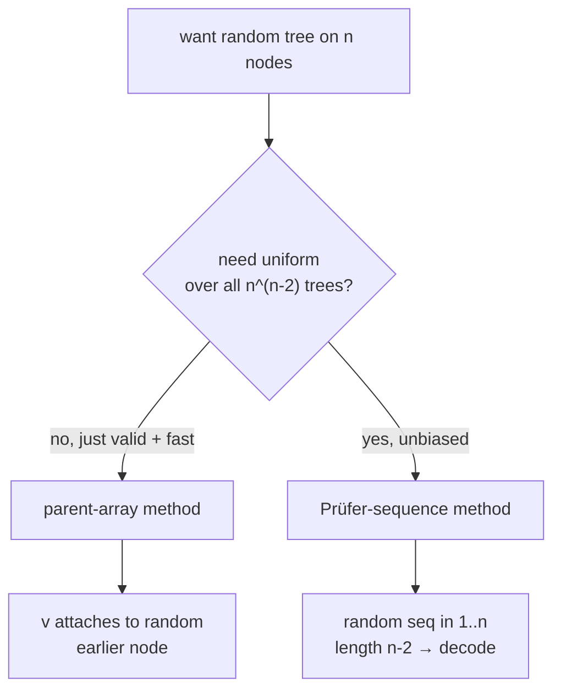
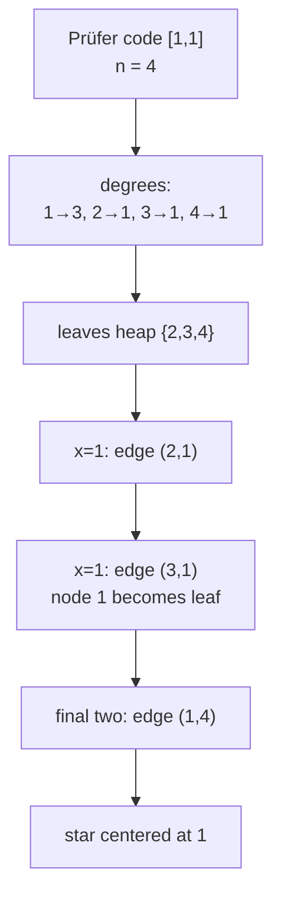
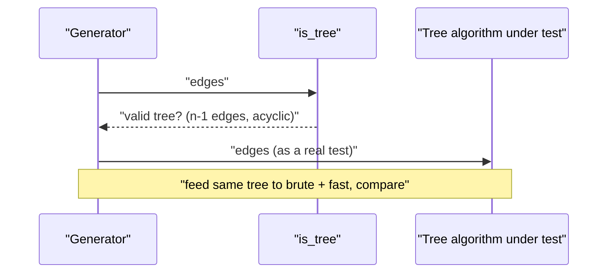
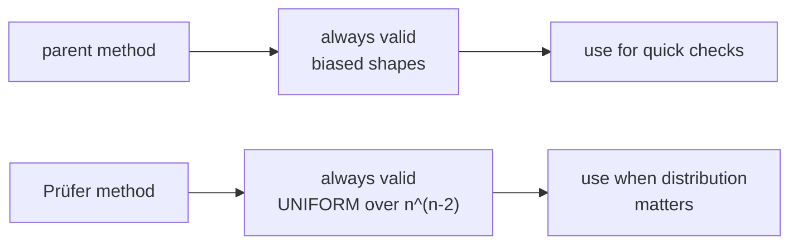

# Random Tree Generator — Parent Array & Prüfer Sequence

| Field | Value |
|-------|-------|
| Source | Technique / Self-contained |
| Topic | Random test generation, trees |
| Difficulty | Easy–Medium |
| Skills | Generating valid structured inputs, Prüfer codes, RNG |
| Goal | Produce random labeled trees for stress testing tree algorithms |

---

## Problem Statement

To stress-test tree algorithms (LCA, diameter, DP-on-tree, …) you need a generator that emits
**valid random labeled trees** on $n$ nodes. A valid tree on $n$ nodes has exactly $n - 1$ edges,
is **connected**, and is **acyclic**. Build two generators:

1. **Parent-array** method — simple, always valid, slightly biased toward "bushy" trees.
2. **Prüfer-sequence** method — produces every one of the $n^{\,n-2}$ labeled trees
   (Cayley's formula) with **uniform** probability.

```text
n = 4

Parent-array output (one possibility):
  edges: (1,2) (1,3) (2,4)

Prüfer code [1, 1] decodes to the tree:
  edges: (1,3) (1,4) (1,2)   # node 1 is a hub (a "star")
```

A printed tree is just its edge list, e.g.:

```text
4
1 2
1 3
2 4
```

---

## Approach (WHY)

**Parent array:** process nodes $2, 3, \dots, n$ in order; each new node $v$ attaches to a
uniformly random **already-placed** node in $1 \dots v-1$. Because every node connects to an
earlier node, the result is connected and acyclic *by construction* — you can never create a
cycle. It is fast and bullet-proof, but not every tree shape is equally likely.

**Prüfer sequence:** Cayley's formula says there are exactly $n^{\,n-2}$ labeled trees on $n$
nodes, and Prüfer codes give a **bijection** between those trees and length-$(n-2)$ sequences over
$\{1, \dots, n\}$. So drawing a uniformly random sequence and decoding it yields a **uniformly
random** labeled tree. This is the method to use when bias matters (e.g. you want to hit
path-like *and* star-like trees with the right frequencies).



---

## Code

### Parent-array generator

```python
import random

def random_tree_parent(n, seed):
    rng = random.Random(seed)
    edges = []
    for v in range(2, n + 1):
        parent = rng.randint(1, v - 1)     # uniform among earlier nodes
        edges.append((parent, v))
    return edges
```

```cpp
#include <bits/stdc++.h>
using namespace std;

vector<pair<int,int>> random_tree_parent(int n, unsigned seed) {
    mt19937 rng(seed);
    vector<pair<int,int>> edges;
    for (int v = 2; v <= n; v++) {
        int parent = uniform_int_distribution<int>(1, v - 1)(rng);  // uniform earlier node
        edges.push_back({parent, v});
    }
    return edges;
}
```

### Prüfer-sequence generator (uniform)

```python
import random

def random_tree_prufer(n, seed):
    rng = random.Random(seed)
    if n == 1:
        return []
    if n == 2:
        return [(1, 2)]
    code = [rng.randint(1, n) for _ in range(n - 2)]   # uniform random Prüfer code
    degree = [1] * (n + 1)
    for x in code:
        degree[x] += 1
    edges = []
    import heapq
    leaves = [i for i in range(1, n + 1) if degree[i] == 1]
    heapq.heapify(leaves)
    for x in code:
        leaf = heapq.heappop(leaves)       # smallest current leaf
        edges.append((leaf, x))
        degree[x] -= 1
        if degree[x] == 1:
            heapq.heappush(leaves, x)
    u = heapq.heappop(leaves)
    v = heapq.heappop(leaves)
    edges.append((u, v))                    # last two remaining nodes
    return edges
```

```cpp
#include <bits/stdc++.h>
using namespace std;

vector<pair<int,int>> random_tree_prufer(int n, unsigned seed) {
    mt19937 rng(seed);
    if (n == 1) return {};
    if (n == 2) return {{1, 2}};
    vector<int> code(n - 2);
    for (int &x : code) x = uniform_int_distribution<int>(1, n)(rng);  // uniform Prufer code
    vector<int> degree(n + 1, 1);
    for (int x : code) degree[x] += 1;
    priority_queue<int, vector<int>, greater<int>> leaves;
    for (int i = 1; i <= n; i++) if (degree[i] == 1) leaves.push(i);
    vector<pair<int,int>> edges;
    for (int x : code) {
        int leaf = leaves.top(); leaves.pop();   // smallest current leaf
        edges.push_back({leaf, x});
        if (--degree[x] == 1) leaves.push(x);
    }
    int u = leaves.top(); leaves.pop();
    int v = leaves.top(); leaves.pop();
    edges.push_back({u, v});                      // last two remaining nodes
    return edges;
}
```

### Validity check (used while stress testing the generator itself)

```python
def is_tree(n, edges):
    if len(edges) != n - 1:
        return False
    parent = list(range(n + 1))
    def find(x):
        while parent[x] != x:
            parent[x] = parent[parent[x]]
            x = parent[x]
        return x
    for u, v in edges:
        ru, rv = find(u), find(v)
        if ru == rv:                  # edge inside one component ⇒ cycle
            return False
        parent[ru] = rv
    return True                       # n-1 edges + no cycle ⇒ connected tree
```

```cpp
#include <bits/stdc++.h>
using namespace std;

bool is_tree(int n, const vector<pair<int,int>> &edges) {
    if ((int)edges.size() != n - 1) return false;
    vector<int> parent(n + 1);
    iota(parent.begin(), parent.end(), 0);
    function<int(int)> find = [&](int x) {
        while (parent[x] != x) { parent[x] = parent[parent[x]]; x = parent[x]; }
        return x;
    };
    for (auto [u, v] : edges) {
        int ru = find(u), rv = find(v);
        if (ru == rv) return false;   // edge inside one component ⇒ cycle
        parent[ru] = rv;
    }
    return true;                      // n-1 edges + no cycle ⇒ connected tree
}
```

---

## Trace

Decode the Prüfer code `[1, 1]` for $n = 4$ (so the code has length $n - 2 = 2$):

Initial degrees: `degree[x] = 1 + (#times x appears in code)`.

| node | base | + appearances in `[1,1]` | degree |
|------|------|--------------------------|--------|
| 1 | 1 | +2 | 3 |
| 2 | 1 | +0 | 1 |
| 3 | 1 | +0 | 1 |
| 4 | 1 | +0 | 1 |

Leaf min-heap starts as `{2, 3, 4}`.

| step | code value `x` | smallest leaf | edge added | degree[x]-- | new leaf? |
|------|----------------|---------------|------------|-------------|-----------|
| 1 | 1 | 2 | (2, 1) | 3 → 2 | no |
| 2 | 1 | 3 | (3, 1) | 2 → 1 | push 1 |
| end | — | pop 1, pop 4 | (1, 4) | — | — |

Resulting edges: `(2,1) (3,1) (1,4)` — node 1 is connected to 2, 3, and 4: a **star** centered at
1, which matches intuition since `1` appeared in every position of the code.







---

## Math & Complexity

**Cayley's formula:** the number of distinct labeled trees on $n$ nodes is

$$
T(n) = n^{\,n-2}.
$$

For $n = 4$ that is $4^{2} = 16$ trees; the Prüfer codes are all length-2 sequences over
$\{1,2,3,4\}$, of which there are exactly $4^{2} = 16$ — confirming the bijection.

| Generator | Time | Space | Distribution |
|-----------|------|-------|--------------|
| Parent array | $O(n)$ | $O(n)$ | valid, biased |
| Prüfer encode/decode | $O(n \log n)$ | $O(n)$ | **uniform** |
| `is_tree` (DSU) | $O(n\,\alpha(n))$ | $O(n)$ | — |

The Prüfer decode is $O(n \log n)$ because of the leaf min-heap; with a pointer-based scan it can
be done in $O(n)$, but the heap version is simpler and plenty fast for test generation.

---

## Takeaway

> Generate trees **valid by construction**: the parent-array trick (attach each node to an
> earlier one) is the fastest always-correct option, while **Prüfer sequences** give a clean
> bijection to length-$(n-2)$ random sequences and therefore a **uniformly random** labeled tree
> — exactly what you want when test-shape distribution matters.
