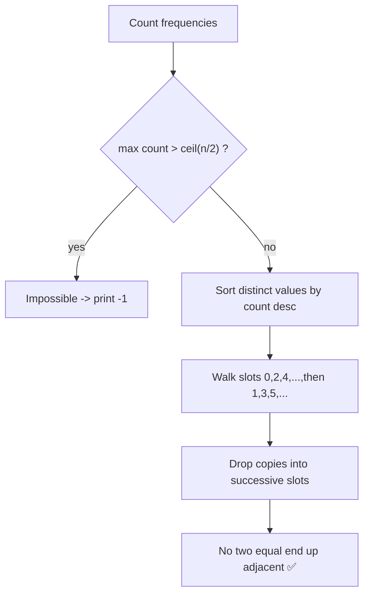
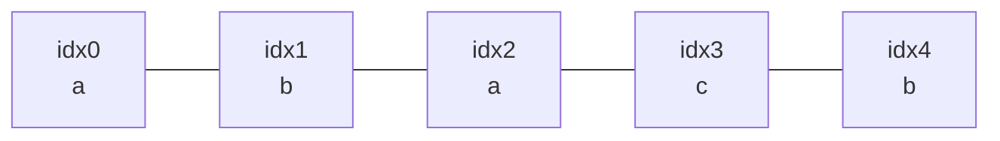
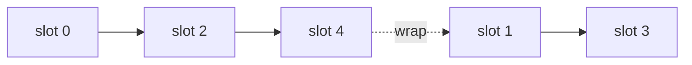
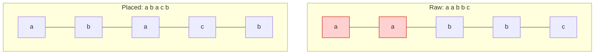
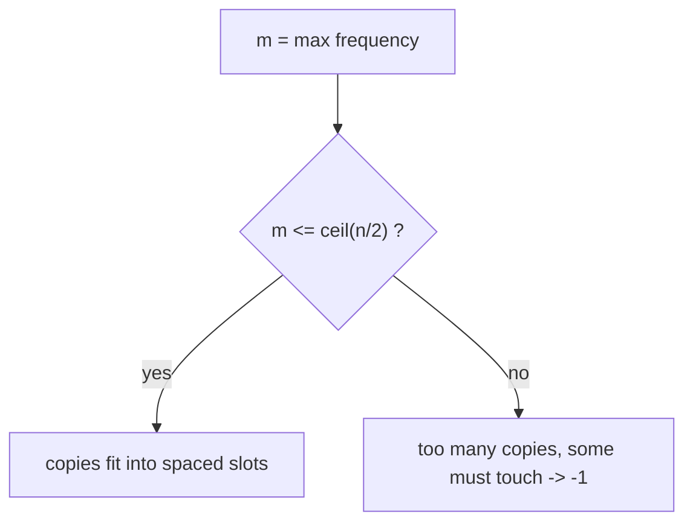
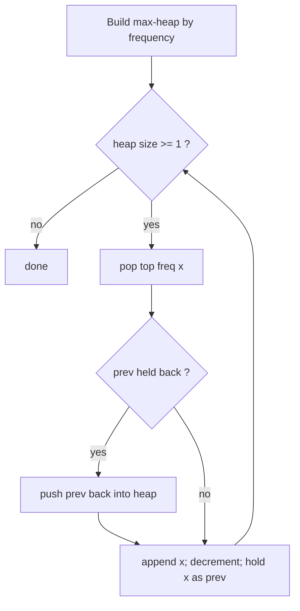

# Constructive — Rearrange so No Two Adjacent Are Equal

| Field | Value |
|-------|-------|
| Source | Self-contained (a.k.a. "reorganize string / task scheduling") |
| Number | — |
| Difficulty | Medium |
| Topics | Constructive, greedy placement, counting/parity, heaps |
| Link | (self-contained) |

---

## Problem Statement

Given an array (or string) of $n$ elements, **reorder** them so that no two **adjacent** elements
are equal. If no such arrangement exists, report that it is **impossible** (print `-1`).

```text
Input:  a a b b c
Output: a b a c b        (no two neighbours equal)

Input:  a a a b
Output: -1               ('a' appears 3 times, ceil(4/2)=2, so impossible)
```

Constraints: $1 \le n \le 2 \cdot 10^5$, values are arbitrary comparable items.

---

## Approach (WHY)

**Feasibility first.** The most frequent element is the bottleneck. If a value occurs $m$ times,
those $m$ copies need $m-1$ separators between them, so they fit only if

$$
m \le \left\lceil \frac{n}{2} \right\rceil .
$$

If the maximum frequency exceeds $\lceil n/2 \rceil$, it is genuinely impossible — output `-1`.

**Construction (greedy slot filling).** Otherwise, sort values by frequency, **highest first**,
and drop them into positions $0, 2, 4, \dots$ (all even indices), then wrap to $1, 3, 5, \dots$
(odd indices). Because even indices are never adjacent to each other, the dangerous high-frequency
value is spread with gaps, and every value lands on non-touching slots in turn.



The even-then-odd walk is the key: consecutive output positions $j$ and $j+1$ are filled at
*different times*, and the same value's copies are always two slots apart, so they can never be
neighbours.

---

## Solution

```python
from collections import Counter

def rearrange_no_adjacent(values):
    n = len(values)
    counts = Counter(values)
    if max(counts.values()) > (n + 1) // 2:
        return None  # impossible

    order = sorted(counts.items(), key=lambda kv: -kv[1])
    result = [None] * n
    idx = 0
    for value, cnt in order:
        for _ in range(cnt):
            result[idx] = value
            idx += 2
            if idx >= n:
                idx = 1
    return result

if __name__ == "__main__":
    arr = input().split()
    out = rearrange_no_adjacent(arr)
    print(-1 if out is None else " ".join(map(str, out)))
```

```cpp
#include <bits/stdc++.h>
using namespace std;

vector<string> rearrange_no_adjacent(const vector<string>& values) {
    long long n = (long long)values.size();
    map<string, long long> counts;
    for (const string& v : values) counts[v]++;

    long long best = 0;
    for (auto& kv : counts) best = max(best, kv.second);
    if (best > (n + 1) / 2) return {};  // impossible (signalled by empty)

    vector<pair<string,long long>> order(counts.begin(), counts.end());
    sort(order.begin(), order.end(),
         [](const auto& a, const auto& b){ return a.second > b.second; });

    vector<string> result(n);
    long long idx = 0;
    for (auto& kv : order) {
        for (long long c = 0; c < kv.second; ++c) {
            result[idx] = kv.first;
            idx += 2;
            if (idx >= n) idx = 1;
        }
    }
    return result;
}

int main() {
    vector<string> arr;
    string token;
    while (cin >> token) arr.push_back(token);

    vector<string> out = rearrange_no_adjacent(arr);
    if (out.empty() && !arr.empty()) {
        cout << -1 << "\n";
    } else {
        for (size_t i = 0; i < out.size(); ++i)
            cout << out[i] << (i + 1 < out.size() ? ' ' : '\n');
    }
    return 0;
}
```

---

## Trace (`a a b b c`, n = 5)

Frequencies: `a:2, b:2, c:1`. Max count $2 \le \lceil 5/2 \rceil = 3$ → feasible.
Order by count desc: `a(2), b(2), c(1)`. Slots visited: $0, 2, 4, 1, 3$.

| Place | value | idx before | write to | idx after | result |
|-------|-------|-----------|----------|-----------|--------|
| 1 | a | 0 | `[0]` | 2 | `a . . . .` |
| 2 | a | 2 | `[2]` | 4 | `a . a . .` |
| 3 | b | 4 | `[4]` | 6→1 | `a . a . b` |
| 4 | b | 1 | `[1]` | 3 | `a b a . b` |
| 5 | c | 3 | `[3]` | 5→1 | `a b a c b` |

Output `a b a c b` — no two neighbours equal. ✅



---

## More Diagrams

The slot-walk visits even indices, then wraps to odd indices:



Why the heaviest value stays safe (before/after):



Feasibility decision as parity/counting:



An alternative heap-based construction (pop the two most frequent each step):



---

## Math & Complexity

Feasibility condition:

$$
\text{possible} \iff \max_v \operatorname{count}(v) \le \left\lceil \frac{n}{2} \right\rceil .
$$

**Correctness sketch.** Even indices $0, 2, \dots$ number $\lceil n/2 \rceil$, the largest single
group of mutually non-adjacent positions. Filling the top value there first means each of its
copies sits two apart. Subsequent values continue along the same non-adjacent walk, so the
invariant "equal copies are $\ge 2$ slots apart" holds throughout.

- **Time:** $O(n + k \log k)$ where $k$ is the number of distinct values (the sort). The heap
  variant is $O(n \log k)$.
- **Space:** $O(n)$.

---

## Takeaway

Two-part constructive template: **(1)** prove a clean impossibility test
($\max\text{count} \le \lceil n/2 \rceil$), then **(2)** place the most-constrained
(highest-frequency) element first into non-adjacent slots. Greedy-by-frequency plus the
even-then-odd walk guarantees no two equal neighbours — and remembering the `-1` branch is half the
battle.
