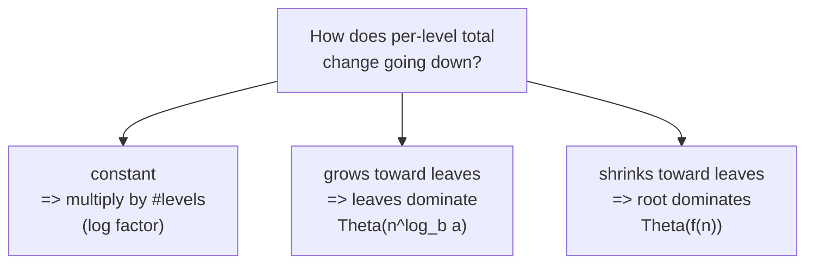
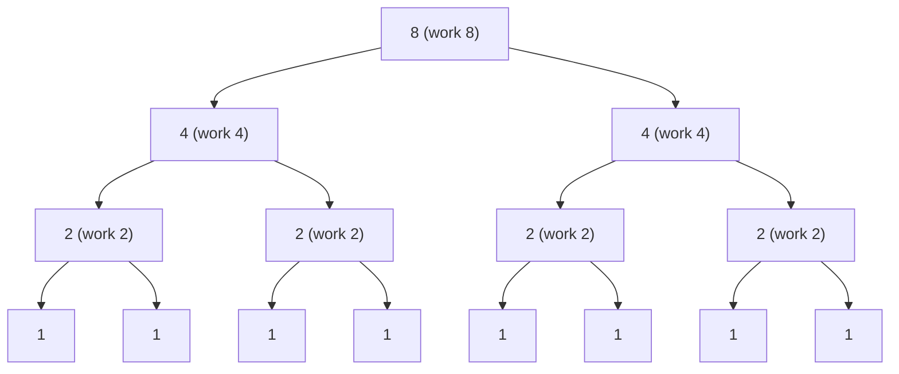
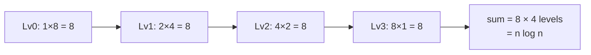
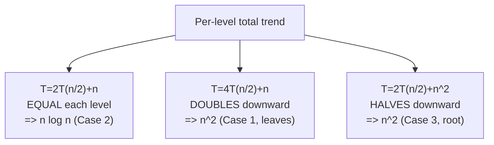
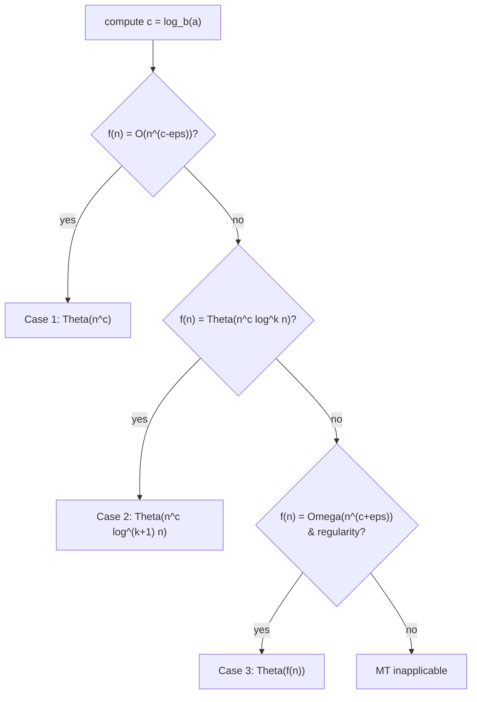

# Recurrence Tree Analysis

| Field | Value |
|---|---|
| **Module** | basics |
| **Topic** | Time complexity — recurrences & Master Theorem |
| **Difficulty** | Medium |
| **Core idea** | Sum work level-by-level in the recursion tree; confirm with the Master Theorem |
| **Time (the recurrence solved)** | $T(n)=2T(n/2)+O(n) = \Theta(n\log n)$ |
| **Space** | $O(\log n)$ recursion depth |
| **Prereqs** | Recursion, geometric series, Big-Theta |

---

## Problem Statement

Given a divide-and-conquer recurrence, determine its asymptotic growth. Concretely, analyze
$$T(n) = 2\,T(n/2) + O(n),$$
and its variants
$$T(n) = 2T(n/2)+O(1), \qquad T(n)=4T(n/2)+O(n), \qquad T(n)=2T(n/2)+O(n^2),$$
using **two independent methods**: the **recurrence tree** (draw it, sum each level) and the **Master Theorem** (compare $f(n)$ against the watershed $n^{\log_b a}$). The two must agree.

### Example

```text
Recurrence: T(n) = 2*T(n/2) + n,  T(1) = 1

Tree:
  level 0:           n                      total = n
  level 1:        n/2 + n/2                  total = n
  level 2:    n/4 + n/4 + n/4 + n/4          total = n
  ...
  level log2(n):   n leaves of size 1        total = n

#levels = log2(n) + 1,  each contributes n
=> T(n) = n * (log2(n)+1) = Theta(n log n)
```

---

## Why This Works

A recurrence describes recursive cost in terms of subproblems. The **tree method** is fully general and intuitive: every node's *local* (non-recursive) work is written at the node, and
$$T(n) = \sum_{\text{levels}} (\text{total work on that level}).$$

The decisive question is **how the per-level total changes as you descend**:

- **Constant per level** (work neither grows nor shrinks): multiply by the number of levels → typically a $\log$ factor appears.
- **Geometrically increasing** toward the leaves: the **bottom level dominates** → cost $\Theta(n^{\log_b a})$.
- **Geometrically decreasing** toward the leaves: the **root dominates** → cost $\Theta(f(n))$.



These three behaviors are exactly the three **Master Theorem cases**.

---

## Approach (paired implementations)

We *instrument* the recurrence: a function that returns the **total work** predicted by the tree, so we can verify the closed form numerically.

First, the canonical $T(n) = 2T(n/2) + n$:

```python
def work_2_half_n(n):
    if n <= 1:
        return 1
    # local work at this node is n, plus the two recursive calls
    return n + work_2_half_n(n // 2) + work_2_half_n(n - n // 2)

for n in [1, 2, 4, 8, 16, 1024]:
    print(n, work_2_half_n(n))   # grows like n*log2(n)
```

```cpp
#include <bits/stdc++.h>
using namespace std;

long long work_2_half_n(long long n) {
    if (n <= 1) {
        return 1;
    }
    // local work at this node is n, plus the two recursive calls
    return n + work_2_half_n(n / 2) + work_2_half_n(n - n / 2);
}

int main() {
    for (long long n : {1LL, 2LL, 4LL, 8LL, 16LL, 1024LL}) {
        cout << n << " " << work_2_half_n(n) << "\n";  // grows like n*log2(n)
    }
    return 0;
}
```

A general solver that sums the tree level-by-level for $T(n)=a\,T(n/b)+f(n)$ (closed-form per level, no recursion needed):

```python
import math

def tree_total(a, b, f, n):
    total = 0.0
    level = 0
    size = n
    nodes = 1
    while size >= 1:
        total += nodes * f(size)     # work on this level = (#nodes) * f(subproblem size)
        nodes *= a
        size //= b
        level += 1
        if size < 1:
            break
    return total, level              # (approx total work, number of levels)

print(tree_total(2, 2, lambda x: x,     1024))  # ~ n log n
print(tree_total(4, 2, lambda x: x,     1024))  # ~ n^2  (leaves dominate)
print(tree_total(2, 2, lambda x: x * x, 1024))  # ~ n^2  (root dominates)
```

```cpp
#include <bits/stdc++.h>
using namespace std;

pair<double,int> tree_total(long long a, long long b,
                            function<double(double)> f, long long n) {
    double total = 0.0;
    int level = 0;
    double size = (double)n;
    double nodes = 1.0;
    while (size >= 1) {
        total += nodes * f(size);    // work on this level = (#nodes) * f(subproblem size)
        nodes *= (double)a;
        size = floor(size / (double)b);
        level++;
        if (size < 1) {
            break;
        }
    }
    return {total, level};           // (approx total work, number of levels)
}

int main() {
    auto r1 = tree_total(2, 2, [](double x){ return x; },     1024);  // ~ n log n
    auto r2 = tree_total(4, 2, [](double x){ return x; },     1024);  // ~ n^2 leaves
    auto r3 = tree_total(2, 2, [](double x){ return x * x; }, 1024);  // ~ n^2 root
    cout << r1.first << " " << r1.second << "\n";
    cout << r2.first << " " << r2.second << "\n";
    cout << r3.first << " " << r3.second << "\n";
    return 0;
}
```

---

## Trace

The tree for $T(n)=2T(n/2)+n$ with $n=8$:



Per-level totals (each row sums to $n=8$):

| Level | #nodes | size each | level total |
|---|---|---|---|
| 0 | 1 | 8 | 8 |
| 1 | 2 | 4 | 8 |
| 2 | 4 | 2 | 8 |
| 3 | 8 | 1 | 8 |

Number of levels $= \log_2 8 + 1 = 4$, each contributing $8$, so $T(8) \approx 8 \cdot 4 = 32 = n\log_2 n + n$.



Contrast the three behaviors side by side:



---

## Math & Complexity

**Master Theorem** for $T(n)=a\,T(n/b)+f(n)$ with watershed $n^{\log_b a}$:



Apply it to each variant:

| Recurrence | $a,b$ | $\log_b a$ | $f(n)$ | Case | Closed form |
|---|---|---|---|---|---|
| $2T(n/2)+n$ | $2,2$ | $1$ | $n=\Theta(n^1)$ | 2, $k=0$ | $\Theta(n\log n)$ |
| $2T(n/2)+1$ | $2,2$ | $1$ | $1=O(n^{1-\epsilon})$ | 1 | $\Theta(n)$ |
| $4T(n/2)+n$ | $4,2$ | $2$ | $n=O(n^{2-\epsilon})$ | 1 | $\Theta(n^2)$ |
| $2T(n/2)+n^2$ | $2,2$ | $1$ | $n^2=\Omega(n^{1+\epsilon})$ | 3 | $\Theta(n^2)$ |
| $3T(n/2)+n$ | $3,2$ | $\log_2 3$ | $n=O(n^{\log_2 3-\epsilon})$ | 1 | $\Theta(n^{\log_2 3})$ |

**Geometric-series derivation** of the canonical case. With $a=b=2$ and $f(n)=n$, level $i$ has $2^i$ nodes each of size $n/2^i$, contributing $2^i \cdot (n/2^i) = n$. Summed over $\log_2 n + 1$ levels:
$$T(n) = \sum_{i=0}^{\log_2 n} n = n(\log_2 n + 1) = \Theta(n\log n).$$

For the leaf-dominated case $4T(n/2)+n$: level $i$ contributes $4^i (n/2^i) = n\,2^i$, a *growing* geometric series whose last term ($i=\log_2 n$) is $n\cdot 2^{\log_2 n} = n^2$, dominating the sum → $\Theta(n^2)$.

**Space:** the recursion depth is $\Theta(\log n)$ (balanced halving), so auxiliary stack space is $O(\log n)$ — independent of how the *time* works out.

---

## Takeaway

- **Tree method = sum per level.** Total = (work per level) × (number of levels), adjusted when levels are not equal.
- **Three regimes:** equal levels → log factor (Case 2); growing toward leaves → $n^{\log_b a}$ (Case 1); shrinking toward leaves → $f(n)$ (Case 3).
- **Master Theorem** is the fast shortcut: compute $n^{\log_b a}$, compare to $f(n)$, read off the case.
- **Time and space are separate:** balanced D&C is $O(\log n)$ stack regardless of the time bound.
