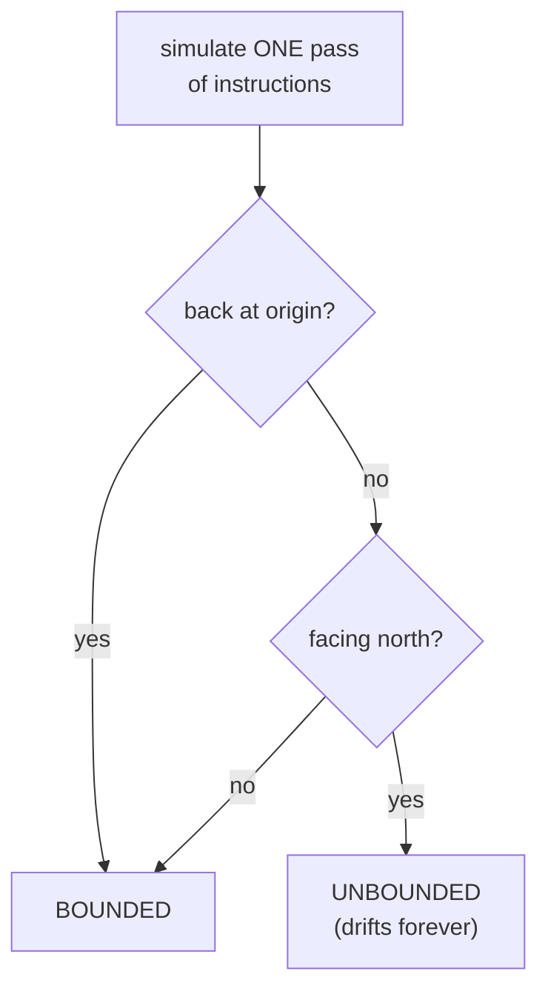
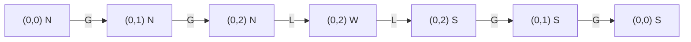
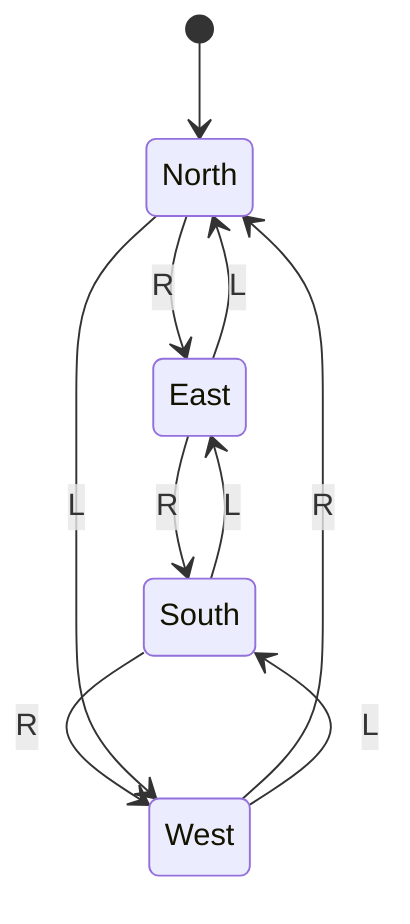
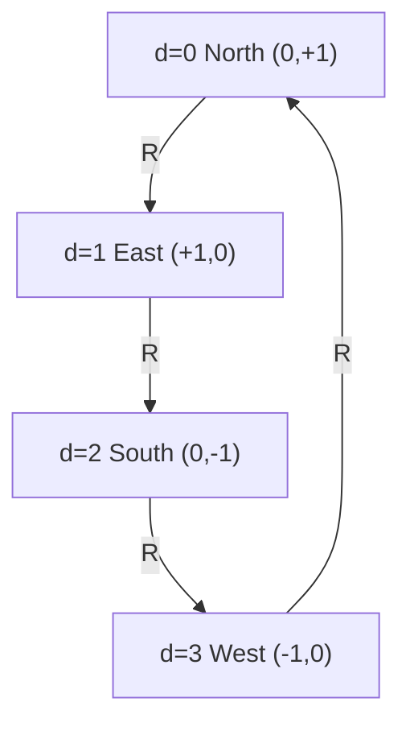
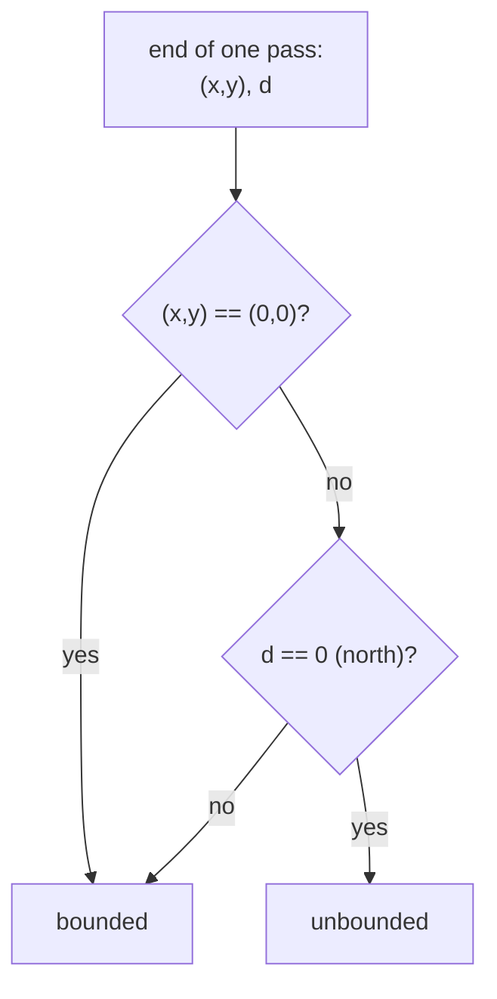
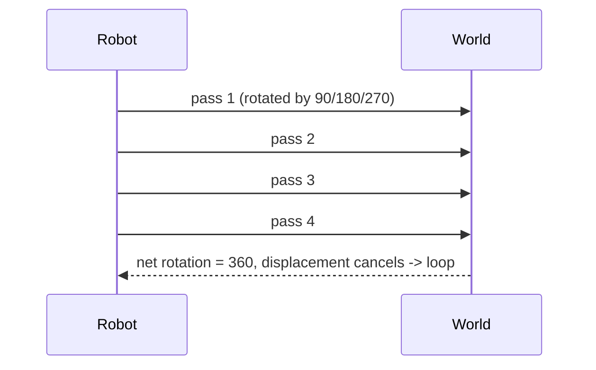

# Robot Bounded in Circle (Direction-Array Simulation)

| Meta | Value |
|------|-------|
| **Problem** | Robot Bounded in Circle |
| **Source** | Self-contained (grid / direction-array simulation) |
| **Reference** | LeetCode 1041 style |
| **Difficulty** | Medium |
| **Topics** | Implementation, Simulation, Direction arrays, Geometry |
| **Time** | $O(L)$ per cycle |
| **Space** | $O(1)$ |

---

## Problem Statement

A robot starts at the origin `(0, 0)` on an infinite grid, **facing north**. It executes a string of instructions, repeated **forever**:

- `'G'` — move forward one unit in the current facing direction.
- `'L'` — turn left $90°$ (counter-clockwise), staying in place.
- `'R'` — turn right $90°$ (clockwise), staying in place.

The robot is **bounded in a circle** (its trajectory never escapes to infinity) if and only if, after running the instruction string **once**, either it returns to the origin, **or** it is no longer facing north. Return whether the robot stays bounded.

```text
Input:  "GGLLGG"
After one pass: back at (0,0) facing south.
Output: true  (returns to a repeating loop)

Input:  "GG"
After one pass: at (0,2) still facing north.
Output: false (drifts north forever)

Input:  "GL"
After one pass: at (0,1) facing west.
Output: true
```

---

## Approach (WHY)

Model the robot with **direction arrays**. Order the four headings clockwise: north, east, south, west. Then a right turn is `dir = (dir + 1) % 4` and a left turn is `dir = (dir + 3) % 4`. Moving forward adds the offset of the current heading.

The key insight (the *WHY*) is that we only need to simulate **one pass** of the instructions. There are two cases after one pass:

- If the robot is back at the origin, the cycle repeats in place forever — bounded.
- If the robot's facing is **not** north, then after at most **four** passes the net rotation brings it back to the start orientation while the displacement vectors cancel, so it traces a closed loop — bounded.
- Only when it ends a pass **at a non-origin point still facing north** does each pass add the same nonzero displacement, marching off to infinity — unbounded.



This reduces an "infinite" simulation to a single $O(L)$ scan — a classic simulation-with-an-invariant shortcut.

---

## Solution

```python
def isRobotBounded(instructions: str) -> bool:
    # headings clockwise: north, east, south, west
    dx = [0, 1, 0, -1]
    dy = [1, 0, -1, 0]
    x, y, d = 0, 0, 0   # start at origin, facing north (d=0)

    for cmd in instructions:
        if cmd == 'L':
            d = (d + 3) % 4
        elif cmd == 'R':
            d = (d + 1) % 4
        elif cmd == 'G':
            x += dx[d]
            y += dy[d]

    # bounded iff returned to origin OR no longer facing north
    return (x == 0 and y == 0) or d != 0

print(isRobotBounded("GGLLGG"))  # True
print(isRobotBounded("GG"))      # False
print(isRobotBounded("GL"))      # True
```

```cpp
#include <bits/stdc++.h>
using namespace std;

bool isRobotBounded(const string &instructions) {
    // headings clockwise: north, east, south, west
    const int dx[4] = {0, 1, 0, -1};
    const int dy[4] = {1, 0, -1, 0};
    int x = 0, y = 0, d = 0;   // start at origin, facing north (d=0)

    for (char cmd : instructions) {
        if (cmd == 'L') {
            d = (d + 3) % 4;
        } else if (cmd == 'R') {
            d = (d + 1) % 4;
        } else if (cmd == 'G') {
            x += dx[d];
            y += dy[d];
        }
    }

    // bounded iff returned to origin OR no longer facing north
    return (x == 0 && y == 0) || d != 0;
}

int main() {
    cout << boolalpha;
    cout << isRobotBounded("GGLLGG") << "\n"; // true
    cout << isRobotBounded("GG") << "\n";     // false
    cout << isRobotBounded("GL") << "\n";     // true
    return 0;
}
```

---

## Trace

Tracing `"GGLLGG"` from `(0,0)` facing north (`d=0`).

| Cmd | Action | `d` after | `(x, y)` after |
|-----|--------|-----------|----------------|
| G | move north | 0 | (0, 1) |
| G | move north | 0 | (0, 2) |
| L | turn left | 3 (west) | (0, 2) |
| L | turn left | 2 (south) | (0, 2) |
| G | move south | 2 | (0, 1) |
| G | move south | 2 | (0, 0) |

End state: `(0, 0)`, facing south. Back at origin ⇒ **bounded (true)**.

Contrast `"GG"`: ends at `(0, 2)` with `d = 0` (north). Not at origin **and** still facing north ⇒ **unbounded (false)**.



---

## Diagrams

The four headings form a clockwise state machine; `R` advances by one, `L` retreats by one:



The direction-array mapping from heading index to offset:



Decision after one simulated pass:



Why a non-north heading guarantees a closed loop — four passes net to zero rotation and cancel displacement:



---

## Math / Complexity

Let $L$ be the length of the instruction string. We perform a single linear scan:

$$T = O(L), \qquad S = O(1).$$

The boundedness argument rests on rotation. If after one pass the heading changed by angle $\theta \in \{90°, 180°, 270°\}$, then after $k$ passes the cumulative rotation is $k\theta$, and the displacement vectors are successive $\theta$-rotations of the first pass's displacement $\vec{v}$:

$$\sum_{k=0}^{3} R_{\theta}^{\,k}\,\vec{v} = \vec{0},$$

because rotating a vector by $90°$ four times (or $180°$ twice, or $270°$ four times) sums to zero. Hence the path closes within at most four passes whenever the final heading is not north.

---

## Takeaway

Pair **direction arrays** with a clockwise ordering so turns become `(d ± 1) % 4`, and look for an **invariant** that collapses an infinite simulation into a single pass. Here the invariant "returns to origin OR no longer faces north" turns a never-ending walk into one $O(L)$ scan.
