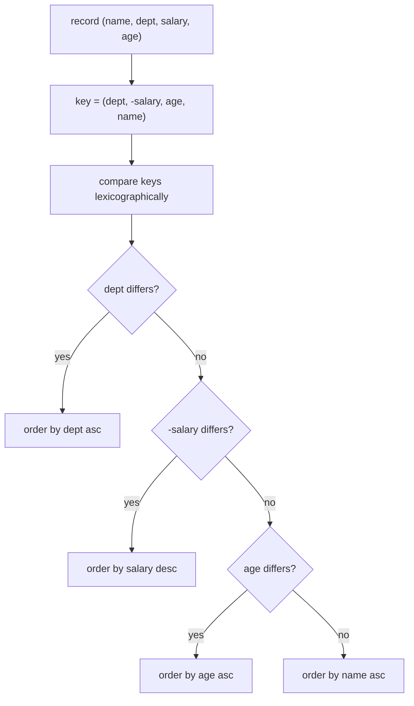
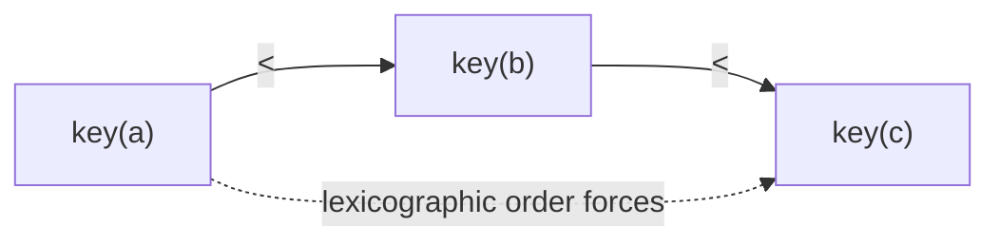
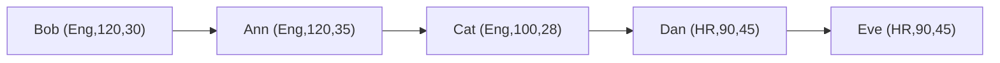
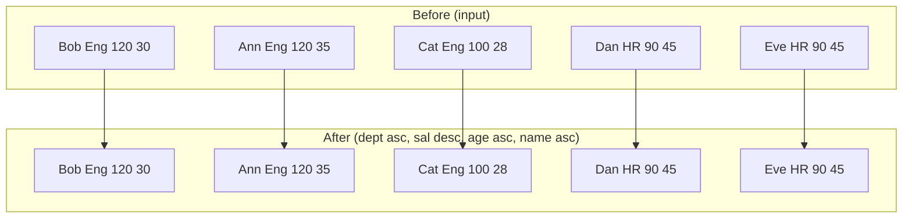
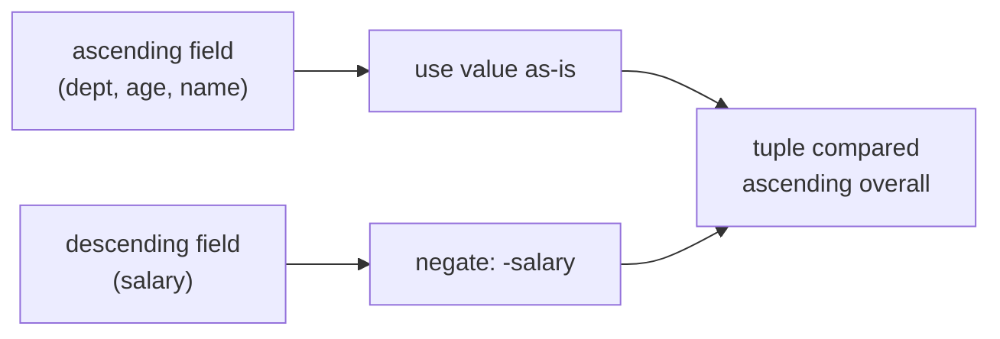
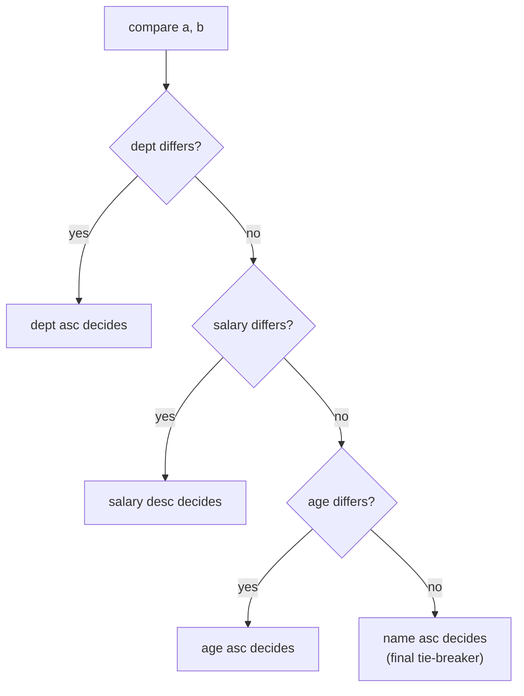

# Sort Records by Multiple Keys (Mixed Asc/Desc Tie-Breakers)

| Meta | Value |
|------|-------|
| **Problem** | Multi-key sort with mixed ascending/descending tie-breakers |
| **Source** | Self-contained (classic interview / CP pattern) |
| **Link** | — |
| **Difficulty** | Easy → Medium |
| **Topics** | Sorting, Custom Comparator, Tuples, Tie-Breakers, Stability |
| **Time** | $O(n \log n)$ |
| **Space** | $O(n)$ (or $O(\log n)$ in place) |

---

## Problem Statement

You are given a list of employee records, each `(name, department, salary, age)`. Sort them by
**several keys at once**, mixing ascending and descending:

1. **Department** ascending (alphabetical).
2. Within a department, **salary** descending (highest paid first).
3. On equal salary, **age** ascending (youngest first).
4. On a full tie, **name** ascending (alphabetical).

```text
Input records (name, dept, salary, age):
  ("Ann",  "Eng",  120, 35)
  ("Bob",  "Eng",  120, 30)
  ("Cat",  "Eng",  100, 28)
  ("Dan",  "HR",    90, 45)
  ("Eve",  "HR",    90, 45)

Output (Eng before HR; within Eng salary desc, then age asc):
  ("Bob",  "Eng",  120, 30)
  ("Ann",  "Eng",  120, 35)
  ("Cat",  "Eng",  100, 28)
  ("Dan",  "HR",    90, 45)
  ("Eve",  "HR",    90, 45)   # Dan before Eve on name tie
```

---

## Approach (WHY)

The cleanest, **bug-proof** way to do multi-key ordering is to map each record to a **tuple key**
whose components are compared left-to-right (lexicographically) — exactly like the spec reads.
Tuple comparison is transitive by construction, so the resulting order is automatically a valid
**strict weak ordering** (no UB risk in C++).

The only subtlety is mixing directions: a tuple is compared ascending in every position. To make
a **numeric** field descending, **negate** it (`-salary`). Strings cannot be negated, but here all
string fields (department, name) are ascending, so plain values work.



The transitivity that makes this safe comes for free from tuple/string ordering:



---

## Solution

```python
from typing import List, Tuple

Record = Tuple[str, str, int, int]   # (name, dept, salary, age)

def sort_records(records: List[Record]) -> List[Record]:
    # dept ASC, salary DESC (negate), age ASC, name ASC
    return sorted(records, key=lambda r: (r[1], -r[2], r[3], r[0]))

data = [
    ("Ann", "Eng", 120, 35),
    ("Bob", "Eng", 120, 30),
    ("Cat", "Eng", 100, 28),
    ("Dan", "HR",   90, 45),
    ("Eve", "HR",   90, 45),
]
for rec in sort_records(data):
    print(rec)
```

```cpp
#include <bits/stdc++.h>
using namespace std;

struct Record {
    string name;
    string dept;
    long long salary;
    long long age;
};

vector<Record> sortRecords(vector<Record> records) {
    // dept ASC, salary DESC (negate), age ASC, name ASC
    stable_sort(records.begin(), records.end(),
                [](const Record &a, const Record &b) {
                    return make_tuple(a.dept, -a.salary, a.age, a.name)
                         < make_tuple(b.dept, -b.salary, b.age, b.name);
                });
    return records;
}

int main() {
    vector<Record> data = {
        {"Ann", "Eng", 120, 35},
        {"Bob", "Eng", 120, 30},
        {"Cat", "Eng", 100, 28},
        {"Dan", "HR",   90, 45},
        {"Eve", "HR",   90, 45},
    };
    for (auto &r : sortRecords(data))
        cout << r.name << ' ' << r.dept << ' '
             << r.salary << ' ' << r.age << '\n';
    return 0;
}
```

---

## Trace

Compute each tuple key, then sort ascending on the key:

| Record | key = (dept, -salary, age, name) |
|--------|----------------------------------|
| Ann, Eng, 120, 35 | `("Eng", -120, 35, "Ann")` |
| Bob, Eng, 120, 30 | `("Eng", -120, 30, "Bob")` |
| Cat, Eng, 100, 28 | `("Eng", -100, 28, "Cat")` |
| Dan, HR, 90, 45 | `("HR", -90, 45, "Dan")` |
| Eve, HR, 90, 45 | `("HR", -90, 45, "Eve")` |

Ascending on these keys: `"Eng" < "HR"` splits departments first. Inside Eng, `-120 < -100`, so
both `120` salaries precede `100` (descending salary achieved). Between Ann and Bob (both
`-120`), `age 30 < 35` puts **Bob** first. In HR, keys differ only at name, so **Dan** precedes
**Eve**.



---

## Diagrams

Before vs after, showing how the multi-key order regroups the records:



How direction is encoded inside a single ascending tuple comparison:



The decision cascade for a single pairwise comparison:



---

## Math & Complexity

Building each tuple key costs $O(k)$ for $k$ fields, and the sort makes $O(n \log n)$ comparisons,
each costing up to $O(k)$:

$$
O(n \log n \cdot k)
$$

With $k$ a small constant (4 fields), this is simply $O(n \log n)$. Space is $O(n)$ for `sorted`
in Python (or $O(\log n)$ for an in-place `sort`); the C++ `stable_sort` may use $O(n)$ scratch.

Because the final tie-breaker (`name`) makes every key **unique** in this dataset, the result is
fully determined and stability is moot — but using `stable_sort` (and a full tie-breaker) is the
safe habit when ties *can* remain.

$$
\text{key}(r) = (\text{dept},\, -\text{salary},\, \text{age},\, \text{name}) \quad\Rightarrow\quad \text{lexicographic} = \text{spec}
$$

---

## Takeaway

Encode multi-key orders as a **tuple of fields** in priority order, **negating numeric fields**
that should be descending. Tuple comparison gives you transitivity (and therefore a valid strict
weak ordering) for free, turning a fiddly nested-`if` comparator into a single, obviously-correct
line.
