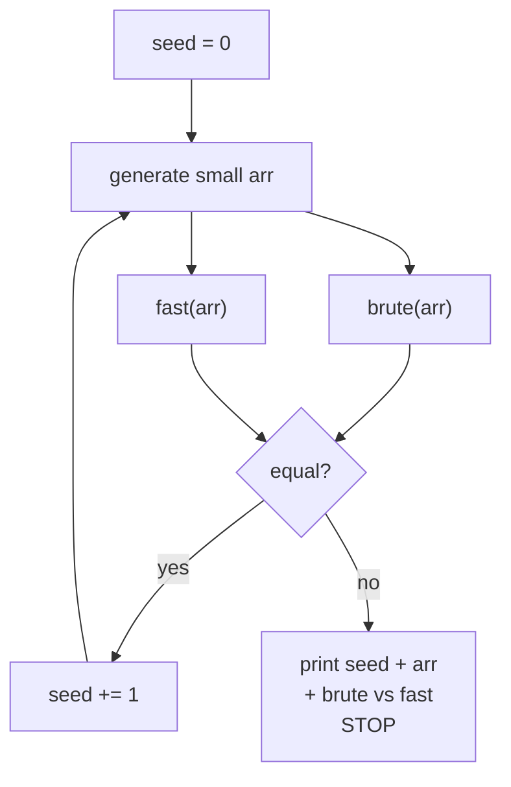
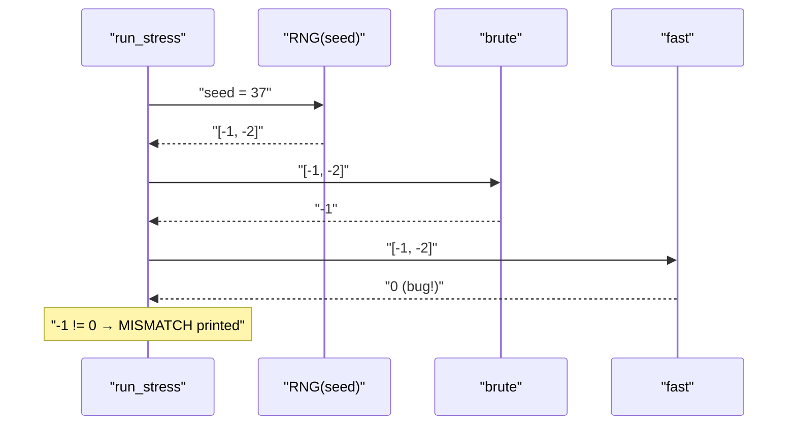
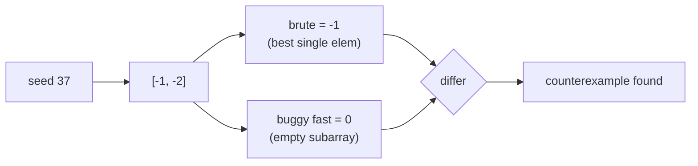

# Stress-Test Harness — Brute vs Optimized (Max Subarray Sum)

| Field | Value |
|-------|-------|
| Source | Technique / Self-contained |
| Topic | Stress testing, random test generation |
| Difficulty | Easy–Medium |
| Skills | Brute-vs-fast comparison, reproducible seeding, RNG |
| Goal | Build a complete harness that auto-finds a counterexample |

---

## Problem Statement

You wrote a fast **maximum subarray sum** solution (Kadane's algorithm) and you are *not sure it
is correct*. Build a **self-contained stress-test harness** that:

1. generates many small random arrays from a reproducible seed,
2. computes the answer with a slow-but-trusted brute force,
3. computes the answer with the fast solution,
4. compares them and prints the first input where they disagree.

The maximum subarray sum is the largest possible sum over any **contiguous, non-empty**
subarray.

```text
Input array : [-2, 1, -3, 4, -1, 2, 1, -5, 4]
Best subarray: [4, -1, 2, 1]  →  sum = 6

Input array : [-3, -1, -2]
Best subarray: [-1]           →  sum = -1   (must pick at least one element)
```

The harness output, when everything is correct, looks like:

```text
All 20000 tests passed.
```

and when the fast solution has a bug:

```text
MISMATCH at seed 37
input : [-1, -2]
brute : -1
fast  : -3
```

---

## Approach (WHY)

A brute force that simply tries **every** start/end pair is impossible to get wrong — its
$O(n^2)$ double loop is a direct translation of the definition. Kadane's $O(n)$ solution is
faster but its "extend or restart" decision is exactly the kind of step that hides off-by-one or
initialization bugs (e.g. starting `best = 0` wrongly excludes all-negative arrays). By feeding
**both** the same random small arrays and comparing, any divergence is a concrete bug we can
print and replay. We keep arrays tiny ($n \le 6$, values in $[-5, 5]$) so the first counterexample
is human-readable, and we seed the RNG with the loop counter so the failing case is reproducible.

---

## Code

The trusted brute force:

```python
def max_subarray_brute(arr):
    best = arr[0]
    for i in range(len(arr)):
        running = 0
        for j in range(i, len(arr)):
            running += arr[j]
            best = max(best, running)
    return best
```

```cpp
#include <bits/stdc++.h>
using namespace std;

long long max_subarray_brute(const vector<long long> &arr) {
    long long best = arr[0];
    for (size_t i = 0; i < arr.size(); i++) {
        long long running = 0;
        for (size_t j = i; j < arr.size(); j++) {
            running += arr[j];
            best = max(best, running);
        }
    }
    return best;
}
```

The fast solution under test (Kadane):

```python
def max_subarray_fast(arr):
    best = cur = arr[0]
    for x in arr[1:]:
        cur = max(x, cur + x)
        best = max(best, cur)
    return best
```

```cpp
#include <bits/stdc++.h>
using namespace std;

long long max_subarray_fast(const vector<long long> &arr) {
    long long best = arr[0], cur = arr[0];
    for (size_t i = 1; i < arr.size(); i++) {
        cur = max(arr[i], cur + arr[i]);
        best = max(best, cur);
    }
    return best;
}
```

The harness — generator + compare loop, all in one place:

```python
import random

def run_stress(iterations=20000):
    for seed in range(iterations):
        rng = random.Random(seed)
        n = rng.randint(1, 6)
        arr = [rng.randint(-5, 5) for _ in range(n)]
        expected = max_subarray_brute(arr)
        got = max_subarray_fast(arr)
        if expected != got:
            print(f"MISMATCH at seed {seed}")
            print("input :", arr)
            print("brute :", expected)
            print("fast  :", got)
            return
    print(f"All {iterations} tests passed.")

run_stress()
```

```cpp
#include <bits/stdc++.h>
using namespace std;

void run_stress(int iterations = 20000) {
    for (int seed = 0; seed < iterations; seed++) {
        mt19937 rng(seed);
        int n = uniform_int_distribution<int>(1, 6)(rng);
        vector<long long> arr(n);
        for (auto &x : arr) x = uniform_int_distribution<long long>(-5, 5)(rng);
        long long expected = max_subarray_brute(arr);
        long long got = max_subarray_fast(arr);
        if (expected != got) {
            cout << "MISMATCH at seed " << seed << "\n";
            cout << "input :"; for (auto x : arr) cout << ' ' << x; cout << "\n";
            cout << "brute : " << expected << "\n";
            cout << "fast  : " << got << "\n";
            return;
        }
    }
    cout << "All " << iterations << " tests passed.\n";
}

int main() { run_stress(); }
```

---

## Trace

Suppose the fast solution had the bug `best = cur = 0` (wrong initialization). Walk through the
first few seeds:

| seed | generated `arr` | brute | buggy fast | verdict |
|------|-----------------|-------|------------|---------|
| 0 | `[3]` | 3 | 3 | match |
| 1 | `[5, -2]` | 5 | 5 | match |
| 2 | `[1, 4]` | 5 | 5 | match |
| … | … | … | … | match |
| 37 | `[-1, -2]` | **-1** | **0** | **MISMATCH** |

At seed 37 the array is all-negative. The brute correctly returns `-1` (the best single element),
but the buggy `best = 0` start lets the fast solution claim `0`, which corresponds to an *empty*
subarray — not allowed. The harness stops and prints exactly this case.







---

## Math & Complexity

For an array of length $n$ there are $\dfrac{n(n+1)}{2}$ contiguous non-empty subarrays, which is
exactly the number of `(i, j)` pairs the brute force visits:

$$
\sum_{i=0}^{n-1}\sum_{j=i}^{n-1} 1 \;=\; \sum_{i=0}^{n-1}(n-i) \;=\; \frac{n(n+1)}{2} \;=\; O(n^2).
$$

Kadane runs in $O(n)$. Over $T$ iterations the harness costs

$$
O\!\left(T \cdot n^2\right),
$$

dominated by the brute. With $n \le 6$ and $T = 2 \times 10^4$ this is roughly
$2 \times 10^4 \times 36 \approx 7 \times 10^5$ operations — instant. The probability that a
specific bug (e.g. only triggered by all-negative arrays) appears in at least one of $T$
independent random small arrays approaches $1$ quickly: if each array triggers it with
probability $p$, the chance of *missing* it across $T$ tries is $(1-p)^T$, which is negligible for
even modest $p$.

---

## Takeaway

> A harness is just **generator + brute + fast + compare** wrapped in a seeded loop. Keep the
> brute boringly correct, keep inputs tiny, seed from the iteration counter, and the first
> mismatch hands you a reproducible counterexample — here, the classic all-negative array that
> exposes a wrong `best = 0` initialization.
