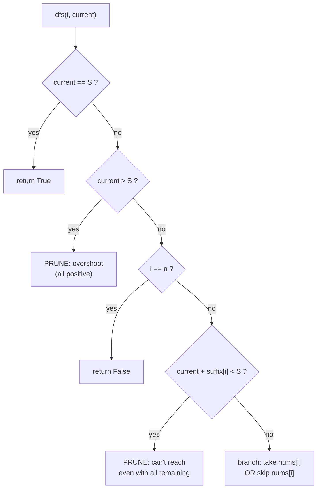
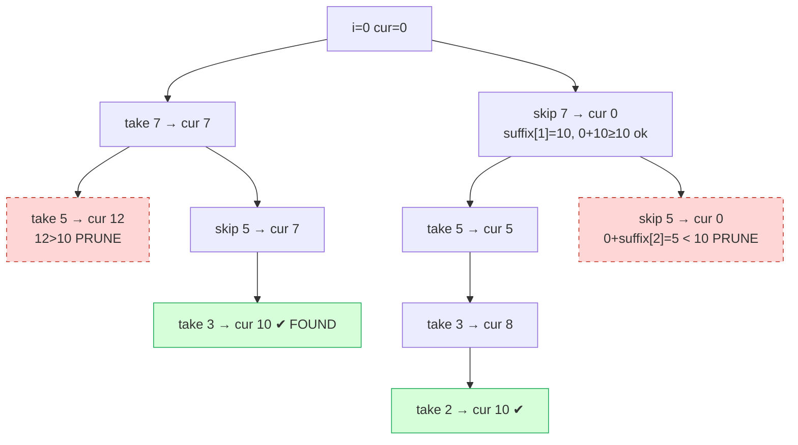

# Subset Sum via Branch-and-Bound Pruning

| Meta | Value |
|------|-------|
| Source | Classic (self-contained) |
| Difficulty | Medium |
| Topics | Recursion, Brute Force, Branch & Bound, Pruning |
| Link | — (decision version of the subset-sum problem) |

---

## Problem Statement
You are given an array of `n` **positive** integers `nums` and a target `S`. Decide whether
**some subset** of `nums` sums to **exactly** `S`. Return `True`/`False`. Order does not
matter, each element may be used at most once.

This is the decision form of the classic subset-sum problem. With $n \le 30$–$40$ and the
right pruning, a branch-and-bound search runs comfortably within limits even though the worst
case is exponential.

**Example**
```text
Input:  nums = [3, 34, 4, 12, 5, 2], S = 9
Output: True            # 4 + 5 = 9  (or 3 + 4 + 2)

Input:  nums = [3, 34, 4, 12, 5, 2], S = 30
Output: False           # no subset sums to exactly 30

Input:  nums = [7, 5, 3, 2], S = 10
Output: True            # 7 + 3 = 10  (or 5 + 3 + 2)
```

---

## WHY This Is a Brute-Force-with-Pruning Problem

Every element is either **in** the subset or **out** — that is a binary choice per item, so the
full search tree has $2^n$ leaves. Brute force is correct but explodes. Because all numbers are
**positive**, two *provably safe* bounds let us discard most of the tree:

1. **Overshoot prune.** If the running sum already exceeds `S`, adding more positive numbers
   can only make it worse — abandon this branch.
2. **Suffix-bound prune.** Precompute `suffix[i]` = sum of `nums[i..]`. If
   `current + suffix[i] < S`, then even taking *every remaining* element falls short — abandon.

A third *ordering* trick supercharges both: **sort descending** so large numbers are decided
first. This makes the overshoot and suffix bounds fire near the **root**, cutting giant
subtrees early.



---

## Solution — Sorted Branch-and-Bound

```python
def subset_sum(nums, S):
    nums = sorted(nums, reverse=True)        # ORDERING: big items first
    n = len(nums)
    suffix = [0] * (n + 1)                    # suffix[i] = nums[i] + ... + nums[n-1]
    for i in range(n - 1, -1, -1):
        suffix[i] = suffix[i + 1] + nums[i]

    def dfs(i, current):
        if current == S:                     # exact hit
            return True
        if current > S:                      # PRUNE 1: overshoot
            return False
        if i == n:                           # ran out of items
            return False
        if current + suffix[i] < S:          # PRUNE 2: suffix bound
            return False
        # branch: take nums[i], or skip it
        return dfs(i + 1, current + nums[i]) or dfs(i + 1, current)

    return dfs(0, 0)


print(subset_sum([3, 34, 4, 12, 5, 2], 9))    # True
print(subset_sum([3, 34, 4, 12, 5, 2], 30))   # False
print(subset_sum([7, 5, 3, 2], 10))           # True
```

```cpp
#include <bits/stdc++.h>
using namespace std;

bool subset_sum(vector<long long> nums, long long S) {
    sort(nums.rbegin(), nums.rend());            // ORDERING: big items first
    int n = (int)nums.size();
    vector<long long> suffix(n + 1, 0);          // suffix[i] = nums[i] + ... + nums[n-1]
    for (int i = n - 1; i >= 0; --i)
        suffix[i] = suffix[i + 1] + nums[i];

    function<bool(int, long long)> dfs = [&](int i, long long current) -> bool {
        if (current == S) return true;           // exact hit
        if (current > S) return false;           // PRUNE 1: overshoot
        if (i == n) return false;                // ran out of items
        if (current + suffix[i] < S) return false; // PRUNE 2: suffix bound
        // branch: take nums[i], or skip it
        return dfs(i + 1, current + nums[i]) || dfs(i + 1, current);
    };
    return dfs(0, 0);
}

int main() {
    cout << boolalpha;
    cout << subset_sum({3, 34, 4, 12, 5, 2}, 9)  << "\n";   // true
    cout << subset_sum({3, 34, 4, 12, 5, 2}, 30) << "\n";   // false
    cout << subset_sum({7, 5, 3, 2}, 10)         << "\n";   // true
    return 0;
}
```

---

## Trace — `nums = [7, 5, 3, 2]` (already descending), `S = 10`

`suffix = [17, 10, 5, 2, 0]` (e.g. `suffix[1] = 5+3+2 = 10`).

| Step | `i` | `current` | check | action |
|------|-----|-----------|-------|--------|
| 1 | 0 | 0 | `0+17 ≥ 10` ok | take 7 |
| 2 | 1 | 7 | `7+10 ≥ 10` ok | take 5 |
| 3 | 2 | 12 | `12 > 10` | **PRUNE overshoot**, backtrack |
| 4 | 1 | 7 | skip 5 | `7+5 ≥ 10` ok |
| 5 | 2 | 7 | take 3 → `current = 10` | **return True** ✔ |

Found `7 + 3 = 10` after touching only a handful of nodes — the overshoot prune at step 3
eliminated the entire `{7,5,...}` subtree.



The dashed nodes are pruned: one by the **overshoot** rule (`cur 12 > 10`) and one by the
**suffix bound** (`0 + 5 < 10`). Both prunes are safe *only because all numbers are positive*.

---

## Math / Complexity

Without pruning the recursion explores the full binary tree of $2^n$ leaves. The two bounds do
not change the asymptotic *worst case*, but in practice they slash the visited-node count.

$$
T(n) = O(2^n)\ \text{worst case},\qquad
S(n) = O(n)\ \text{recursion depth},\qquad
\text{preprocess} = O(n \log n)\ \text{for the sort}.
$$

Because each step either fixes one element or prunes, and pruning removes whole subtrees, the
**typical** running time is far below $2^n$ — often closer to $O(2^{n/2})$-ish behavior on
random data when sorted descending. For larger `n` (say $30 \le n \le 45$) switch to
**meet-in-the-middle**, which guarantees $O(2^{n/2} \cdot n)$.

> **Safety note.** If `nums` could contain **negative** numbers, the overshoot and suffix
> prunes become *invalid* (a later negative could rescue an overshooting branch), and you must
> fall back to full search or DP over the achievable-sum range.

---

## Takeaway

> **Subset-sum decision = binary brute force made fast by branch-and-bound.** Sort descending,
> then prune on (1) *overshoot* and (2) *suffix bound*. Both are valid precisely because the
> inputs are positive — the prerequisite that makes "more items ⇒ larger sum" monotone. This
> overshoot/bound/order trio is the universal recipe for turning an exponential search into one
> that finishes: **prove a branch is hopeless, then never enter it.**
