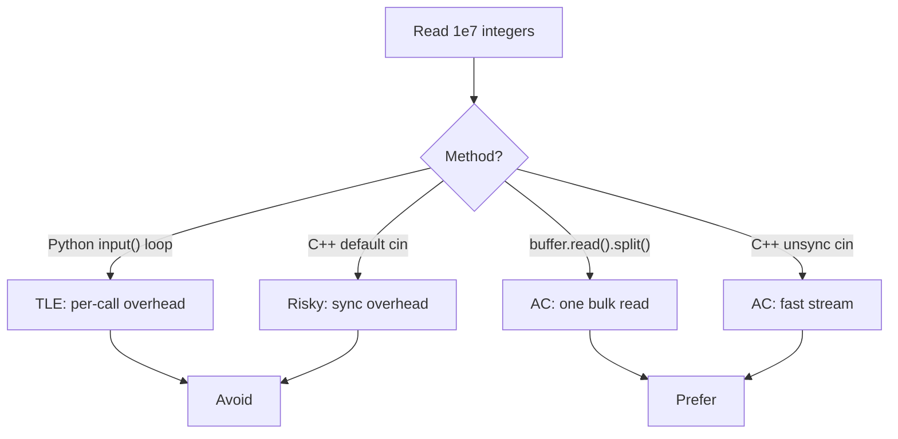
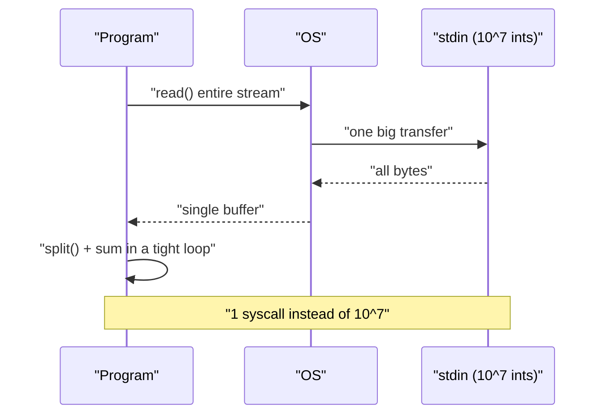
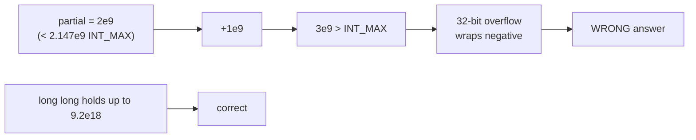
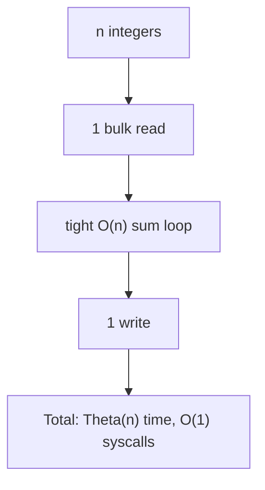

# Sum of Many Integers — Slow vs Fast I/O

| Field | Value |
|---|---|
| Source | Self-contained drill |
| Difficulty | Trivial algorithm, instructive I/O |
| Primary topic | **Fast input** of up to $10^7$ integers |
| Secondary topic | 64-bit accumulation, single output |
| Key constraint | $1 \le n \le 10^7$, each $|a_i| \le 10^9$ |

The *algorithm* is a one-liner — add everything up. The whole point is to show that with $n$ up to $10^7$, **how you read the numbers decides whether you pass or time out**.

---

## Statement

The first line contains an integer $n$. The next tokens are $n$ integers $a_1, \dots, a_n$ (they may span multiple lines or all be on one line — whitespace is irrelevant). Output their sum.

### Example

```text
Input:
5
1000000000 1000000000 1000000000 1000000000 1000000000

Output:
5000000000
```

The sum is $5\cdot10^9$, which exceeds the 32-bit limit $2^{31}-1 \approx 2.147\cdot10^9$ — so a 32-bit accumulator overflows. Use 64-bit.

---

## WHY: Slow vs Fast

With $n = 10^7$:

- **Python `input()` / `int(input())` per number** → tens of millions of Python-level calls, each allocating a string → far too slow.
- **Python `sys.stdin.buffer.read().split()`** → one syscall, one C-level split, then a tight integer loop → fast.
- **C++ with default `cin`** (sync on) → each `>>` carries synchronization overhead → can TLE.
- **C++ with `sync_with_stdio(false); cin.tie(nullptr);`** → the same `cin >> x` becomes several times faster.



What "bulk read" actually does:



---

## Solution (Paired Python + C++)

### Fast versions

```python
import sys

def main():
    data = sys.stdin.buffer.read().split()
    n = int(data[0])
    total = 0
    for i in range(1, n + 1):
        total += int(data[i])
    sys.stdout.write(str(total) + '\n')

main()
```

```cpp
#include <bits/stdc++.h>
using namespace std;

int main() {
    ios_base::sync_with_stdio(false);
    cin.tie(nullptr);
    int n;
    cin >> n;
    long long total = 0, x;       // 64-bit accumulator
    for (int i = 0; i < n; ++i) {
        cin >> x;
        total += x;
    }
    cout << total << '\n';
    return 0;
}
```

### The slow versions (for contrast — do NOT submit these)

```python
# SLOW: a Python-level call and string build per number.
import sys
n = int(input())
total = 0
for _ in range(n):
    total += int(input())   # one int() + one input() per line -> TLE for 1e7
print(total)
```

```cpp
// SLOW: synchronization left ON, and endl would make it worse.
#include <bits/stdc++.h>
using namespace std;
int main() {
    int n;
    cin >> n;                 // sync_with_stdio still true -> slower
    long long total = 0, x;
    for (int i = 0; i < n; ++i) { cin >> x; total += x; }
    cout << total << endl;    // endl flush (harmless here but a bad habit)
    return 0;
}
```

For the *very* largest inputs in C++, a hand-rolled reader beats even unsynced `cin`:

```python
# Python equivalent idea: read once, parse manually is unnecessary because
# split() is already C-level. This block mirrors the C++ custom-reader pairing.
import sys

def main():
    buf = sys.stdin.buffer.read()
    total = 0
    n = None
    num = 0
    started = False
    # manual scan (illustrative; split() is normally preferred in Python)
    for b in buf:
        if 48 <= b <= 57:
            num = num * 10 + (b - 48)
            started = True
        elif started:
            if n is None:
                n = num
            else:
                total += num
            num = 0
            started = False
    if started:
        total += num
    sys.stdout.write(str(total) + '\n')

main()
```

```cpp
#include <bits/stdc++.h>
using namespace std;

static inline long long readInt() {
    long long x = 0; int c = getchar_unlocked(); int sign = 1;
    while (c != '-' && (c < '0' || c > '9')) c = getchar_unlocked();
    if (c == '-') { sign = -1; c = getchar_unlocked(); }
    while (c >= '0' && c <= '9') { x = x * 10 + (c - '0'); c = getchar_unlocked(); }
    return x * sign;
}

int main() {
    long long n = readInt();
    long long total = 0;
    for (long long i = 0; i < n; ++i) total += readInt();
    printf("%lld\n", total);
    return 0;
}
```

---

## Trace

Input `n=5`, values all $10^9$.

```text
data = [b'5', b'10^9', b'10^9', b'10^9', b'10^9', b'10^9']
total = 0
+1e9 -> 1e9
+1e9 -> 2e9
+1e9 -> 3e9
+1e9 -> 4e9
+1e9 -> 5e9
print 5000000000
```

Why a 32-bit accumulator fails:



---

## Math & Complexity

The exact sum is

$$S = \sum_{i=1}^{n} a_i, \qquad |S| \le n \cdot \max_i |a_i| \le 10^7 \cdot 10^9 = 10^{16}.$$

Since $10^{16} < 9.22\cdot10^{18} = 2^{63}-1$, a signed 64-bit integer is sufficient (and necessary — $10^{16} > 2^{31}-1$).

- Time: $\Theta(n)$ — unavoidable, you must touch every number.
- Extra space: $O(1)$ in C++ streaming; $O(n)$ tokens held in Python's `split()` list.
- Syscalls: $O(1)$ for bulk read, $O(1)$ for the single write.



---

## Takeaway

When $n$ reaches $10^6$–$10^7$, the *only* thing that matters is the I/O constant factor: **bulk-read** in Python (`sys.stdin.buffer.read().split()`), **unsync** in C++ (or a custom `getchar_unlocked` reader), and always sum into a **64-bit** accumulator.
