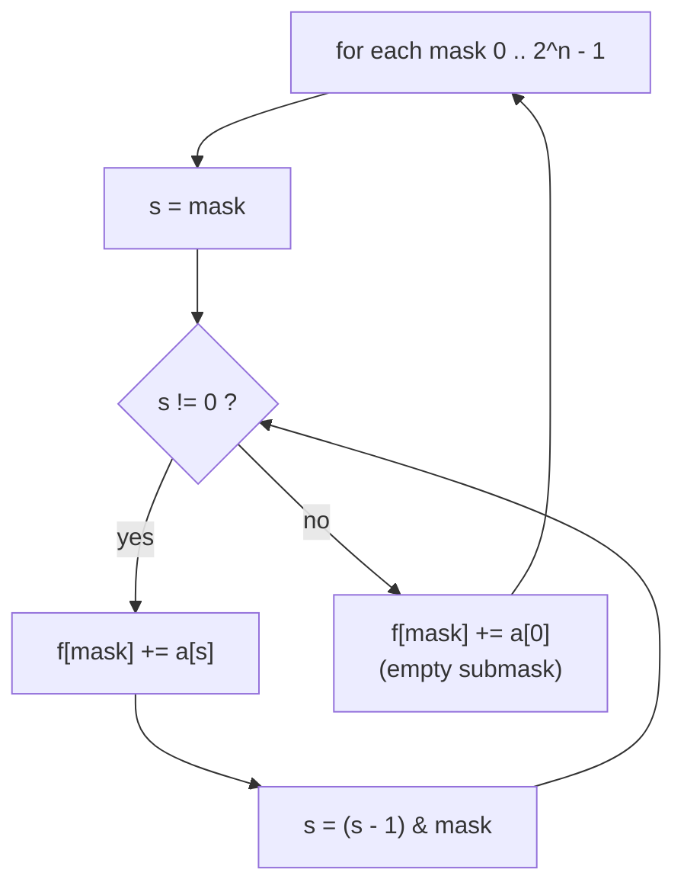
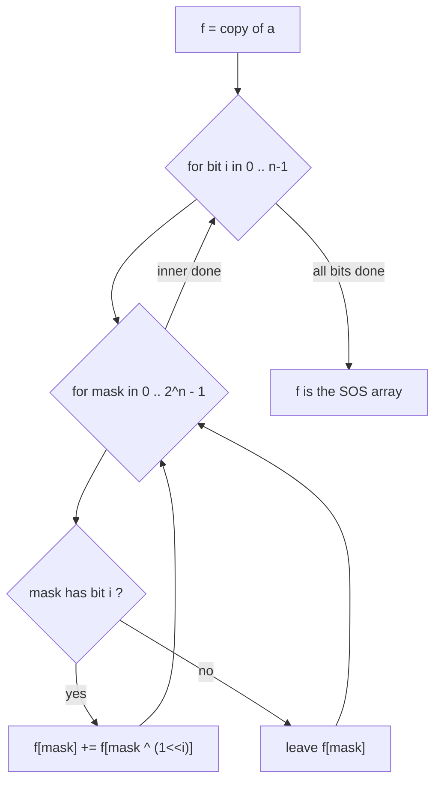
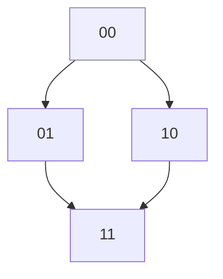
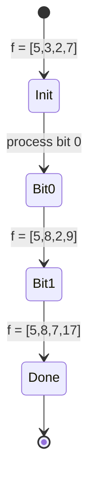
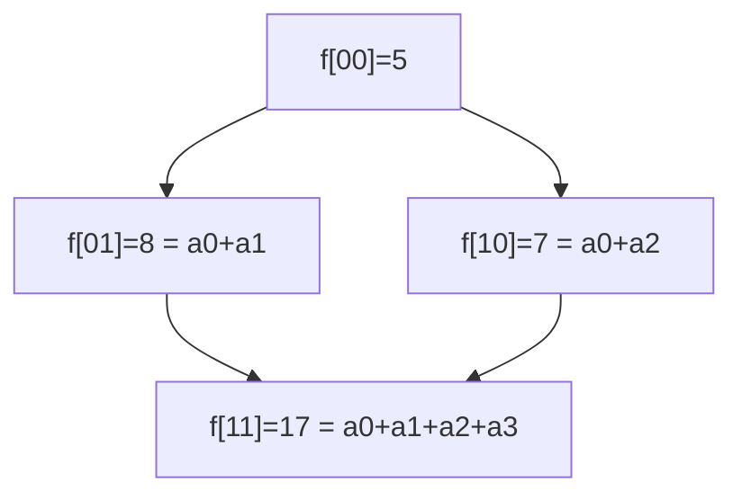

# Sum over Subsets (SOS) DP — Submask Enumeration

| Field | Value |
|-------|-------|
| Source | Classic technique (self-contained) |
| Difficulty | Hard |
| Topics | Bit manipulation, submask enumeration, SOS dynamic programming |
| Link | (self-contained — no external judge) |

---

## Problem Statement

You are given an array `a` of length $2^n$, indexed by **bitmasks** $0 \dots 2^n - 1$. Compute an array
`f` of the same length such that each `f[mask]` is the sum of `a[s]` over **all submasks** `s` of
`mask`:

$$
f[\text{mask}] = \sum_{s \,\subseteq\, \text{mask}} a[s],
$$

where $s \subseteq \text{mask}$ means `s & mask == s` (every set bit of `s` is also set in `mask`).

```text
Input:  n = 2,  a = [a0, a1, a2, a3]      (indices 00,01,10,11)
Output:
f[00] = a0
f[01] = a0 + a1
f[10] = a0 + a2
f[11] = a0 + a1 + a2 + a3

Concrete: a = [5, 3, 2, 7]
f = [5, 8, 7, 17]
  f[00] = 5
  f[01] = 5 + 3      = 8
  f[10] = 5 + 2      = 7
  f[11] = 5+3+2+7    = 17
```

Constraints to keep in mind: $n$ up to about $20$–$22$, so $2^n$ up to a few million. We need a method
that beats the naive submask walk.

---

## Approach (WHY)

**Naive submask enumeration.** For each `mask`, iterate its submasks with the standard trick
`for (s = mask; s; s = (s-1) & mask)` and accumulate. This is correct but costs $O(3^n)$ total, because
each of the $n$ bit positions is independently *outside `mask`*, *in `mask` but not `s`*, or *in both* —
$3^n$ (mask, submask) pairs:

$$
\sum_{\text{mask}} 2^{\operatorname{popcount}(\text{mask})} = \sum_{k=0}^{n} \binom{n}{k} 2^k = 3^n.
$$



**SOS DP (the fast way).** Instead of recomputing per mask, relax **one bit at a time**. After
processing bit $i$, `f[mask]` holds the sum over all submasks that differ from `mask` only in bits
$0 \dots i$. The transition: if bit $i$ is set in `mask`, add the contribution of the version with bit
$i$ cleared.

$$
f_i[\text{mask}] =
\begin{cases}
f_{i-1}[\text{mask}] + f_{i-1}[\text{mask} \oplus 2^i] & \text{if bit } i \in \text{mask},\\[2pt]
f_{i-1}[\text{mask}] & \text{otherwise.}
\end{cases}
$$

This visits $n$ bits over $2^n$ masks → $O(n \cdot 2^n)$, dramatically better than $3^n$.



Think of it as pushing each bit's "off" contribution into the "on" states, dimension by dimension —
like a higher-dimensional prefix sum over the subset lattice:



---

## Solution

**Naive $O(3^n)$ submask enumeration:**

```python
def sos_naive(a: list[int], n: int) -> list[int]:
    size = 1 << n
    f = [0] * size
    for mask in range(size):
        s = mask
        while True:
            f[mask] += a[s]                 # accumulate submask s
            if s == 0:
                break
            s = (s - 1) & mask              # next submask (descending)
    return f
```

```cpp
#include <bits/stdc++.h>
using namespace std;

vector<long long> sos_naive(const vector<long long>& a, int n) {
    int size = 1 << n;
    vector<long long> f(size, 0);
    for (int mask = 0; mask < size; mask++) {
        int s = mask;
        while (true) {
            f[mask] += a[s];                // accumulate submask s
            if (s == 0) break;
            s = (s - 1) & mask;             // next submask (descending)
        }
    }
    return f;
}
```

**Fast $O(n \cdot 2^n)$ SOS DP:**

```python
def sos_dp(a: list[int], n: int) -> list[int]:
    size = 1 << n
    f = a[:]                                # f starts as a copy of a
    for i in range(n):                      # relax one bit at a time
        bit = 1 << i
        for mask in range(size):
            if mask & bit:                  # bit i is present
                f[mask] += f[mask ^ bit]    # add the "bit i off" sums
    return f
```

```cpp
#include <bits/stdc++.h>
using namespace std;

vector<long long> sos_dp(const vector<long long>& a, int n) {
    int size = 1 << n;
    vector<long long> f = a;                // f starts as a copy of a
    for (int i = 0; i < n; i++) {           // relax one bit at a time
        int bit = 1 << i;
        for (int mask = 0; mask < size; mask++) {
            if (mask & bit)                 // bit i is present
                f[mask] += f[mask ^ bit];   // add the "bit i off" sums
        }
    }
    return f;
}
```

---

## Trace

SOS DP for `n = 2`, `a = [5, 3, 2, 7]` (indices `00, 01, 10, 11`). Start `f = [5, 3, 2, 7]`.

**Process bit 0** (`bit = 01`): update masks with bit 0 set → masks `01`, `11`.

| mask | has bit0? | update | new f[mask] |
|------|-----------|--------|-------------|
| `00` | no | — | `5` |
| `01` | yes | `f[01] += f[00]` = `3 + 5` | `8` |
| `10` | no | — | `2` |
| `11` | yes | `f[11] += f[10]` = `7 + 2` | `9` |

Now `f = [5, 8, 2, 9]`.

**Process bit 1** (`bit = 10`): update masks with bit 1 set → masks `10`, `11`.

| mask | has bit1? | update | new f[mask] |
|------|-----------|--------|-------------|
| `00` | no | — | `5` |
| `01` | no | — | `8` |
| `10` | yes | `f[10] += f[00]` = `2 + 5` | `7` |
| `11` | yes | `f[11] += f[01]` = `9 + 8` | `17` |

Final `f = [5, 8, 7, 17]` ✓ — matches the expected output.





---

## Complexity

| Method | Time | Space |
|--------|------|-------|
| Naive submask walk | $O(3^n)$ | $O(2^n)$ |
| SOS DP | $O(n \cdot 2^n)$ | $O(2^n)$ |

The speedup is exact: for $n = 20$, $3^n \approx 3.5 \times 10^9$ versus $n \cdot 2^n \approx 2.1 \times
10^7$ — over a hundredfold fewer operations. The bound for the naive walk comes from

$$
\sum_{k=0}^{n} \binom{n}{k} 2^k = (1 + 2)^n = 3^n.
$$

The "superset sum" variant (sum over all **supersets**) is symmetric: replace the condition with
`if not (mask & bit): f[mask] += f[mask ^ bit]`.

---

## Takeaway

Summing over all submasks naively is $O(3^n)$ via the `s = (s-1) & mask` walk — fine for small $n$ and
worth knowing. But when you need *every* mask's submask sum, **SOS DP** relaxes one bit at a time to get
$O(n \cdot 2^n)$, treating the subset lattice as a high-dimensional prefix sum. The submask-enumeration
identity $\sum_k \binom{n}{k} 2^k = 3^n$ is the key to understanding both the cost and the optimization.
