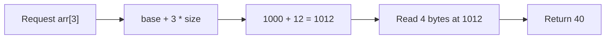
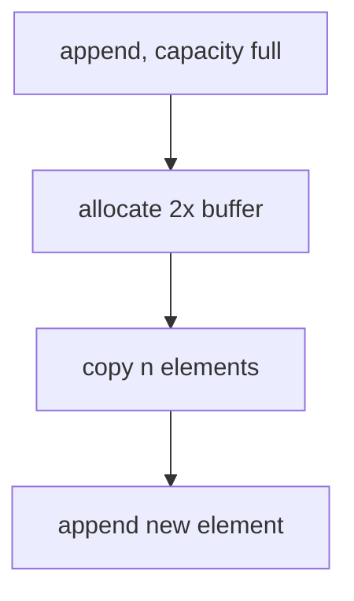

# Arrays — Complete Guide (Beginner → Advanced)

> An array is the most fundamental data structure in computer science. Almost every other
> structure (strings, stacks, queues, hash tables, heaps, graphs as adjacency matrices) is
> built on top of, or inspired by, the array.

---

## Table of Contents
1. [What is an Array?](#1-what-is-an-array)
2. [Memory Model & Why Indexing is O(1)](#2-memory-model--why-indexing-is-o1)
3. [Core Operations & Complexity](#3-core-operations--complexity)
4. [Static vs Dynamic Arrays](#4-static-vs-dynamic-arrays)
5. [Multi-dimensional Arrays](#5-multi-dimensional-arrays)
6. [Common Patterns (Intermediate)](#6-common-patterns-intermediate)
7. [Advanced Techniques](#7-advanced-techniques)
8. [Pitfalls & Gotchas](#8-pitfalls--gotchas)
9. [Cheat Sheet](#9-cheat-sheet)

---

## 1. What is an Array?

An **array** is a contiguous block of memory that stores a fixed number of elements of the
**same type**. Each element is accessible by an integer **index**.

```
Index:    0     1     2     3     4
        +-----+-----+-----+-----+-----+
Value:  | 10  | 20  | 30  | 40  | 50  |
        +-----+-----+-----+-----+-----+
Address: 1000  1004  1008  1012  1016   (if each int = 4 bytes)
```

Key properties:
- **Fixed element size** — every slot occupies the same number of bytes.
- **Contiguous** — slots are laid out back-to-back in memory.
- **Zero-indexed** (in most languages) — the first element is at index `0`.

---

## 2. Memory Model & Why Indexing is O(1)

Because the array is contiguous and every element has the same size, the CPU can compute the
address of **any** element with a single arithmetic formula:

$$
\text{address}(i) = \text{base\_address} + i \times \text{element\_size}
$$

Example: base address `1000`, `element_size = 4` bytes, accessing index `3`:

$$
\text{address}(3) = 1000 + 3 \times 4 = 1012
$$

This is one multiplication and one addition — **constant time, O(1)**, regardless of array
size. This is *the* superpower of arrays and the reason they are everywhere.



---

## 3. Core Operations & Complexity

| Operation                       | Time   | Why |
|---------------------------------|--------|-----|
| Access `arr[i]`                 | O(1)   | Address formula |
| Update `arr[i] = x`             | O(1)   | Direct write |
| Search (unsorted)               | O(n)   | Must scan |
| Search (sorted, binary search)  | O(log n) | Halving |
| Insert at end (dynamic, amortized) | O(1) | Usually free slot |
| Insert at front / middle        | O(n)   | Shift elements right |
| Delete at front / middle        | O(n)   | Shift elements left |

### Why insertion in the middle is O(n)

To insert `99` at index `2` of `[10, 20, 30, 40, 50]`, every element from index `2` onward
must shift one slot to the right:

```
Before: [10, 20, 30, 40, 50, _ ]
                 ^ insert here
Shift:  [10, 20, _ , 30, 40, 50]
Write:  [10, 20, 99, 30, 40, 50]
```

In the worst case (insert at front) we shift all `n` elements → **O(n)**.

---

## 4. Static vs Dynamic Arrays

### Static array
Size fixed at creation. C arrays, Java `int[]`. No resizing.

### Dynamic array
Grows automatically: Python `list`, Java `ArrayList`, C++ `std::vector`, JS `Array`.

**How growth works (amortized O(1) append):**

When the underlying buffer is full, the dynamic array allocates a **new buffer (usually 2×)**,
copies all elements over, then appends.



Although a single resize costs O(n), it happens rarely. The cost amortizes:

$$
\text{Total copies for } n \text{ appends} = 1 + 2 + 4 + \dots + n \approx 2n = O(n)
$$

So **per append** it averages out to O(1) — this is *amortized analysis*.

---

## 5. Multi-dimensional Arrays

A 2-D array (matrix) is logically a grid but physically stored linearly. **Row-major order**
(C, Python, Java) stores row 0, then row 1, etc.:

$$
\text{address}(r, c) = \text{base} + (r \times \text{numCols} + c) \times \text{element\_size}
$$

```
Matrix (2 rows x 3 cols):     Linear memory (row-major):
[ [1, 2, 3],                   [1, 2, 3, 4, 5, 6]
  [4, 5, 6] ]                   r0c0 r0c1 r0c2 r1c0 r1c1 r1c2
```

> Iterating in row-major order (outer loop rows, inner loop columns) is **cache-friendly**
> because you read sequential memory. Column-major iteration jumps around and causes cache
> misses — a real performance difference on large matrices.

---

## 6. Common Patterns (Intermediate)

### 6.1 Prefix Sum
Precompute cumulative sums so any range sum is O(1).

$$
P[i] = \sum_{k=0}^{i-1} arr[k], \qquad \text{sum}(l, r) = P[r+1] - P[l]
$$

```
arr    = [2, 4, 1, 3, 5]
prefix = [0, 2, 6, 7, 10, 15]
sum(1,3) = prefix[4] - prefix[1] = 10 - 2 = 8   // = 4+1+3
```

### 6.2 Two Pointers
Use two indices moving toward each other or in the same direction (see TwoPointers folder).

### 6.3 Kadane's Algorithm (Maximum Subarray)
Track the best subarray ending at each position:

$$
\text{best}_i = \max(arr[i],\; \text{best}_{i-1} + arr[i])
$$

### 6.4 Sliding Window
Maintain a moving range and update incrementally (see SlidingWindow folder).

### 6.5 In-place reversal / rotation
Reverse subranges to rotate without extra memory.

---

## 7. Advanced Techniques

- **Difference Array** — O(1) range updates, used in interval problems.
- **Binary Indexed Tree (Fenwick)** — O(log n) prefix sums with updates.
- **Segment Tree** — O(log n) range queries + updates (sum, min, max, gcd).
- **Sparse Table** — O(1) idempotent range queries (min/max/gcd) after O(n log n) build.
- **Mo's Algorithm** — offline range queries in O((n+q)√n).
- **Coordinate Compression** — map large/sparse values to a small dense range.

### Difference array example
To add `+5` to range `[2, 4]` of an array in O(1):

```
diff[2] += 5
diff[5] -= 5      // one past the end
// prefix-sum diff to recover the final array
```

---

## 8. Pitfalls & Gotchas

| Pitfall | Fix |
|---------|-----|
| Off-by-one in loop bounds | Carefully decide `<` vs `<=` |
| Out-of-bounds access | Validate `0 <= i < n` |
| Modifying array while iterating | Iterate over a copy or use index math |
| Shallow copy of nested arrays | Deep copy when needed |
| Integer overflow in prefix sums | Use 64-bit integers |
| Assuming sorted when it isn't | Sort first or verify |

---

## 9. Cheat Sheet

```
Access/update ........... O(1)
Append (amortized) ...... O(1)
Insert/delete middle .... O(n)
Search unsorted ......... O(n)
Search sorted ........... O(log n)
Space ................... O(n)

Patterns: prefix sum, two pointers, sliding window, Kadane,
          difference array, binary search on answer
Advanced: Fenwick / Segment tree / Sparse table / Mo's
```

> **Mental model:** Arrays trade *flexible insertion* for *instant random access*. Reach for
> them whenever you need fast indexed lookups and know (roughly) how many elements you have.
