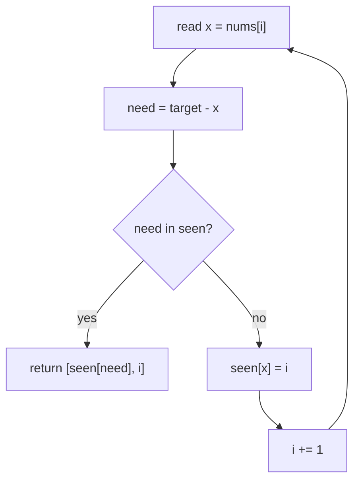

# Two Sum

| Meta | Value |
|------|-------|
| Source | LeetCode #1 |
| Difficulty | Easy |
| Topics | Array, Hash Table |
| Link | https://leetcode.com/problems/two-sum/ |

---

## Problem Statement
Given an array of integers `nums` and an integer `target`, return the **indices** of the two
numbers that add up to `target`. Each input has **exactly one** solution, and you may not use
the same element twice.

**Example**
```
Input:  nums = [2, 7, 11, 15], target = 9
Output: [0, 1]            // because nums[0] + nums[1] = 2 + 7 = 9
```

---

## 1. Brute Force — O(n²)

Try every pair `(i, j)`.

```python
def two_sum_brute(nums, target):
    n = len(nums)
    for i in range(n):
        for j in range(i + 1, n):
            if nums[i] + nums[j] == target:
                return [i, j]
    return []
```

```cpp
vector<int> two_sum_brute(vector<int>& nums, int target) {
    int n = nums.size();
    for (int i = 0; i < n; i++) {
        for (int j = i + 1; j < n; j++) {
            if (nums[i] + nums[j] == target)
                return {i, j};
        }
    }
    return {};
}
```

Number of pairs checked:

$$
\binom{n}{2} = \frac{n(n-1)}{2} = O(n^2)
$$

Too slow for large `n`.

---

## 2. Optimal — Hash Map, O(n)

**Key insight:** for each number `x`, its partner is `target - x` (the *complement*). If we
remember every number we've seen in a hash map (`value → index`), we can check in **O(1)**
whether the complement already appeared.

```python
def two_sum(nums, target):
    seen = {}                      # value -> index
    for i, x in enumerate(nums):
        need = target - x
        if need in seen:           # complement seen earlier
            return [seen[need], i]
        seen[x] = i                # record current number
    return []
```

```cpp
vector<int> two_sum(vector<int>& nums, int target) {
    unordered_map<int, int> seen;          // value -> index
    for (int i = 0; i < (int)nums.size(); i++) {
        int x = nums[i];
        int need = target - x;
        if (seen.count(need))              // complement seen earlier
            return {seen[need], i};
        seen[x] = i;                       // record current number
    }
    return {};
}
```

### Iteration trace — `nums = [2, 7, 11, 15]`, `target = 9`

| i | x  | need = target - x | `seen` before | found? | action |
|---|----|-------------------|---------------|--------|--------|
| 0 | 2  | 7                 | `{}`          | no     | store `2→0` |
| 1 | 7  | 2                 | `{2:0}`       | **yes**| return `[0, 1]` |

We never even look at indices 2 and 3 — we short-circuit as soon as the pair is found.

### Why one pass works

When we reach index `i`, the map holds every element **before** `i`. Asking "is `target - x`
in the map?" is the same as asking "did some earlier element `j < i` satisfy
`nums[j] = target - nums[i]`?" Storing the current value *after* the check guarantees we never
pair an element with itself.



---

## Complexity

| Approach | Time | Space |
|----------|------|-------|
| Brute force | O(n²) | O(1) |
| Hash map | **O(n)** | O(n) |

We trade O(n) extra memory for an order-of-magnitude speedup — a classic
**space-for-time** trade.

---

## Edge Cases
- Negative numbers → works (complement arithmetic is sign-agnostic).
- Duplicate values (`[3, 3], target = 6`) → works because we store index *after* checking.
- No solution → return `[]` (problem guarantees one, but defensive return is fine).

## Takeaway
The "store complements in a hash map" pattern reappears constantly (3Sum, 4Sum, subarray sums).
Whenever you search for *pairs summing to a value*, think hash map first.
