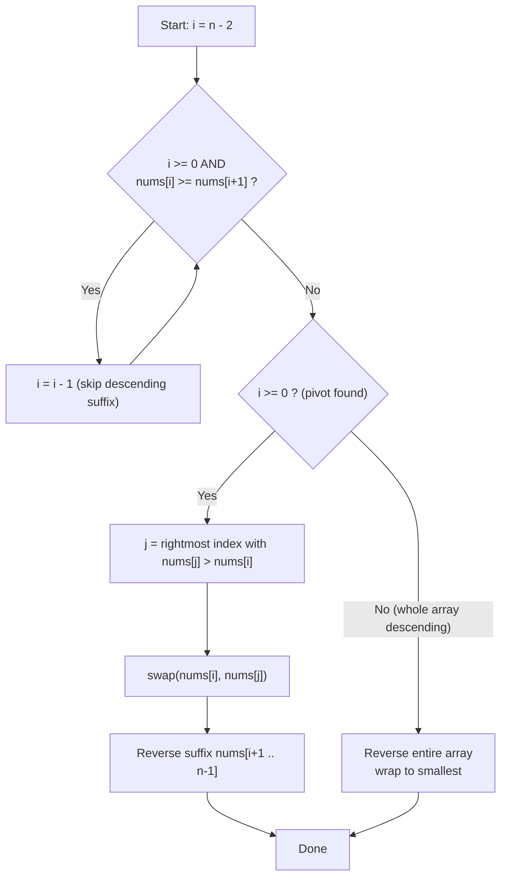

# Next Permutation

| Meta | Value |
|------|-------|
| Source | LeetCode #31 |
| Difficulty | Medium |
| Topics | Array, Two Pointers, Combinatorics |
| Link | https://leetcode.com/problems/next-permutation/ |

---

## Problem Statement
A **permutation** of an array is one of its possible orderings. The **next permutation** is the
next lexicographically greater arrangement of the numbers. If no greater arrangement exists (the
array is in descending order — the largest permutation), wrap around to the **smallest**
(ascending) permutation. The transformation must be done **in place** with $O(1)$ extra memory.

**Example**
```
Input:  nums = [1, 2, 3]   ->  Output: [1, 3, 2]
Input:  nums = [3, 2, 1]   ->  Output: [1, 2, 3]   // already largest -> wrap to smallest
Input:  nums = [1, 1, 5]   ->  Output: [1, 5, 1]

Worked example: nums = [1, 3, 5, 4, 2]  ->  [1, 4, 2, 3, 5]
```

The full lexicographic order of `{1,2,3}` makes the "next" relation obvious:
```
123 -> 132 -> 213 -> 231 -> 312 -> 321 -> (wrap) 123
```

---

## Approach 1 — Brute Force (Generate & Search)

Generate **all** $n!$ permutations, sort them lexicographically, find the current one, and return
the element right after it (wrapping at the end). Conceptually simple, but $O(n! \cdot n)$ time
and $O(n! \cdot n)$ space — unusable beyond ~10 elements and it violates the in-place requirement.

```python
from itertools import permutations

def next_permutation_brute(nums):
    perms = sorted(set(permutations(nums)))   # all distinct orderings, lexicographic
    i = perms.index(tuple(nums))              # locate current arrangement
    nxt = perms[(i + 1) % len(perms)]         # next one, wrapping around
    nums[:] = list(nxt)                        # write back in place
```

```cpp
// Illustrative only: factorial blow-up, not for real use.
void next_permutation_brute(vector<int>& nums) {
    vector<vector<int>> perms;
    vector<int> a = nums;
    sort(a.begin(), a.end());                 // start from smallest ordering
    do { perms.push_back(a); }                // collect every distinct permutation
    while (next_permutation(a.begin(), a.end()));
    int i = find(perms.begin(), perms.end(), nums) - perms.begin();  // locate current
    nums = perms[(i + 1) % perms.size()];     // next one, wrapping around
}
```

We need the structure of *why* one permutation follows another. That structure gives a clean
$O(n)$, in-place algorithm.

---

## Approach 2 — Pivot / Successor / Reverse (Optimal, the classic)

### The intuition
Read the array from the right. A long **descending** suffix is already the *largest* arrangement
of those particular elements — you cannot make it bigger by only rearranging the suffix. To get
the next permutation you must increase the value just **before** that suffix as little as possible,
then make everything after it as **small** as possible.

This yields three steps.

#### Step 1 — Find the pivot
Scan from the right for the first index `i` where the order *drops*, i.e. the first

$$
i \;=\; \max\{\, k : nums[k] < nums[k+1] \,\}.
$$

Everything to the right of `i` (the suffix `nums[i+1 .. n-1]`) is non-increasing. If **no such `i`
exists**, the whole array is descending (largest permutation) — skip to Step 3 to reverse the
entire array and wrap to the smallest.

#### Step 2 — Find the successor and swap
In that descending suffix, find the **smallest element that is still larger than `nums[i]`**.
Because the suffix is non-increasing, scanning from the right, the first index `j` with
`nums[j] > nums[i]` is exactly that element:

$$
j \;=\; \max\{\, k > i : nums[k] > nums[i] \,\}, \qquad \text{swap } nums[i] \leftrightarrow nums[j].
$$

Swapping bumps position `i` up to the *next* available value while keeping the suffix descending.

#### Step 3 — Reverse the suffix
After the swap, `nums[i+1 .. n-1]` is still descending, hence it is the *largest* ordering of
those elements. We want the *smallest*, so **reverse** it (which, for a descending run, also sorts
it ascending). Reversing turns the suffix into its minimal arrangement, finishing the next
permutation.

The total work is a constant number of single passes: $O(n)$ time, $O(1)$ space.

### Walkthrough on `[1, 3, 5, 4, 2]`
- **Pivot:** from the right, `5 > 4 > 2` is descending; the drop is at `nums[1]=3 < nums[2]=5`, so
  `i = 1` (value `3`).
- **Successor:** in suffix `[5, 4, 2]`, the smallest value `> 3` scanning from right is `4` at
  `j = 3`. Swap → `[1, 4, 5, 3, 2]`.
- **Reverse suffix** `nums[2..4] = [5, 3, 2]` → `[2, 3, 5]`, giving `[1, 4, 2, 3, 5]`. ✅

```python
def next_permutation(nums):
    n = len(nums)
    i = n - 2
    while i >= 0 and nums[i] >= nums[i + 1]:   # Step 1: find first drop from the right
        i -= 1                                  # suffix nums[i+1:] is non-increasing
    if i >= 0:                                  # a pivot exists (not the largest perm)
        j = n - 1
        while nums[j] <= nums[i]:               # Step 2: rightmost value > pivot
            j -= 1
        nums[i], nums[j] = nums[j], nums[i]     # swap pivot with its successor
    # Step 3: reverse the (still descending) suffix to make it smallest
    lo, hi = i + 1, n - 1
    while lo < hi:
        nums[lo], nums[hi] = nums[hi], nums[lo]
        lo += 1
        hi -= 1
```

```cpp
void next_permutation_manual(vector<int>& nums) {
    int n = (int)nums.size();
    int i = n - 2;
    while (i >= 0 && nums[i] >= nums[i + 1])    // Step 1: find first drop from the right
        --i;                                     // suffix nums[i+1..] is non-increasing
    if (i >= 0) {                                // a pivot exists (not the largest perm)
        int j = n - 1;
        while (nums[j] <= nums[i])               // Step 2: rightmost value > pivot
            --j;
        swap(nums[i], nums[j]);                  // swap pivot with its successor
    }
    // Step 3: reverse the (still descending) suffix to make it smallest
    reverse(nums.begin() + (i + 1), nums.end());
}
```

> Note: the C++ standard library already provides `std::next_permutation(begin, end)`, which
> implements exactly this algorithm and returns `false` when it wraps from largest to smallest.

---

## Iteration Trace

Input `nums = [1, 3, 5, 4, 2]`.

| Phase | Pointer(s) | Comparison | Result / Array state |
|-------|-----------|-----------|----------------------|
| Find pivot | `i = 3` | `nums[3]=4 >= nums[4]=2` | descend, `i -> 2` |
| Find pivot | `i = 2` | `nums[2]=5 >= nums[3]=4` | descend, `i -> 1` |
| Find pivot | `i = 1` | `nums[1]=3 >= nums[2]=5`? **No** | **pivot = index 1 (value 3)** |
| Find successor | `j = 4` | `nums[4]=2 <= 3` | `j -> 3` |
| Find successor | `j = 3` | `nums[3]=4 <= 3`? **No** | **successor = index 3 (value 4)** |
| Swap | `i=1, j=3` | swap `3` and `4` | `[1, 4, 5, 3, 2]` |
| Reverse suffix | `lo=2, hi=4` | swap `5` and `2` | `[1, 4, 2, 3, 5]` |
| Reverse suffix | `lo=3, hi=3` | `lo >= hi`, stop | **`[1, 4, 2, 3, 5]`** |

---

## Algorithm Diagram



---

## Why "reverse" is correct (the math)
Let the pivot be at index $i$. By construction the suffix $nums[i+1 \ldots n-1]$ is non-increasing,
so among **all** arrangements of those suffix elements it is the *lexicographically largest*.
After swapping the pivot with its successor, the suffix remains non-increasing. We want the
*smallest* possible suffix so that the overall permutation is the **immediate** next one — and the
smallest arrangement of a multiset is its ascending order. Reversing a non-increasing sequence
produces exactly the non-decreasing (ascending) sequence:

$$
\text{reverse}\big([\,a_0 \ge a_1 \ge \dots \ge a_m\,]\big) = [\,a_m \le \dots \le a_1 \le a_0\,].
$$

Hence reversing is equivalent to sorting the suffix ascending, but in $O(n)$ instead of
$O(n \log n)$.

---

## Complexity

| Approach | Time | Space |
|----------|------|-------|
| Brute force (generate all permutations) | $O(n! \cdot n)$ | $O(n! \cdot n)$ |
| Pivot / successor / reverse | $O(n)$ | $O(1)$ |

---

## Takeaway
- The next permutation is built from a **descending suffix**: that suffix is already maximal, so
  the change must happen at the element just left of it.
- Three crisp steps: **find pivot** (first drop from the right), **swap with the rightmost value
  greater than the pivot**, **reverse the suffix** to minimize it.
- Reversing works *because* the suffix is guaranteed non-increasing — it's an $O(n)$ stand-in for
  sorting.
- When no pivot exists, the array is the largest permutation; reversing the whole thing wraps to
  the smallest — matching the problem's circular definition.
- `std::next_permutation` in C++ is this exact algorithm; knowing the internals lets you reproduce
  it in any language and adapt it (e.g. *previous permutation* just flips every comparison).
