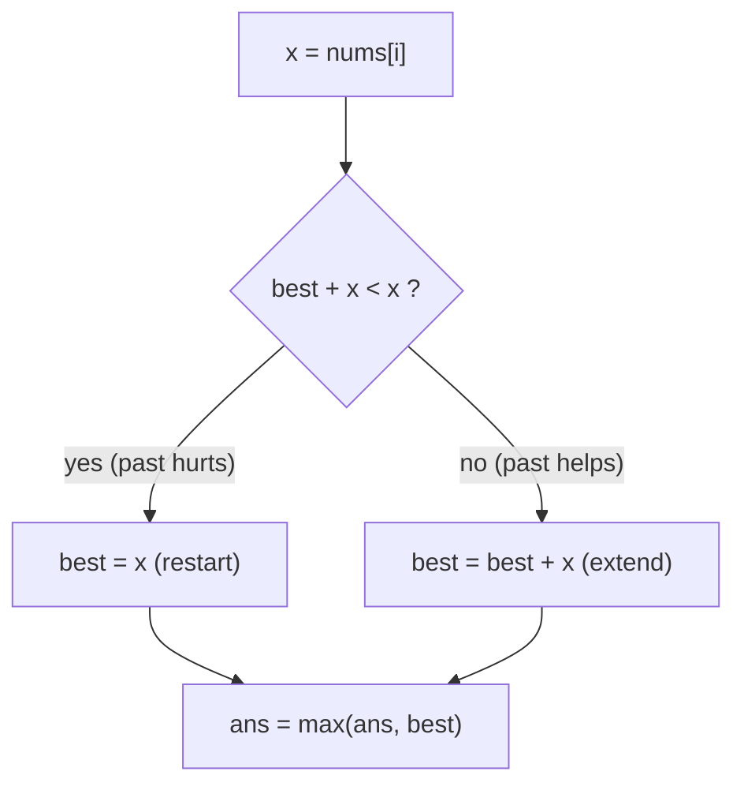

# Maximum Subarray (Kadane's Algorithm)

| Meta | Value |
|------|-------|
| Source | LeetCode #53 |
| Difficulty | Medium |
| Topics | Array, Dynamic Programming, Divide & Conquer |
| Link | https://leetcode.com/problems/maximum-subarray/ |

---

## Problem Statement
Find the contiguous subarray (containing at least one number) with the **largest sum** and
return that sum.

**Example**
```
Input:  nums = [-2, 1, -3, 4, -1, 2, 1, -5, 4]
Output: 6                 // subarray [4, -1, 2, 1]
```

---

## The Core Idea — Kadane's Algorithm

Define `best[i]` = the maximum sum of a subarray that **ends exactly at index `i`**.

At each position you face one decision: either
1. **extend** the previous best subarray by adding `nums[i]`, or
2. **start fresh** at `nums[i]` (because the previous best was negative and only hurts).

This gives the recurrence:

$$
\text{best}[i] = \max\big(nums[i],\; \text{best}[i-1] + nums[i]\big)
$$

The answer is the maximum over all positions:

$$
\text{answer} = \max_{0 \le i < n} \text{best}[i]
$$

Because each `best[i]` only depends on `best[i-1]`, we keep a single running variable instead
of an array — **O(1) space**.

```python
def max_subarray(nums):
    best = nums[0]      # best subarray ending at current index
    ans  = nums[0]      # global best
    for x in nums[1:]:
        best = max(x, best + x)   # extend or restart
        ans  = max(ans, best)
    return ans
```

```cpp
long long max_subarray(vector<int>& nums) {
    long long best = nums[0];   // best subarray ending at current index
    long long ans  = nums[0];   // global best
    for (int i = 1; i < (int)nums.size(); i++) {
        long long x = nums[i];
        best = max(x, best + x);     // extend or restart
        ans  = max(ans, best);
    }
    return ans;
}
```

---

## Iteration Trace — `[-2, 1, -3, 4, -1, 2, 1, -5, 4]`

| i | nums[i] | best + nums[i] | best = max(nums[i], best+nums[i]) | ans |
|---|---------|----------------|-----------------------------------|-----|
| 0 | -2      | —              | -2                                | -2  |
| 1 | 1       | -2+1 = -1      | max(1, -1) = **1** (restart)      | 1   |
| 2 | -3      | 1-3 = -2       | max(-3, -2) = -2                  | 1   |
| 3 | 4       | -2+4 = 2       | max(4, 2) = **4** (restart)       | 4   |
| 4 | -1      | 4-1 = 3        | max(-1, 3) = 3                    | 4   |
| 5 | 2       | 3+2 = 5        | max(2, 5) = 5                     | 5   |
| 6 | 1       | 5+1 = 6        | max(1, 6) = 6                     | **6** |
| 7 | -5      | 6-5 = 1        | max(-5, 1) = 1                    | 6   |
| 8 | 4       | 1+4 = 5        | max(4, 5) = 5                     | 6   |

Final answer = **6**, from subarray `[4, -1, 2, 1]` (positions 3–6).

Notice the "restart" decisions at i=1 and i=3: each time `best` had become a liability
(too small), Kadane abandons the past and begins a new subarray.



---

## Why Greedy Restart is Correct

If `best[i-1] < 0`, then for *any* extension, `best[i-1] + nums[i] < nums[i]`. Carrying a
negative prefix can never improve a future sum — so discarding it is always at least as good.
This is the exchange argument that proves the greedy choice optimal.

---

## Complexity

| Approach | Time | Space |
|----------|------|-------|
| Brute force (all subarrays) | O(n²) or O(n³) | O(1) |
| Prefix-sum + min-prefix | O(n) | O(1) |
| **Kadane** | **O(n)** | **O(1)** |

---

## Variant: Return the Subarray Indices
Track a `start` pointer that resets whenever you restart:

```python
def max_subarray_indices(nums):
    best = ans = nums[0]
    start = best_l = best_r = 0
    for i in range(1, len(nums)):
        if best + nums[i] < nums[i]:
            best = nums[i]
            start = i              # restart window here
        else:
            best += nums[i]
        if best > ans:
            ans, best_l, best_r = best, start, i
    return ans, best_l, best_r
```

```cpp
tuple<long long, int, int> max_subarray_indices(vector<int>& nums) {
    long long best = nums[0], ans = nums[0];
    int start = 0, best_l = 0, best_r = 0;
    for (int i = 1; i < (int)nums.size(); i++) {
        if (best + nums[i] < nums[i]) {
            best = nums[i];
            start = i;             // restart window here
        } else {
            best += nums[i];
        }
        if (best > ans) {
            ans = best;
            best_l = start;
            best_r = i;
        }
    }
    return {ans, best_l, best_r};
}
```

## Edge Cases
- All negatives (`[-3, -1, -2]`) → answer is the largest single element `-1`.
- Single element → return it directly.

## Takeaway
Kadane is the canonical "DP with O(1) state" example. The pattern *"max of (start new vs. extend
old)"* generalizes to maximum product subarray, best time to buy/sell stock, and more.
