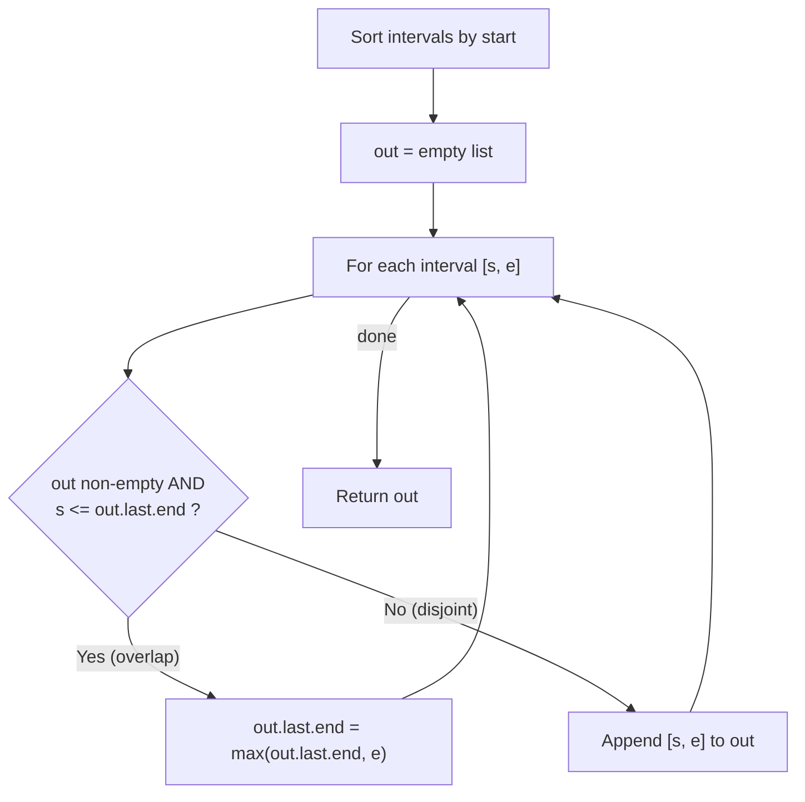

# Merge Intervals

| Meta | Value |
|------|-------|
| Source | LeetCode #56 |
| Difficulty | Medium |
| Topics | Array, Sorting, Sweep / Greedy |
| Link | https://leetcode.com/problems/merge-intervals/ |

---

## Problem Statement
You are given an array of `intervals` where `intervals[i] = [start_i, end_i]`. **Merge all
overlapping intervals** and return an array of the non-overlapping intervals that cover all the
intervals in the input.

Two intervals overlap when one starts **before (or exactly when)** the other ends.

**Example**
```
Input:  intervals = [[1, 3], [2, 6], [8, 10], [15, 18]]
Output: [[1, 6], [8, 10], [15, 18]]

Why:
  [1,3] and [2,6] overlap (2 <= 3)        -> merged into [1,6]
  [8,10]  is disjoint from [1,6]           -> kept
  [15,18] is disjoint from [8,10]          -> kept
```

---

## Approach 1 — Brute Force (Repeated Pairwise Merging)

The naive idea: keep scanning the whole list, and whenever **any** two intervals overlap, fuse
them and restart. Two intervals $[a_1, b_1]$ and $[a_2, b_2]$ overlap iff

$$
\max(a_1, a_2) \le \min(b_1, b_2)
$$

and their union is

$$
\big[\min(a_1, a_2),\; \max(b_1, b_2)\big].
$$

Because a single merge can create a **new** overlap with an interval you already passed, you must
re-scan from the start until a full pass produces no merge. In the worst case this is
$O(n^2)$ comparisons (and can degrade further with the restarts).

```python
def merge_brute(intervals):
    intervals = [list(iv) for iv in intervals]   # mutable copies
    changed = True
    while changed:                               # keep going until a clean pass
        changed = False
        out = []
        while intervals:
            a = intervals.pop()                  # take one interval
            merged = False
            for b in out:                        # try to fuse with an accepted one
                if max(a[0], b[0]) <= min(a[1], b[1]):   # overlap test
                    b[0] = min(a[0], b[0])       # widen left edge
                    b[1] = max(a[1], b[1])       # widen right edge
                    merged = True
                    changed = True
                    break
            if not merged:
                out.append(a)                    # no overlap -> keep as-is
        intervals = out
    return intervals
```

```cpp
vector<vector<int>> merge_brute(vector<vector<int>> intervals) {
    bool changed = true;
    while (changed) {                                  // keep going until a clean pass
        changed = false;
        vector<vector<int>> out;
        while (!intervals.empty()) {
            vector<int> a = intervals.back();          // take one interval
            intervals.pop_back();
            bool merged = false;
            for (auto& b : out) {                      // try to fuse with an accepted one
                if (max(a[0], b[0]) <= min(a[1], b[1])) {  // overlap test
                    b[0] = min(a[0], b[0]);            // widen left edge
                    b[1] = max(a[1], b[1]);            // widen right edge
                    merged = true;
                    changed = true;
                    break;
                }
            }
            if (!merged) out.push_back(a);             // no overlap -> keep as-is
        }
        intervals = out;
    }
    return intervals;
}
```

This works but the repeated full passes are wasteful. The key insight that unlocks the optimal
solution: **if we process intervals in order of their start, every overlap is always with the
*most recently emitted* interval — never with one further back.**

---

## Approach 2 — Sort by Start, then Sweep-Merge (Optimal)

### Why sorting fixes everything
Sort the intervals by their `start`. Now walk left to right and keep a single "current" interval
`cur` that we are extending. For the next interval `iv`:

- Because of the sort, `iv.start >= cur.start`. So the **only** way they can overlap is if
  `iv.start <= cur.end`.
- If they overlap, the merged interval keeps `cur.start` (already the smaller start) and extends
  the end to `max(cur.end, iv.end)`.
- If they do **not** overlap, `cur` can never overlap anything later either (all later starts are
  even bigger), so we *emit* `cur` and start a fresh `cur = iv`.

Formally, after sorting so that $s_0 \le s_1 \le \dots \le s_{n-1}$, interval $i$ merges into the
running interval $[S, E]$ exactly when

$$
s_i \le E \quad\Longrightarrow\quad E \leftarrow \max(E,\; e_i),
$$

otherwise we close $[S, E]$ and open a new run at $[s_i, e_i]$.

Each interval is touched once after the sort, so the cost is dominated by the sort:
$O(n \log n)$ time, $O(n)$ output (or $O(\log n)$ auxiliary ignoring the result).

```python
def merge(intervals):
    intervals.sort(key=lambda iv: iv[0])     # sort by start
    out = []
    for s, e in intervals:
        if out and s <= out[-1][1]:          # overlaps the last emitted interval
            out[-1][1] = max(out[-1][1], e)  # extend its end
        else:
            out.append([s, e])               # disjoint -> start a new interval
    return out
```

```cpp
vector<vector<int>> merge(vector<vector<int>>& intervals) {
    sort(intervals.begin(), intervals.end());        // sort by start (lexicographic on pairs)
    vector<vector<int>> out;
    for (auto& iv : intervals) {
        long long s = iv[0], e = iv[1];
        if (!out.empty() && s <= out.back()[1])       // overlaps the last emitted interval
            out.back()[1] = max<long long>(out.back()[1], e);  // extend its end
        else
            out.push_back({(int)s, (int)e});          // disjoint -> start a new interval
    }
    return out;
}
```

---

## Iteration Trace

Sorted input: `[[1, 3], [2, 6], [8, 10], [15, 18]]` (already sorted by start).

| Step | Interval `[s, e]` | Condition `s <= out[-1].end`? | Action | `out` after step |
|------|-------------------|-------------------------------|--------|------------------|
| 1 | `[1, 3]`   | `out` empty                | push                | `[[1, 3]]` |
| 2 | `[2, 6]`   | `2 <= 3` ✅                | extend end to `6`   | `[[1, 6]]` |
| 3 | `[8, 10]`  | `8 <= 6` ❌                | push new            | `[[1, 6], [8, 10]]` |
| 4 | `[15, 18]` | `15 <= 10` ❌              | push new            | `[[1, 6], [8, 10], [15, 18]]` |

Final answer: `[[1, 6], [8, 10], [15, 18]]`.

---

## Control Flow



---

## Complexity

| Approach | Time | Space |
|----------|------|-------|
| Brute force (repeated pairwise merge) | $O(n^2)$ (worse with restarts) | $O(n)$ |
| Sort + sweep-merge | $O(n \log n)$ | $O(n)$ output, $O(\log n)$ auxiliary |

The sweep is optimal: any algorithm must at least read all $n$ intervals, and the sort lower
bound $\Omega(n \log n)$ applies in the comparison model.

---

## Takeaway
- **Sorting by start turns a 2D overlap problem into a 1D scan.** Once sorted, every potential
  overlap is with the single most-recently-emitted interval.
- The overlap test is the one-liner `next.start <= current.end`; the merge is
  `current.end = max(current.end, next.end)`.
- This sort-then-sweep template generalizes to *insert interval*, *interval intersection*,
  *meeting rooms*, and *minimum arrows to burst balloons* — recognize the family.
- In C++, sorting `vector<vector<int>>` is lexicographic, which already orders by start (then end)
  for free.
