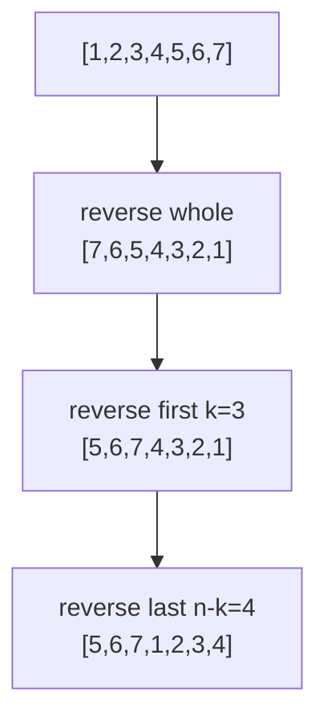

# Rotate Array (In-Place by Reversal)

| Meta | Value |
|------|-------|
| Source | LeetCode #189 |
| Difficulty | Medium |
| Topics | Array, Math, Two Pointers |
| Link | https://leetcode.com/problems/rotate-array/ |

---

## Problem Statement
Rotate the array to the **right** by `k` steps, **in place** with O(1) extra space.

**Example**
```
Input:  nums = [1, 2, 3, 4, 5, 6, 7], k = 3
Output: [5, 6, 7, 1, 2, 3, 4]
```

---

## Step 0: Normalize k
If `k >= n`, rotating by `k` is the same as rotating by `k mod n` (a full rotation of `n`
returns the array to its start).

$$
k \leftarrow k \bmod n
$$

---

## The Reversal Trick — O(1) Space

Rotating right by `k` means the **last `k` elements** move to the front and the **first `n-k`**
move to the back. A beautiful identity makes this O(1) space:

1. Reverse the **entire** array.
2. Reverse the **first `k`** elements.
3. Reverse the **remaining `n-k`** elements.

### Why it works (math intuition)
Reversal is its own inverse. After reversing the whole array, the last `k` elements are now at
the front but in *reversed* order; reversing each block independently restores their original
internal order while keeping them in the new (rotated) position.

Formally, for a sequence split as `A | B`, the right rotation produces `B | A`. Using
`rev()` for reverse and `+` for concatenation:

$$
\text{rev}\big(\text{rev}(A) + \text{rev}(B)\big) = B + A
$$

---

## Trace — `nums = [1,2,3,4,5,6,7]`, `k = 3`

```
Step 1: reverse all              [7, 6, 5, 4, 3, 2, 1]
Step 2: reverse first k=3        [5, 6, 7, 4, 3, 2, 1]
                                  ^^^^^^^ reversed
Step 3: reverse last n-k=4       [5, 6, 7, 1, 2, 3, 4]
                                          ^^^^^^^^^^ reversed
Result:                          [5, 6, 7, 1, 2, 3, 4]   ✓
```



---

## Code

```python
def rotate(nums, k):
    n = len(nums)
    k %= n

    def reverse(l, r):
        while l < r:
            nums[l], nums[r] = nums[r], nums[l]
            l += 1
            r -= 1

    reverse(0, n - 1)        # whole array
    reverse(0, k - 1)        # first k
    reverse(k, n - 1)        # remaining n-k
```

```cpp
void rotate(vector<int>& nums, int k) {
    int n = nums.size();
    k %= n;

    auto reverse = [&](int l, int r) {
        while (l < r) {
            swap(nums[l], nums[r]);
            l++;
            r--;
        }
    };

    reverse(0, n - 1);       // whole array
    reverse(0, k - 1);       // first k
    reverse(k, n - 1);       // remaining n-k
}
```

---

## Complexity

| Metric | Value |
|--------|-------|
| Time   | O(n) — each element swapped a constant number of times |
| Space  | O(1) — in place |

### Alternative: extra-array method (O(n) space)
`new[(i + k) % n] = nums[i]`. Simpler to reason about but violates the O(1) constraint.

---

## Edge Cases
- `k = 0` or `k = n` → no change (handled by `k %= n`).
- Single element → trivially unchanged.

## Takeaway
The triple-reversal identity `rev(rev(A)+rev(B)) = B+A` is a reusable gem for in-place block
swaps — it also powers string rotation and word-order reversal.
