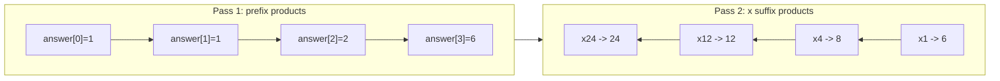

# Product of Array Except Self

| Meta | Value |
|------|-------|
| Source | LeetCode #238 |
| Difficulty | Medium |
| Topics | Array, Prefix Product |
| Link | https://leetcode.com/problems/product-of-array-except-self/ |

---

## Problem Statement
Given an integer array `nums`, return an array `answer` such that `answer[i]` equals the
product of all elements of `nums` **except** `nums[i]`. You must solve it **without division**
and in **O(n)** time.

**Example**
```
Input:  nums = [1, 2, 3, 4]
Output: [24, 12, 8, 6]
        answer[0] = 2*3*4 = 24
        answer[1] = 1*3*4 = 12
        answer[2] = 1*2*4 = 8
        answer[3] = 1*2*3 = 6
```

---

## Why Not Division?
The naive trick is `answer[i] = total_product / nums[i]`. But this **breaks when any element is
0** (division by zero, and zeros make the total product 0). The problem forbids division to
force the elegant prefix/suffix approach.

---

## Key Insight — Split Into Prefix × Suffix

For index `i`, everything *except* `nums[i]` is:

$$
answer[i] = \underbrace{\left(\prod_{k<i} nums[k]\right)}_{\text{prefix}}
            \times
            \underbrace{\left(\prod_{k>i} nums[k]\right)}_{\text{suffix}}
$$

So if we know the product of everything to the **left** and everything to the **right** of
each index, multiplying them gives the answer — no division needed.

```
nums   = [ 1 ,  2 ,  3 ,  4 ]
prefix = [ 1 ,  1 ,  2 ,  6 ]   prefix[i] = product of nums[0..i-1]
suffix = [24 , 12 ,  4 ,  1 ]   suffix[i] = product of nums[i+1..n-1]
answer = prefix[i] * suffix[i]
       = [24 , 12 ,  8 ,  6 ]
```

---

## Two-Pass O(1) Extra Space Solution

We reuse the output array for the prefix, then fold in the suffix on a second pass using a
single running variable.

```python
def product_except_self(nums):
    n = len(nums)
    answer = [1] * n

    # Pass 1: answer[i] = product of everything to the LEFT of i
    prefix = 1
    for i in range(n):
        answer[i] = prefix
        prefix *= nums[i]

    # Pass 2: multiply by product of everything to the RIGHT of i
    suffix = 1
    for i in range(n - 1, -1, -1):
        answer[i] *= suffix
        suffix *= nums[i]

    return answer
```

```cpp
vector<long long> product_except_self(vector<int>& nums) {
    int n = nums.size();
    vector<long long> answer(n, 1);

    // Pass 1: answer[i] = product of everything to the LEFT of i
    long long prefix = 1;
    for (int i = 0; i < n; i++) {
        answer[i] = prefix;
        prefix *= nums[i];
    }

    // Pass 2: multiply by product of everything to the RIGHT of i
    long long suffix = 1;
    for (int i = n - 1; i >= 0; i--) {
        answer[i] *= suffix;
        suffix *= nums[i];
    }

    return answer;
}
```

### Iteration Trace — `nums = [1, 2, 3, 4]`

**Pass 1 (left → right), `prefix` starts at 1:**

| i | answer[i] = prefix | prefix *= nums[i] |
|---|--------------------|-------------------|
| 0 | 1                  | 1 × 1 = 1         |
| 1 | 1                  | 1 × 2 = 2         |
| 2 | 2                  | 2 × 3 = 6         |
| 3 | 6                  | 6 × 4 = 24        |

After pass 1: `answer = [1, 1, 2, 6]`

**Pass 2 (right → left), `suffix` starts at 1:**

| i | answer[i] *= suffix | answer[i] | suffix *= nums[i] |
|---|---------------------|-----------|-------------------|
| 3 | 6 × 1               | 6         | 1 × 4 = 4         |
| 2 | 2 × 4               | 8         | 4 × 3 = 12        |
| 1 | 1 × 12              | 12        | 12 × 2 = 24       |
| 0 | 1 × 24              | 24        | 24 × 1 = 24       |

Final: `answer = [24, 12, 8, 6]` ✓



---

## Complexity

| Metric | Value |
|--------|-------|
| Time   | O(n) — two linear passes |
| Extra space | O(1) — output array doesn't count; only two scalars |

---

## Edge Cases
- **One zero** → only that index gets a nonzero product; all others become 0. Handled
  automatically by prefix/suffix.
- **Two or more zeros** → every answer is 0. Also handled automatically.
- Negative numbers → signs multiply correctly.

## Takeaway
The **prefix + suffix decomposition** is a powerful general technique: whenever
`answer[i]` depends on "everything on the left" and "everything on the right," precompute both
directions and combine. It also appears in trapping rain water and candy distribution.
