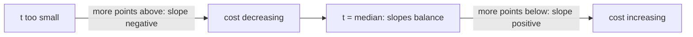

# Stick Lengths (Greedy + Median)

| Meta | Value |
|------|-------|
| Source | CSES Problem Set — Sorting and Searching |
| Difficulty | Easy–Medium |
| Topics | Sorting, Median, Greedy, Math |
| Link | https://cses.fi/problemset/task/1074 |

---

## Problem Statement
There are `n` sticks of given lengths. In one move you can lengthen or shorten a stick by 1
(cost 1). Find the **minimum total cost** to make all sticks the **same** length.

**Example**
```
lengths = [2, 3, 1, 5, 2]
Output: 5      (make all equal to 2: |2-2|+|3-2|+|1-2|+|5-2|+|2-2| = 0+1+1+3+0 = 5)
```

---

## Reformulation

Choose a target length `t`. Total cost is:

$$
C(t) = \sum_{i=1}^{n} |a_i - t|
$$

We want the `t` that **minimizes the sum of absolute deviations**. This is a classic result:

> The sum of absolute deviations is minimized at the **median** of the data.

---

## Why the Median? (Proof Sketch)

Consider moving the target `t` slightly. The derivative of `C(t)` is:

$$
C'(t) = (\#\{a_i < t\}) - (\#\{a_i > t\})
$$

Each value below `t` pushes the cost up as `t` increases (slope +1); each value above pushes it
down (slope −1). `C(t)` decreases while more points lie above `t`, and increases once more lie
below. The minimum is where these balance — i.e. where `t` has equal numbers of points on each
side: **the median**.



For an **even** count, any value between the two middle elements is optimal (the cost is flat
there) — picking either middle element works.

---

## Algorithm

1. Sort the lengths.
2. Take the median (element at index `n // 2`).
3. Sum `|a_i − median|`.

```python
def stick_lengths(lengths):
    lengths.sort()
    median = lengths[len(lengths) // 2]
    return sum(abs(x - median) for x in lengths)
```

```cpp
long long stick_lengths(vector<int>& lengths) {
    sort(lengths.begin(), lengths.end());
    int median = lengths[lengths.size() / 2];
    long long total = 0;
    for (int x : lengths)
        total += abs(x - median);
    return total;
}
```

---

## Trace — `[2, 3, 1, 5, 2]`

1. Sort → `[1, 2, 2, 3, 5]`.
2. Median = index `5 // 2 = 2` → value `2`.
3. Cost = `|1−2| + |2−2| + |2−2| + |3−2| + |5−2| = 1 + 0 + 0 + 1 + 3 = 5` ✓.

Try a different target to confirm optimality:
- `t = 3`: `2+1+1+0+2 = 6` (worse)
- `t = 1`: `0+1+1+2+4 = 8` (worse)

The median (2) indeed gives the minimum, **5**.

---

## Common Pitfall — The Mean Is Wrong Here
A frequent mistake is to use the **mean**. The mean minimizes the sum of **squared** deviations
(`Σ(a_i − t)²`), not the sum of **absolute** deviations. For L1 cost, always use the **median**.

| Cost function | Optimal target |
|---------------|----------------|
| `Σ \|a_i − t\|` (L1) | **median** |
| `Σ (a_i − t)²` (L2) | mean |

---

## Complexity

| Metric | Value |
|--------|-------|
| Time   | O(n log n) — dominated by the sort |
| Space  | O(1) extra (or O(n) for the sort) |

Values can be large, so use 64-bit integers for the accumulated cost to avoid overflow.

## Takeaway
"Make everything equal with minimum ±1 moves" = **minimize sum of absolute deviations** =
**aim for the median**. This median-minimizes-L1 fact recurs in facility-location and
"meeting point" problems (e.g. Best Meeting Point, LeetCode 296).
