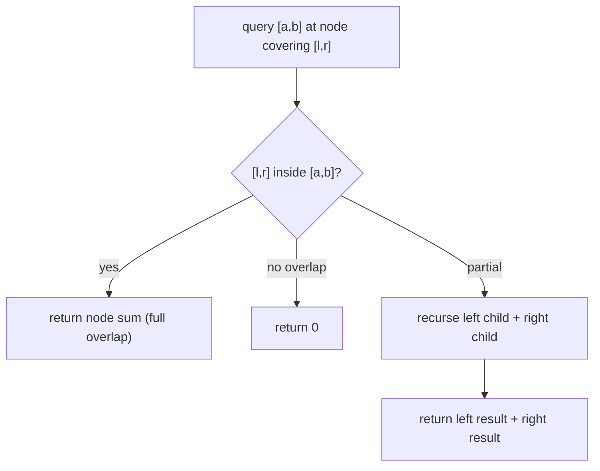

# Dynamic Range Sum Queries (Segment Tree)

| Meta | Value |
|------|-------|
| Source | CSES Problem Set — Range Queries |
| Difficulty | Medium (fundamental competitive structure) |
| Topics | Segment Tree, Point Update, Range Query |
| Link | https://cses.fi/problemset/task/1648 |

---

## Problem Statement
Given an array of `n` integers, process `q` queries of two types:
1. `1 k u` — set the value at position `k` to `u` (**point update**).
2. `2 a b` — output the **sum** of values in range `[a, b]` (**range query**).

Both updates and queries must be fast — `n, q` up to `2·10⁵`, so `O(n)` per query is too slow.
We need **O(log n)** per operation → a **segment tree**.

**Example**
```
array = [1, 2, 3, 4, 5, 6, 7, 8]
query 2 1 4  -> 1+2+3+4 = 10
update 1 4 9 -> array[4] = 9  (1-indexed)
query 2 1 4  -> 1+2+3+9 = 15
```

---

## Why a Segment Tree?

| Structure | Range sum | Point update |
|-----------|-----------|--------------|
| Plain array | O(n) | O(1) |
| Prefix sum array | O(1) | **O(n)** (rebuild) |
| **Segment tree** | **O(log n)** | **O(log n)** |
| Fenwick (BIT) | O(log n) | O(log n) |

A prefix-sum array gives O(1) queries but updating one element forces an O(n) rebuild. The
segment tree balances **both** operations at O(log n) — ideal when updates and queries
interleave.

---

## The Idea — A Tree of Range Sums

Build a binary tree where each node stores the **sum of a contiguous segment**. The root covers
`[0, n-1]`; each node splits its range in half between its two children; leaves are single
elements.

```
            [0..7]=36
           /        \
      [0..3]=10    [4..7]=26
       /    \        /    \
   [0..1]  [2..3] [4..5] [6..7]
    =3      =7     =11    =15
   / \     / \    / \     / \
  1   2   3   4  5   6   7   8
```

Any range `[a, b]` decomposes into **O(log n)** of these precomputed node ranges, so a query
sums just a handful of nodes.



---

## Implementation (Iterative, 1-based, array-backed)

A clean iterative segment tree stores `2n` values: leaves at indices `[n, 2n)`, internal nodes
at `[1, n)`. Parent of `i` is `i//2`; children of `i` are `2i` and `2i+1`.

```python
class SegTree:
    def __init__(self, data):
        self.n = len(data)
        self.tree = [0] * (2 * self.n)
        # place leaves
        for i in range(self.n):
            self.tree[self.n + i] = data[i]
        # build internal nodes bottom-up
        for i in range(self.n - 1, 0, -1):
            self.tree[i] = self.tree[2 * i] + self.tree[2 * i + 1]

    def update(self, pos, value):          # point update: data[pos] = value
        i = pos + self.n
        self.tree[i] = value
        i //= 2
        while i >= 1:
            self.tree[i] = self.tree[2 * i] + self.tree[2 * i + 1]
            i //= 2

    def query(self, l, r):                 # sum over [l, r] inclusive
        res = 0
        l += self.n
        r += self.n + 1                    # half-open [l, r)
        while l < r:
            if l & 1:                      # l is a right child -> include & move right
                res += self.tree[l]
                l += 1
            if r & 1:                      # r is a right child -> move left & include
                r -= 1
                res += self.tree[r]
            l //= 2
            r //= 2
        return res
```

```cpp
struct SegTree {
    int n;
    vector<long long> tree;

    SegTree(vector<long long>& data) {
        n = data.size();
        tree.assign(2 * n, 0);
        // place leaves
        for (int i = 0; i < n; i++)
            tree[n + i] = data[i];
        // build internal nodes bottom-up
        for (int i = n - 1; i > 0; i--)
            tree[i] = tree[2 * i] + tree[2 * i + 1];
    }

    void update(int pos, long long value) {   // point update: data[pos] = value
        int i = pos + n;
        tree[i] = value;
        i /= 2;
        while (i >= 1) {
            tree[i] = tree[2 * i] + tree[2 * i + 1];
            i /= 2;
        }
    }

    long long query(int l, int r) {           // sum over [l, r] inclusive
        long long res = 0;
        l += n;
        r += n + 1;                           // half-open [l, r)
        while (l < r) {
            if (l & 1) {                      // l is a right child -> include & move right
                res += tree[l];
                l++;
            }
            if (r & 1) {                      // r is a right child -> move left & include
                r--;
                res += tree[r];
            }
            l /= 2;
            r /= 2;
        }
        return res;
    }
};
```

---

## Update Trace — set `data[4] = 9` in `[1..8]`

Leaf index = `4 + n = 4 + 8 = 12`. We fix the leaf, then walk up, re-summing each ancestor:

| node i | range | recompute | new sum |
|--------|-------|-----------|---------|
| 12 | [4] | leaf set | 9 |
| 6  | [4..5] | tree[12]+tree[13] = 9+6 | 15 |
| 3  | [4..7] | tree[6]+tree[7] = 15+15 | 30 |
| 1  | [0..7] | tree[2]+tree[3] = 10+30 | 40 |

Only the `O(log n)` ancestors on the path to the root change — everything else is untouched.

---

## Query Trace — sum `[0, 4]` (1-indexed `[1,5]`) after the update

Range `[0,4]` decomposes into a few canonical nodes; the iterative loop accumulates them as it
climbs. Result = `1+2+3+9+5 = 20`. The loop touches at most two nodes per level → O(log n).

---

## Complexity

| Operation | Time | Space |
|-----------|------|-------|
| Build | O(n) | O(n) |
| Point update | O(log n) | — |
| Range query | O(log n) | — |

---

## Variations (same skeleton, change the merge)
- **Range minimum / maximum:** replace `+` with `min`/`max` (identity `+inf`/`-inf`).
- **Range gcd / xor:** merge with `gcd`/`xor`.
- **Range update + range query:** add **lazy propagation** (defer updates to children).
- **Fenwick tree (BIT):** simpler/faster for pure prefix-sum + point-update, but less flexible.

## Takeaway
A segment tree is the Swiss-army knife of range queries: it answers any **associative** range
operation with point or range updates in O(log n). The decomposition of `[a,b]` into O(log n)
canonical segments is the core idea — internalize it and lazy propagation follows naturally.
