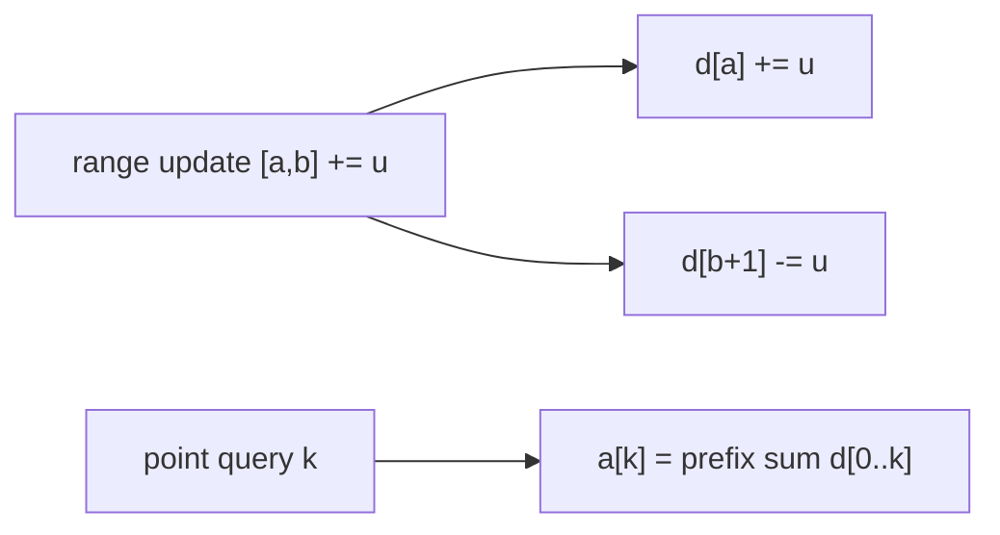

# Range Update Queries (Difference Array + Fenwick)

| Meta | Value |
|------|-------|
| Source | CSES Problem Set — Range Queries (Range Updates / "Range Update Queries") |
| Difficulty | Medium |
| Topics | Difference Array, Fenwick Tree, Prefix Sum |
| Link | https://cses.fi/problemset/task/1651 |

---

## Problem Statement
Given an array of `n` integers and `q` queries of two types:
1. `1 a b u` — add `u` to **every** element in range `[a, b]` (**range update**).
2. `2 k` — print the value at position `k` (**point query**).

We want both operations in **O(log n)**.

**Example**
```
array = [3, 3, 1, 1, 1, 1, 1, 1]
1 1 4 5  -> add 5 to positions 1..4 -> [8, 8, 6, 6, 1, 1, 1, 1]
2 4      -> 6
```

---

## Key Insight — Difference Array Turns Range Update into Two Point Updates

Define the **difference array** `d` where `d[i] = a[i] − a[i−1]` (with `a[-1] = 0`). Then:

$$
a[k] = d[0] + d[1] + \dots + d[k] = \sum_{i=0}^{k} d[i]
$$

So a **point value** is a **prefix sum** of `d`. The magic: adding `u` to the whole range
`[a, b]` of the original array touches **only two** entries of `d`:

$$
d[a] \mathrel{+}= u, \qquad d[b+1] \mathrel{-}= u
$$

Why? Increasing `d[a]` by `u` raises the prefix sum (and thus `a[i]`) for **all** `i ≥ a`.
Subtracting `u` at `d[b+1]` cancels that increase for `i > b`. Net effect: exactly `[a, b]` is
bumped by `u`.

```
add u to [a, b]:
        a            b  b+1
        v            v   v
d:  ... +u ........... .. -u ...
prefix(d) rises by u from index a, returns to normal after b.  ✓
```



---

## Fenwick Tree for O(log n) Prefix Sums

The point query needs `prefix(d, k)`. A **Fenwick (Binary Indexed) Tree** maintains prefix sums
with O(log n) **point update** and O(log n) **prefix query** — exactly what we need on `d`.

```python
class Fenwick:
    def __init__(self, n):
        self.n = n
        self.bit = [0] * (n + 1)        # 1-indexed

    def add(self, i, delta):            # point update d[i] += delta
        i += 1
        while i <= self.n:
            self.bit[i] += delta
            i += i & (-i)               # jump to next responsible node

    def prefix(self, i):                # sum d[0..i]
        i += 1
        s = 0
        while i > 0:
            s += self.bit[i]
            i -= i & (-i)               # strip lowest set bit
        return s


def solve(arr, queries):
    n = len(arr)
    fw = Fenwick(n + 1)
    # initialize d as the difference array of arr
    for i in range(n):
        prev = arr[i - 1] if i > 0 else 0
        fw.add(i, arr[i] - prev)
    out = []
    for q in queries:
        if q[0] == 1:                   # range update
            _, a, b, u = q              # 0-indexed inclusive
            fw.add(a, u)
            fw.add(b + 1, -u)
        else:                           # point query
            _, k = q
            out.append(fw.prefix(k))
    return out
```

```cpp
struct Fenwick {
    int n;
    vector<long long> bit;               // 1-indexed

    Fenwick(int n) : n(n), bit(n + 1, 0) {}

    void add(int i, long long delta) {   // point update d[i] += delta
        i += 1;
        while (i <= n) {
            bit[i] += delta;
            i += i & (-i);               // jump to next responsible node
        }
    }

    long long prefix(int i) {            // sum d[0..i]
        i += 1;
        long long s = 0;
        while (i > 0) {
            s += bit[i];
            i -= i & (-i);               // strip lowest set bit
        }
        return s;
    }
};

vector<long long> solve(vector<long long>& arr, vector<vector<long long>>& queries) {
    int n = arr.size();
    Fenwick fw(n + 1);
    // initialize d as the difference array of arr
    for (int i = 0; i < n; i++) {
        long long prev = i > 0 ? arr[i - 1] : 0;
        fw.add(i, arr[i] - prev);
    }
    vector<long long> out;
    for (auto& q : queries) {
        if (q[0] == 1) {                 // range update
            long long a = q[1], b = q[2], u = q[3];   // 0-indexed inclusive
            fw.add(a, u);
            fw.add(b + 1, -u);
        } else {                         // point query
            long long k = q[1];
            out.push_back(fw.prefix(k));
        }
    }
    return out;
}
```

The expression `i & (-i)` isolates the **lowest set bit** — the size of the range each Fenwick
node is responsible for. That bit-trick is what makes traversal O(log n).

---

## Trace — `arr = [3,3,1,1,1,1,1,1]`, update `[1,4] += 5`, query position 4

Difference array initially: `d = [3, 0, -2, 0, 0, 0, 0, 0]`.

**Range update `[1,4] += 5`:** `d[1] += 5`, `d[5] -= 5` → `d = [3, 5, -2, 0, 0, -5, 0, 0]`.

**Point query k=4:** `a[4] = prefix(d, 4) = 3 + 5 + (-2) + 0 + 0 = 6` ✓.

The whole range `[1,4]` became `[8,8,6,6]` while positions 5+ stayed at 1 — and we only modified
**two** Fenwick entries per update.

---

## Complexity

| Operation | Time |
|-----------|------|
| Range update | O(log n) (two Fenwick point updates) |
| Point query | O(log n) (one prefix sum) |
| Space | O(n) |

Compare to the naive O(n) per range update — this is a dramatic speedup for many queries.

---

## Duality Note
This is the **dual** of "point update + range query" (the standard Fenwick/segment tree). By
working on the **difference array**, "range update + point query" reduces to "point update +
prefix query." Combining both ideas (two Fenwick trees) yields **range update + range query**.

## Takeaway
The **difference array** converts an O(n) range update into O(1) (or O(log n) with Fenwick)
point edits, because *a value is the prefix sum of differences*. This identity underpins
interval-stabbing, "car pooling," and offline range-increment problems.
