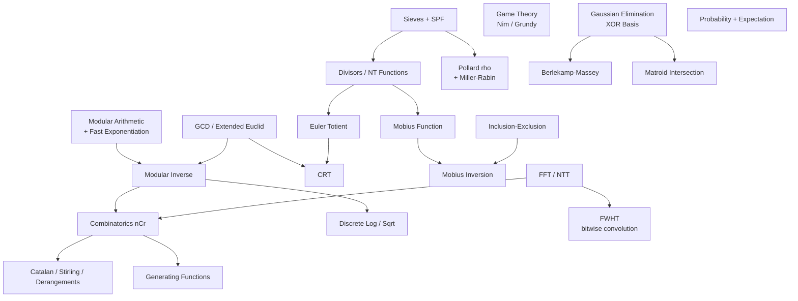

# Mathematics — Competitive & Interview

A deep-dive module on **mathematics for competitive programming** and senior-level interviews,
spanning number theory, combinatorics, game theory, linear algebra, probability, and polynomial
algorithms. Each topic has a **complete guide** (theory, math, complexity, pitfalls) and one or
more **curated problems** (mostly [CSES](https://cses.fi/problemset/) + classics) solved with
**both Python and C++**.

## Structure

```
maths/
├── guide/      # one concept guide per topic
└── problems/   # one file per curated problem (Python + C++, traces, diagrams, math)
```

## Topics & Guides

| # | Concept | Guide | Key problems |
|---|---------|-------|--------------|
| 1 | Modular arithmetic, fast exponentiation, modular inverse | [01-modular-arithmetic-fast-exp.md](guide/01-modular-arithmetic-fast-exp.md) | Exponentiation, Exponentiation II |
| 2 | GCD/LCM, extended Euclidean algorithm | [02-gcd-lcm-extended-euclid.md](guide/02-gcd-lcm-extended-euclid.md) | GCD/LCM, linear Diophantine |
| 3 | Sieve of Eratosthenes, linear sieve, SPF factorization | [03-sieves-factorization.md](guide/03-sieves-factorization.md) | Counting Coprime Pairs, prime sieve |
| 4 | Divisor counting/sum, number-theoretic functions | [04-divisors-number-theoretic-functions.md](guide/04-divisors-number-theoretic-functions.md) | Common Divisors, Sum of Divisors |
| 5 | Combinatorics: nCr mod p, factorials + inverse factorials, Pascal, Lucas | [05-combinatorics-ncr-lucas.md](guide/05-combinatorics-ncr-lucas.md) | Binomial Coefficients, Distributing Apples |
| 6 | Inclusion-exclusion | [06-inclusion-exclusion.md](guide/06-inclusion-exclusion.md) | Counting Divisors, Coprime counting |
| 7 | Euler's totient, Chinese Remainder Theorem | [07-totient-crt.md](guide/07-totient-crt.md) | Counting Coprimes, Exponentiation II |
| 8 | Catalan / Stirling numbers, derangements | [08-catalan-stirling-derangements.md](guide/08-catalan-stirling-derangements.md) | Bracket Sequences, Christmas Party |
| 9 | Game theory: Nim, Sprague-Grundy | [09-game-theory-nim-grundy.md](guide/09-game-theory-nim-grundy.md) | Nim Game, Stair/Grundy games |
| 10 | Linear algebra: Gaussian elimination, XOR basis | [10-gaussian-elimination-xor-basis.md](guide/10-gaussian-elimination-xor-basis.md) | XOR Maximization, linear systems |
| 11 | Probability & expectation, linearity of expectation | [11-probability-expectation.md](guide/11-probability-expectation.md) | Dice Combinations (E), Moving Robots |
| 12 | FFT / NTT (polynomial multiplication), convolutions | [12-fft-ntt-convolution.md](guide/12-fft-ntt-convolution.md) | Polynomial multiply, string matching |
| 13 | Möbius function / Möbius inversion | [13-mobius-function-inversion.md](guide/13-mobius-function-inversion.md) | Counting coprime pairs, squarefree |
| 14 | Pollard's rho factorization + Miller-Rabin | [14-pollard-rho-factorization.md](guide/14-pollard-rho-factorization.md) | Factor up to 1e18, big-N primality |
| 15 | Discrete log (BSGS) & discrete sqrt (Tonelli-Shanks) | [15-discrete-log-sqrt.md](guide/15-discrete-log-sqrt.md) | Discrete log, quadratic residue |
| 16 | FWHT — XOR/AND/OR convolutions | [16-fwht-xor-and-or-convolution.md](guide/16-fwht-xor-and-or-convolution.md) | XOR convolution, subset XOR counts |
| 17 | Berlekamp-Massey + Kitamasa | [17-berlekamp-massey.md](guide/17-berlekamp-massey.md) | Find recurrence, n-th term huge n |
| 18 | Matroid intersection (niche) | [18-matroid-intersection.md](guide/18-matroid-intersection.md) | Colorful spanning tree, rainbow forest |
| 19 | Generating functions | [19-generating-functions.md](guide/19-generating-functions.md) | Coin change, integer partitions |
| 20 | Burnside's lemma / Pólya enumeration | [20-burnside-polya-enumeration.md](guide/20-burnside-polya-enumeration.md) | Necklaces, bracelets, grid/cube colorings |

## How the pieces fit together




## Recommended study order

1. **Modular arithmetic + fast exponentiation + inverse** (1) — the bedrock of every "mod p" answer.
2. **GCD / extended Euclid** (2) — inverses, Diophantine equations, CRT.
3. **Sieves + factorization → divisors / NT functions** (3–4) — multiplicative-function toolkit.
4. **Combinatorics → inclusion-exclusion** (5–6) — counting with nCr and corrections.
5. **Totient + CRT** (7) — modular structure, coprime counting.
6. **Catalan / Stirling / derangements** (8) — special counting sequences.
7. **Game theory, linear algebra, probability** (9–11) — independent specialized toolkits.
8. **FFT / NTT, Möbius** (12–13) — convolutions and multiplicative inversion.
9. **Pollard's rho, discrete log/sqrt** (14–15) — heavy number theory for 64-bit inputs.
10. **FWHT, Berlekamp-Massey, generating functions** (16–17, 19) — advanced algebraic toolkits.
11. **Matroid intersection** (18) — the niche capstone (combinatorial optimization).
12. **Burnside / Pólya** (20) — counting under symmetry (uses totient + modular inverse).

## Complexity cheat sheet

| Algorithm | Complexity | Notes |
|-----------|-----------|-------|
| Fast (binary) exponentiation | $O(\log n)$ | $a^n \bmod m$ |
| Modular inverse (Fermat) | $O(\log m)$ | prime modulus |
| Modular inverse (ext. Euclid) | $O(\log m)$ | any coprime modulus |
| Euclid GCD | $O(\log \min(a,b))$ | + extended for coefficients |
| Sieve of Eratosthenes | $O(n \log \log n)$ | primes up to $n$ |
| Linear sieve | $O(n)$ | primes + SPF + mult. functions |
| SPF factorization | $O(\log n)$ per query | after $O(n)$ sieve |
| nCr mod p (precompute) | $O(n)$ build, $O(1)$ query | factorials + inverse factorials |
| Lucas' theorem | $O(p + \log_p n)$ | small prime $p$ |
| Euler totient (single) | $O(\sqrt n)$ | factorization-based |
| CRT (k congruences) | $O(k \log m)$ | pairwise / general |
| Gaussian elimination | $O(n^3)$ | linear systems, rank, det |
| XOR basis insert/query | $O(\log_2 \max)$ | linear basis over GF(2) |
| FFT / NTT | $O(n \log n)$ | polynomial multiplication |
| Möbius sieve | $O(n \log \log n)$ | + $O(n)$ via linear sieve |
| Miller-Rabin (deterministic) | $O(k \log^3 n)$ | primality for $n < 2^{64}$ |
| Pollard's rho | $O(n^{1/4})$ expected | factor large $n$ |
| Baby-step giant-step | $O(\sqrt m)$ | discrete logarithm |
| Tonelli-Shanks | $O(\log^2 p)$ | discrete square root |
| FWHT (xor/and/or) | $O(n \log n)$ | bitwise convolution, $n = 2^k$ |
| Berlekamp-Massey | $O(nL)$ | shortest linear recurrence |
| Kitamasa (n-th term) | $O(k^2 \log n)$ | linear recurrence eval |
| Matroid intersection | $O(r^{1.5}\cdot\text{oracle})$ | max common independent set |
| Generating-function product | $O(n^2)$ / $O(n \log n)$ | naive / with NTT |
| Burnside / Pólya | $O(|G|\cdot\text{fix})$ | orbits under group action |

---

> Every code sample appears in **both Python and C++**. Problem files follow the repo format:
> meta table → statement → approaches → Python + C++ → iteration trace → Mermaid → math →
> complexity → takeaway. Guides follow: TOC → concepts → paired code → Mermaid → math →
> complexity → pitfalls → patterns. Use `long long` and explicit `MOD` constants; reduce
> intermediate products to avoid overflow (`__int128` or careful mulmod where needed).
