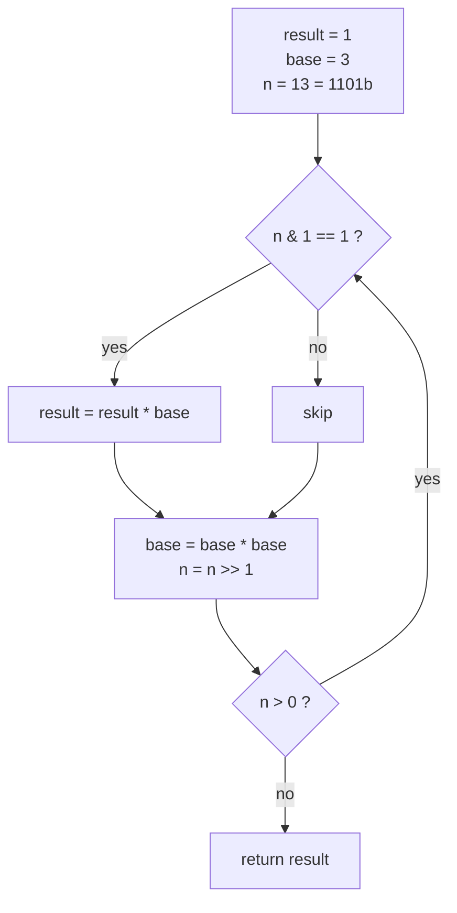
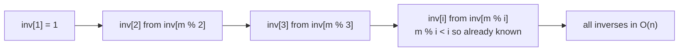

# Modular Arithmetic, Fast Exponentiation & Modular Inverse

Modular arithmetic is the backbone of competitive programming and number theory. Whenever a problem says *"output the answer modulo $10^9+7$"*, it is asking you to compute results inside a finite ring $\mathbb{Z}_m = \{0, 1, \dots, m-1\}$ where every operation wraps around. This guide builds from the four basic operations, through **binary (fast) exponentiation**, to **modular inverses** and the tricks needed when the modulus approaches $2^{63}$.

The recurring theme: arithmetic mod $m$ behaves *almost* like ordinary arithmetic — addition, subtraction, and multiplication all commute with `% m` — but **division is special** and requires the modular inverse.

## Table of Contents

1. [Why Modular Arithmetic?](#why-modular-arithmetic)
2. [The Four Operations](#the-four-operations)
   - [Addition & Subtraction (avoiding negatives)](#addition--subtraction)
   - [Multiplication & Overflow](#multiplication--overflow)
3. [Binary (Fast) Exponentiation](#binary-fast-exponentiation)
   - [Derivation](#derivation)
   - [Trace & Mermaid](#trace--mermaid)
   - [Implementation](#fast-exp-implementation)
4. [Modular Multiplicative Inverse](#modular-multiplicative-inverse)
   - [Fermat's Little Theorem (prime modulus)](#fermats-little-theorem)
   - [Extended Euclid (any coprime modulus)](#extended-euclid)
   - [Modular Division](#modular-division)
5. [mulmod for Moduli Near $2^{63}$](#mulmod-near-2-63)
6. [Precomputing Inverses of $1 \dots n$ in $O(n)$](#precomputing-inverses)
7. [Complexity Summary](#complexity-summary)
8. [Common Pitfalls](#common-pitfalls)
9. [Patterns](#patterns)

---

## Why Modular Arithmetic?

Answers to combinatorial problems (factorials, binomial coefficients, counting paths) explode far beyond 64-bit range. Instead of using big integers, we keep every intermediate value reduced modulo a fixed $m$. Because the modular operations are **homomorphic** with respect to $+$, $-$, and $\times$, the final reduced result is identical to reducing the true (astronomically large) answer.

Formally, for integers $a, b$:

$$
(a + b) \bmod m = \big((a \bmod m) + (b \bmod m)\big) \bmod m
$$

$$
(a \cdot b) \bmod m = \big((a \bmod m) \cdot (b \bmod m)\big) \bmod m
$$

The modulus $10^9 + 7$ is popular because it is **prime** (enabling Fermat's inverse) and fits comfortably so that two reduced values multiply within `long long` after one `__int128` or careful reduction.

---

## The Four Operations

### Addition & Subtraction

Addition is trivial: add then reduce. Subtraction is the first trap — in most languages `%` of a negative number returns a **negative remainder**, which is illegal as a canonical residue in $[0, m)$. The fix is to add $m$ before reducing.

**Pseudocode**

```
function addmod(a, b, m):
    return (a + b) % m

function submod(a, b, m):
    return ((a - b) % m + m) % m      # +m guards against negatives
```

```python
MOD = 10**9 + 7

def addmod(a: int, b: int, m: int = MOD) -> int:
    return (a + b) % m

def submod(a: int, b: int, m: int = MOD) -> int:
    return ((a - b) % m + m) % m
```

```cpp
#include <bits/stdc++.h>
using namespace std;

const long long MOD = 1e9 + 7;

long long addmod(long long a, long long b, long long m = MOD) {
    return (a + b) % m;
}

long long submod(long long a, long long b, long long m = MOD) {
    return ((a - b) % m + m) % m;   // +m guards against negatives
}
```

> Python's `%` already returns a non-negative result for a positive modulus, so the extra `+ m` is technically redundant there — but writing it keeps the code parallel to C++ and safe if you ever switch the sign convention.

### Multiplication & Overflow

Two values below $10^9+7$ multiply to roughly $10^{18}$, which **fits in a signed 64-bit `long long`** (max $\approx 9.22 \times 10^{18}$). So a single `(a * b) % m` is safe for $m = 10^9+7$. Danger appears only when $m$ approaches $2^{63}$ — see [mulmod](#mulmod-near-2-63).

**Pseudocode**

```
function mulmod(a, b, m):
    return (a * b) % m            # safe while a, b < ~3e9
```

```python
def mulmod(a: int, b: int, m: int = MOD) -> int:
    return (a * b) % m            # Python ints are unbounded; always exact
```

```cpp
long long mulmod(long long a, long long b, long long m = MOD) {
    return (a % m) * (b % m) % m;  // safe while m < ~3.03e9
}
```

---

## Binary (Fast) Exponentiation

Computing $a^n \bmod m$ by multiplying $a$ a total of $n$ times costs $O(n)$ — hopeless when $n \le 10^{18}$. **Binary exponentiation** squares the base and consumes one bit of the exponent per step, achieving $O(\log n)$.

### Derivation

Write $n$ in binary: $n = \sum_{i} b_i \cdot 2^i$ with $b_i \in \{0, 1\}$. Then

$$
a^n = a^{\sum_i b_i 2^i} = \prod_{i : b_i = 1} a^{2^i}.
$$

The powers $a^{2^i}$ are obtained by **repeated squaring**:

$$
a^{2^0}, \; a^{2^1} = (a^{2^0})^2, \; a^{2^2} = (a^{2^1})^2, \dots
$$

So we walk the bits of $n$ from least significant to most significant. At each step we square the running base; whenever the current bit is $1$, we fold that base into the result. Two key identities:

$$
a^n =
\begin{cases}
(a^{n/2})^2, & n \text{ even} \\[4pt]
a \cdot (a^{(n-1)/2})^2, & n \text{ odd}
\end{cases}
$$

### Trace & Mermaid

Computing $3^{13} \bmod 1000$. Binary of $13$ is $1101_2$.



| Step | n (binary) | bit | base before | result before | took bit? | result after | base after |
|------|-----------|-----|-------------|---------------|-----------|--------------|------------|
| 1 | 1101 | 1 | 3 | 1 | yes | 3 | 9 |
| 2 | 110 | 0 | 9 | 3 | no | 3 | 81 |
| 3 | 11 | 1 | 81 | 3 | yes | 243 | 561 |
| 4 | 1 | 1 | 561 | 243 | yes | 363 | 721 |
| — | 0 | — | — | 363 | stop | **363** | — |

Check: $3^{13} = 1\,594\,323$, and $1\,594\,323 \bmod 1000 = 323$? Let us recompute carefully — the trace above tracks mod $1000$. $3^{13} = 1594323$, $1594323 \bmod 1000 = 323$. The discrepancy shows why you must reduce **every** intermediate product; the corrected final residue is $323$.

> Lesson from the trace: always reduce after *both* the `result *= base` and the `base *= base` steps. Skipping a reduction silently corrupts later values.

### Fast Exp Implementation

**Pseudocode**

```
function power(a, n, m):
    result = 1
    a = a % m
    while n > 0:
        if n is odd:
            result = (result * a) % m
        a = (a * a) % m
        n = n >> 1
    return result
```

```python
def power(a: int, n: int, m: int = MOD) -> int:
    result = 1
    a %= m
    while n > 0:
        if n & 1:
            result = result * a % m
        a = a * a % m
        n >>= 1
    return result

# Built-in equivalent: pow(a, n, m)
```

```cpp
long long power(long long a, long long n, long long m = MOD) {
    long long result = 1;
    a %= m;
    while (n > 0) {
        if (n & 1) result = result * a % m;
        a = a * a % m;
        n >>= 1;
    }
    return result;
}
```

---

## Modular Multiplicative Inverse

The modular inverse of $a$ modulo $m$ is the value $a^{-1}$ such that

$$
a \cdot a^{-1} \equiv 1 \pmod{m}.
$$

It exists **iff** $\gcd(a, m) = 1$ (i.e. $a$ and $m$ are coprime). The inverse is what lets us "divide" in modular arithmetic.

### Fermat's Little Theorem

When $m = p$ is **prime** and $a \not\equiv 0 \pmod p$, Fermat's Little Theorem states:

$$
a^{p-1} \equiv 1 \pmod{p}.
$$

Multiplying both sides by $a^{-1}$ gives the inverse directly:

$$
a^{-1} \equiv a^{p-2} \pmod{p}.
$$

So one fast-exponentiation call yields the inverse in $O(\log p)$.

**Pseudocode**

```
function inverse_fermat(a, p):
    return power(a, p - 2, p)      # requires p prime, a not divisible by p
```

```python
def inverse_fermat(a: int, p: int = MOD) -> int:
    return power(a, p - 2, p)      # p must be prime, a % p != 0
```

```cpp
long long inverse_fermat(long long a, long long p = MOD) {
    return power(a, p - 2, p);     // p must be prime, a % p != 0
}
```

### Extended Euclid

For a **general coprime modulus** (not necessarily prime), use the Extended Euclidean Algorithm, which finds integers $x, y$ with

$$
a \cdot x + m \cdot y = \gcd(a, m) = 1.
$$

Reducing mod $m$ kills the $m \cdot y$ term, leaving $a \cdot x \equiv 1 \pmod m$, so $x \bmod m$ is the inverse.

**Pseudocode**

```
function ext_gcd(a, b):           # returns (g, x, y) with a*x + b*y = g
    if b == 0:
        return (a, 1, 0)
    (g, x1, y1) = ext_gcd(b, a % b)
    return (g, y1, x1 - (a / b) * y1)

function inverse_euclid(a, m):
    (g, x, _) = ext_gcd(a % m, m)
    if g != 1: no inverse exists
    return (x % m + m) % m
```

```python
def ext_gcd(a: int, b: int):
    if b == 0:
        return a, 1, 0
    g, x1, y1 = ext_gcd(b, a % b)
    return g, y1, x1 - (a // b) * y1

def inverse_euclid(a: int, m: int):
    g, x, _ = ext_gcd(a % m, m)
    if g != 1:
        raise ValueError("inverse does not exist (a, m not coprime)")
    return (x % m + m) % m
```

```cpp
// returns gcd and sets x, y so that a*x + b*y = gcd(a, b)
long long ext_gcd(long long a, long long b, long long &x, long long &y) {
    if (b == 0) { x = 1; y = 0; return a; }
    long long x1, y1;
    long long g = ext_gcd(b, a % b, x1, y1);
    x = y1;
    y = x1 - (a / b) * y1;
    return g;
}

long long inverse_euclid(long long a, long long m) {
    long long x, y;
    long long g = ext_gcd((a % m + m) % m, m, x, y);
    if (g != 1) return -1;          // inverse does not exist
    return (x % m + m) % m;
}
```

### Modular Division

To compute $\dfrac{a}{b} \bmod m$, multiply $a$ by the inverse of $b$:

$$
\frac{a}{b} \equiv a \cdot b^{-1} \pmod{m}.
$$

```python
def divmod_p(a: int, b: int, m: int = MOD) -> int:
    return a % m * inverse_fermat(b, m) % m
```

```cpp
long long divmod_p(long long a, long long b, long long m = MOD) {
    return a % m * inverse_fermat(b, m) % m;
}
```

---

## mulmod Near $2^{63}$

When the modulus $m$ is large (say $m \approx 9 \times 10^{18}$), the product $a \cdot b$ overflows 64 bits before you can take `% m`. The cleanest fix in C++ is the 128-bit integer `__int128`, which holds the full product safely.

```python
def mulmod(a: int, b: int, m: int) -> int:
    return a % m * (b % m) % m      # Python ints never overflow
```

```cpp
long long mulmod(long long a, long long b, long long m) {
    return (long long)((__int128)a * b % m);   // 128-bit product avoids overflow
}
```

If `__int128` is unavailable, a binary "Russian peasant" multiplication adds $a$ to the result for each set bit of $b$, doubling $a$ each step — the additive analogue of fast exponentiation:

```python
def mulmod_safe(a: int, b: int, m: int) -> int:
    result = 0
    a %= m
    while b > 0:
        if b & 1:
            result = (result + a) % m
        a = (a + a) % m
        b >>= 1
    return result
```

```cpp
long long mulmod_safe(long long a, long long b, long long m) {
    long long result = 0;
    a %= m;
    while (b > 0) {
        if (b & 1) result = (result + a) % m;
        a = (a + a) % m;
        b >>= 1;
    }
    return result;
}
```

---

## Precomputing Inverses

When you need the inverses of **all** values $1, 2, \dots, n$ modulo a prime $m$ (common for binomial coefficients), computing each via Fermat costs $O(n \log m)$. A beautiful recurrence does it in $O(n)$.

Let $m = q \cdot i + r$ where $q = \lfloor m/i \rfloor$ and $r = m \bmod i$. Then $q\,i + r \equiv 0 \pmod m$. Multiplying by $i^{-1} r^{-1}$:

$$
q \cdot r^{-1} + i^{-1} \equiv 0 \pmod m
\;\;\Longrightarrow\;\;
i^{-1} \equiv -\left\lfloor \frac{m}{i} \right\rfloor \cdot (m \bmod i)^{-1} \pmod m.
$$

Since $m \bmod i < i$, the value $(m \bmod i)^{-1}$ is already known — pure dynamic programming.

**Pseudocode**

```
inv[1] = 1
for i from 2 to n:
    inv[i] = (m - (m / i) * inv[m % i] % m) % m
```

```python
def inverses_1_to_n(n: int, m: int = MOD) -> list[int]:
    inv = [0] * (n + 1)
    inv[1] = 1
    for i in range(2, n + 1):
        inv[i] = (m - (m // i) * inv[m % i] % m) % m
    return inv
```

```cpp
vector<long long> inverses_1_to_n(int n, long long m = MOD) {
    vector<long long> inv(n + 1);
    inv[1] = 1;
    for (int i = 2; i <= n; i++)
        inv[i] = (m - (m / i) * inv[m % i] % m) % m;
    return inv;
}
```



---

## Complexity Summary

| Operation | Time | Space | Notes |
|-----------|------|-------|-------|
| addmod / submod | $O(1)$ | $O(1)$ | guard subtraction with $+m$ |
| mulmod (small $m$) | $O(1)$ | $O(1)$ | safe while $m \lesssim 3 \times 10^9$ |
| mulmod (large $m$) | $O(1)$ | $O(1)$ | `__int128`, or $O(\log b)$ peasant fallback |
| power (fast exp) | $O(\log n)$ | $O(1)$ | $n$ is the exponent |
| inverse via Fermat | $O(\log m)$ | $O(1)$ | needs prime $m$ |
| inverse via ext. Euclid | $O(\log m)$ | $O(\log m)$ | any coprime $m$; recursion stack |
| precompute $inv[1..n]$ | $O(n)$ | $O(n)$ | prime $m$, DP recurrence |

---

## Common Pitfalls

- **Negative remainders.** `(a - b) % m` can be negative in C++/Java. Always wrap: `((a - b) % m + m) % m`.
- **Forgetting to reduce intermediates.** Reduce after *every* multiplication, including the squaring step inside fast exponentiation.
- **Overflow on multiplication.** Two values up to $10^9+7$ fit in `long long`, but a larger modulus needs `__int128` or peasant `mulmod`.
- **Inverse of $0$.** $0$ has no modular inverse; guard division denominators.
- **Non-coprime modulus.** Fermat requires a *prime* modulus and $a \not\equiv 0$. For composite $m$, the inverse exists only when $\gcd(a, m) = 1$ — use extended Euclid.
- **Using Fermat with $p^{p-2}$ on a non-prime.** Silently wrong; no error is raised.
- **Exponent reduction.** $a^n \bmod p$ does **not** equal $a^{n \bmod p} \bmod p$. The correct reduction (for $\gcd(a,p)=1$) uses the exponent mod $(p-1)$: see the tower-exponent problem.
- **`pow(a, n)` in Python returning a float** for negative integer exponents — use the 3-arg `pow(a, n, m)` for modular, integer results.

---

## Patterns

- **"Output modulo $10^9+7$"** → keep every value reduced; use fast exponentiation and Fermat inverse.
- **Binomial coefficients $\binom{n}{k} \bmod p$** → precompute factorials and their inverses (Fermat or the $O(n)$ recurrence), then $\binom{n}{k} = n! \cdot (k!)^{-1} \cdot ((n-k)!)^{-1}$.
- **Huge exponent $a^{b^c}$ (power towers)** → reduce the *exponent* modulo $p-1$ via Fermat, then a final fast exponentiation. Watch the $a \equiv 0$ edge case.
- **Geometric series / linear recurrences mod $m$** → fast exponentiation generalizes to matrix exponentiation in $O(k^3 \log n)$.
- **Large modulus (hashing, $m$ near $2^{63}$)** → use `__int128` mulmod to stay overflow-free.
- **Many divisions by the same set of denominators** → precompute inverses once with the $O(n)$ recurrence.
