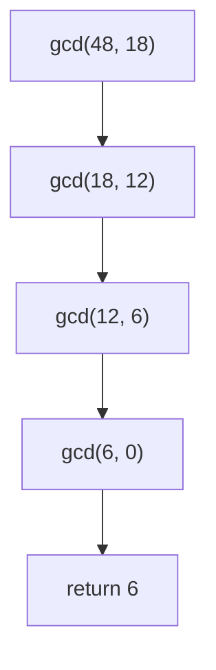
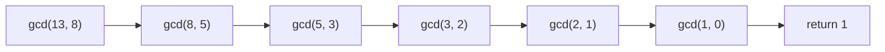
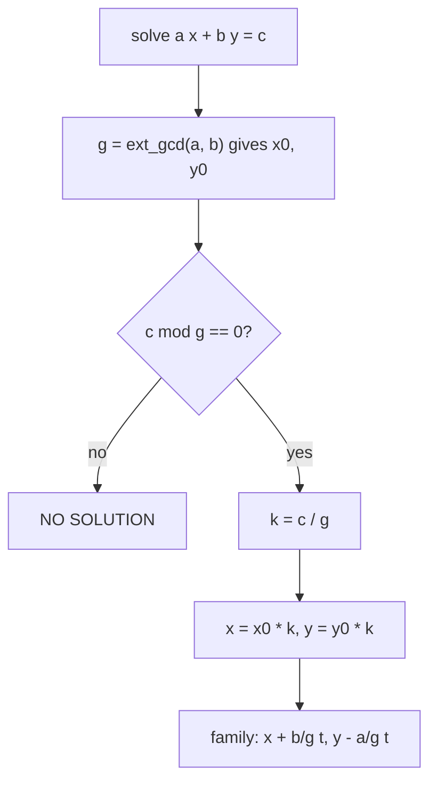

# GCD, LCM, and the Extended Euclidean Algorithm

The **greatest common divisor** (GCD) is the bedrock of elementary number theory used in competitive programming. From it we derive the **least common multiple** (LCM), **modular inverses**, and the solution of **linear Diophantine equations**. This guide builds everything from Euclid's algorithm, proves its logarithmic running time, and shows how the *extended* version recovers the Bézout coefficients $x, y$ satisfying $ax + by = \gcd(a,b)$.

---

## Table of Contents

- [1. Euclid's Algorithm](#1-euclids-algorithm)
  - [1.1 The Invariant](#11-the-invariant)
  - [1.2 Recursive Form](#12-recursive-form)
  - [1.3 Iterative Form](#13-iterative-form)
  - [1.4 Why It Is $O(\log \min(a,b))$](#14-why-it-is-olog-mina-b)
- [2. Least Common Multiple](#2-least-common-multiple)
- [3. Extended Euclidean Algorithm](#3-extended-euclidean-algorithm)
  - [3.1 Bézout's Identity](#31-bézouts-identity)
  - [3.2 Worked Trace](#32-worked-trace)
- [4. Modular Inverse](#4-modular-inverse)
- [5. Linear Diophantine Equations](#5-linear-diophantine-equations)
- [6. GCD / LCM of an Array](#6-gcd--lcm-of-an-array)
- [Complexity Summary](#complexity-summary)
- [Common Pitfalls](#common-pitfalls)
- [Patterns](#patterns)

---

## 1. Euclid's Algorithm

### 1.1 The Invariant

Euclid's algorithm rests on a single identity. For integers $a$ and $b$ with $b \neq 0$:

$$\gcd(a, b) = \gcd(b,\; a \bmod b)$$

**Why it holds.** Any common divisor $d$ of $a$ and $b$ also divides $a - qb = a \bmod b$ (where $q = \lfloor a/b \rfloor$). Conversely any common divisor of $b$ and $a \bmod b$ divides $a = qb + (a \bmod b)$. So the two pairs share *exactly* the same set of common divisors, hence the same greatest one. The base case is:

$$\gcd(a, 0) = a$$

because every integer divides $0$, so the largest divisor of $a$ wins.



### 1.2 Recursive Form

**Pseudocode**

```
function gcd(a, b):
    if b == 0:
        return a
    return gcd(b, a mod b)
```

```python
def gcd(a: int, b: int) -> int:
    if b == 0:
        return a
    return gcd(b, a % b)
```

```cpp
long long gcd(long long a, long long b) {
    if (b == 0) return a;
    return gcd(b, a % b);
}
```

### 1.3 Iterative Form

The recursion is tail-recursive, so it unrolls into a tight loop with no stack growth.

**Pseudocode**

```
function gcd(a, b):
    while b != 0:
        (a, b) = (b, a mod b)
    return a
```

```python
def gcd(a: int, b: int) -> int:
    while b != 0:
        a, b = b, a % b
    return a
```

```cpp
long long gcd(long long a, long long b) {
    while (b != 0) {
        long long t = a % b;
        a = b;
        b = t;
    }
    return a;
}
```

> **Library shortcut (C++).** You may use `std::__gcd(a, b)` or, since C++17, `std::gcd(a, b)` from `<numeric>`. Always understand the hand-written version above — interviewers and edge cases (negative inputs) demand it.

```python
import math
g = math.gcd(a, b)   # standard library, handles negatives by taking absolute values
```

```cpp
#include <numeric>
long long g = std::gcd(a, b);   // C++17; or std::__gcd(a, b)
```

### 1.4 Why It Is $O(\log \min(a,b))$

The key claim: **after two steps the larger argument is at least halved.** Suppose $a > b$. After one step we work with $(b, a \bmod b)$.

- If $b \le a/2$, the first component already shrank below half of $a$.
- If $b > a/2$, then $a \bmod b = a - b < a/2$ because subtracting $b$ once removes more than half.

Either way, within two iterations the leading value drops below half its earlier value. Halving an $n$-bit number can happen at most $O(\log a)$ times, giving:

$$T(a,b) = O(\log \min(a,b))$$

**Worst case = consecutive Fibonacci numbers.** Running Euclid on $\gcd(F_{n+1}, F_n)$ takes exactly $n$ steps, because $F_{n+1} \bmod F_n = F_{n-1}$ — the recursion walks down the Fibonacci sequence. Since $F_n \approx \varphi^n / \sqrt 5$ with $\varphi = \tfrac{1+\sqrt5}{2}$, the number of steps for inputs up to $N$ is $\approx \log_\varphi N \approx 1.44 \log_2 N$. This is *Lamé's theorem*.



---

## 2. Least Common Multiple

The fundamental relationship between LCM and GCD:

$$\text{lcm}(a, b) \cdot \gcd(a, b) = a \cdot b$$

Therefore:

$$\text{lcm}(a, b) = \frac{a}{\gcd(a,b)} \cdot b$$

**Divide before multiplying.** Writing it as `a / gcd(a,b) * b` keeps the intermediate value small and avoids the overflow you would hit with `a * b / gcd(a,b)` when $a$ and $b$ are large. The division is exact because $\gcd(a,b) \mid a$.

**Pseudocode**

```
function lcm(a, b):
    if a == 0 or b == 0:
        return 0
    return (a / gcd(a, b)) * b
```

```python
def lcm(a: int, b: int) -> int:
    if a == 0 or b == 0:
        return 0
    return a // gcd(a, b) * b
```

```cpp
long long lcm(long long a, long long b) {
    if (a == 0 || b == 0) return 0;
    return a / gcd(a, b) * b;   // divide first to avoid overflow
}
```

---

## 3. Extended Euclidean Algorithm

### 3.1 Bézout's Identity

For any integers $a, b$ there exist integers $x, y$ (the **Bézout coefficients**) such that:

$$a x + b y = \gcd(a, b)$$

The extended algorithm computes $g = \gcd(a,b)$ *and* one such pair $(x, y)$ simultaneously. It reuses the recursion $\gcd(a,b) = \gcd(b, a \bmod b)$. Suppose the recursive call returns $(g, x_1, y_1)$ for the pair $(b, a \bmod b)$:

$$b\,x_1 + (a \bmod b)\,y_1 = g$$

Substitute $a \bmod b = a - \lfloor a/b \rfloor\, b$:

$$b\,x_1 + \left(a - \left\lfloor \tfrac{a}{b}\right\rfloor b\right) y_1 = a\,y_1 + b\left(x_1 - \left\lfloor \tfrac{a}{b}\right\rfloor y_1\right) = g$$

So the coefficients for $(a, b)$ are:

$$x = y_1, \qquad y = x_1 - \left\lfloor \tfrac{a}{b} \right\rfloor y_1$$

**Pseudocode**

```
function ext_gcd(a, b):
    if b == 0:
        return (a, 1, 0)          # a*1 + 0*0 = a = gcd
    (g, x1, y1) = ext_gcd(b, a mod b)
    x = y1
    y = x1 - (a div b) * y1
    return (g, x, y)
```

```python
def ext_gcd(a: int, b: int) -> tuple[int, int, int]:
    if b == 0:
        return (a, 1, 0)
    g, x1, y1 = ext_gcd(b, a % b)
    x = y1
    y = x1 - (a // b) * y1
    return (g, x, y)
```

```cpp
// Returns gcd(a, b); sets x, y so that a*x + b*y = gcd(a, b).
long long ext_gcd(long long a, long long b, long long &x, long long &y) {
    if (b == 0) {
        x = 1;
        y = 0;
        return a;
    }
    long long x1, y1;
    long long g = ext_gcd(b, a % b, x1, y1);
    x = y1;
    y = x1 - (a / b) * y1;
    return g;
}
```

An iterative version avoids recursion entirely:

```python
def ext_gcd_iter(a: int, b: int) -> tuple[int, int, int]:
    old_r, r = a, b
    old_x, x = 1, 0
    old_y, y = 0, 1
    while r != 0:
        q = old_r // r
        old_r, r = r, old_r - q * r
        old_x, x = x, old_x - q * x
        old_y, y = y, old_y - q * y
    return (old_r, old_x, old_y)
```

```cpp
long long ext_gcd_iter(long long a, long long b, long long &x, long long &y) {
    long long old_r = a, r = b;
    long long old_x = 1, cx = 0;
    long long old_y = 0, cy = 1;
    while (r != 0) {
        long long q = old_r / r;
        long long t;
        t = old_r - q * r;   old_r = r;   r = t;
        t = old_x - q * cx;  old_x = cx;  cx = t;
        t = old_y - q * cy;  old_y = cy;  cy = t;
    }
    x = old_x;
    y = old_y;
    return old_r;
}
```

### 3.2 Worked Trace

Compute $\text{ext\_gcd}(240, 46)$. We descend through the recursion, then bubble the coefficients back up.

| Call | $a$ | $b$ | $\lfloor a/b \rfloor$ | returns $(g, x, y)$ | check $ax+by$ |
|------|-----|-----|-----------------------|---------------------|---------------|
| 0 | 240 | 46 | 5 | $(2,\, -9,\, 47)$ | $240(-9)+46(47)=2$ |
| 1 | 46 | 10 | 4 | $(2,\, 5,\, -9)$ | $46(5)+10(-9)=2$ |
| 2 | 10 | 6 | 1 | $(2,\, -1,\, 5)$ | $10(-1)+6(5)=2$ |
| 3 | 6 | 4 | 1 | $(2,\, 1,\, -1)$ | $6(1)+4(-1)=2$ |
| 4 | 4 | 2 | 2 | $(2,\, 0,\, 1)$ | $4(0)+2(1)=2$ |
| 5 | 2 | 0 | — | $(2,\, 1,\, 0)$ | base case |

Reading the back-substitution at call 0: $\gcd(240,46)=2$ and $240(-9) + 46(47) = -2160 + 2162 = 2$. ✓

The Bézout identity is therefore:

$$240 \cdot (-9) + 46 \cdot 47 = 2 = \gcd(240, 46)$$

---

## 4. Modular Inverse

The **modular inverse** of $a$ modulo $m$ is the value $a^{-1}$ with:

$$a \cdot a^{-1} \equiv 1 \pmod{m}$$

It exists **if and only if** $\gcd(a, m) = 1$. When it exists, run extended Euclid on $(a, m)$:

$$a x + m y = 1 \implies a x \equiv 1 \pmod m \implies a^{-1} \equiv x \pmod m$$

The raw $x$ may be negative, so normalise into $[0, m)$ with $((x \bmod m) + m) \bmod m$.

Unlike Fermat's little theorem ($a^{-1} \equiv a^{m-2}$), extended Euclid works for **any coprime modulus**, not only primes.

**Pseudocode**

```
function mod_inverse(a, m):
    (g, x, y) = ext_gcd(a, m)
    if g != 1:
        return NO_INVERSE
    return ((x mod m) + m) mod m
```

```python
def mod_inverse(a: int, m: int):
    g, x, _ = ext_gcd(a, m)
    if g != 1:
        return None            # inverse does not exist
    return (x % m + m) % m
```

```cpp
// Returns -1 if the inverse does not exist.
long long mod_inverse(long long a, long long m) {
    long long x, y;
    long long g = ext_gcd(a, m, x, y);
    if (g != 1) return -1;
    return ((x % m) + m) % m;
}
```

---

## 5. Linear Diophantine Equations

A **linear Diophantine equation** asks for *integer* solutions of:

$$a x + b y = c$$

**Solvability.** A solution exists **iff** $\gcd(a, b) \mid c$. This follows from Bézout: every value $ax + by$ is a multiple of $g = \gcd(a,b)$, and conversely every multiple of $g$ is attainable.

**Constructing one solution.** Use extended Euclid to get $a x_0 + b y_0 = g$. If $g \mid c$, scale by $k = c / g$:

$$x = x_0 \cdot k, \qquad y = y_0 \cdot k$$

**General solution family.** Given one solution $(x, y)$, all solutions are:

$$x' = x + \frac{b}{g}\, t, \qquad y' = y - \frac{a}{g}\, t, \qquad t \in \mathbb{Z}$$

The shifts $\tfrac{b}{g}$ and $\tfrac{a}{g}$ keep $a x' + b y' = c$ invariant because the changes cancel: $a \cdot \tfrac{b}{g} t - b \cdot \tfrac{a}{g} t = 0$.



```python
def solve_diophantine(a: int, b: int, c: int):
    g, x0, y0 = ext_gcd(abs(a), abs(b))
    if c % g != 0:
        return None                      # no integer solution
    k = c // g
    x = x0 * k * (1 if a >= 0 else -1)
    y = y0 * k * (1 if b >= 0 else -1)
    return (x, y, g)                      # one solution + gcd
```

```cpp
// Returns true and fills x, y, g if solvable; false otherwise.
bool solve_diophantine(long long a, long long b, long long c,
                       long long &x, long long &y, long long &g) {
    long long x0, y0;
    g = ext_gcd(llabs(a), llabs(b), x0, y0);
    if (c % g != 0) return false;
    long long k = c / g;
    x = x0 * k * (a >= 0 ? 1 : -1);
    y = y0 * k * (b >= 0 ? 1 : -1);
    return true;
}
```

---

## 6. GCD / LCM of an Array

GCD is associative, so the GCD of a whole array folds left to right:

$$\gcd(a_1, a_2, \dots, a_n) = \gcd\big(\dots \gcd(\gcd(a_1, a_2), a_3) \dots, a_n\big)$$

The fold short-circuits: once the running GCD hits $1$ it stays $1$, so you can break early. LCM folds the same way but can explode in size, so when the problem asks for it "modulo $p$" you take the modulus after each multiply (dividing by the GCD *before* reducing, using a modular inverse if $p$ is prime — covered in the array problem).

**Pseudocode**

```
function array_gcd(arr):
    g = 0
    for v in arr:
        g = gcd(g, v)          # gcd(0, v) = v seeds the fold
    return g
```

```python
from functools import reduce
from math import gcd

def array_gcd(arr: list[int]) -> int:
    return reduce(gcd, arr, 0)   # 0 is the identity: gcd(0, v) = v
```

```cpp
#include <numeric>
long long array_gcd(const std::vector<long long>& arr) {
    long long g = 0;             // gcd(0, v) = v seeds the fold
    for (long long v : arr) g = std::gcd(g, v);
    return g;
}
```

---

## Complexity Summary

| Operation | Time | Space |
|-----------|------|-------|
| `gcd(a, b)` (recursive/iterative) | $O(\log \min(a,b))$ | $O(1)$ iterative, $O(\log)$ stack recursive |
| `lcm(a, b)` | $O(\log \min(a,b))$ | $O(1)$ |
| `ext_gcd(a, b)` | $O(\log \min(a,b))$ | $O(\log)$ recursive, $O(1)$ iterative |
| `mod_inverse(a, m)` | $O(\log m)$ | $O(1)$ |
| `solve_diophantine(a, b, c)` | $O(\log \min(a,b))$ | $O(1)$ |
| Array GCD / LCM of $n$ items | $O(n \log V)$ where $V = \max a_i$ | $O(1)$ |

---

## Common Pitfalls

- **Overflow in LCM.** Always write `a / gcd(a,b) * b`, never `a * b / gcd(a,b)`. The product can overflow 64-bit even when the LCM fits.
- **Negative inputs.** `a % b` in C++ can be negative; `math.gcd` in Python always returns a non-negative result. For extended Euclid, run it on absolute values and fix signs afterwards.
- **Negative Bézout coefficients.** The raw $x$ from ext-gcd is often negative — normalise with `((x % m) + m) % m` before using it as a modular inverse.
- **Forgetting the solvability check.** A Diophantine equation has *no* integer solution unless $\gcd(a,b) \mid c$. Check before scaling.
- **`gcd(0, 0)`.** Defined as $0$ by convention; guard against it if a "no positive divisor" answer would be wrong for your problem.
- **Fermat vs. ext-gcd.** Fermat's inverse $a^{m-2}$ needs a *prime* modulus; ext-gcd needs only $\gcd(a,m)=1$. Pick the right tool.

---

## Patterns

- **Coprimality test.** $\gcd(a, b) = 1$ is the canonical "are these coprime?" check — used in fraction reduction, CRT preconditions, and counting problems.
- **Reduce a fraction.** Divide numerator and denominator by their GCD to get lowest terms.
- **CRT building block.** The Chinese Remainder Theorem combines congruences using modular inverses produced by ext-gcd.
- **Lattice / step problems.** "Can I reach position $c$ taking steps of $a$ and $b$?" is a Diophantine solvability question: reachable iff $\gcd(a,b) \mid c$.
- **Early-exit array GCD.** Break as soon as the running GCD reaches $1$; it can never decrease further.
- **Divide-before-multiply.** A general overflow-avoidance habit whenever an exact division is available.
