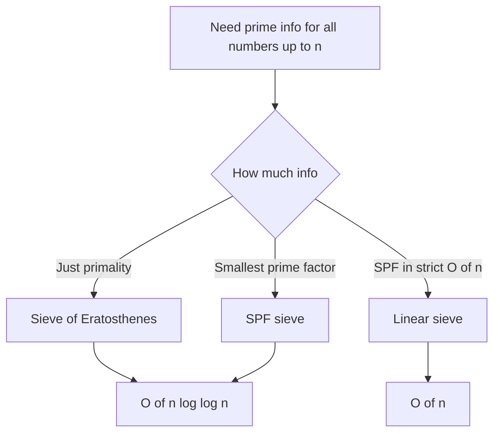
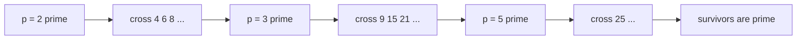
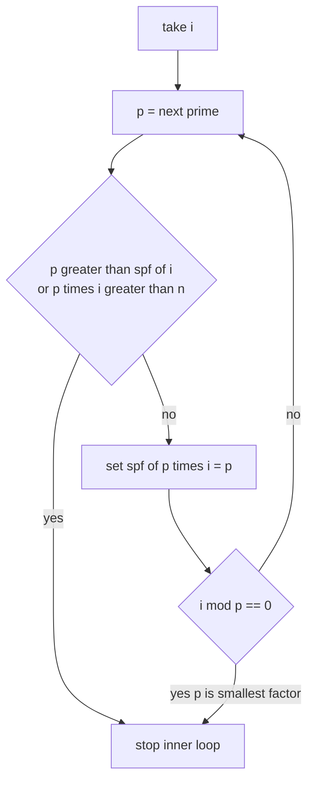

# Sieves and Factorization

Prime sieves are the backbone of competitive-programming number theory. They let us precompute, in near-linear time, *which* numbers up to $n$ are prime — and, with a small twist, the **smallest prime factor** of every number, which turns factorization into a $O(\log n)$ operation.

This guide builds up from the classic **Sieve of Eratosthenes** to the **smallest-prime-factor (SPF) sieve** and finally the **linear sieve**, with paired Python and C++ for every code sample.

## Table of Contents

- [Why Sieves](#why-sieves)
- [Sieve of Eratosthenes](#sieve-of-eratosthenes)
- [Complexity of the Sieve](#complexity-of-the-sieve)
- [Smallest Prime Factor (SPF) Sieve](#smallest-prime-factor-spf-sieve)
- [Linear Sieve](#linear-sieve)
- [Trial-Division Factorization](#trial-division-factorization)
- [Segmented Sieve (Brief)](#segmented-sieve-brief)
- [Generating vs Marking](#generating-vs-marking)
- [Complexity Summary](#complexity-summary)
- [Common Pitfalls](#common-pitfalls)
- [Patterns](#patterns)

## Why Sieves

If you need to test primality of *one* number, trial division up to $\sqrt n$ is enough. But many problems ask about *all* numbers up to $n$: count primes, factorize thousands of queries, sum divisors, compute Euler's totient for a range. A sieve answers all of those at once by sharing work across numbers.

The core idea: instead of asking "is $x$ prime?" for each $x$ independently, we **mark multiples**. Every composite number is a multiple of some prime, so if we cross out the multiples of each prime, whatever survives is prime.



## Sieve of Eratosthenes

Start by assuming every number $\ge 2$ is prime. Walk from $2$ upward. The first time you reach a number still marked prime, it *is* prime — so cross out all of its multiples. By the time you finish, only primes remain unmarked.

A key optimization: when sieving prime $p$, start crossing out at $p^2$, not $2p$. Every smaller multiple $2p, 3p, \dots, (p-1)p$ was already crossed out by a smaller prime. This is why the outer loop only needs to run while $p^2 \le n$.

**Pseudocode**

```
is_prime[0..n] = true
is_prime[0] = is_prime[1] = false
for p from 2 while p*p <= n:
    if is_prime[p]:
        for multiple from p*p to n step p:
            is_prime[multiple] = false
primes = all p with is_prime[p] == true
```

```python
def sieve(n: int) -> list[bool]:
    is_prime = [True] * (n + 1)
    is_prime[0] = is_prime[1] = False
    p = 2
    while p * p <= n:
        if is_prime[p]:
            for multiple in range(p * p, n + 1, p):
                is_prime[multiple] = False
        p += 1
    return is_prime


if __name__ == "__main__":
    flags = sieve(30)
    primes = [i for i, ok in enumerate(flags) if ok]
    print(primes)  # [2, 3, 5, 7, 11, 13, 17, 19, 23, 29]
```

```cpp
#include <bits/stdc++.h>
using namespace std;

vector<char> sieve(int n) {
    vector<char> is_prime(n + 1, true);
    is_prime[0] = is_prime[1] = false;
    for (long long p = 2; p * p <= n; ++p) {
        if (is_prime[p]) {
            for (long long multiple = p * p; multiple <= n; multiple += p)
                is_prime[multiple] = false;
        }
    }
    return is_prime;
}

int main() {
    vector<char> flags = sieve(30);
    for (int i = 0; i < (int)flags.size(); ++i)
        if (flags[i]) cout << i << ' ';
    cout << '\n';  // 2 3 5 7 11 13 17 19 23 29
    return 0;
}
```



## Complexity of the Sieve

The cost is the total number of cross-out operations. For each prime $p \le n$ we strike about $n/p$ multiples, so the total work is

$$
\sum_{p \le n} \frac{n}{p} = n \sum_{p \le n} \frac{1}{p}.
$$

The **sum of reciprocals of primes** grows like $\ln \ln n$ (Mertens' theorem):

$$
\sum_{p \le n} \frac{1}{p} \approx \ln \ln n + M,
$$

where $M \approx 0.2615$ is the Meissel–Mertens constant. Therefore the sieve runs in

$$
O(n \log \log n),
$$

which for all practical input sizes is effectively linear — $\log \log n$ is below $5$ even for $n = 10^9$.

## Smallest Prime Factor (SPF) Sieve

A small modification stores, for each number, the **smallest prime that divides it** (`spf[x]`). Once you have `spf`, factorizing any $x \le n$ is just repeatedly dividing by `spf[x]`:

$$
x = p_1 p_2 \cdots p_k, \qquad \text{each step removes one prime, so at most } \log_2 x \text{ steps.}
$$

That gives $O(\log n)$ factorization per query after an $O(n \log \log n)$ precompute.

```python
def build_spf(n: int) -> list[int]:
    spf = list(range(n + 1))  # spf[x] starts as x
    p = 2
    while p * p <= n:
        if spf[p] == p:  # p is prime
            for multiple in range(p * p, n + 1, p):
                if spf[multiple] == multiple:
                    spf[multiple] = p
        p += 1
    return spf


def factorize(x: int, spf: list[int]) -> list[int]:
    factors = []
    while x > 1:
        p = spf[x]
        while x % p == 0:
            factors.append(p)
            x //= p
    return factors


if __name__ == "__main__":
    spf = build_spf(100)
    print(factorize(84, spf))  # [2, 2, 3, 7]
```

```cpp
#include <bits/stdc++.h>
using namespace std;

vector<int> build_spf(int n) {
    vector<int> spf(n + 1);
    iota(spf.begin(), spf.end(), 0);  // spf[x] = x
    for (long long p = 2; p * p <= n; ++p) {
        if (spf[p] == p) {  // p is prime
            for (long long multiple = p * p; multiple <= n; multiple += p)
                if (spf[multiple] == multiple)
                    spf[multiple] = (int)p;
        }
    }
    return spf;
}

vector<int> factorize(int x, const vector<int>& spf) {
    vector<int> factors;
    while (x > 1) {
        int p = spf[x];
        while (x % p == 0) {
            factors.push_back(p);
            x /= p;
        }
    }
    return factors;
}

int main() {
    vector<int> spf = build_spf(100);
    for (int f : factorize(84, spf)) cout << f << ' ';
    cout << '\n';  // 2 2 3 7
    return 0;
}
```

## Linear Sieve

The Sieve of Eratosthenes strikes some composites more than once (e.g. $12$ is hit by both $2$ and $3$). The **linear sieve** guarantees every composite is struck **exactly once** — by its smallest prime factor — giving a strict $O(n)$ runtime. It also produces the list of primes and an SPF table simultaneously.

The mechanism: iterate $i$ from $2$ to $n$. Maintain a growing list of primes found so far. For each $i$, multiply it by primes $p$ from the list (smallest first), marking $p \cdot i$ as composite with smallest prime factor $p$. The crucial line is the **break condition**:

> When `i % p == 0`, mark `p * i` and then **break**.

Why break? If $p$ divides $i$, then $p$ is the smallest prime factor of $i$. For any larger prime $q$ in the list, the number $q \cdot i$ has smallest prime factor $p$ (since $p \mid i \mid q \cdot i$), not $q$. So $q \cdot i$ should be struck later by a different $i'$ with $q$ as its smallest prime — striking it now would be a duplicate. Breaking preserves the "each composite struck exactly once" invariant.

**Pseudocode**

```
spf[0..n] = 0
primes = empty list
for i from 2 to n:
    if spf[i] == 0:        # i is prime
        spf[i] = i
        append i to primes
    for p in primes:
        if p > spf[i] or p*i > n:
            break
        spf[p*i] = p
        if i % p == 0:      # p is the smallest prime factor of i
            break
```

```python
def linear_sieve(n: int) -> tuple[list[int], list[int]]:
    spf = [0] * (n + 1)
    primes: list[int] = []
    for i in range(2, n + 1):
        if spf[i] == 0:
            spf[i] = i
            primes.append(i)
        for p in primes:
            if p > spf[i] or p * i > n:
                break
            spf[p * i] = p
            if i % p == 0:
                break
    return primes, spf


if __name__ == "__main__":
    primes, spf = linear_sieve(30)
    print(primes)   # [2, 3, 5, 7, 11, 13, 17, 19, 23, 29]
    print(spf[12])  # 2
```

```cpp
#include <bits/stdc++.h>
using namespace std;

pair<vector<int>, vector<int>> linear_sieve(int n) {
    vector<int> spf(n + 1, 0);
    vector<int> primes;
    for (int i = 2; i <= n; ++i) {
        if (spf[i] == 0) {
            spf[i] = i;
            primes.push_back(i);
        }
        for (int p : primes) {
            if (p > spf[i] || (long long)p * i > n) break;
            spf[p * i] = p;
            if (i % p == 0) break;
        }
    }
    return {primes, spf};
}

int main() {
    auto [primes, spf] = linear_sieve(30);
    for (int p : primes) cout << p << ' ';
    cout << '\n';            // 2 3 5 7 11 13 17 19 23 29
    cout << spf[12] << '\n'; // 2
    return 0;
}
```

The Mermaid below shows the inner loop for a single $i$: each prime $p$ marks $p \cdot i$, and the moment $p$ divides $i$ we break.



## Trial-Division Factorization

When you only need to factor a *single* number (no range precompute), divide out primes up to $\sqrt n$. Any factor larger than $\sqrt n$ can appear at most once, so whatever remains after the loop is itself prime.

```python
def trial_factorize(n: int) -> list[int]:
    factors = []
    d = 2
    while d * d <= n:
        while n % d == 0:
            factors.append(d)
            n //= d
        d += 1
    if n > 1:
        factors.append(n)
    return factors


if __name__ == "__main__":
    print(trial_factorize(360))  # [2, 2, 2, 3, 3, 5]
```

```cpp
#include <bits/stdc++.h>
using namespace std;

vector<long long> trial_factorize(long long n) {
    vector<long long> factors;
    for (long long d = 2; d * d <= n; ++d) {
        while (n % d == 0) {
            factors.push_back(d);
            n /= d;
        }
    }
    if (n > 1) factors.push_back(n);
    return factors;
}

int main() {
    for (long long f : trial_factorize(360)) cout << f << ' ';
    cout << '\n';  // 2 2 2 3 3 5
    return 0;
}
```

This is $O(\sqrt n)$ per number — great for one query, but if you have many queries up to a fixed bound, the SPF sieve's $O(\log n)$ per query wins.

## Segmented Sieve (Brief)

When $n$ is large (say up to $10^{12}$) but you only need primes in a window $[L, R]$ with $R - L$ small, a full boolean array of size $n$ won't fit in memory. The **segmented sieve** first computes all primes up to $\sqrt R$ with an ordinary sieve, then uses them to mark composites only within $[L, R]$.

For each base prime $p \le \sqrt R$, the first multiple inside the window is $\max(p^2, \lceil L/p \rceil \cdot p)$; cross out from there in steps of $p$. The window array is indexed by offset $x - L$, so it uses only $O(R - L)$ space.

## Generating vs Marking

Two related but distinct goals:

- **Marking**: produce a boolean `is_prime[x]` (or `spf[x]`) array — random-access primality for the whole range. Use the Eratosthenes or linear sieve.
- **Generating**: produce the *list* of primes `[2, 3, 5, 7, ...]` — a compact sequence you can iterate. Often you build the marking array first, then collect indices.

If you only need the count of primes $\le n$ (the prime-counting function $\pi(n)$), marking plus a sum of the boolean array suffices — no list needed.

## Complexity Summary

| Technique | Precompute | Per query | Space |
|---|---|---|---|
| Sieve of Eratosthenes | $O(n \log \log n)$ | $O(1)$ primality | $O(n)$ |
| SPF sieve | $O(n \log \log n)$ | $O(\log n)$ factorize | $O(n)$ |
| Linear sieve | $O(n)$ | $O(\log n)$ factorize | $O(n)$ |
| Trial division | none | $O(\sqrt n)$ factorize | $O(1)$ |
| Segmented sieve | $O((R-L) \log\log R + \sqrt R)$ | — | $O(R-L + \sqrt R)$ |

## Common Pitfalls

- **Off-by-one on bounds.** Arrays must be size $n+1$ to index $n$ directly; forgetting the $+1$ causes out-of-range errors.
- **Marking from $2p$ instead of $p^2$.** Correct, but slower; the $p^2$ start is the standard optimization. Never start *above* $p^2$.
- **Integer overflow.** In C++, `p * p` and `p * i` can overflow `int` near the bounds — cast to `long long` (as shown) before comparing to $n$.
- **Treating $0$ and $1$ as prime.** Always set `is_prime[0] = is_prime[1] = false`.
- **Linear sieve without the break.** Omitting `break` on `i % p == 0` re-marks composites and breaks both the $O(n)$ guarantee and the SPF correctness.
- **Memory blowup.** A `vector<int> spf` of $10^8$ entries is ~400 MB. Use `vector<char>` for pure primality, or a segmented approach, when $n$ is huge.

## Patterns

- **Precompute once, answer many.** Whenever a problem has many primality/factorization queries within a fixed bound, build a sieve first. The amortized per-query cost collapses.
- **SPF unlocks multiplicative functions.** With `spf`, you can compute Euler's totient $\varphi$, number/sum of divisors, Möbius $\mu$, etc., in $O(\log n)$ per value, or fold them directly into the linear sieve in $O(n)$ total.
- **Count via boolean sum.** $\pi(n)$ is just the number of `true` entries — no separate counting pass logic needed beyond a sum.
- **$\sqrt n$ remainder trick.** After dividing out all factors $\le \sqrt n$, any leftover $> 1$ is automatically prime. This avoids sieving when you only factor a single value.
- **Window the range.** For huge upper bounds with a narrow region of interest, segment: sieve base primes up to $\sqrt R$, then mark only $[L, R]$.
