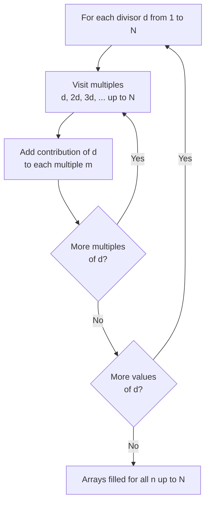

# Divisors and Number-Theoretic Functions

This guide covers how to count and sum the divisors of an integer, the family of **multiplicative functions** ($d$, $\sigma$, $\varphi$, $\mu$), and how to compute these functions for **every** integer up to $N$ using sieve techniques. We close with a brief look at sum-over-divisors / Dirichlet convolution intuition.

Everything here builds on the **prime factorization** of $n$:

$$n = p_1^{e_1} \cdot p_2^{e_2} \cdots p_k^{e_k}.$$

Once you know the exponents $e_i$, most divisor questions reduce to simple products.

## Table of Contents

- [Number of Divisors $d(n)$](#number-of-divisors-dn)
- [Sum of Divisors $\sigma(n)$](#sum-of-divisors-sigman)
- [Multiplicative Functions](#multiplicative-functions)
- [Divisor Sieve: Functions for all $n \le N$](#divisor-sieve-functions-for-all-n-le-n)
- [Linear Sieve Carrying the Smallest-Prime Exponent](#linear-sieve-carrying-the-smallest-prime-exponent)
- [Sum Over Divisors and Dirichlet Convolution](#sum-over-divisors-and-dirichlet-convolution)
- [Complexity Summary](#complexity-summary)
- [Common Pitfalls](#common-pitfalls)
- [Patterns](#patterns)

---

## Number of Divisors $d(n)$

A divisor of $n = \prod p_i^{e_i}$ is obtained by choosing, for each prime $p_i$, an exponent between $0$ and $e_i$ inclusive. That gives $e_i + 1$ independent choices per prime, so:

$$d(n) = \prod_{i=1}^{k} (e_i + 1).$$

For example $72 = 2^3 \cdot 3^2$, so $d(72) = (3+1)(2+1) = 12$.

### Pseudocode

```text
function count_divisors(n):
    result = 1
    for p from 2 while p*p <= n:
        if p divides n:
            exp = 0
            while p divides n:
                n = n / p
                exp = exp + 1
            result = result * (exp + 1)
    if n > 1:            # a leftover prime factor > sqrt
        result = result * 2
    return result
```

### Python

```python
def count_divisors(n: int) -> int:
    result = 1
    p = 2
    while p * p <= n:
        if n % p == 0:
            exp = 0
            while n % p == 0:
                n //= p
                exp += 1
            result *= exp + 1
        p += 1
    if n > 1:            # leftover prime factor larger than sqrt
        result *= 2
    return result
```

```cpp
long long count_divisors(long long n) {
    long long result = 1;
    for (long long p = 2; p * p <= n; ++p) {
        if (n % p == 0) {
            int exp = 0;
            while (n % p == 0) {
                n /= p;
                ++exp;
            }
            result *= exp + 1;
        }
    }
    if (n > 1) {         // leftover prime factor larger than sqrt
        result *= 2;
    }
    return result;
}
```

---

## Sum of Divisors $\sigma(n)$

The sum of all divisors factors the same way. For a single prime power, the divisors are $1, p, p^2, \dots, p^e$, a geometric series:

$$\sigma(p^e) = 1 + p + p^2 + \cdots + p^e = \frac{p^{e+1} - 1}{p - 1}.$$

Because the function is multiplicative (see below), the total is the product over distinct primes:

$$\sigma(n) = \prod_{i=1}^{k} \frac{p_i^{e_i + 1} - 1}{p_i - 1}.$$

For $72 = 2^3 \cdot 3^2$: $\sigma(72) = \frac{2^4 - 1}{2 - 1} \cdot \frac{3^3 - 1}{3 - 1} = 15 \cdot 13 = 195$.

### Pseudocode

```text
function sum_divisors(n):
    result = 1
    for p from 2 while p*p <= n:
        if p divides n:
            term = 1
            power = 1
            while p divides n:
                n = n / p
                power = power * p
                term = term + power      # 1 + p + p^2 + ...
            result = result * term
    if n > 1:
        result = result * (1 + n)        # leftover prime p^1
    return result
```

### Python

```python
def sum_divisors(n: int) -> int:
    result = 1
    p = 2
    while p * p <= n:
        if n % p == 0:
            term = 1
            power = 1
            while n % p == 0:
                n //= p
                power *= p
                term += power            # accumulate 1 + p + p^2 + ...
            result *= term
        p += 1
    if n > 1:
        result *= 1 + n                  # leftover prime to the first power
    return result
```

```cpp
long long sum_divisors(long long n) {
    long long result = 1;
    for (long long p = 2; p * p <= n; ++p) {
        if (n % p == 0) {
            long long term = 1, power = 1;
            while (n % p == 0) {
                n /= p;
                power *= p;
                term += power;           // accumulate 1 + p + p^2 + ...
            }
            result *= term;
        }
    }
    if (n > 1) {
        result *= 1 + n;                 // leftover prime to the first power
    }
    return result;
}
```

---

## Multiplicative Functions

A function $f$ defined on positive integers is **multiplicative** when:

$$f(1) = 1 \quad\text{and}\quad f(ab) = f(a)\,f(b) \text{ whenever } \gcd(a, b) = 1.$$

If the equality holds for **all** $a, b$ (even when they share factors), $f$ is called **completely multiplicative**.

The key consequence: a multiplicative function is fully determined by its values on prime powers, because

$$f(n) = \prod_{i=1}^{k} f\!\left(p_i^{e_i}\right).$$

The classic number-theoretic functions are all multiplicative:

| Function | Meaning | Value on $p^e$ |
| --- | --- | --- |
| $d(n)$ | number of divisors | $e + 1$ |
| $\sigma(n)$ | sum of divisors | $\dfrac{p^{e+1} - 1}{p - 1}$ |
| $\varphi(n)$ | Euler totient (count of $\le n$ coprime to $n$) | $p^{e} - p^{e-1}$ |
| $\mu(n)$ | Mobius function | $-1$ if $e=1$, else $0$ |

Recall the closed forms that follow from multiplicativity:

$$\varphi(n) = n \prod_{p \mid n} \left(1 - \frac{1}{p}\right), \qquad \mu(n) = \begin{cases} 1 & n = 1 \\ (-1)^k & n \text{ is a product of } k \text{ distinct primes} \\ 0 & n \text{ has a squared prime factor.} \end{cases}$$

Multiplicativity is what makes the **linear sieve** below able to fill in $f(n)$ for all $n$ in $O(N)$ time.

---

## Divisor Sieve: Functions for all $n \le N$

When you need a function for **every** $n$ up to $N$ (not just one value), the simplest tool is the **divisor sieve**. The idea: iterate over each candidate divisor $d$ from $1$ to $N$, then walk through all of its multiples $d, 2d, 3d, \dots$ and add a contribution.

For example, to compute $d(n)$ for all $n$ (number of divisors), every $d$ contributes $+1$ to each of its multiples:

```text
for d from 1 to N:
    for m = d, 2d, 3d, ... up to N:
        num_divisors[m] += 1
```

The inner loop runs $N/d$ times, so the total work is $\sum_{d=1}^{N} N/d \approx N \ln N$, i.e. $O(N \log N)$.



### Python

```python
def divisor_count_sieve(N: int) -> list[int]:
    # num_divisors[n] = number of divisors of n
    num_divisors = [0] * (N + 1)
    for d in range(1, N + 1):
        for m in range(d, N + 1, d):
            num_divisors[m] += 1
    return num_divisors


def divisor_sum_sieve(N: int) -> list[int]:
    # divisor_sum[n] = sigma(n) = sum of divisors of n
    divisor_sum = [0] * (N + 1)
    for d in range(1, N + 1):
        for m in range(d, N + 1, d):
            divisor_sum[m] += d
    return divisor_sum
```

```cpp
vector<long long> divisor_count_sieve(int N) {
    // num_divisors[n] = number of divisors of n
    vector<long long> num_divisors(N + 1, 0);
    for (int d = 1; d <= N; ++d) {
        for (int m = d; m <= N; m += d) {
            num_divisors[m] += 1;
        }
    }
    return num_divisors;
}

vector<long long> divisor_sum_sieve(int N) {
    // divisor_sum[n] = sigma(n) = sum of divisors of n
    vector<long long> divisor_sum(N + 1, 0);
    for (int d = 1; d <= N; ++d) {
        for (int m = d; m <= N; m += d) {
            divisor_sum[m] += d;
        }
    }
    return divisor_sum;
}
```

This pattern generalizes: replace the `+= 1` / `+= d` with any per-divisor contribution to compute other sum-over-divisors functions.

---

## Linear Sieve Carrying the Smallest-Prime Exponent

The divisor sieve is $O(N \log N)$. For multiplicative functions we can do better — $O(N)$ — with the **linear sieve**. The trick is to record, for each composite $n$, the exponent of its **smallest prime factor (spf)**, because the value of a multiplicative $f$ on $n$ is built from $f$ on the prime-power piece plus $f$ on the coprime remainder.

The standard linear sieve visits each $n$ exactly once. We maintain:

- `primes`: the primes found so far,
- `cnt[n]`: the exponent of the smallest prime factor of $n$,
- `f[n]`: the value of the multiplicative function.

When extending $n$ by a prime $p$:

- if $p \nmid n$, then $\gcd(p, n) = 1$, so $f(p \cdot n) = f(p) \cdot f(n)$ and the spf exponent of $p \cdot n$ is $1$;
- if $p \mid n$ (so $p$ is the spf of $n$), then $p \cdot n$ keeps the same smallest prime but with exponent one higher, and we rebuild $f$ from the prime-power formula.

Below we compute $d(n)$ (number of divisors) as the running example.

### Pseudocode

```text
function linear_sieve_d(N):
    d = array of size N+1
    cnt = array of size N+1        # exponent of smallest prime factor
    primes = empty list
    is_composite = array of false
    d[1] = 1
    for i from 2 to N:
        if not is_composite[i]:    # i is prime
            primes.append(i)
            d[i] = 2               # divisors: 1 and i
            cnt[i] = 1
        for p in primes:
            if i * p > N: break
            is_composite[i*p] = true
            if i mod p == 0:       # p is the smallest prime of i
                cnt[i*p] = cnt[i] + 1
                # remove old (cnt+1) factor, insert new (cnt+2)
                d[i*p] = d[i] / (cnt[i] + 1) * (cnt[i] + 2)
                break              # keep the linear-time guarantee
            else:
                cnt[i*p] = 1
                d[i*p] = d[i] * 2  # d[p] = 2 for prime p
    return d
```

### Python

```python
def linear_sieve_d(N: int) -> list[int]:
    # d[n] = number of divisors of n, computed in O(N)
    d = [0] * (N + 1)
    cnt = [0] * (N + 1)            # exponent of smallest prime factor
    is_composite = [False] * (N + 1)
    primes: list[int] = []
    d[1] = 1
    for i in range(2, N + 1):
        if not is_composite[i]:
            primes.append(i)
            d[i] = 2               # 1 and i
            cnt[i] = 1
        for p in primes:
            if i * p > N:
                break
            is_composite[i * p] = True
            if i % p == 0:
                cnt[i * p] = cnt[i] + 1
                d[i * p] = d[i] // (cnt[i] + 1) * (cnt[i] + 2)
                break              # preserve linear time
            else:
                cnt[i * p] = 1
                d[i * p] = d[i] * 2
    return d
```

```cpp
vector<long long> linear_sieve_d(int N) {
    // d[n] = number of divisors of n, computed in O(N)
    vector<long long> d(N + 1, 0);
    vector<int> cnt(N + 1, 0);     // exponent of smallest prime factor
    vector<bool> is_composite(N + 1, false);
    vector<int> primes;
    d[1] = 1;
    for (int i = 2; i <= N; ++i) {
        if (!is_composite[i]) {
            primes.push_back(i);
            d[i] = 2;              // 1 and i
            cnt[i] = 1;
        }
        for (int p : primes) {
            if ((long long)i * p > N) break;
            is_composite[i * p] = true;
            if (i % p == 0) {
                cnt[i * p] = cnt[i] + 1;
                d[i * p] = d[i] / (cnt[i] + 1) * (cnt[i] + 2);
                break;             // preserve linear time
            } else {
                cnt[i * p] = 1;
                d[i * p] = d[i] * 2;
            }
        }
    }
    return d;
}
```

The same skeleton computes $\varphi$, $\sigma$, or $\mu$ — only the update rules in the two branches change. For $\varphi$: in the coprime branch $\varphi(ip) = \varphi(i)(p-1)$, and in the divides branch $\varphi(ip) = \varphi(i)\,p$.

---

## Sum Over Divisors and Dirichlet Convolution

Many identities have the shape "$f(n)$ equals a sum over the divisors of $n$." The **Dirichlet convolution** of $f$ and $g$ is

$$(f * g)(n) = \sum_{d \mid n} f(d)\, g\!\left(\frac{n}{d}\right).$$

If both $f$ and $g$ are multiplicative, so is $f * g$. Two convolutions you already met in disguise:

$$d = \mathbf{1} * \mathbf{1}, \qquad \sigma = \mathrm{id} * \mathbf{1},$$

where $\mathbf{1}(n) = 1$ and $\mathrm{id}(n) = n$. This is exactly why the divisor sieve works: summing $\mathbf{1}$ over the divisors of $n$ (each $d$ contributing $+1$ to its multiples) yields $d(n)$, and summing $\mathrm{id}$ (each $d$ contributing $+d$) yields $\sigma(n)$.

The Mobius function is the inverse of $\mathbf{1}$ under convolution, giving the **Mobius inversion** formula:

$$g(n) = \sum_{d \mid n} f(d) \iff f(n) = \sum_{d \mid n} \mu\!\left(\frac{n}{d}\right) g(d).$$

A useful special case: $\sum_{d \mid n} \varphi(d) = n$, i.e. $\varphi * \mathbf{1} = \mathrm{id}$.

To evaluate any "$\sum_{d \mid n}$" for all $n \le N$, reuse the divisor-sieve loop: for each $d$, push its contribution onto every multiple.

---

## Complexity Summary

| Task | Time | Space |
| --- | --- | --- |
| $d(n)$ or $\sigma(n)$ for one $n$ via factorization | $O(\sqrt{n})$ | $O(1)$ |
| All $d(n), \sigma(n)$ for $n \le N$ via divisor sieve | $O(N \log N)$ | $O(N)$ |
| All multiplicative $f(n)$ for $n \le N$ via linear sieve | $O(N)$ | $O(N)$ |
| Single sum-over-divisors $\sum_{d\mid n}$ value | $O(\sqrt{n})$ | $O(1)$ |
| Sum $\sum_{i=1}^{n} d(i)$ via hyperbola trick | $O(\sqrt{n})$ | $O(1)$ |

The harmonic sum $\sum_{d=1}^{N} \lfloor N/d \rfloor = \Theta(N \log N)$ explains the divisor-sieve cost.

## Common Pitfalls

- **Forgetting the leftover prime.** In single-value factorization, after the loop `p*p <= n`, a remaining `n > 1` is a prime factor greater than $\sqrt{n}$. Multiply by $(e+1) = 2$ for $d$, or by $(1 + n)$ for $\sigma$.
- **Overflow in $\sigma$.** Sums of divisors grow fast; use `long long` in C++ (Python integers are unbounded).
- **Integer division order.** In the linear-sieve update `d[i] / (cnt[i] + 1) * (cnt[i] + 2)`, divide before multiplying; `d[i]` is always exactly divisible by `cnt[i] + 1`, so order matters only for staying in range, but write it this way to keep values exact.
- **Breaking out of the prime loop.** The `break` after the `i % p == 0` case is essential — without it the sieve is no longer linear and may double-count.
- **Off-by-one in the sieve bound.** Loop `m` up to and including `N`; allocate arrays of size `N + 1`.
- **$\mu$ and squared factors.** $\mu(n) = 0$ whenever any prime appears with exponent $\ge 2$; do not forget the zero case.

## Patterns

- **Reduce divisor questions to exponents.** Factorize once, then $d$, $\sigma$, $\varphi$ are products of per-prime terms.
- **One value vs all values.** For a single $n$, factorize in $O(\sqrt n)$. For all $n \le N$, sieve.
- **Divisor sieve for any sum-over-divisors.** "For each $d$, contribute to its multiples" computes $d$, $\sigma$, $\varphi$ totals, and arbitrary $f * \mathbf{1}$.
- **Linear sieve when $O(N\log N)$ is too slow.** Carry the smallest-prime exponent and split into coprime / divides branches.
- **Count multiples to reason about gcd.** Many "how many pairs share a divisor" problems are solved by counting how many array elements are multiples of each $d$ — see the Common Divisors problem.
- **Hyperbola trick.** $\sum_{i=1}^{n} \lfloor n/i \rfloor$ has only $O(\sqrt n)$ distinct values of $\lfloor n/i \rfloor$; exploit that for fast divisor-summatory computations.
