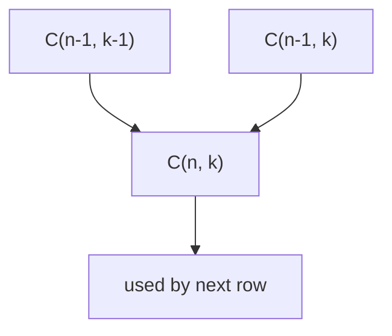
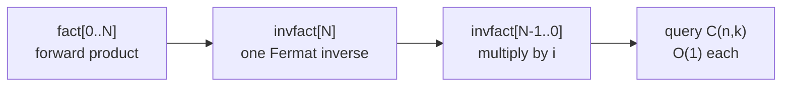
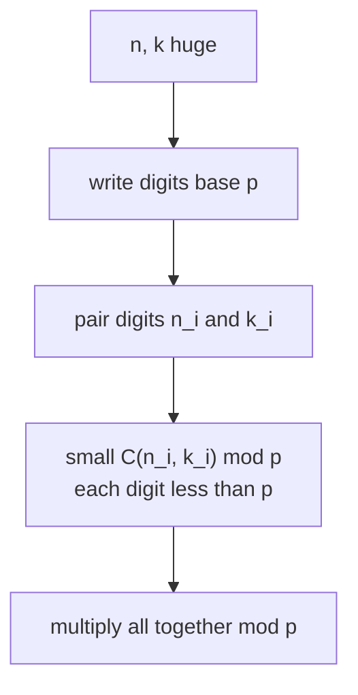

# Combinatorics: nCr mod p, Factorials + Inverse Factorials, Pascal's Triangle, Lucas' Theorem

Counting how many ways things can happen is the heart of competitive combinatorics. The single most important quantity is the **binomial coefficient** $\binom{n}{k}$ — "n choose k" — the number of ways to pick an unordered subset of size $k$ from $n$ distinct items. This guide builds it up from first principles, shows how to compute it efficiently modulo a prime, and finishes with **Lucas' theorem**, which lets you evaluate $\binom{n}{k} \bmod p$ even when $n$ has billions of digits relative to a tiny prime.

---

## Table of Contents

1. [Binomial Coefficient Definition](#binomial-coefficient-definition)
2. [Core Identities](#core-identities)
3. [Pascal's Triangle DP](#pascals-triangle-dp)
4. [nCr mod p via Factorials and Inverse Factorials](#ncr-mod-p-via-factorials-and-inverse-factorials)
5. [Stars and Bars / Multiset Coefficients](#stars-and-bars--multiset-coefficients)
6. [Lucas' Theorem](#lucas-theorem)
7. [Complexity Summary](#complexity-summary)
8. [Common Pitfalls](#common-pitfalls)
9. [Patterns](#patterns)

---

## Binomial Coefficient Definition

The binomial coefficient counts unordered selections:

$$
\binom{n}{k} = \frac{n!}{k!\,(n-k)!}, \qquad 0 \le k \le n.
$$

By convention $\binom{n}{k} = 0$ when $k < 0$ or $k > n$, and $\binom{n}{0} = \binom{n}{n} = 1$.

It is named after its appearance in the **binomial theorem**:

$$
(x + y)^n = \sum_{k=0}^{n} \binom{n}{k} x^{k} y^{\,n-k}.
$$

A naive direct evaluation of $\frac{n!}{k!(n-k)!}$ overflows quickly because factorials explode. A safer multiplicative form computes it incrementally and divides early:

```text
function binom(n, k):
    if k < 0 or k > n: return 0
    k = min(k, n - k)          # symmetry: fewer multiplications
    result = 1
    for i in 0 .. k-1:
        result = result * (n - i)
        result = result / (i + 1)   # always exact integer division here
    return result
```

```python
def binom(n: int, k: int) -> int:
    if k < 0 or k > n:
        return 0
    k = min(k, n - k)
    result = 1
    for i in range(k):
        result = result * (n - i) // (i + 1)
    return result
```

```cpp
long long binom(long long n, long long k) {
    if (k < 0 || k > n) return 0;
    k = min(k, n - k);
    long long result = 1;
    for (long long i = 0; i < k; ++i) {
        result = result * (n - i) / (i + 1);
    }
    return result;
}
```

> The order `result * (n - i) / (i + 1)` matters: after multiplying by $k$ consecutive integers, the running product is always divisible by $i+1$, so the integer division is exact. This gives exact small values without modular arithmetic, but it overflows for large $n$ — for those cases use the modular method below.

---

## Core Identities

These identities are the toolkit you reach for again and again.

### Pascal's Rule

$$
\binom{n}{k} = \binom{n-1}{k-1} + \binom{n-1}{k}.
$$

Intuition: fix one element. Either it is in the chosen subset (then pick $k-1$ more from the remaining $n-1$), or it is not (then pick all $k$ from the remaining $n-1$). This recurrence is the engine of Pascal's triangle.

### Symmetry

$$
\binom{n}{k} = \binom{n}{n-k}.
$$

Choosing which $k$ to include is the same as choosing which $n-k$ to exclude.

### Hockey Stick Identity

$$
\sum_{i=r}^{n} \binom{i}{r} = \binom{n+1}{r+1}.
$$

Summing a diagonal of Pascal's triangle gives the entry just below the end of that diagonal — the shape traced out looks like a hockey stick.

### Row Sum

$$
\sum_{k=0}^{n} \binom{n}{k} = 2^{n}.
$$

The total number of subsets of an $n$-element set.

---

## Pascal's Triangle DP

When you need **all** values $\binom{n}{k}$ for $n, k$ up to a few thousand, Pascal's rule gives a clean $O(n^2)$ table — no division, no modular inverses required.



Each entry is the sum of the two entries diagonally above it.

```text
function build_pascal(N, MOD):
    C = 2D array (N+1) x (N+1), all zeros
    for n in 0 .. N:
        C[n][0] = 1
        for k in 1 .. n:
            C[n][k] = (C[n-1][k-1] + C[n-1][k]) mod MOD
    return C
```

```python
def build_pascal(N: int, MOD: int) -> list[list[int]]:
    C = [[0] * (N + 1) for _ in range(N + 1)]
    for n in range(N + 1):
        C[n][0] = 1
        for k in range(1, n + 1):
            C[n][k] = (C[n - 1][k - 1] + C[n - 1][k]) % MOD
    return C
```

```cpp
#include <bits/stdc++.h>
using namespace std;

const long long MOD = 1e9 + 7;

vector<vector<long long>> build_pascal(int N) {
    vector<vector<long long>> C(N + 1, vector<long long>(N + 1, 0));
    for (int n = 0; n <= N; ++n) {
        C[n][0] = 1;
        for (int k = 1; k <= n; ++k) {
            C[n][k] = (C[n - 1][k - 1] + C[n - 1][k]) % MOD;
        }
    }
    return C;
}
```

The triangle's first few rows make the structure visible:

$$
\begin{array}{ccccccc}
 & & & 1 & & & \\
 & & 1 & & 1 & & \\
 & 1 & & 2 & & 1 & \\
1 & & 3 & & 3 & & 1
\end{array}
$$

Use this when $N \le 5000$ or so. Beyond that the $O(N^2)$ table is too big — switch to factorials.

---

## nCr mod p via Factorials and Inverse Factorials

This is the workhorse for $n$ up to $10^6$–$10^7$ with answers modulo a prime $p$ (commonly $p = 10^9 + 7$). The plan:

1. Precompute $\text{fact}[i] = i! \bmod p$ for all $i$ up to $N$.
2. Precompute $\text{invfact}[i] = (i!)^{-1} \bmod p$ for all $i$.
3. Answer each query in $O(1)$:

$$
\binom{n}{k} \equiv \text{fact}[n] \cdot \text{invfact}[k] \cdot \text{invfact}[n-k] \pmod p.
$$

### Modular Inverse via Fermat's Little Theorem

Because $p$ is prime, Fermat's little theorem gives $a^{p-1} \equiv 1 \pmod p$ for $a \not\equiv 0$, so

$$
a^{-1} \equiv a^{\,p-2} \pmod p.
$$

We only need **one** modular exponentiation: compute $\text{invfact}[N] = (\text{fact}[N])^{-1}$ once, then walk down using $\text{invfact}[i-1] = \text{invfact}[i] \cdot i$. This makes the whole build $O(N + \log p)$.



```text
function precompute(N, p):
    fact[0] = 1
    for i in 1 .. N: fact[i] = fact[i-1] * i mod p
    invfact[N] = power(fact[N], p-2, p)        # Fermat inverse
    for i in N down to 1: invfact[i-1] = invfact[i] * i mod p

function nCr(n, k):
    if k < 0 or k > n: return 0
    return fact[n] * invfact[k] mod p * invfact[n-k] mod p
```

```python
MOD = 10**9 + 7

def precompute(N: int, p: int = MOD):
    fact = [1] * (N + 1)
    for i in range(1, N + 1):
        fact[i] = fact[i - 1] * i % p
    invfact = [1] * (N + 1)
    invfact[N] = pow(fact[N], p - 2, p)          # one Fermat inverse
    for i in range(N, 0, -1):
        invfact[i - 1] = invfact[i] * i % p
    return fact, invfact

def nCr(n: int, k: int, fact, invfact, p: int = MOD) -> int:
    if k < 0 or k > n:
        return 0
    return fact[n] * invfact[k] % p * invfact[n - k] % p
```

```cpp
#include <bits/stdc++.h>
using namespace std;

const long long MOD = 1e9 + 7;

long long power(long long a, long long b, long long p) {
    long long result = 1 % p;
    a %= p;
    while (b > 0) {
        if (b & 1) result = result * a % p;
        a = a * a % p;
        b >>= 1;
    }
    return result;
}

vector<long long> fact, invfact;

void precompute(int N, long long p = MOD) {
    fact.assign(N + 1, 1);
    for (int i = 1; i <= N; ++i) fact[i] = fact[i - 1] * i % p;
    invfact.assign(N + 1, 1);
    invfact[N] = power(fact[N], p - 2, p);       // one Fermat inverse
    for (int i = N; i >= 1; --i) invfact[i - 1] = invfact[i] * i % p;
}

long long nCr(long long n, long long k, long long p = MOD) {
    if (k < 0 || k > n) return 0;
    return fact[n] * invfact[k] % p * invfact[n - k] % p;
}
```

> Why the downward recurrence works: $(i-1)!^{-1} = (i!)^{-1} \cdot i$ because $i! = (i-1)! \cdot i$, so inverting both sides and multiplying by $i$ gives the relation. It avoids computing $N$ separate modular exponentiations.

---

## Stars and Bars / Multiset Coefficients

Stars and bars answers: **how many ways to distribute $n$ identical items into $k$ distinct groups?**

### Nonnegative solutions

The number of nonnegative integer solutions to $x_1 + x_2 + \dots + x_k = n$ is

$$
\binom{n + k - 1}{k - 1} = \binom{n + k - 1}{n}.
$$

Picture $n$ stars in a row and $k-1$ bars inserted among them to split into $k$ groups; you are choosing positions for the bars among $n + k - 1$ slots.

### Positive solutions

If each group must receive at least one item ($x_i \ge 1$), substitute $y_i = x_i - 1 \ge 0$ to get $y_1 + \dots + y_k = n - k$, giving

$$
\binom{n - 1}{k - 1}.
$$

```text
function stars_and_bars_nonneg(n, k):    # x_i >= 0
    return nCr(n + k - 1, k - 1)

function stars_and_bars_pos(n, k):       # x_i >= 1
    if n < k: return 0
    return nCr(n - 1, k - 1)
```

```python
def stars_and_bars_nonneg(n, k, fact, invfact):
    return nCr(n + k - 1, k - 1, fact, invfact)

def stars_and_bars_pos(n, k, fact, invfact):
    if n < k:
        return 0
    return nCr(n - 1, k - 1, fact, invfact)
```

```cpp
long long stars_and_bars_nonneg(long long n, long long k) {
    return nCr(n + k - 1, k - 1);
}

long long stars_and_bars_pos(long long n, long long k) {
    if (n < k) return 0;
    return nCr(n - 1, k - 1);
}
```

The number $\binom{n+k-1}{n}$ is also called the **multiset coefficient** $\left(\!\binom{k}{n}\!\right)$: the number of size-$n$ multisets drawn from $k$ types.

---

## Lucas' Theorem

The factorial method needs $\text{fact}[n]$, so it only works when $n$ is small enough to precompute (up to $\sim 10^7$). What if $n$ and $k$ are astronomically large but the modulus $p$ is a **small prime**? Lucas' theorem reduces the giant problem to a product of tiny binomials.

### Statement

Write $n$ and $k$ in base $p$:

$$
n = n_m p^m + \dots + n_1 p + n_0, \qquad k = k_m p^m + \dots + k_1 p + k_0,
$$

where each digit satisfies $0 \le n_i, k_i < p$. Then

$$
\binom{n}{k} \equiv \prod_{i=0}^{m} \binom{n_i}{k_i} \pmod{p}.
$$

A useful corollary: $\binom{n}{k} \equiv 0 \pmod p$ if and only if at least one base-$p$ digit of $k$ exceeds the corresponding digit of $n$ (i.e. some $k_i > n_i$).



Each small $\binom{n_i}{k_i}$ has both arguments below $p$, so we precompute factorials up to $p-1$ and reuse the $O(1)$ query.

```text
function lucas(n, k, p):
    if k == 0: return 1
    ni = n mod p
    ki = k mod p
    if ki > ni: return 0
    small = fact[ni] * invfact[ki] mod p * invfact[ni - ki] mod p
    return small * lucas(n / p, k / p, p) mod p
```

```python
def lucas(n: int, k: int, p: int, fact, invfact) -> int:
    if k == 0:
        return 1
    ni, ki = n % p, k % p
    if ki > ni:
        return 0
    small = fact[ni] * invfact[ki] % p * invfact[ni - ki] % p
    return small * lucas(n // p, k // p, p, fact, invfact) % p
```

```cpp
#include <bits/stdc++.h>
using namespace std;

long long lucas(long long n, long long k, long long p) {
    if (k == 0) return 1;
    long long ni = n % p, ki = k % p;
    if (ki > ni) return 0;
    long long small = fact[ni] * invfact[ki] % p * invfact[ni - ki] % p;
    return small * lucas(n / p, k / p, p) % p;
}
```

Here `fact` / `invfact` are precomputed only up to $p-1$, so this works even for $n, k \sim 10^{18}$ as long as $p$ is small (say $p \le 10^6$). The recursion depth is $\log_p n$.

---

## Complexity Summary

| Method | Precompute | Per query | Best when |
| --- | --- | --- | --- |
| Multiplicative (no mod) | $O(1)$ | $O(k)$ | tiny exact values, no overflow |
| Pascal's triangle DP | $O(N^2)$ time, $O(N^2)$ space | $O(1)$ | $N \le 5000$, need a full table |
| Factorials + inverse factorials | $O(N + \log p)$ | $O(1)$ | $n \le 10^7$, prime modulus |
| Lucas' theorem | $O(p)$ | $O(\log_p n)$ | huge $n,k$, small prime $p$ |

Memory: Pascal needs $O(N^2)$; the factorial table needs $O(N)$; Lucas needs only $O(p)$.

---

## Common Pitfalls

- **Forgetting the $k < 0$ or $k > n$ guard.** Indexing `fact[n - k]` with a negative or out-of-range value crashes or returns garbage; always return $0$ first.
- **Doing modular division by `/`.** Division is not valid mod $p$. Multiply by the modular inverse instead.
- **Computing $N$ separate inverses.** Use the single Fermat inverse of $\text{fact}[N]$ plus the downward recurrence; computing `pow(fact[i], p-2)` for every $i$ is $O(N \log p)$ and needlessly slow.
- **Applying the factorial method when $n > N$.** If $n$ exceeds your precomputed range you get an out-of-bounds read. For huge $n$ with small prime, switch to Lucas.
- **Using Lucas with a composite modulus.** Plain Lucas requires $p$ prime. For prime-power moduli you need the generalized (Andrew Granville / Lucas–Andrew) version.
- **Integer overflow in C++.** Multiplying two values near $10^9$ overflows 32-bit `int`. Use `long long` and reduce mod $p$ after every multiplication.
- **Off-by-one in stars and bars.** Distinguish "at least zero" ($\binom{n+k-1}{k-1}$) from "at least one" ($\binom{n-1}{k-1}$); picking the wrong one is the classic mistake.

---

## Patterns

- **"Count arrangements / selections modulo $10^9+7$"** → precompute factorials + inverse factorials, answer with $\binom{n}{k}$ in $O(1)$.
- **"Distribute identical items into groups" / "nonnegative integer solutions"** → stars and bars, $\binom{n+k-1}{k-1}$.
- **"Number of paths on a grid moving right/down"** → $\binom{r+c}{r}$, a direct binomial.
- **"$\binom{n}{k} \bmod p$ with $n$ up to $10^{18}$ and $p$ a small prime"** → Lucas' theorem on base-$p$ digits.
- **"Need every $\binom{n}{k}$ for small $n$"** → Pascal's triangle table, no inverses needed.
- **"Sum of a diagonal of binomials"** → hockey stick identity collapses it to a single term.
