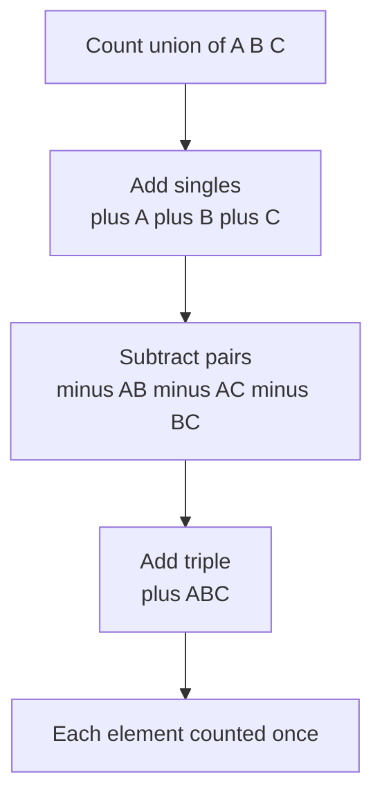
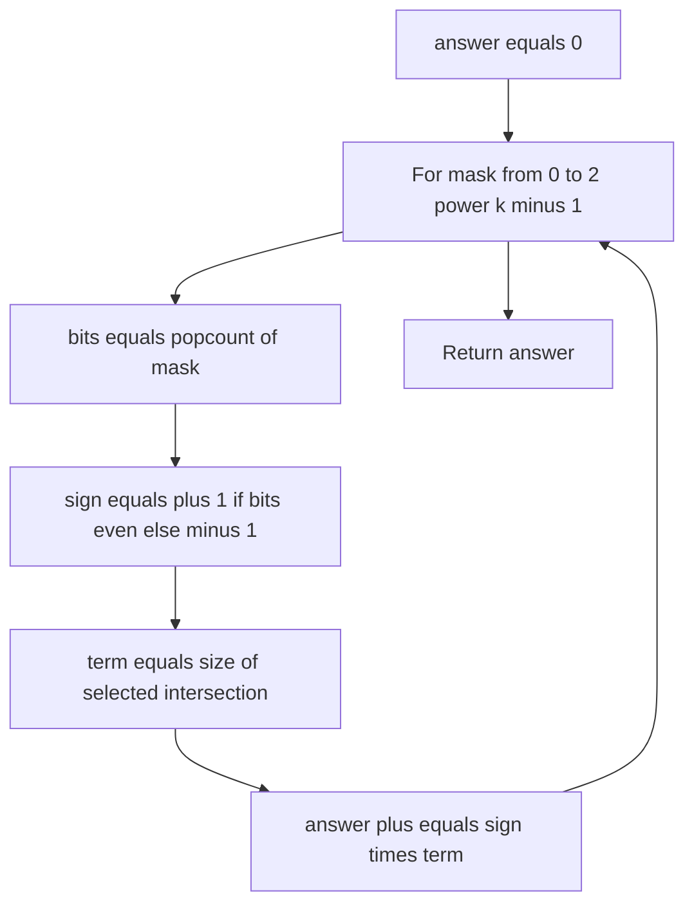

# Inclusion-Exclusion Principle

The **inclusion-exclusion principle** (IE) is a counting technique for finding the size of a union of sets when the sets overlap. Naively adding the sizes of overlapping sets double-counts the elements in their intersections. IE fixes this by alternately **adding** and **subtracting** the sizes of intersections so that every element is counted exactly once.

It is one of the most reusable ideas in combinatorics: counting numbers divisible by some primes, counting coprime integers, derangements, surjections, and many "count things satisfying *at least one* / *none* of these properties" problems all reduce to a single inclusion-exclusion sum.

## Table of Contents

- [The Idea: Two and Three Sets](#the-idea-two-and-three-sets)
- [The General Formula](#the-general-formula)
- [Subset-Sum Enumeration Over Bitmasks](#subset-sum-enumeration-over-bitmasks)
- [Counting Integers Divisible by None of a Set of Primes](#counting-integers-divisible-by-none-of-a-set-of-primes)
- [Complementary Counting](#complementary-counting)
- [Surjections and Derangements](#surjections-and-derangements)
- [Complexity Summary](#complexity-summary)
- [Common Pitfalls](#common-pitfalls)
- [Patterns](#patterns)

## The Idea: Two and Three Sets

For two sets the overlap is counted twice when we add sizes, so we subtract it once:

$$|A \cup B| = |A| + |B| - |A \cap B|$$

For three sets, subtracting all pairwise intersections removes the triple overlap one time too many, so we add it back:

$$|A \cup B \cup C| = |A| + |B| + |C| - |A \cap B| - |A \cap C| - |B \cap C| + |A \cap B \cap C|$$

The diagram below shows the alternating pattern of signs by the **size of the intersection** for three sets.



The sign rule is: a term that intersects $k$ sets gets sign $(-1)^{k+1}$ (positive for odd $k$, negative for even $k$).

## The General Formula

For $n$ finite sets $A_1, A_2, \ldots, A_n$:

$$\left| \bigcup_{i=1}^{n} A_i \right| = \sum_{i} |A_i| - \sum_{i<j} |A_i \cap A_j| + \sum_{i<j<k} |A_i \cap A_j \cap A_k| - \cdots + (-1)^{n+1} \left| \bigcap_{i=1}^{n} A_i \right|$$

Compactly, summing over every non-empty subset $S \subseteq \{1, \ldots, n\}$:

$$\left| \bigcup_{i=1}^{n} A_i \right| = \sum_{\emptyset \neq S \subseteq \{1,\dots,n\}} (-1)^{|S|+1} \left| \bigcap_{i \in S} A_i \right|$$

The complement form (counting elements in **none** of the sets, inside a universe $U$) is often more convenient:

$$\left| \overline{A_1} \cap \cdots \cap \overline{A_n} \right| = \sum_{S \subseteq \{1,\dots,n\}} (-1)^{|S|} \left| \bigcap_{i \in S} A_i \right|$$

Here the empty subset $S = \emptyset$ contributes $+|U|$.

## Subset-Sum Enumeration Over Bitmasks

When there are $k$ sets, IE is a sum over all $2^k$ subsets. We represent each subset as a bitmask from $0$ to $2^k - 1$; the **sign** of a subset is determined by the parity of its **popcount** (number of set bits).

Pseudocode (counting elements in none of the sets):

```
answer = 0
for mask in 0 .. 2^k - 1:
    bits = popcount(mask)
    sign = (bits even) ? +1 : -1
    term = sizeOfIntersection(mask)   # |intersection of chosen sets|
    answer += sign * term
return answer
```

```python
def inclusion_exclusion(k, intersection_size):
    """Count elements in none of the k sets within a universe.

    intersection_size(mask) returns the size of the intersection of the
    sets selected by mask (mask == 0 means the whole universe).
    """
    answer = 0
    for mask in range(1 << k):
        bits = bin(mask).count("1")
        sign = 1 if bits % 2 == 0 else -1
        answer += sign * intersection_size(mask)
    return answer
```

```cpp
#include <bits/stdc++.h>
using namespace std;

// intersection_size(mask) returns the size of the intersection of the
// sets selected by mask (mask == 0 means the whole universe).
long long inclusionExclusion(int k, const function<long long(int)>& intersectionSize) {
    long long answer = 0;
    for (int mask = 0; mask < (1 << k); ++mask) {
        int bits = __builtin_popcount(mask);
        long long sign = (bits % 2 == 0) ? 1 : -1;
        answer += sign * intersectionSize(mask);
    }
    return answer;
}
```

The flow of the bitmask loop:



## Counting Integers Divisible by None of a Set of Primes

A classic application: given distinct primes $p_1, \ldots, p_k$, count integers in $[1, n]$ divisible by **none** of them (i.e. coprime to their product). The number of integers in $[1, n]$ divisible by a value $d$ is $\lfloor n / d \rfloor$. For a subset $S$ of primes, the count divisible by **all** of them is $\lfloor n / \prod_{i \in S} p_i \rfloor$ because the primes are pairwise coprime.

So the count of integers in $[1, n]$ divisible by none of the primes is:

$$\sum_{S \subseteq \{1,\dots,k\}} (-1)^{|S|} \left\lfloor \frac{n}{\prod_{i \in S} p_i} \right\rfloor$$

```python
def count_coprime_to_primes(n, primes):
    """Count integers in [1, n] divisible by none of the given distinct primes."""
    k = len(primes)
    answer = 0
    for mask in range(1 << k):
        product = 1
        bits = 0
        for i in range(k):
            if mask & (1 << i):
                product *= primes[i]
                bits += 1
        sign = 1 if bits % 2 == 0 else -1
        answer += sign * (n // product)
    return answer
```

```cpp
#include <bits/stdc++.h>
using namespace std;

// Count integers in [1, n] divisible by none of the given distinct primes.
long long countCoprimeToPrimes(long long n, const vector<long long>& primes) {
    int k = (int)primes.size();
    long long answer = 0;
    for (int mask = 0; mask < (1 << k); ++mask) {
        long long product = 1;
        int bits = 0;
        for (int i = 0; i < k; ++i) {
            if (mask & (1 << i)) {
                product *= primes[i];
                ++bits;
            }
        }
        long long sign = (bits % 2 == 0) ? 1 : -1;
        answer += sign * (n / product);
    }
    return answer;
}
```

If instead you want integers divisible by **at least one** prime, subtract the coprime count from $n$, or use the $(-1)^{|S|+1}$ form over non-empty subsets directly.

## Complementary Counting

Often the easiest path is to count the **complement**: instead of counting elements with *at least one* forbidden property, count the total and subtract those with *none*, or vice versa. This is exactly the relationship

$$\left| \bigcup_i A_i \right| = |U| - \left| \overline{A_1} \cap \cdots \cap \overline{A_n} \right|.$$

For example, "how many integers in $[1, n]$ share a common factor with $m$" is most easily computed as $n$ minus the count coprime to $m$. The coprime count itself is an IE sum over the **distinct prime factors** of $m$:

$$\varphi\text{-style count} = \sum_{S \subseteq P} (-1)^{|S|} \left\lfloor \frac{n}{\prod_{p \in S} p} \right\rfloor, \quad P = \{\text{distinct primes of } m\}.$$

```python
def factorize_primes(m):
    """Return the distinct prime factors of m."""
    primes = []
    d = 2
    while d * d <= m:
        if m % d == 0:
            primes.append(d)
            while m % d == 0:
                m //= d
        d += 1
    if m > 1:
        primes.append(m)
    return primes
```

```cpp
#include <bits/stdc++.h>
using namespace std;

// Return the distinct prime factors of m.
vector<long long> factorizePrimes(long long m) {
    vector<long long> primes;
    for (long long d = 2; d * d <= m; ++d) {
        if (m % d == 0) {
            primes.push_back(d);
            while (m % d == 0) m /= d;
        }
    }
    if (m > 1) primes.push_back(m);
    return primes;
}
```

## Surjections and Derangements

**Surjections.** The number of functions from an $n$-element set onto an $m$-element set (every target hit at least once) is found by IE over which targets are *missed*:

$$\text{Surj}(n, m) = \sum_{j=0}^{m} (-1)^j \binom{m}{j} (m - j)^n.$$

Here $A_i$ is the set of functions that miss target $i$; we count functions in none of the $A_i$.

**Derangements.** A derangement is a permutation with no fixed point. Let $A_i$ be permutations fixing position $i$, so $|A_i \cap \cdots| = (n - |S|)!$ for any subset $S$ of positions. IE gives the closed form:

$$D_n = n! \sum_{k=0}^{n} \frac{(-1)^k}{k!} = \sum_{k=0}^{n} (-1)^k \binom{n}{k} (n - k)!$$

with the convenient recurrence $D_n = (n-1)(D_{n-1} + D_{n-2})$ and base cases $D_0 = 1$, $D_1 = 0$.

```python
def derangements(n, mod=10**9 + 7):
    """Number of permutations of n elements with no fixed point, modulo mod."""
    d0, d1 = 1, 0
    if n == 0:
        return d0 % mod
    for i in range(2, n + 1):
        d0, d1 = d1, ((i - 1) * (d1 + d0)) % mod
    return d1 % mod
```

```cpp
#include <bits/stdc++.h>
using namespace std;

const long long MOD = 1e9 + 7;

// Number of permutations of n elements with no fixed point, modulo MOD.
long long derangements(int n) {
    long long d0 = 1, d1 = 0;
    if (n == 0) return d0 % MOD;
    for (int i = 2; i <= n; ++i) {
        long long next = ((long long)(i - 1) * ((d1 + d0) % MOD)) % MOD;
        d0 = d1;
        d1 = next;
    }
    return d1 % MOD;
}
```

## Complexity Summary

| Task | Time | Space |
| --- | --- | --- |
| IE over $k$ sets (bitmask), $O(1)$ intersection | $O(2^k)$ | $O(1)$ |
| IE over $k$ sets, $O(k)$ per subset to build product | $O(k \cdot 2^k)$ | $O(1)$ |
| Coprime count over $k$ distinct primes | $O(k \cdot 2^k)$ | $O(k)$ |
| Factorize $m$ into distinct primes | $O(\sqrt{m})$ | $O(\log m)$ |
| Derangements / surjections via recurrence | $O(n)$ | $O(1)$ |
| Surjection direct IE sum | $O(m \log n)$ | $O(1)$ |

## Common Pitfalls

- **Wrong sign convention.** For the *union* form use $(-1)^{|S|+1}$ over non-empty subsets; for the *complement / none* form use $(-1)^{|S|}$ including the empty subset. Mixing them flips the answer.
- **Forgetting the empty subset.** In the complement form, $S = \emptyset$ contributes $+|U|$ (e.g. $+n$). Dropping it is a common off-by-everything error.
- **Non-coprime "primes."** The trick $\lfloor n / \prod p_i \rfloor$ for joint divisibility requires the factors to be **pairwise coprime**. With arbitrary divisors you must use $\text{lcm}$ instead of the product.
- **Overflow.** The product of several primes can exceed 32-bit range; use `long long` and guard the product (or skip a subset once the product exceeds $n$, since $\lfloor n / \text{product} \rfloor = 0$).
- **Exponential blowup.** $2^k$ grows fast; IE over bitmasks is only practical for small $k$ (roughly $k \le 20$–$25$).
- **Repeated prime factors.** When deriving primes from $m$, use **distinct** primes only; including a prime twice double-counts.

## Patterns

- **"At least one" vs "none."** If the problem says *at least one* property holds, compute the union directly, or compute the complement (none) and subtract from the universe — whichever intersection is easier to size.
- **Bitmask sign = popcount parity.** Iterate `mask` from $0$ to $2^k - 1$, take `popcount`, and let the parity decide the sign. This template covers most small-$k$ IE problems.
- **Divisibility ⇒ floor division.** Counting multiples of a value $d$ in $[1, n]$ is $\lfloor n/d \rfloor$; joint divisibility by coprime values uses the product.
- **Coprimality ⇒ IE over prime factors.** Counting integers coprime to $m$ in a range is IE over the distinct primes of $m$ (a finite, exact Euler-$\varphi$ generalization).
- **"No object in its forbidden place" ⇒ derangement-style IE.** Define $A_i$ as "object $i$ is in a forbidden state," then count the intersection of complements.
- **Surjection / onto counting ⇒ IE over missed targets.** Subtract configurations that skip at least one required value.
