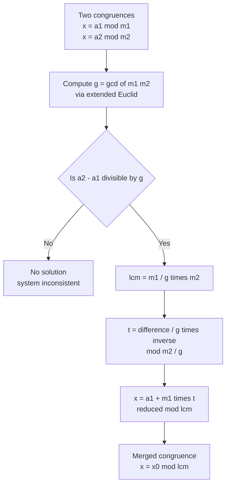

# Euler's Totient Function and the Chinese Remainder Theorem

This guide covers two cornerstone tools of elementary number theory used constantly in competitive programming: **Euler's totient function** $\varphi(n)$ and the **Chinese Remainder Theorem (CRT)**. The totient counts integers coprime to $n$ and powers modular-exponent reductions; CRT lets us stitch together congruences modulo different moduli into a single congruence. Together they solve a huge class of counting, modular-arithmetic, and reconstruction problems.

## Table of Contents

- [Euler's Totient Function](#eulers-totient-function)
  - [Definition and Formula](#definition-and-formula)
  - [Single-Value Computation in O(sqrt n)](#single-value-computation-in-osqrt-n)
  - [Totient Sieve for All n up to N](#totient-sieve-for-all-n-up-to-n)
  - [Properties](#properties)
- [Euler's Theorem](#eulers-theorem)
  - [Coprime Case](#coprime-case)
  - [Generalized Exponent Reduction](#generalized-exponent-reduction)
- [Chinese Remainder Theorem](#chinese-remainder-theorem)
  - [Two Congruences](#two-congruences)
  - [General k-Congruence Merge](#general-k-congruence-merge)
  - [Non-Coprime and Consistency](#non-coprime-and-consistency)
- [Complexity Summary](#complexity-summary)
- [Common Pitfalls](#common-pitfalls)
- [Patterns](#patterns)

## Euler's Totient Function

### Definition and Formula

Euler's totient function $\varphi(n)$ counts the integers in $\{1, 2, \dots, n\}$ that are **coprime** to $n$ (i.e. share no common prime factor). For example $\varphi(1)=1$, $\varphi(6)=2$ (only $1$ and $5$), and $\varphi(p)=p-1$ for any prime $p$.

The closed form uses the distinct prime factors of $n$:

$$\varphi(n) = n \prod_{p \mid n} \left(1 - \frac{1}{p}\right)$$

If $n = p_1^{a_1} p_2^{a_2} \cdots p_k^{a_k}$ then equivalently

$$\varphi(n) = \prod_{i=1}^{k} p_i^{a_i - 1} (p_i - 1).$$

The function is **multiplicative**: if $\gcd(m, n) = 1$ then $\varphi(mn) = \varphi(m)\,\varphi(n)$.

### Single-Value Computation in O(sqrt n)

To compute one value $\varphi(n)$, factor $n$ by trial division up to $\sqrt n$. For each distinct prime factor $p$, multiply the running result by $(1 - 1/p)$, which we apply integer-safely as `result -= result / p`.

Pseudocode:

```
function phi(n):
    result = n
    p = 2
    while p * p <= n:
        if n % p == 0:
            while n % p == 0:
                n = n / p
            result -= result / p
        p += 1
    if n > 1:                 # leftover prime factor > sqrt(original n)
        result -= result / n
    return result
```

```python
def phi(n: int) -> int:
    result = n
    p = 2
    while p * p <= n:
        if n % p == 0:
            while n % p == 0:
                n //= p
            result -= result // p
        p += 1
    if n > 1:
        result -= result // n
    return result
```

```cpp
long long phi(long long n) {
    long long result = n;
    for (long long p = 2; p * p <= n; ++p) {
        if (n % p == 0) {
            while (n % p == 0) n /= p;
            result -= result / p;
        }
    }
    if (n > 1) result -= result / n;
    return result;
}
```

### Totient Sieve for All n up to N

When many values are needed, build a sieve in $O(N \log \log N)$ by initializing $\varphi[i] = i$ and, for each prime $p$, multiplying the factor $(1 - 1/p)$ into every multiple of $p$.

```
function totient_sieve(N):
    phi = [0..N]            # phi[i] = i initially
    for i in 2..N:
        if phi[i] == i:     # i is prime (untouched)
            for j in i, 2i, 3i, ... up to N:
                phi[j] -= phi[j] / i
    return phi
```

```python
def totient_sieve(N: int) -> list[int]:
    phi = list(range(N + 1))
    for i in range(2, N + 1):
        if phi[i] == i:          # i is prime
            for j in range(i, N + 1, i):
                phi[j] -= phi[j] // i
    return phi
```

```cpp
vector<long long> totient_sieve(int N) {
    vector<long long> phi(N + 1);
    for (int i = 0; i <= N; ++i) phi[i] = i;
    for (int i = 2; i <= N; ++i) {
        if (phi[i] == i) {       // i is prime
            for (int j = i; j <= N; j += i)
                phi[j] -= phi[j] / i;
        }
    }
    return phi;
}
```

### Properties

A key identity is the **divisor sum**: summing the totient over all divisors of $n$ recovers $n$ itself.

$$\sum_{d \mid n} \varphi(d) = n$$

For instance with $n = 12$, the divisors are $1,2,3,4,6,12$ and $\varphi$ values $1,1,2,2,2,4$ sum to $12$. Other useful facts:

- $\varphi(p^a) = p^a - p^{a-1}$ for prime $p$.
- $\varphi(n)$ is even for all $n > 2$.
- For $n > 1$, the sum of integers in $[1, n]$ coprime to $n$ equals $n \cdot \varphi(n) / 2$.

## Euler's Theorem

### Coprime Case

If $\gcd(a, n) = 1$, then

$$a^{\varphi(n)} \equiv 1 \pmod{n}.$$

This generalizes Fermat's little theorem ($a^{p-1} \equiv 1 \pmod p$ for prime $p$). The practical consequence: exponents can be reduced modulo $\varphi(n)$ when the base is coprime to the modulus.

$$a^{e} \equiv a^{\,e \bmod \varphi(n)} \pmod{n}, \qquad \gcd(a, n) = 1.$$

### Generalized Exponent Reduction

When $a$ and $n$ are **not** coprime, the plain reduction is invalid. The generalized form (valid for any $a$) handles large exponents $e$:

$$a^{e} \equiv a^{\,\varphi(n) + (e \bmod \varphi(n))} \pmod{n}, \qquad e \ge \log_2 n.$$

The condition $e \ge \log_2 n$ (a sufficient threshold $e \ge \varphi(n)$ also works) guards the case where small exponents must be computed directly. This is the form used for towers of exponents and "$a^{a^{a^{\cdots}}} \bmod n$" problems.

```python
def euler_phi(n: int) -> int:
    result, m = n, n
    p = 2
    while p * p <= m:
        if m % p == 0:
            while m % p == 0:
                m //= p
            result -= result // p
        p += 1
    if m > 1:
        result -= result // m
    return result

def power_mod(a: int, e: int, mod: int) -> int:
    a %= mod
    res = 1
    while e > 0:
        if e & 1:
            res = res * a % mod
        a = a * a % mod
        e >>= 1
    return res

def generalized_pow(a: int, e: int, mod: int) -> int:
    ph = euler_phi(mod)
    if e >= ph:
        e = e % ph + ph          # reduce, keep above threshold
    return power_mod(a, e, mod)
```

```cpp
long long euler_phi(long long n) {
    long long result = n, m = n;
    for (long long p = 2; p * p <= m; ++p) {
        if (m % p == 0) {
            while (m % p == 0) m /= p;
            result -= result / p;
        }
    }
    if (m > 1) result -= result / m;
    return result;
}

long long power_mod(long long a, long long e, long long mod) {
    a %= mod;
    long long res = 1 % mod;
    while (e > 0) {
        if (e & 1) res = res * a % mod;
        a = a * a % mod;
        e >>= 1;
    }
    return res;
}

long long generalized_pow(long long a, long long e, long long mod) {
    long long ph = euler_phi(mod);
    if (e >= ph) e = e % ph + ph;   // reduce, keep above threshold
    return power_mod(a, e, mod);
}
```

## Chinese Remainder Theorem

The CRT answers: given several congruences with different moduli, is there an $x$ satisfying all of them simultaneously, and if so what is it?

### Two Congruences

Suppose we want $x$ with

$$x \equiv a_1 \pmod{m_1}, \qquad x \equiv a_2 \pmod{m_2}.$$

When $\gcd(m_1, m_2) = 1$, a unique solution exists modulo $M = m_1 m_2$. Write $x = a_1 + m_1 t$. Substituting into the second congruence gives

$$a_1 + m_1 t \equiv a_2 \pmod{m_2} \implies m_1 t \equiv a_2 - a_1 \pmod{m_2}.$$

Find $m_1^{-1} \pmod{m_2}$ via the extended Euclidean algorithm, solve for $t$, then $x = a_1 + m_1 t \bmod M$.



### General k-Congruence Merge

For a system $x \equiv a_i \pmod{m_i}$, $i = 1, \dots, k$, fold the congruences one at a time: keep a running solution $(a, m)$ and merge each new $(a_i, m_i)$ into it. The merged modulus becomes $\operatorname{lcm}(m, m_i)$.

```
function crt_merge(a1, m1, a2, m2):
    (g, p, q) = ext_gcd(m1, m2)        # p is m1's cofactor
    diff = a2 - a1
    if diff mod g != 0:
        return INCONSISTENT
    lcm = m1 / g * m2
    t = (diff / g) * p  mod (m2 / g)
    x = (a1 + m1 * t) mod lcm
    return (x, lcm)
```

```python
def ext_gcd(a: int, b: int) -> tuple[int, int, int]:
    if b == 0:
        return a, 1, 0
    g, x, y = ext_gcd(b, a % b)
    return g, y, x - (a // b) * y

def crt_merge(a1: int, m1: int, a2: int, m2: int):
    g, p, _ = ext_gcd(m1, m2)
    diff = a2 - a1
    if diff % g != 0:
        return None                      # inconsistent
    lcm = m1 // g * m2
    mod = m2 // g
    t = (diff // g) % mod * (p % mod) % mod
    x = (a1 + m1 * t) % lcm
    return x % lcm, lcm

def crt_system(rem: list[int], mod: list[int]):
    a, m = 0, 1
    for ai, mi in zip(rem, mod):
        merged = crt_merge(a, m, ai % mi, mi)
        if merged is None:
            return None
        a, m = merged
    return a, m
```

```cpp
array<long long, 3> ext_gcd(long long a, long long b) {
    if (b == 0) return {a, 1, 0};
    auto r = ext_gcd(b, a % b);
    long long g = r[0], x = r[1], y = r[2];
    return {g, y, x - (a / b) * y};
}

// Returns {x, lcm}; lcm == -1 signals inconsistency.
pair<long long, long long> crt_merge(long long a1, long long m1,
                                     long long a2, long long m2) {
    auto r = ext_gcd(m1, m2);
    long long g = r[0], p = r[1];
    long long diff = a2 - a1;
    if (diff % g != 0) return {0, -1};   // inconsistent
    long long lcm = m1 / g * m2;
    long long mod = m2 / g;
    // use __int128 to avoid overflow in the products below
    long long t = (long long)(((__int128)(diff / g) % mod
                  * ((p % mod + mod) % mod)) % mod);
    long long x = (long long)(((__int128)m1 * t + a1) % lcm);
    x = ((x % lcm) + lcm) % lcm;
    return {x, lcm};
}

pair<long long, long long> crt_system(const vector<long long>& rem,
                                      const vector<long long>& mod) {
    long long a = 0, m = 1;
    for (size_t i = 0; i < rem.size(); ++i) {
        long long ai = ((rem[i] % mod[i]) + mod[i]) % mod[i];
        auto merged = crt_merge(a, m, ai, mod[i]);
        if (merged.second == -1) return {0, -1};
        a = merged.first;
        m = merged.second;
    }
    return {a, m};
}
```

### Non-Coprime and Consistency

When $\gcd(m_1, m_2) = g > 1$, a solution exists **iff** $a_1 \equiv a_2 \pmod g$, i.e. $g \mid (a_2 - a_1)$. If that holds, the merged modulus is $\operatorname{lcm}(m_1, m_2) = m_1 m_2 / g$ and the solution is unique modulo that lcm. If it fails, the system is inconsistent and has no solution. The merge code above checks exactly this with `diff % g != 0`.

The product $m_1 \cdot t$ and intermediate terms can overflow 64-bit integers even when the final modulus fits, so the C++ code uses `__int128` for the multiplications.

## Complexity Summary

| Operation | Time | Space |
| --- | --- | --- |
| Single $\varphi(n)$ (trial division) | $O(\sqrt n)$ | $O(1)$ |
| Totient sieve up to $N$ | $O(N \log \log N)$ | $O(N)$ |
| Modular exponentiation | $O(\log e)$ | $O(1)$ |
| Extended Euclid / one CRT merge | $O(\log \max(m_1, m_2))$ | $O(1)$ |
| CRT over $k$ congruences | $O(k \log M)$ | $O(1)$ |

Here $M$ is the final (lcm) modulus.

## Common Pitfalls

- **Applying $a^e \equiv a^{e \bmod \varphi(n)}$ when $\gcd(a,n)\neq 1$.** Use the generalized form with the $+\varphi(n)$ offset instead.
- **Integer division order in the totient formula.** Compute `result -= result / p` (the running result is divisible by $p$) rather than `result * (p-1) / p` on the original, to avoid truncation surprises; keep the factor application after dividing out all copies of $p$.
- **Overflow in CRT.** $m_1 \cdot t$ can exceed 64 bits; use `__int128` in C++ (Python is arbitrary precision).
- **Negative remainders.** Always normalize with `((x % m) + m) % m`, especially after subtracting `a1` from `a2`.
- **Forgetting the consistency check** for non-coprime moduli — silently returning a wrong $x$ instead of reporting "no solution".
- **Treating $\varphi$ as additive.** It is multiplicative only for coprime arguments, not in general.

## Patterns

- **Exponent reduction:** any "compute $a^{\text{huge}} \bmod n$" reduces the exponent via Euler's theorem (coprime) or its generalization (non-coprime / power towers).
- **Counting coprime residues:** $\varphi(n)$ directly counts fractions in lowest terms with denominator $n$, Farey sequence sizes, and orders of cyclic groups $(\mathbb{Z}/n\mathbb{Z})^\times$.
- **Divisor-sum tricks:** $\sum_{d\mid n}\varphi(d)=n$ underlies many summation identities and Dirichlet-convolution arguments.
- **Reconstruction via CRT:** recover a number from its remainders (hashing with multiple moduli, calendar/cycle alignment, big-integer multiplication via NTT with several primes).
- **Iterative merge:** always fold a system of congruences pairwise, checking consistency at each step, so the running modulus stays the lcm of processed moduli.
