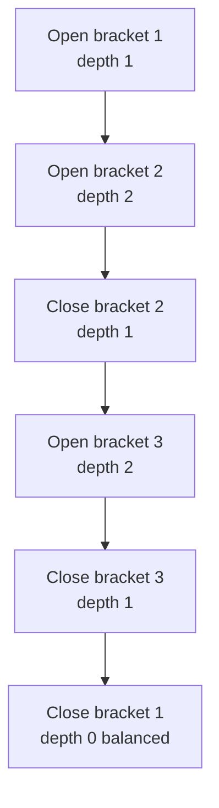
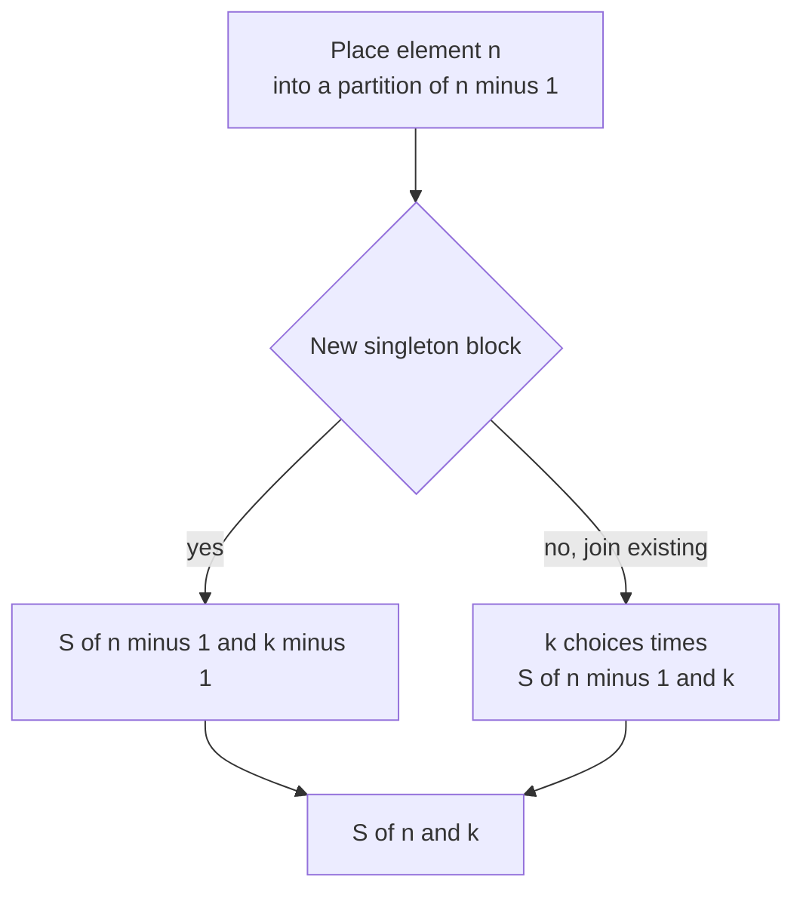
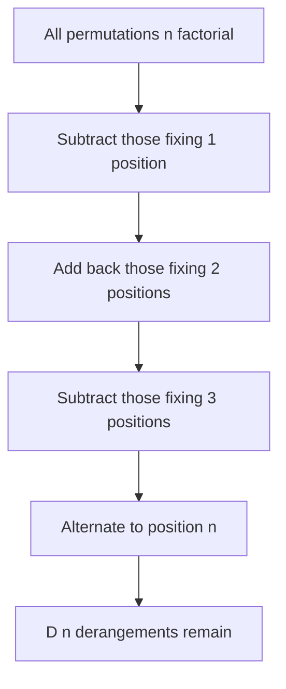

# Catalan Numbers, Stirling Numbers, and Derangements

This guide collects three families of **counting numbers** that appear constantly in combinatorics and competitive programming: **Catalan numbers** (which count balanced brackets, binary search trees, polygon triangulations, and lattice paths under a diagonal), **Stirling numbers of the second kind** (which count partitions of a set into a fixed number of non-empty blocks, and through them surjections), **Stirling numbers of the first kind** (which count permutations by their number of cycles), and **derangements** (permutations with no fixed point).

All four share a common toolkit: small linear/quadratic recurrences, closed-form expressions involving binomial coefficients, and modular-arithmetic helpers (`nCr mod p`) for computing the answers under a prime modulus such as $10^9 + 7$.

## Table of Contents

- [nCr mod p Helper](#ncr-mod-p-helper)
- [Catalan Numbers](#catalan-numbers)
- [Stirling Numbers of the Second Kind](#stirling-numbers-of-the-second-kind)
- [Stirling Numbers of the First Kind](#stirling-numbers-of-the-first-kind)
- [Derangements](#derangements)
- [Complexity Summary](#complexity-summary)
- [Common Pitfalls](#common-pitfalls)
- [Patterns](#patterns)

## nCr mod p Helper

Every closed form below uses binomial coefficients modulo a prime $p$. We precompute factorials and inverse factorials once in $O(n)$ (after a single modular inverse via Fermat's little theorem) and then answer each $\binom{n}{r}$ in $O(1)$:

$$
\binom{n}{r} \equiv \frac{n!}{r!\,(n-r)!} \equiv n! \cdot (r!)^{-1} \cdot ((n-r)!)^{-1} \pmod p .
$$

Pseudocode:

```
precompute(N):
    fact[0] = 1
    for i in 1..N: fact[i] = fact[i-1] * i mod p
    inv_fact[N] = modpow(fact[N], p-2, p)
    for i in N-1..0: inv_fact[i] = inv_fact[i+1] * (i+1) mod p

nCr(n, r):
    if r < 0 or r > n: return 0
    return fact[n] * inv_fact[r] mod p * inv_fact[n-r] mod p
```

```python
MOD = 10**9 + 7

class Binom:
    def __init__(self, n: int) -> None:
        self.fact = [1] * (n + 1)
        for i in range(1, n + 1):
            self.fact[i] = self.fact[i - 1] * i % MOD
        self.inv_fact = [1] * (n + 1)
        self.inv_fact[n] = pow(self.fact[n], MOD - 2, MOD)
        for i in range(n - 1, -1, -1):
            self.inv_fact[i] = self.inv_fact[i + 1] * (i + 1) % MOD

    def nCr(self, n: int, r: int) -> int:
        if r < 0 or r > n or n < 0:
            return 0
        return self.fact[n] * self.inv_fact[r] % MOD * self.inv_fact[n - r] % MOD
```

```cpp
#include <bits/stdc++.h>
using namespace std;

const long long MOD = 1e9 + 7;

long long modpow(long long base, long long exp, long long mod) {
    long long result = 1 % mod;
    base %= mod;
    while (exp > 0) {
        if (exp & 1) result = result * base % mod;
        base = base * base % mod;
        exp >>= 1;
    }
    return result;
}

struct Binom {
    vector<long long> fact, invFact;

    explicit Binom(int n) : fact(n + 1), invFact(n + 1) {
        fact[0] = 1;
        for (int i = 1; i <= n; ++i) fact[i] = fact[i - 1] * i % MOD;
        invFact[n] = modpow(fact[n], MOD - 2, MOD);
        for (int i = n - 1; i >= 0; --i) invFact[i] = invFact[i + 1] * (i + 1) % MOD;
    }

    long long nCr(long long n, long long r) const {
        if (r < 0 || r > n || n < 0) return 0;
        return fact[n] * invFact[r] % MOD * invFact[n - r] % MOD;
    }
};
```

## Catalan Numbers

The **Catalan numbers** $C_0, C_1, C_2, \ldots = 1, 1, 2, 5, 14, 42, 132, \ldots$ have the closed form

$$
C_n = \frac{1}{n+1}\binom{2n}{n} = \binom{2n}{n} - \binom{2n}{n+1},
$$

and satisfy the convolution recurrence

$$
C_0 = 1, \qquad C_{n+1} = \sum_{i=0}^{n} C_i \, C_{n-i},
$$

equivalently $C_{n+1} = \sum_{i=0}^{n} C_i\, C_{n-1-i}$ written with index $n-1-i$ for the right sub-structure. A handy linear recurrence (great for a single value) is

$$
C_{n+1} = \frac{2(2n+1)}{n+2}\, C_n .
$$

**What they count.** $C_n$ equals all of the following:

- The number of **balanced bracket sequences** of length $2n$ (e.g. for $n = 3$: `()()()`, `()(())`, `(())()`, `(()())`, `((()))`).
- The number of **binary search trees** (distinct tree shapes) on $n$ nodes.
- The number of **triangulations** of a convex polygon with $n+2$ vertices.
- The number of **monotonic lattice paths** from $(0,0)$ to $(n,n)$ that never rise above the diagonal.

The bracket-matching view is the most intuitive: every `(` must be closed by a later `)`, and at no prefix may the number of `)` exceed the number of `(`. The diagram traces matching for `(()())`:



The convolution recurrence comes directly from this picture: the first `(` is matched by some `)` at position $2i+2$, splitting the sequence into an inner balanced block of $i$ pairs and an outer balanced block of $n-i$ pairs, giving $C_i \cdot C_{n-i}$ summed over the split point.

Pseudocode for the modular closed form:

```
catalan(n):
    return nCr(2n, n) * modinv(n + 1) mod p
```

```python
def catalan_closed(n: int, binom: "Binom") -> int:
    return binom.nCr(2 * n, n) * pow(n + 1, MOD - 2, MOD) % MOD

def catalan_dp(n: int) -> list[int]:
    """All Catalan numbers C_0..C_n via the convolution recurrence (mod)."""
    C = [0] * (n + 1)
    C[0] = 1
    for m in range(1, n + 1):
        total = 0
        for i in range(m):
            total += C[i] * C[m - 1 - i]
        C[m] = total % MOD
    return C
```

```cpp
long long catalanClosed(int n, const Binom& binom) {
    return binom.nCr(2 * n, n) * modpow(n + 1, MOD - 2, MOD) % MOD;
}

// All Catalan numbers C_0..C_n via the convolution recurrence (mod).
vector<long long> catalanDp(int n) {
    vector<long long> C(n + 1, 0);
    C[0] = 1;
    for (int m = 1; m <= n; ++m) {
        long long total = 0;
        for (int i = 0; i < m; ++i)
            total = (total + C[i] * C[m - 1 - i]) % MOD;
        C[m] = total;
    }
    return C;
}
```

## Stirling Numbers of the Second Kind

$S(n, k)$ (also written $\left\{ {n \atop k} \right\}$) counts the number of ways to **partition a set of $n$ labelled elements into exactly $k$ non-empty, unlabelled blocks**. For example $S(4, 2) = 7$.

The recurrence considers element $n$: either it forms its own new block (leaving $S(n-1, k-1)$ ways to partition the rest into $k-1$ blocks), or it joins one of the $k$ existing blocks (leaving $S(n-1, k)$ ways, times $k$ choices):

$$
S(n, k) = k\, S(n-1, k) + S(n-1, k-1),
$$

with base cases $S(0, 0) = 1$ and $S(n, 0) = S(0, k) = 0$ for $n, k > 0$.

The explicit **inclusion-exclusion** formula is

$$
S(n, k) = \frac{1}{k!}\sum_{j=0}^{k} (-1)^{j}\binom{k}{j}(k-j)^{n}.
$$

Closely related are **surjections** (onto functions) from an $n$-set to a $k$-set: there are $k!\,S(n,k)$ of them, because we choose an ordered labelling of the $k$ blocks:

$$
\text{Surj}(n, k) = k!\,S(n, k) = \sum_{j=0}^{k} (-1)^{j}\binom{k}{j}(k-j)^{n}.
$$

```python
def stirling2_table(n: int, k: int) -> list[list[int]]:
    """S(i, j) for 0<=i<=n, 0<=j<=k via the recurrence (mod)."""
    S = [[0] * (k + 1) for _ in range(n + 1)]
    S[0][0] = 1
    for i in range(1, n + 1):
        for j in range(1, k + 1):
            S[i][j] = (j * S[i - 1][j] + S[i - 1][j - 1]) % MOD
    return S

def stirling2_formula(n: int, k: int, binom: "Binom") -> int:
    """S(n, k) via inclusion-exclusion (mod)."""
    total = 0
    for j in range(k + 1):
        term = binom.nCr(k, j) * pow(k - j, n, MOD) % MOD
        total = (total + (term if j % 2 == 0 else -term)) % MOD
    return total * binom.inv_fact[k] % MOD
```

```cpp
// S(i, j) for 0<=i<=n, 0<=j<=k via the recurrence (mod).
vector<vector<long long>> stirling2Table(int n, int k) {
    vector<vector<long long>> S(n + 1, vector<long long>(k + 1, 0));
    S[0][0] = 1;
    for (int i = 1; i <= n; ++i)
        for (int j = 1; j <= k; ++j)
            S[i][j] = (j * S[i - 1][j] + S[i - 1][j - 1]) % MOD;
    return S;
}

// S(n, k) via inclusion-exclusion (mod).
long long stirling2Formula(long long n, int k, const Binom& binom) {
    long long total = 0;
    for (int j = 0; j <= k; ++j) {
        long long term = binom.nCr(k, j) * modpow(k - j, n, MOD) % MOD;
        if (j % 2 == 0) total = (total + term) % MOD;
        else total = (total - term % MOD + MOD) % MOD;
    }
    return total * binom.invFact[k] % MOD;
}
```

The decision tree for placing element $n$ underlies the recurrence:



## Stirling Numbers of the First Kind

The **unsigned Stirling numbers of the first kind** $c(n, k)$ (also $\left[ {n \atop k} \right]$) count the number of **permutations of $n$ elements that have exactly $k$ disjoint cycles**. For example $c(4, 2) = 11$.

The recurrence considers element $n$: it can form its own fixed-point cycle (giving $c(n-1, k-1)$), or be inserted into one of the existing $n-1$ positions within the current cycles (giving $(n-1)\,c(n-1, k)$):

$$
c(n, k) = (n-1)\, c(n-1, k) + c(n-1, k-1),
$$

with $c(0, 0) = 1$ and $c(n, 0) = 0$ for $n > 0$. Summing over all cycle counts recovers the factorial, $\sum_{k=0}^{n} c(n, k) = n!$.

The **signed** Stirling numbers of the first kind $s(n, k) = (-1)^{n-k} c(n, k)$ are the coefficients that expand the falling factorial $x^{\underline{n}} = x(x-1)\cdots(x-n+1) = \sum_k s(n,k)\, x^k$; the unsigned ones expand the rising factorial.

```python
def stirling1_unsigned_table(n: int, k: int) -> list[list[int]]:
    """Unsigned c(i, j) for 0<=i<=n, 0<=j<=k via the recurrence (mod)."""
    c = [[0] * (k + 1) for _ in range(n + 1)]
    c[0][0] = 1
    for i in range(1, n + 1):
        for j in range(1, k + 1):
            c[i][j] = ((i - 1) * c[i - 1][j] + c[i - 1][j - 1]) % MOD
    return c
```

```cpp
// Unsigned c(i, j) for 0<=i<=n, 0<=j<=k via the recurrence (mod).
vector<vector<long long>> stirling1UnsignedTable(int n, int k) {
    vector<vector<long long>> c(n + 1, vector<long long>(k + 1, 0));
    c[0][0] = 1;
    for (int i = 1; i <= n; ++i)
        for (int j = 1; j <= k; ++j)
            c[i][j] = (((long long)(i - 1) * c[i - 1][j]) % MOD + c[i - 1][j - 1]) % MOD;
    return c;
}
```

## Derangements

A **derangement** is a permutation with **no fixed point** ($\sigma(i) \neq i$ for all $i$). The count $D_n$ begins $D_0 = 1, D_1 = 0, D_2 = 1, D_3 = 2, D_4 = 9, D_5 = 44, \ldots$

It satisfies two recurrences,

$$
D_n = (n-1)\,(D_{n-1} + D_{n-2}), \qquad D_n = n\,D_{n-1} + (-1)^{n},
$$

and the inclusion-exclusion closed form (let $A_i$ be the set of permutations fixing position $i$):

$$
D_n = n!\sum_{j=0}^{n}\frac{(-1)^{j}}{j!} = \sum_{j=0}^{n} (-1)^{j}\binom{n}{j}(n-j)! .
$$

As $n \to \infty$ the fraction of derangements tends to $1/e \approx 0.3679$, so $D_n \approx n!/e$.

```python
def derangements(n: int) -> list[int]:
    """D_0..D_n via the (n-1)(D_{n-1}+D_{n-2}) recurrence (mod)."""
    D = [0] * (max(n, 1) + 1)
    D[0] = 1
    if n >= 1:
        D[1] = 0
    for i in range(2, n + 1):
        D[i] = (i - 1) * (D[i - 1] + D[i - 2]) % MOD
    return D[: n + 1]

def derangement_ie(n: int, binom: "Binom") -> int:
    """D_n via inclusion-exclusion (mod)."""
    total = 0
    for j in range(n + 1):
        term = binom.nCr(n, j) * binom.fact[n - j] % MOD
        total = (total + (term if j % 2 == 0 else -term)) % MOD
    return total % MOD
```

```cpp
// D_0..D_n via the (n-1)(D_{n-1}+D_{n-2}) recurrence (mod).
vector<long long> derangements(int n) {
    vector<long long> D(max(n, 1) + 1, 0);
    D[0] = 1;
    if (n >= 1) D[1] = 0;
    for (int i = 2; i <= n; ++i)
        D[i] = (long long)(i - 1) * ((D[i - 1] + D[i - 2]) % MOD) % MOD;
    D.resize(n + 1);
    return D;
}

// D_n via inclusion-exclusion (mod).
long long derangementIE(int n, const Binom& binom) {
    long long total = 0;
    for (int j = 0; j <= n; ++j) {
        long long term = binom.nCr(n, j) * binom.fact[n - j] % MOD;
        if (j % 2 == 0) total = (total + term) % MOD;
        else total = (total - term + MOD) % MOD;
    }
    return total % MOD;
}
```

The inclusion-exclusion view: start from all $n!$ permutations and alternately subtract/add those that fix at least one chosen set of positions.



## Complexity Summary

| Quantity | Method | Precompute | Per query |
| --- | --- | --- | --- |
| $C_n$ | closed form $\binom{2n}{n}/(n+1)$ | $O(n)$ factorials | $O(1)$ |
| $C_0..C_n$ | convolution recurrence | — | $O(n^2)$ total |
| $C_n$ | linear ratio recurrence | — | $O(n)$ |
| $S(n,k)$ | recurrence table | — | $O(nk)$ table |
| $S(n,k)$ | IE formula | $O(\max(n,k))$ | $O(k\log n)$ |
| $c(n,k)$ first kind | recurrence table | — | $O(nk)$ table |
| $D_n$ | linear recurrence | — | $O(n)$ |
| $D_n$ | IE formula | $O(n)$ factorials | $O(n)$ |

## Common Pitfalls

- **Negative values under a modulus.** The inclusion-exclusion sums for $S(n,k)$ and $D_n$ alternate signs; always add `MOD` before taking the result mod to keep it in $[0, \text{MOD})$.
- **Dividing by $n+1$ for Catalan.** Under a prime modulus you cannot literally divide; multiply by the modular inverse $\text{modpow}(n+1, p-2, p)$.
- **Off-by-one in the convolution recurrence.** $C_{n+1} = \sum_{i=0}^{n} C_i C_{n-i}$ pairs index $i$ with $n-i$, not $n-1-i$, when written for $C_{n+1}$; double-check which side of the recurrence you are indexing.
- **Confusing the two kinds of Stirling numbers.** Second kind partitions a set into blocks; first kind counts cycles of a permutation. Their recurrences differ ($k\,S(n-1,k)$ vs $(n-1)\,c(n-1,k)$).
- **Surjections vs partitions.** Surjections onto $k$ labelled targets are $k!\,S(n,k)$, not $S(n,k)$; forgetting the $k!$ is a classic error.
- **$0^0$ in the IE formula.** In $\sum (-1)^j \binom{k}{j}(k-j)^n$, the $j=k$ term is $(0)^n$; for $n>0$ this is $0$, but guard against languages/`pow` that return $1$ for $0^0$ when $n=0$.

## Patterns

- **"Count balanced / nested / non-crossing structures" $\Rightarrow$ Catalan number.** Brackets, BSTs, triangulations, Dyck paths, and stack-sortable permutations all map to $C_n$.
- **"Distribute $n$ distinct items into $k$ identical non-empty groups" $\Rightarrow$ Stirling second kind $S(n,k)$;** if the groups are distinct (labelled), multiply by $k!$ to get surjections.
- **"Count permutations by number of cycles" $\Rightarrow$ Stirling first kind $c(n,k)$.**
- **"No element in its original place / nobody gets their own gift" $\Rightarrow$ derangement $D_n$.**
- **Sign-alternating sums over subsets or counts $\Rightarrow$ inclusion-exclusion;** both Stirling-2 and derangements are special cases, so reuse the same `nCr mod p` precomputation.
