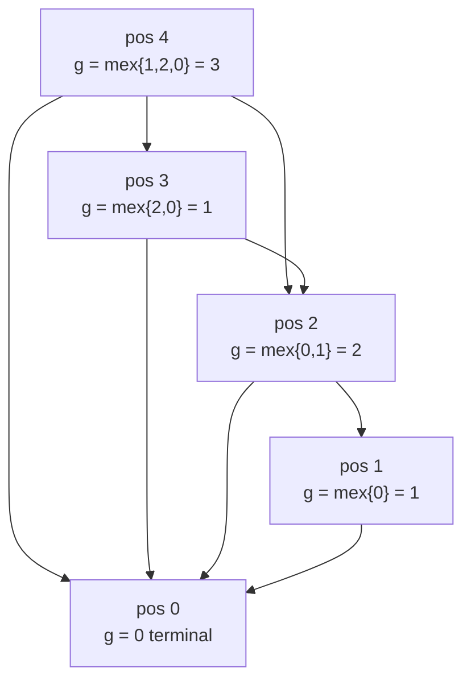
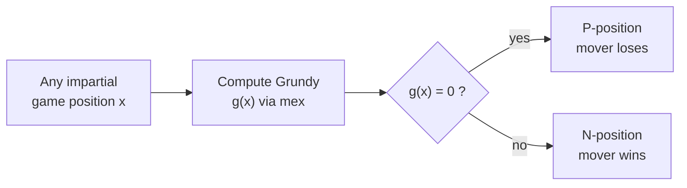

# Game Theory: Nim, Grundy Numbers, and the Sprague–Grundy Theorem

Combinatorial game theory studies two-player games of **perfect information** with **no randomness**. The crown jewel of the field is the **Sprague–Grundy theorem**, which says that *every* impartial game under normal play behaves exactly like a single pile of **Nim**. Once you internalize this, an enormous family of seemingly unrelated games collapses into one tool: compute a number (the *Grundy value*), and XOR things together. This guide builds that machinery from scratch — from the definition of a winning position all the way to summing games via nimbers.

---

## Table of Contents

1. [Impartial Games and Normal Play](#impartial-games-and-normal-play)
2. [P-positions and N-positions](#p-positions-and-n-positions)
3. [The Game of Nim](#the-game-of-nim)
4. [Bouton's Theorem (Why XOR Works)](#boutons-theorem-why-xor-works)
5. [The mex Function](#the-mex-function)
6. [Grundy Numbers (Nimbers)](#grundy-numbers-nimbers)
7. [The Sprague–Grundy Theorem](#the-spraguegrundy-theorem)
8. [Sum of Games = XOR of Grundy Values](#sum-of-games--xor-of-grundy-values)
9. [Subtraction Games and Grundy Tables](#subtraction-games-and-grundy-tables)
10. [Misère Play Note](#misère-play-note)
11. [Complexity Summary](#complexity-summary)
12. [Common Pitfalls](#common-pitfalls)
13. [Patterns](#patterns)

---

## Impartial Games and Normal Play

A game is **impartial** when the set of legal moves from any position depends *only on the position*, not on whose turn it is. Both players can make exactly the same moves. (Chess is **partisan** — White moves white pieces only — so the theory here does not apply directly to it.)

We assume:

- **Finite**: the game always ends after finitely many moves (no infinite play).
- **Perfect information**: both players see the entire state.
- **Normal play convention**: the player who **cannot move loses**. (The opposite, *misère* play, is discussed later.)

Classic impartial games: Nim, subtraction games, Turning Turtles, Green Hackenbush, and countless puzzle variants.

---

## P-positions and N-positions

Every position is exactly one of two types under optimal play:

- **P-position** — the **P**revious player wins (i.e. the player *about to move* **loses**). These are the **losing** positions for the mover.
- **N-position** — the **N**ext player wins (i.e. the player *about to move* **wins**). These are the **winning** positions for the mover.

They are defined by mutual recursion:

> A position is a **P-position** if **every** move leads to an N-position.
> A position is an **N-position** if **at least one** move leads to a P-position.
> A terminal position (no moves) is a **P-position** (the mover loses immediately under normal play).

The winning strategy is simply: *always move to a P-position*. Your opponent is then stuck with only N-positions to hand back to you.

```text
function classify(pos):
    if pos has no moves:
        return P              # mover cannot move -> mover loses
    for each next in moves(pos):
        if classify(next) == P:
            return N          # we can shove opponent into a loss
    return P                  # every move hands opponent a win
```

```python
from functools import lru_cache

@lru_cache(maxsize=None)
def is_winning(pos) -> bool:
    """True if the player to move from `pos` wins (N-position)."""
    moves = list(next_states(pos))
    if not moves:
        return False                       # terminal -> P-position -> mover loses
    return any(not is_winning(nxt) for nxt in moves)
```

```cpp
#include <map>
#include <vector>
using namespace std;

map<long long, bool> memo;
vector<long long> next_states(long long pos);  // game-specific

// True if the player to move from `pos` wins (N-position).
bool is_winning(long long pos) {
    auto it = memo.find(pos);
    if (it != memo.end()) return it->second;
    vector<long long> moves = next_states(pos);
    bool win = false;                      // terminal -> false -> P-position
    for (long long nxt : moves) {
        if (!is_winning(nxt)) { win = true; break; }
    }
    return memo[pos] = win;
}
```

---

## The Game of Nim

**Nim** is the foundational impartial game. The state is a collection of **piles** of stones, say sizes $a_1, a_2, \dots, a_k$. On your turn you pick **one** pile and remove **any positive number** of stones from it (at least one, up to the whole pile). The player who cannot move — i.e. faces all-empty piles — loses.

A single pile is trivially an N-position whenever it is non-empty (just take the whole pile). The magic appears with multiple piles. The complete solution is **Bouton's theorem**.

---

## Bouton's Theorem (Why XOR Works)

Define the **Nim-sum** as the bitwise XOR of all pile sizes:

$$
S = a_1 \oplus a_2 \oplus \cdots \oplus a_k.
$$

> **Bouton's Theorem.** A Nim position is a **P-position** (losing for the mover) **iff** $S = 0$. Equivalently, the **first player wins iff** $S \ne 0$.

**Proof intuition.** We verify the two defining properties of P-positions, treating positions with $S = 0$ as the claimed P-positions.

1. **From $S = 0$, every move makes $S \ne 0$.** Changing a single pile $a_i$ to $a_i' \ne a_i$ changes the XOR to $S \oplus a_i \oplus a_i' = 0 \oplus a_i \oplus a_i' = a_i \oplus a_i' \ne 0$ because $a_i \ne a_i'$. So from a zero Nim-sum you are forced into a non-zero one.

2. **From $S \ne 0$, some move reaches $S = 0$.** Let $d$ be the highest set bit of $S$. Some pile $a_i$ has that bit set (otherwise the bit could not appear in the XOR). Then $a_i' = a_i \oplus S$ flips that high bit *off*, so $a_i' < a_i$ — a legal removal. After the move the new Nim-sum is $S \oplus a_i \oplus a_i' = S \oplus a_i \oplus (a_i \oplus S) = 0$.

These are exactly the recursive P/N rules: $S=0$ positions only reach $S\ne0$ positions (all N), and $S\ne0$ positions can reach an $S=0$ position (some P). The terminal all-zero position has $S = 0$, consistent with it being a P-position. $\blacksquare$

The **winning move** is concrete: take the pile with the high bit of $S$ set and reduce it to $a_i \oplus S$.

```python
def nim_first_player_wins(piles: list[int]) -> bool:
    s = 0
    for x in piles:
        s ^= x
    return s != 0

def nim_winning_move(piles: list[int]):
    """Return (pile_index, new_size) reaching Nim-sum 0, or None if losing."""
    s = 0
    for x in piles:
        s ^= x
    if s == 0:
        return None
    for i, x in enumerate(piles):
        target = x ^ s
        if target < x:
            return (i, target)
    return None
```

```cpp
#include <vector>
#include <optional>
#include <utility>
using namespace std;

bool nim_first_player_wins(const vector<long long>& piles) {
    long long s = 0;
    for (long long x : piles) s ^= x;
    return s != 0;
}

// Return (pile_index, new_size) reaching Nim-sum 0, or nullopt if losing.
optional<pair<int, long long>> nim_winning_move(const vector<long long>& piles) {
    long long s = 0;
    for (long long x : piles) s ^= x;
    if (s == 0) return nullopt;
    for (int i = 0; i < (int)piles.size(); ++i) {
        long long target = piles[i] ^ s;
        if (target < piles[i]) return make_pair(i, target);
    }
    return nullopt;
}
```

---

## The mex Function

**mex** = *minimum excludant*. For a set $T$ of non-negative integers,

$$
\operatorname{mex}(T) = \min\{\, n \in \mathbb{Z}_{\ge 0} : n \notin T \,\}.
$$

That is, the smallest non-negative integer **not** present in $T$.

| $T$ | $\operatorname{mex}(T)$ |
|---|---|
| $\{\}$ | $0$ |
| $\{0\}$ | $1$ |
| $\{1, 2\}$ | $0$ |
| $\{0, 1, 2\}$ | $3$ |
| $\{0, 1, 3, 4\}$ | $2$ |

```python
def mex(values) -> int:
    seen = set(values)
    n = 0
    while n in seen:
        n += 1
    return n
```

```cpp
#include <vector>
#include <unordered_set>
using namespace std;

int mex(const vector<int>& values) {
    unordered_set<int> seen(values.begin(), values.end());
    int n = 0;
    while (seen.count(n)) ++n;
    return n;
}
```

---

## Grundy Numbers (Nimbers)

The **Grundy value** (also **nimber**) $g(x)$ of a position is defined recursively as the mex of the Grundy values of all positions reachable in one move:

$$
g(x) = \operatorname{mex}\bigl(\{\, g(y) : x \to y \,\}\bigr).
$$

Key fact: **$g(x) = 0$ exactly when $x$ is a P-position.** A non-zero Grundy value marks an N-position. So Grundy values strictly generalize the P/N labeling — they carry *how much* of a winning resource the position is worth, measured in "Nim-pile units".

For a single Nim pile of size $n$, the reachable Grundy values are $\{0, 1, \dots, n-1\}$, so $g(n) = \operatorname{mex}\{0,\dots,n-1\} = n$. **A Nim pile of size $n$ has Grundy value $n$** — the size *is* the nimber.

```text
function grundy(pos):
    reachable = { grundy(next) for next in moves(pos) }
    return mex(reachable)
```

```python
from functools import lru_cache

@lru_cache(maxsize=None)
def grundy(pos) -> int:
    reachable = {grundy(nxt) for nxt in next_states(pos)}
    return mex(reachable)            # mex defined above
```

```cpp
#include <map>
#include <vector>
using namespace std;

map<long long, int> gmemo;
vector<long long> next_states(long long pos);  // game-specific

int grundy(long long pos) {
    auto it = gmemo.find(pos);
    if (it != gmemo.end()) return it->second;
    vector<int> reachable;
    for (long long nxt : next_states(pos)) reachable.push_back(grundy(nxt));
    return gmemo[pos] = mex(reachable);   // mex defined above
}
```

A small game-state graph, with each node annotated by its Grundy value computed bottom-up:



---

## The Sprague–Grundy Theorem

> **Sprague–Grundy Theorem.** Every impartial game under normal play, played from a given position $x$, is **equivalent to a single Nim pile** of size $g(x)$. In particular the mover **wins iff $g(x) \ne 0$**.

This is profound: no matter how baroque the rules, optimal play is governed by one integer. To *solve* an impartial game you only need a way to compute its Grundy function. Two positions with equal Grundy values are interchangeable — you may freely swap one for the other in any larger game without changing who wins.



---

## Sum of Games = XOR of Grundy Values

A **sum of games** is when the overall position is several independent sub-games played side by side; a move chooses one component and makes a legal move there. The decisive corollary:

$$
g(G_1 + G_2 + \cdots + G_m) = g(G_1) \oplus g(G_2) \oplus \cdots \oplus g(G_m).
$$

This is the engine behind everything. Nim itself is just a sum of single-pile games, each with Grundy value equal to its size — recovering Bouton's XOR rule as a special case. To analyze a composite game:

1. Decompose it into independent components.
2. Compute each component's Grundy value.
3. XOR them. The first player wins iff the result is non-zero.

```python
def composite_first_player_wins(components) -> bool:
    """components: iterable of game positions, each with its own grundy()."""
    total = 0
    for comp in components:
        total ^= grundy(comp)
    return total != 0
```

```cpp
#include <vector>
using namespace std;

int grundy(long long pos);  // per-component Grundy

bool composite_first_player_wins(const vector<long long>& components) {
    int total = 0;
    for (long long comp : components) total ^= grundy(comp);
    return total != 0;
}
```

---

## Subtraction Games and Grundy Tables

A **subtraction game** $\mathrm{Sub}(S)$ has a single pile; a move removes $s$ stones for some $s$ in a fixed set $S \subseteq \{1, 2, \dots\}$. With one pile, $g(0) = 0$ and

$$
g(n) = \operatorname{mex}\bigl(\{\, g(n - s) : s \in S,\ s \le n \,\}\bigr).
$$

These Grundy sequences are eventually **periodic**, which is what makes huge inputs tractable. Example tables:

**$S = \{1, 2, 3\}$** (remove 1, 2, or 3): pure win-by-multiple-of-4 pattern, but Grundy values cycle $0,1,2,3$:

| $n$ | 0 | 1 | 2 | 3 | 4 | 5 | 6 | 7 | 8 |
|---|---|---|---|---|---|---|---|---|---|
| $g(n)$ | 0 | 1 | 2 | 3 | 0 | 1 | 2 | 3 | 0 |

Here $g(n) = n \bmod 4$; P-positions are exactly multiples of 4.

**$S = \{1, 3, 4\}$**: period 7 — $0,1,0,1,2,3,2$ repeating.

| $n$ | 0 | 1 | 2 | 3 | 4 | 5 | 6 | 7 | 8 | 9 | 10 | 11 | 12 | 13 |
|---|---|---|---|---|---|---|---|---|---|---|---|---|---|---|
| $g(n)$ | 0 | 1 | 0 | 1 | 2 | 3 | 2 | 0 | 1 | 0 | 1 | 2 | 3 | 2 |

```python
def grundy_subtraction(limit: int, moves: set[int]) -> list[int]:
    g = [0] * (limit + 1)
    for n in range(1, limit + 1):
        reachable = {g[n - s] for s in moves if s <= n}
        m = 0
        while m in reachable:
            m += 1
        g[n] = m
    return g
```

```cpp
#include <vector>
#include <set>
using namespace std;

vector<int> grundy_subtraction(int limit, const set<int>& moves) {
    vector<int> g(limit + 1, 0);
    for (int n = 1; n <= limit; ++n) {
        set<int> reachable;
        for (int s : moves) if (s <= n) reachable.insert(g[n - s]);
        int m = 0;
        while (reachable.count(m)) ++m;
        g[n] = m;
    }
    return g;
}
```

---

## Misère Play Note

In **misère** play the player who makes the *last move* **loses** (the one who cannot move *wins*). The clean Sprague–Grundy machinery does **not** carry over in general. For plain Nim there is a known correction:

> **Misère Nim.** The first player wins iff **either** some pile has size $\ge 2$ and the Nim-sum is non-zero, **or** every pile has size $\le 1$ and the number of piles is **even**.

For arbitrary impartial games misère analysis is genuinely harder (it requires *genus theory* / misère quotients), so unless told otherwise, assume **normal play**.

---

## Complexity Summary

| Task | Time | Space |
|---|---|---|
| Nim winner (XOR test) | $O(k)$ for $k$ piles | $O(1)$ |
| `mex` of a set of size $m$ | $O(m)$ | $O(m)$ |
| Grundy table up to $n$, move set size $\lvert S\rvert$ | $O(n \cdot \lvert S\rvert)$ | $O(n)$ |
| Grundy by memoized DFS over $V$ states, $E$ edges | $O(V + E)$ amortized | $O(V)$ |
| Sum of $m$ games | $O(m)$ plus per-game Grundy cost | $O(1)$ extra |

---

## Common Pitfalls

- **Confusing P and N.** P-position = the player *to move* **loses**. The terminal (no-move) position is a **P-position** under normal play. Re-derive this whenever you doubt it.
- **Assuming Grundy adds, not XORs.** Sums of games combine by **XOR**, never arithmetic addition. $g = 1$ and $g = 1$ cancel to $0$ (a loss), they do **not** make $2$.
- **Applying normal-play XOR to misère.** Misère Nim needs the special all-piles-$\le 1$ correction; do not blindly reuse $S \ne 0$.
- **Forgetting Grundy of a single Nim pile is its size.** $g(n) = n$ for Nim, *not* $n \bmod \text{something}$ — that pattern is for subtraction games.
- **Recomputing Grundy without memoization**, causing exponential blowup. Always cache.
- **Misidentifying independent components.** XOR only works when sub-games are truly independent (a move touches exactly one component).
- **mex of an empty set is $0$**, not undefined — terminal positions correctly get Grundy $0$.

---

## Patterns

- **"Who wins this pile game?"** → Compute Grundy values, test if the XOR is non-zero.
- **Multiple independent piles/boards** → Grundy per component, XOR them (Sprague–Grundy sum).
- **"Remove from a fixed set"** → Subtraction game; build a Grundy table and exploit its eventual **periodicity** for large $n$.
- **Plain Nim** → Skip Grundy machinery; XOR the pile sizes directly (Bouton).
- **Single pile, simple modular rule** (e.g. take 1–3) → Look for $g(n) = n \bmod (m+1)$; P-positions are the multiples.
- **Suspect periodicity** → Compute the first few hundred Grundy values, detect the period, then index large $n$ by modular reduction.
- **Misère variant** → Default machinery breaks; handle Nim with the special rule, otherwise tread carefully.
