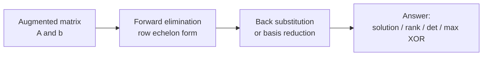
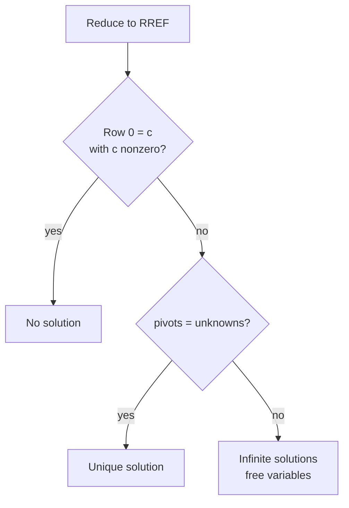
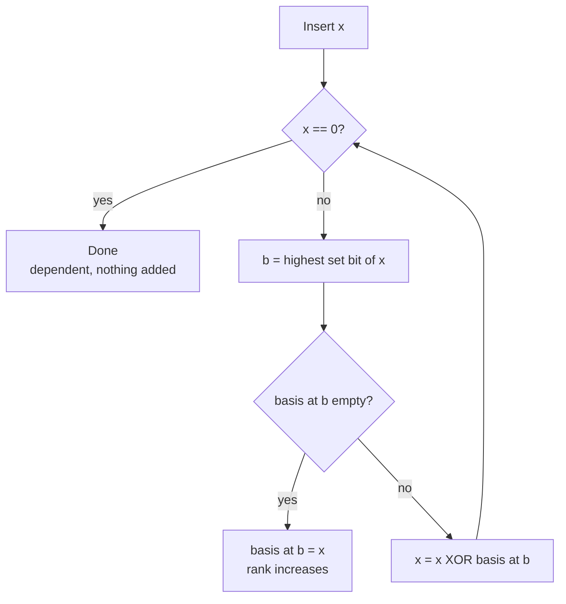

# Linear Algebra: Gaussian Elimination and the XOR Basis (Linear Basis over GF(2))

Linear algebra shows up constantly in competitive programming and applied math: solving systems of equations, computing ranks and determinants, and — perhaps surprisingly — answering questions about XOR of subsets. The unifying idea is **Gaussian elimination**: repeatedly use one row to cancel a chosen variable out of the others. Over the rational numbers this solves $Ax = b$; over the two-element field $\mathrm{GF}(2)$ the exact same algorithm becomes the **XOR linear basis**, a tiny structure that answers maximum-XOR-subset, representability, and counting queries in $O(\text{bits})$ time.

This guide builds both views from scratch and connects them.

---

## Table of Contents

1. [Why Elimination Works](#why-elimination-works)
2. [Gaussian Elimination over the Reals](#gaussian-elimination-over-the-reals)
3. [Partial Pivoting and Numerical Stability](#partial-pivoting-and-numerical-stability)
4. [Detecting No / Unique / Infinite Solutions](#detecting-no--unique--infinite-solutions)
5. [Rank and Determinant](#rank-and-determinant)
6. [Gaussian Elimination over GF(2) with Bitsets](#gaussian-elimination-over-gf2-with-bitsets)
7. [The XOR Linear Basis](#the-xor-linear-basis)
8. [Querying the Basis](#querying-the-basis)
9. [Complexity Summary](#complexity-summary)
10. [Common Pitfalls](#common-pitfalls)
11. [Patterns](#patterns)

---

## Why Elimination Works

A system of linear equations describes a set of constraints. The key invariant of Gaussian elimination is:

> Adding a multiple of one equation to another does **not** change the solution set.

Likewise, scaling an equation by a nonzero constant and swapping two equations preserve the solutions. These three **elementary row operations** let us transform the augmented matrix $[A \mid b]$ into a triangular shape from which the answer is read off directly.

The same three operations are valid over **any field** — including $\mathrm{GF}(2) = \{0, 1\}$ where addition is XOR and multiplication is AND. There, "add a multiple of one row to another" simplifies to "XOR one row into another," and that is exactly the XOR basis.



---

## Gaussian Elimination over the Reals

**Forward elimination** turns the matrix into **row echelon form** (zeros below each pivot). For each column we pick a pivot row, then subtract scaled copies of that row from every row below to zero out the column.

**Back substitution** then walks bottom-up, solving each variable using the already-known ones.

Pseudocode for a square, uniquely solvable system:

```text
function solve(A, b, n):
    for col in 0 .. n-1:
        pivot = row >= col with largest |A[row][col]|   # partial pivoting
        swap row 'col' and row 'pivot' (in A and b)
        for row in col+1 .. n-1:
            factor = A[row][col] / A[col][col]
            for c in col .. n-1:
                A[row][c] -= factor * A[col][c]
            b[row] -= factor * b[col]
    # back substitution
    for row in n-1 .. 0:
        s = b[row]
        for c in row+1 .. n-1:
            s -= A[row][c] * x[c]
        x[row] = s / A[row][row]
    return x
```

```python
def solve_linear_system(A, b):
    """Solve A x = b for a square, non-singular system. Returns x."""
    n = len(A)
    # Build augmented matrix as floats.
    M = [row[:] + [b[i]] for i, row in enumerate(A)]
    EPS = 1e-9

    for col in range(n):
        # Partial pivoting: pick the row with the largest absolute value.
        pivot = max(range(col, n), key=lambda r: abs(M[r][col]))
        if abs(M[pivot][col]) < EPS:
            raise ValueError("singular matrix")
        M[col], M[pivot] = M[pivot], M[col]

        # Eliminate this column from the rows below.
        for r in range(col + 1, n):
            factor = M[r][col] / M[col][col]
            for c in range(col, n + 1):
                M[r][c] -= factor * M[col][c]

    # Back substitution.
    x = [0.0] * n
    for r in range(n - 1, -1, -1):
        s = M[r][n]
        for c in range(r + 1, n):
            s -= M[r][c] * x[c]
        x[r] = s / M[r][r]
    return x
```

```cpp
#include <bits/stdc++.h>
using namespace std;

// Solve A x = b for a square, non-singular system. Returns x.
vector<double> solveLinearSystem(vector<vector<double>> A, vector<double> b) {
    int n = (int)A.size();
    const double EPS = 1e-9;

    // Build augmented matrix.
    for (int i = 0; i < n; ++i) A[i].push_back(b[i]);

    for (int col = 0; col < n; ++col) {
        // Partial pivoting: pick the row with the largest absolute value.
        int pivot = col;
        for (int r = col + 1; r < n; ++r)
            if (fabs(A[r][col]) > fabs(A[pivot][col])) pivot = r;
        if (fabs(A[pivot][col]) < EPS) throw runtime_error("singular matrix");
        swap(A[col], A[pivot]);

        // Eliminate this column from the rows below.
        for (int r = col + 1; r < n; ++r) {
            double factor = A[r][col] / A[col][col];
            for (int c = col; c <= n; ++c)
                A[r][c] -= factor * A[col][c];
        }
    }

    // Back substitution.
    vector<double> x(n);
    for (int r = n - 1; r >= 0; --r) {
        double s = A[r][n];
        for (int c = r + 1; c < n; ++c) s -= A[r][c] * x[c];
        x[r] = s / A[r][r];
    }
    return x;
}
```

---

## Partial Pivoting and Numerical Stability

Dividing by a tiny pivot magnifies floating-point error. **Partial pivoting** fixes this: before eliminating column $j$, swap in the row (from $j$ downward) whose entry in column $j$ has the **largest absolute value**. This keeps the multipliers $|factor| \le 1$ and dramatically improves accuracy.

A pivot that is effectively zero (below an epsilon like $10^{-9}$) signals that the column has no usable pivot — the matrix is singular in that column, which feeds directly into rank and solvability detection below.

For exact answers, work over **rationals** (store each entry as a reduced fraction $\frac{p}{q}$) or over a prime field $\mathbb{Z}_p$ using modular inverses, eliminating floating point entirely.

---

## Detecting No / Unique / Infinite Solutions

For a general (possibly non-square) system, reduce to **reduced row echelon form** and inspect pivots:

- A row of the form $[\,0\ 0\ \cdots\ 0 \mid c\,]$ with $c \ne 0$ is the equation $0 = c$ — **no solution** (inconsistent).
- If every variable gets a pivot (number of pivots $=$ number of unknowns) and the system is consistent — **unique solution**.
- If it is consistent but some variables are **free** (pivots $<$ unknowns) — **infinitely many solutions**, parameterized by the free variables.



Formally, with rank $r$ of $A$ and rank $r'$ of $[A \mid b]$ in $n$ unknowns:

$$
\begin{cases}
\text{no solution} & r < r' \\
\text{unique} & r = r' = n \\
\text{infinite} & r = r' < n
\end{cases}
$$

---

## Rank and Determinant

Forward elimination yields both quantities for free.

The **rank** is the number of nonzero pivot rows after elimination — the dimension of the row space.

The **determinant** of a square matrix equals the product of the pivots, adjusted by the sign of the row swaps:

$$
\det(A) = (-1)^{s} \prod_{i=0}^{n-1} U_{ii},
$$

where $U$ is the upper-triangular result and $s$ is the number of row swaps performed during pivoting. Each elimination step costs $O(n^2)$ work across $O(n)$ columns, giving the classic $O(n^3)$.

```python
def determinant(A):
    """Determinant via elimination. O(n^3)."""
    n = len(A)
    M = [row[:] for row in A]
    EPS = 1e-12
    det = 1.0
    sign = 1
    for col in range(n):
        pivot = max(range(col, n), key=lambda r: abs(M[r][col]))
        if abs(M[pivot][col]) < EPS:
            return 0.0  # singular -> determinant is zero
        if pivot != col:
            M[col], M[pivot] = M[pivot], M[col]
            sign = -sign
        det *= M[col][col]
        for r in range(col + 1, n):
            factor = M[r][col] / M[col][col]
            for c in range(col, n):
                M[r][c] -= factor * M[col][c]
    return det * sign
```

```cpp
#include <bits/stdc++.h>
using namespace std;

// Determinant via elimination. O(n^3).
double determinant(vector<vector<double>> M) {
    int n = (int)M.size();
    const double EPS = 1e-12;
    double det = 1.0;
    int sign = 1;
    for (int col = 0; col < n; ++col) {
        int pivot = col;
        for (int r = col + 1; r < n; ++r)
            if (fabs(M[r][col]) > fabs(M[pivot][col])) pivot = r;
        if (fabs(M[pivot][col]) < EPS) return 0.0;  // singular
        if (pivot != col) { swap(M[col], M[pivot]); sign = -sign; }
        det *= M[col][col];
        for (int r = col + 1; r < n; ++r) {
            double factor = M[r][col] / M[col][col];
            for (int c = col; c < n; ++c)
                M[r][c] -= factor * M[col][c];
        }
    }
    return det * sign;
}
```

---

## Gaussian Elimination over GF(2) with Bitsets

Over $\mathrm{GF}(2)$ every entry is $0$ or $1$, addition is XOR, and there is no division to worry about (the only nonzero element is its own inverse). A row of $m$ bits is stored as a single machine integer or a `bitset`, so XORing two rows is one CPU instruction over a whole word — a $64\times$ speedup.

The elimination is identical in spirit: for each row, find its leading (highest or lowest) set bit, use it as a pivot, and XOR that row into every other row that shares that bit.

```python
def gf2_rank(rows):
    """Rank of a 0/1 matrix over GF(2). rows = list of int bitmasks."""
    rows = rows[:]
    rank = 0
    n = len(rows)
    # Process from the highest bit downward.
    for bit in range(max((x.bit_length() for x in rows), default=0) - 1, -1, -1):
        pivot = -1
        for i in range(rank, n):
            if rows[i] >> bit & 1:
                pivot = i
                break
        if pivot == -1:
            continue
        rows[rank], rows[pivot] = rows[pivot], rows[rank]
        for i in range(n):
            if i != rank and (rows[i] >> bit & 1):
                rows[i] ^= rows[rank]
        rank += 1
    return rank
```

```cpp
#include <bits/stdc++.h>
using namespace std;

// Rank of a 0/1 matrix over GF(2). rows = bitmasks.
int gf2Rank(vector<unsigned long long> rows) {
    int n = (int)rows.size();
    int rank = 0;
    for (int bit = 63; bit >= 0; --bit) {
        int pivot = -1;
        for (int i = rank; i < n; ++i)
            if (rows[i] >> bit & 1ULL) { pivot = i; break; }
        if (pivot == -1) continue;
        swap(rows[rank], rows[pivot]);
        for (int i = 0; i < n; ++i)
            if (i != rank && (rows[i] >> bit & 1ULL))
                rows[i] ^= rows[rank];
        ++rank;
    }
    return rank;
}
```

For matrices wider than 64 columns use `std::bitset<W>` in C++ (XOR over the whole bitset in one expression) or Python's arbitrary-precision integers, which already act as unbounded bitsets.

---

## The XOR Linear Basis

The XOR basis is Gaussian elimination over $\mathrm{GF}(2)$ specialized to the single question: **which values can I build by XORing a subset of the given numbers?** The set of reachable XOR values is a vector space over $\mathrm{GF}(2)$, and the basis is its minimal generating set.

We keep an array `basis[b]` indexed by bit position, where `basis[b]`, if nonzero, is a basis vector whose **highest set bit** is exactly `b`. To **insert** a number `x`:

1. Scan its bits from high to low.
2. At each set bit `b`, if `basis[b]` is empty, store `x` there — it is a new independent vector; stop.
3. Otherwise reduce: `x ^= basis[b]`, clearing that bit, and continue.
4. If `x` becomes $0$, it was already representable — nothing new is added.

The number of stored vectors is the **rank** of the input set.



```python
class XorBasis:
    def __init__(self, bits=63):
        self.bits = bits
        self.basis = [0] * (bits + 1)  # basis[b] has highest set bit b
        self.size = 0                  # number of independent vectors = rank

    def insert(self, x):
        """Add x. Returns True if it increased the rank."""
        b = self.bits
        while x:
            top = x.bit_length() - 1
            if self.basis[top] == 0:
                self.basis[top] = x
                self.size += 1
                return True
            x ^= self.basis[top]
        return False
```

```cpp
#include <bits/stdc++.h>
using namespace std;

struct XorBasis {
    static const int BITS = 63;
    array<unsigned long long, BITS + 1> basis{};  // basis[b] has highest set bit b
    int size = 0;                                  // rank

    // Add x. Returns true if it increased the rank.
    bool insert(unsigned long long x) {
        while (x) {
            int top = 63 - __builtin_clzll(x);
            if (basis[top] == 0ULL) {
                basis[top] = x;
                ++size;
                return true;
            }
            x ^= basis[top];
        }
        return false;
    }
};
```

---

## Querying the Basis

Once built, the basis answers several questions in $O(\text{bits})$.

**Maximum XOR subset.** Start from $0$ and greedily walk basis vectors from the highest bit down; take a vector whenever it *increases* the running value. Greedy is optimal because each basis vector controls a unique highest bit no lower vector can touch.

$$
\text{maxXor} = \max_{S \subseteq A} \bigoplus_{a \in S} a.
$$

**Representability.** Reduce a target `t` by the basis exactly like an insert that does **not** store anything; `t` is representable iff it reduces to $0$.

**Counting distinct XOR values.** Every subset of the $r$ basis vectors gives a distinct XOR, so the number of distinct achievable values is

$$
2^{\,r}, \qquad r = \text{rank}.
$$

**k-th smallest XOR.** First convert the basis to a **reduced** form where each pivot bit appears in only one basis vector. Sort the pivots by bit position; then the binary digits of $k$ (0-indexed) select which pivots to include, producing the $k$-th smallest value directly.

```python
class XorBasis(XorBasis):  # extends the class above
    def max_xor(self):
        res = 0
        for b in range(self.bits, -1, -1):
            if self.basis[b] and (res ^ self.basis[b]) > res:
                res ^= self.basis[b]
        return res

    def can_represent(self, t):
        while t:
            top = t.bit_length() - 1
            if self.basis[top] == 0:
                return False
            t ^= self.basis[top]
        return True

    def count_distinct(self):
        return 1 << self.size  # 2^rank distinct XOR values (including 0)

    def kth_smallest(self, k):
        """0-indexed k-th smallest XOR over all subsets (including empty=0)."""
        # Reduce basis so each pivot bit is isolated.
        reduced = []
        b = self.basis[:]
        for i in range(self.bits, -1, -1):
            if b[i] == 0:
                continue
            for j in range(self.bits, -1, -1):
                if i != j and b[j] and (b[j] >> i & 1):
                    b[j] ^= b[i]
            reduced.append(b[i])
        reduced.sort()             # by value == by isolated pivot bit
        if k >= (1 << len(reduced)):
            return -1              # out of range
        res = 0
        for i, vec in enumerate(reduced):
            if k >> i & 1:
                res ^= vec
        return res
```

```cpp
#include <bits/stdc++.h>
using namespace std;

struct XorBasisFull {
    static const int BITS = 63;
    array<unsigned long long, BITS + 1> basis{};
    int size = 0;

    bool insert(unsigned long long x) {
        while (x) {
            int top = 63 - __builtin_clzll(x);
            if (basis[top] == 0ULL) { basis[top] = x; ++size; return true; }
            x ^= basis[top];
        }
        return false;
    }

    unsigned long long maxXor() const {
        unsigned long long res = 0;
        for (int b = BITS; b >= 0; --b)
            if (basis[b] && (res ^ basis[b]) > res) res ^= basis[b];
        return res;
    }

    bool canRepresent(unsigned long long t) const {
        while (t) {
            int top = 63 - __builtin_clzll(t);
            if (basis[top] == 0ULL) return false;
            t ^= basis[top];
        }
        return true;
    }

    // 2^rank distinct XOR values (including 0).
    unsigned long long countDistinct() const { return 1ULL << size; }

    // 0-indexed k-th smallest XOR over all subsets (including empty = 0).
    long long kthSmallest(unsigned long long k) const {
        // Reduce so each pivot bit is isolated.
        array<unsigned long long, BITS + 1> b = basis;
        vector<unsigned long long> reduced;
        for (int i = BITS; i >= 0; --i) {
            if (b[i] == 0ULL) continue;
            for (int j = BITS; j >= 0; --j)
                if (i != j && b[j] && (b[j] >> i & 1ULL)) b[j] ^= b[i];
            reduced.push_back(b[i]);
        }
        sort(reduced.begin(), reduced.end());
        if (k >= (1ULL << reduced.size())) return -1;  // out of range
        unsigned long long res = 0;
        for (size_t i = 0; i < reduced.size(); ++i)
            if (k >> i & 1ULL) res ^= reduced[i];
        return (long long)res;
    }
};
```

---

## Complexity Summary

Let $n$ be the number of rows/values, $m$ the number of columns/bits, and $W$ the machine word size.

| Operation | Time | Space |
| --- | --- | --- |
| Solve $Ax=b$ over reals | $O(n^3)$ | $O(n^2)$ |
| Rank / determinant (reals) | $O(n^3)$ | $O(n^2)$ |
| GF(2) elimination, bitset | $O\!\left(\dfrac{n^2 m}{W}\right)$ | $O\!\left(\dfrac{n m}{W}\right)$ |
| XOR basis: insert | $O(m)$ | $O(m)$ |
| XOR basis: max / represent | $O(m)$ | $O(m)$ |
| XOR basis: count distinct | $O(1)$ | — |
| XOR basis: k-th smallest | $O(m^2)$ once, then $O(m)$ | $O(m)$ |

---

## Common Pitfalls

- **Tiny pivots without pivoting.** Dividing by a near-zero pivot wrecks accuracy. Always use partial pivoting for floating-point elimination, or switch to exact rational / modular arithmetic.
- **Comparing floats to exact zero.** Use an epsilon (e.g. $10^{-9}$) to decide whether a pivot vanishes, otherwise you misclassify rank and solvability.
- **Forgetting the swap sign in the determinant.** Each row swap flips the sign; lose track and the determinant's sign is wrong.
- **Confusing "rank of $A$" with "rank of $[A \mid b]$."** Solvability depends on comparing both; using only one misclassifies the no-solution case.
- **XOR basis indexed by the wrong bit.** Each basis slot must be keyed by the vector's **highest** set bit; mixing high/low conventions breaks the greedy max query.
- **Counting the empty subset.** $2^{\text{rank}}$ includes the empty XOR ($0$). If a problem wants nonempty subsets and the array can produce $0$, adjust accordingly.
- **Overflowing the bit width.** Use `unsigned long long` (and bit index up to 63) for 64-bit values; signed shifts and 32-bit ints silently lose high bits.

---

## Patterns

- **"Maximum / target XOR of a subset"** → build an XOR basis, then greedy-max or representability check.
- **"How many distinct XOR values / probability a value is reachable"** → answer is governed by $2^{\text{rank}}$.
- **"k-th smallest reachable XOR"** → reduce the basis to isolated pivots and read $k$'s binary digits.
- **"Solve / count solutions of a linear system over a field"** → Gaussian elimination; compare $\operatorname{rank}(A)$ vs $\operatorname{rank}([A\mid b])$ vs number of unknowns.
- **"Determinant / invertibility / linear independence"** → elimination; product of pivots, or rank $=$ dimension.
- **"Boolean equations / lights-out / parity constraints"** → GF(2) elimination with bitsets; free variables enumerate the solution space.
