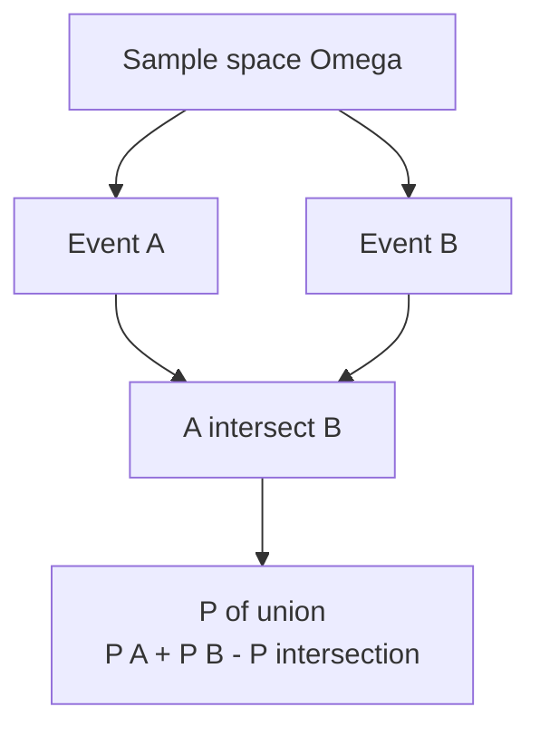
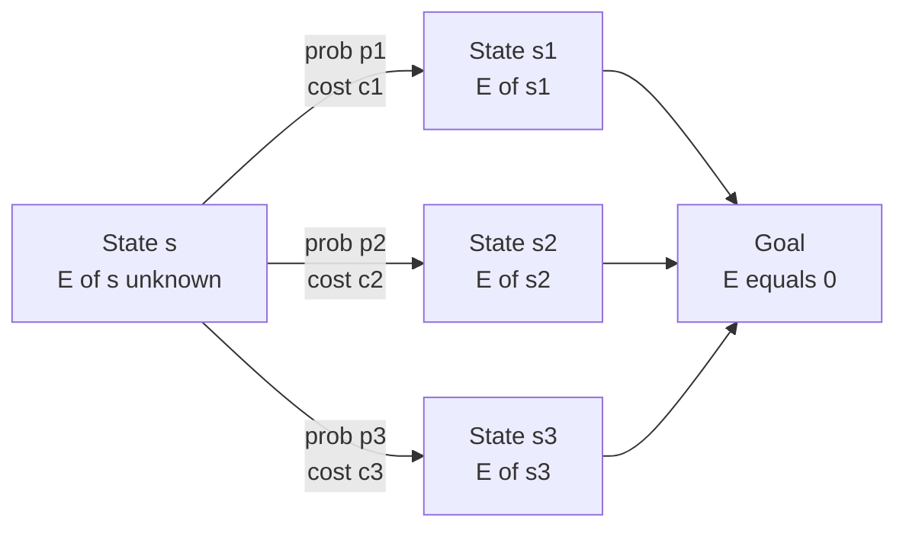

# Probability & Expectation, Linearity of Expectation

Probability lets us reason precisely about random processes; **expectation** is the single most useful summary of a random quantity. This guide builds up sample spaces, conditional probability and independence, then defines expectation and develops its most powerful tool — **linearity of expectation**, which holds even when the variables are dependent. We finish with **expected-value DP** (including cyclic systems solved by Gaussian elimination) and how to carry probabilities as **modular rationals** when the answer must be reported $\bmod p$.

---

## Table of Contents

1. [Sample Spaces and Events](#sample-spaces-and-events)
2. [Conditional Probability and Independence](#conditional-probability-and-independence)
3. [Random Variables and Expectation](#random-variables-and-expectation)
4. [Linearity of Expectation](#linearity-of-expectation)
5. [Classic Linearity Examples](#classic-linearity-examples)
6. [Expected-Value DP](#expected-value-dp)
7. [Cyclic Systems and Gaussian Elimination](#cyclic-systems-and-gaussian-elimination)
8. [Expectation mod p](#expectation-mod-p)
9. [Complexity Summary](#complexity-summary)
10. [Common Pitfalls](#common-pitfalls)
11. [Patterns](#patterns)

---

## Sample Spaces and Events

A **sample space** $\Omega$ is the set of all possible outcomes of an experiment. An **event** $A \subseteq \Omega$ is a subset of outcomes. For a finite, equally-likely space,

$$
P(A) = \frac{|A|}{|\Omega|}.
$$

The probability axioms (Kolmogorov) are:

$$
0 \le P(A) \le 1, \qquad P(\Omega) = 1, \qquad P\!\left(\bigcup_i A_i\right) = \sum_i P(A_i) \ \text{for disjoint } A_i.
$$

Two immediate consequences are the complement rule $P(A^{c}) = 1 - P(A)$ and inclusion–exclusion for two events:

$$
P(A \cup B) = P(A) + P(B) - P(A \cap B).
$$



---

## Conditional Probability and Independence

The **conditional probability** of $A$ given $B$ (with $P(B) > 0$) is

$$
P(A \mid B) = \frac{P(A \cap B)}{P(B)}.
$$

Rearranging gives the **multiplication rule** $P(A \cap B) = P(A \mid B)\,P(B)$ and **Bayes' theorem**

$$
P(A \mid B) = \frac{P(B \mid A)\,P(A)}{P(B)}.
$$

Events $A$ and $B$ are **independent** iff $P(A \cap B) = P(A)\,P(B)$, equivalently $P(A \mid B) = P(A)$. Independence of variables is *not* required for linearity of expectation — that is what makes linearity so powerful.

The **law of total probability** partitions $\Omega$ into disjoint events $B_1,\dots,B_k$:

$$
P(A) = \sum_{i=1}^{k} P(A \mid B_i)\,P(B_i).
$$

```text
function bayes(P_A, P_B_given_A, P_B_given_notA):
    P_notA = 1 - P_A
    P_B = P_B_given_A * P_A + P_B_given_notA * P_notA
    return (P_B_given_A * P_A) / P_B
```

```python
def bayes(p_a: float, p_b_given_a: float, p_b_given_not_a: float) -> float:
    p_not_a = 1.0 - p_a
    p_b = p_b_given_a * p_a + p_b_given_not_a * p_not_a
    return (p_b_given_a * p_a) / p_b
```

```cpp
double bayes(double p_a, double p_b_given_a, double p_b_given_not_a) {
    double p_not_a = 1.0 - p_a;
    double p_b = p_b_given_a * p_a + p_b_given_not_a * p_not_a;
    return (p_b_given_a * p_a) / p_b;
}
```

---

## Random Variables and Expectation

A **random variable** $X$ assigns a real number to each outcome. Its **expectation** (mean) is the probability-weighted average of its values:

$$
E[X] = \sum_{x} x \, P(X = x),
$$

or for a discrete process over outcomes $\omega \in \Omega$,

$$
E[X] = \sum_{\omega \in \Omega} X(\omega)\, P(\omega).
$$

A particularly useful special case is the **indicator variable** $\mathbf{1}_A$, which equals $1$ when event $A$ occurs and $0$ otherwise. Its expectation is just the probability of the event:

$$
E[\mathbf{1}_A] = 1 \cdot P(A) + 0 \cdot P(A^{c}) = P(A).
$$

```text
function expectation(values, probs):
    e = 0
    for i in 0 .. len(values)-1:
        e = e + values[i] * probs[i]
    return e
```

```python
def expectation(values: list[float], probs: list[float]) -> float:
    return sum(v * p for v, p in zip(values, probs))
```

```cpp
double expectation(const vector<double>& values, const vector<double>& probs) {
    double e = 0.0;
    for (size_t i = 0; i < values.size(); ++i) {
        e += values[i] * probs[i];
    }
    return e;
}
```

---

## Linearity of Expectation

For **any** random variables $X$ and $Y$ — independent or not — and constants $a, b$:

$$
E[aX + bY] = a\,E[X] + b\,E[Y].
$$

More generally, for a sum of $n$ variables,

$$
E\!\left[\sum_{i=1}^{n} X_i\right] = \sum_{i=1}^{n} E[X_i].
$$

The reason this is so useful: combine it with **indicator variables**. To count the expected number of "successes" among $n$ events $A_1,\dots,A_n$, write $X = \sum_i \mathbf{1}_{A_i}$. Then

$$
E[X] = \sum_{i=1}^{n} E[\mathbf{1}_{A_i}] = \sum_{i=1}^{n} P(A_i),
$$

so you only ever need the probability of each *single* event, never the messy joint distribution.

---

## Classic Linearity Examples

**Expected number of fixed points of a random permutation.** Let $\pi$ be a uniformly random permutation of $\{1,\dots,n\}$ and $X$ the number of $i$ with $\pi(i)=i$. Let $\mathbf{1}_i$ indicate that $i$ is fixed; $P(\pi(i)=i) = 1/n$. Then

$$
E[X] = \sum_{i=1}^{n} P(\pi(i) = i) = n \cdot \frac{1}{n} = 1,
$$

independent of $n$ — even though the $\mathbf{1}_i$ are dependent.

**Balls in bins.** Throw $m$ balls independently and uniformly into $n$ bins. The expected number of balls in a fixed bin is $m/n$. The expected number of **empty** bins: bin $j$ is empty with probability $(1 - 1/n)^m$, so

$$
E[\text{empty bins}] = n\left(1 - \tfrac{1}{n}\right)^{m}.
$$

**Coupon collector.** There are $n$ coupon types; each draw is a uniformly random type. Let $T$ be the number of draws to collect all $n$. Once you hold $i$ distinct coupons, the probability a draw is new is $(n-i)/n$, so the expected draws to get the next new coupon is $n/(n-i)$ (a geometric variable). By linearity over the $n$ "phases":

$$
E[T] = \sum_{i=0}^{n-1} \frac{n}{n-i} = n \sum_{k=1}^{n} \frac{1}{k} = n H_n,
$$

where $H_n$ is the $n$-th harmonic number, and $E[T] \approx n \ln n$.

```text
function coupon_collector_expected(n):
    H = 0
    for k in 1 .. n:
        H = H + 1 / k
    return n * H
```

```python
def coupon_collector_expected(n: int) -> float:
    h = sum(1.0 / k for k in range(1, n + 1))
    return n * h
```

```cpp
double coupon_collector_expected(int n) {
    double h = 0.0;
    for (int k = 1; k <= n; ++k) {
        h += 1.0 / k;
    }
    return n * h;
}
```

---

## Expected-Value DP

When a process moves between **states**, define $E[s]$ = expected cost (or steps) to reach a goal starting from state $s$. From state $s$, with probability $p$ we pay cost $c$ and move to state $s'$:

$$
E[s] = \sum_{s'} p(s \to s') \,\bigl(c(s \to s') + E[s']\bigr).
$$

Terminal states have $E[\text{goal}] = 0$. If the state graph is a **DAG** (transitions only move "forward" toward the goal), evaluate states in reverse topological order and each $E[s]$ is a direct sum.



A canonical DAG example: expected number of fair-die rolls (faces $1..6$) to move from position $0$ to a target $\ge n$. Let $E[i]$ be the expected rolls from position $i$ with $E[i]=0$ for $i \ge n$:

$$
E[i] = 1 + \frac{1}{6}\sum_{f=1}^{6} E[i+f].
$$

```text
function expected_rolls(n):
    E = array of size n+1, E[i >= n] = 0
    for i from n-1 down to 0:
        s = 0
        for f in 1 .. 6:
            s = s + E[min(i + f, n)]
        E[i] = 1 + s / 6
    return E[0]
```

```python
def expected_rolls(n: int) -> float:
    E = [0.0] * (n + 7)
    for i in range(n - 1, -1, -1):
        s = sum(E[min(i + f, n)] for f in range(1, 7))
        E[i] = 1.0 + s / 6.0
    return E[0]
```

```cpp
double expected_rolls(int n) {
    vector<double> E(n + 7, 0.0);
    for (int i = n - 1; i >= 0; --i) {
        double s = 0.0;
        for (int f = 1; f <= 6; ++f) {
            s += E[min(i + f, n)];
        }
        E[i] = 1.0 + s / 6.0;
    }
    return E[0];
}
```

---

## Cyclic Systems and Gaussian Elimination

When transitions can return to a state already on the path (a **cycle**), $E[s]$ appears on both sides and the states are mutually recursive. The equations form a linear system $A\mathbf{x} = \mathbf{b}$ that you solve with **Gaussian elimination**.

A clean cyclic case: with probability $p$ a "step" succeeds and you finish, otherwise you repeat. Then $E = 1 + (1-p)E$, giving the closed form $E = 1/p$ (the geometric mean). For larger coupled systems, build the matrix and eliminate.

```text
function gaussian_solve(A, b):           # A is n x n, b length n
    n = len(b)
    for col in 0 .. n-1:
        pivot = row >= col with max |A[row][col]|
        swap rows col and pivot
        for row in col+1 .. n-1:
            factor = A[row][col] / A[col][col]
            subtract factor * row(col) from row(row), also b[row]
    back-substitute to recover x
    return x
```

```python
def gaussian_solve(A: list[list[float]], b: list[float]) -> list[float]:
    n = len(b)
    M = [row[:] + [b[i]] for i, row in enumerate(A)]
    for col in range(n):
        piv = max(range(col, n), key=lambda r: abs(M[r][col]))
        M[col], M[piv] = M[piv], M[col]
        for r in range(col + 1, n):
            factor = M[r][col] / M[col][col]
            for c in range(col, n + 1):
                M[r][c] -= factor * M[col][c]
    x = [0.0] * n
    for i in range(n - 1, -1, -1):
        s = M[i][n] - sum(M[i][j] * x[j] for j in range(i + 1, n))
        x[i] = s / M[i][i]
    return x
```

```cpp
vector<double> gaussian_solve(vector<vector<double>> A, vector<double> b) {
    int n = (int)b.size();
    for (int i = 0; i < n; ++i) A[i].push_back(b[i]);   // augmented column
    for (int col = 0; col < n; ++col) {
        int piv = col;
        for (int r = col + 1; r < n; ++r)
            if (fabs(A[r][col]) > fabs(A[piv][col])) piv = r;
        swap(A[col], A[piv]);
        for (int r = col + 1; r < n; ++r) {
            double factor = A[r][col] / A[col][col];
            for (int c = col; c <= n; ++c) A[r][c] -= factor * A[col][c];
        }
    }
    vector<double> x(n, 0.0);
    for (int i = n - 1; i >= 0; --i) {
        double s = A[i][n];
        for (int j = i + 1; j < n; ++j) s -= A[i][j] * x[j];
        x[i] = s / A[i][i];
    }
    return x;
}
```

---

## Expectation mod p

Probabilities are rationals $\frac{a}{b}$. When the answer must be reported modulo a prime $p$ (typically $p = 10^9 + 7$), represent $\frac{a}{b}$ as $a \cdot b^{-1} \bmod p$, where $b^{-1}$ is the **modular inverse** computed via Fermat's little theorem $b^{-1} \equiv b^{\,p-2} \pmod p$. All expectation arithmetic (addition, the $1/6$ factor, geometric $1/p$) then happens in the modular field.

$$
\frac{a}{b} \bmod p \equiv a \cdot b^{p-2} \bmod p.
$$

```text
function inv(b, MOD):  return power(b, MOD-2, MOD)
function exp_dice_mod(n, MOD):
    inv6 = inv(6, MOD)
    E[i >= n] = 0
    for i from n-1 down to 0:
        s = sum of E[min(i+f, n)] for f in 1..6  (mod)
        E[i] = (1 + s * inv6) mod MOD
    return E[0]
```

```python
MOD = 1_000_000_007

def power(base: int, exp: int, mod: int) -> int:
    result = 1
    base %= mod
    while exp:
        if exp & 1:
            result = result * base % mod
        base = base * base % mod
        exp >>= 1
    return result

def inv(b: int, mod: int = MOD) -> int:
    return power(b, mod - 2, mod)

def exp_dice_mod(n: int) -> int:
    inv6 = inv(6)
    E = [0] * (n + 7)
    for i in range(n - 1, -1, -1):
        s = 0
        for f in range(1, 7):
            s = (s + E[min(i + f, n)]) % MOD
        E[i] = (1 + s * inv6) % MOD
    return E[0]
```

```cpp
const long long MOD = 1e9 + 7;

long long power(long long base, long long exp, long long mod) {
    long long result = 1;
    base %= mod;
    while (exp) {
        if (exp & 1) result = result * base % mod;
        base = base * base % mod;
        exp >>= 1;
    }
    return result;
}

long long inv(long long b) { return power(b, MOD - 2, MOD); }

long long exp_dice_mod(int n) {
    long long inv6 = inv(6);
    vector<long long> E(n + 7, 0);
    for (int i = n - 1; i >= 0; --i) {
        long long s = 0;
        for (int f = 1; f <= 6; ++f) s = (s + E[min(i + f, n)]) % MOD;
        E[i] = (1 + s * inv6) % MOD;
    }
    return E[0];
}
```

---

## Complexity Summary

| Technique | Time | Space |
| --- | --- | --- |
| Single expectation / indicator sum | $O(n)$ | $O(1)$ |
| Coupon collector $nH_n$ | $O(n)$ | $O(1)$ |
| DAG expected-value DP | $O(\text{states} \times \text{transitions})$ | $O(\text{states})$ |
| Cyclic system (Gaussian elimination) | $O(s^3)$ for $s$ states | $O(s^2)$ |
| Expectation mod $p$ (per inverse) | $O(\log p)$ | $O(1)$ |

---

## Common Pitfalls

- **Assuming independence to use linearity** — linearity needs none. Conversely, $E[XY] = E[X]E[Y]$ *does* require independence; do not confuse the two.
- **Forgetting the $+1$ (or $+c$) cost** in expected-value DP transitions — each move usually costs one step.
- **Self-loops in DP** — a transition $s \to s$ makes $E[s]$ appear on both sides; isolate it algebraically ($E = 1 + qE \Rightarrow E = 1/(1-q)$) or use Gaussian elimination.
- **Dividing in modular space** — never use `/`; multiply by the modular inverse. Ensure denominators are coprime to $p$.
- **Float precision** for very long chains — prefer modular rationals or `long double` / `Fraction` when accumulation error grows.
- **Wrong base case** — terminal/goal states must have $E = 0$, not $1$.

---

## Patterns

- **Count something? Reach for indicators + linearity.** Expected count of events = sum of their individual probabilities.
- **"Expected steps to reach a target"** ⇒ expected-value DP; check whether the state graph is a DAG (evaluate in reverse) or has cycles (linear system).
- **Geometric waiting time** ⇒ expected trials until first success with probability $p$ is $1/p$.
- **Phased collection (coupon collector style)** ⇒ split into stages where each stage is geometric, then sum expectations.
- **Answer mod $p$** ⇒ carry every probability as $a \cdot b^{-1} \bmod p$ from the start; never convert at the end.
- **Symmetry** ⇒ identical sub-events share the same probability, so $E[\text{count}] = n \cdot p_{\text{single}}$.
