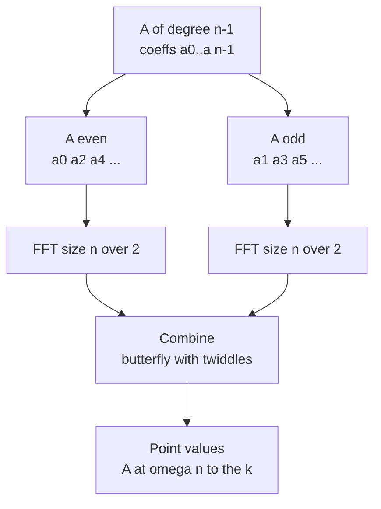

# FFT / NTT: Polynomial Multiplication & Convolutions

Polynomial multiplication is the same operation as **convolution**, and it shows up everywhere: multiplying big integers, counting pairs by sum, string matching, signal processing, and probability. The naive method costs $O(n^2)$. The **Fast Fourier Transform (FFT)** and its integer cousin the **Number Theoretic Transform (NTT)** reduce this to $O(n\log n)$ by transforming polynomials into *point-value* form, multiplying pointwise, and transforming back.

This guide builds the idea from scratch: convolution → the DFT and roots of unity → the Cooley–Tukey FFT → numerical pitfalls → exact NTT modulo $998244353$ → applications.

## Table of Contents

- [Convolution and Polynomial Multiplication](#convolution-and-polynomial-multiplication)
- [The Naive O(n^2) Algorithm](#the-naive-on2-algorithm)
- [Point-Value Representation](#point-value-representation)
- [Roots of Unity and the DFT](#roots-of-unity-and-the-dft)
- [The Cooley–Tukey FFT](#the-cooleytukey-fft)
- [Iterative Bit-Reversal FFT](#iterative-bit-reversal-fft)
- [Inverse FFT and Full Multiplication](#inverse-fft-and-full-multiplication)
- [Numerical Precision Pitfalls of double FFT](#numerical-precision-pitfalls-of-double-fft)
- [NTT: Exact Integer Convolution](#ntt-exact-integer-convolution)
- [Applications](#applications)
- [Complexity Summary](#complexity-summary)
- [Common Pitfalls](#common-pitfalls)
- [Patterns](#patterns)

## Convolution and Polynomial Multiplication

A polynomial of degree $n-1$ is a coefficient vector $a = (a_0, a_1, \dots, a_{n-1})$ representing

$$A(x) = \sum_{i=0}^{n-1} a_i x^i.$$

Multiplying two polynomials $A(x)$ and $B(x)$ gives $C(x) = A(x)B(x)$ whose coefficients are the **convolution** of $a$ and $b$:

$$c_k = \sum_{i=0}^{k} a_i \, b_{k-i}, \qquad k = 0, 1, \dots, (n_a - 1) + (n_b - 1).$$

If $A$ has $n_a$ coefficients and $B$ has $n_b$ coefficients, then $C$ has $n_a + n_b - 1$ coefficients. Every "multiply two sequences and sum the overlaps" problem is secretly this formula.

## The Naive O(n^2) Algorithm

The definition translates directly into a double loop.

```python
def convolve_naive(a, b):
    n, m = len(a), len(b)
    c = [0] * (n + m - 1)
    for i in range(n):
        for j in range(m):
            c[i + j] += a[i] * b[j]
    return c
```

```cpp
#include <bits/stdc++.h>
using namespace std;

vector<long long> convolve_naive(const vector<long long>& a,
                                 const vector<long long>& b) {
    int n = (int)a.size(), m = (int)b.size();
    vector<long long> c(n + m - 1, 0);
    for (int i = 0; i < n; ++i)
        for (int j = 0; j < m; ++j)
            c[i + j] += a[i] * b[j];
    return c;
}
```

This is $O(n_a \cdot n_b)$. For $n \approx 10^5$ it is already $10^{10}$ operations — too slow. FFT fixes this.

## Point-Value Representation

A degree $n-1$ polynomial is uniquely determined by its values at $n$ distinct points. So instead of storing coefficients, we can store

$$\{(x_0, A(x_0)), (x_1, A(x_1)), \dots, (x_{n-1}, A(x_{n-1}))\}.$$

The key insight: in **point-value form**, multiplication is *pointwise* and therefore $O(n)$:

$$C(x_j) = A(x_j) \cdot B(x_j).$$

The whole game becomes:

1. **Evaluate** $A$ and $B$ at the same $2n$ points (we need enough points for the product's degree).
2. Multiply the values pointwise — cheap.
3. **Interpolate** back to coefficients of $C$.

Evaluation and interpolation are normally $O(n^2)$. The FFT performs both in $O(n\log n)$ by choosing the points cleverly: the **complex roots of unity**.

## Roots of Unity and the DFT

The $n$-th roots of unity are the complex numbers $\omega_n^k = e^{2\pi i k / n}$ for $k = 0, \dots, n-1$. They are equally spaced on the unit circle and satisfy two magical properties that make divide-and-conquer work:

- **Squaring (halving):** $(\omega_n^k)^2 = \omega_{n/2}^k$.
- **Symmetry:** $\omega_n^{k + n/2} = -\omega_n^k$.

The **Discrete Fourier Transform** evaluates a polynomial at all $n$ roots of unity:

$$\hat{a}_k = A(\omega_n^k) = \sum_{j=0}^{n-1} a_j \, \omega_n^{jk}.$$

The inverse DFT recovers coefficients from values:

$$a_j = \frac{1}{n} \sum_{k=0}^{n-1} \hat{a}_k \, \omega_n^{-jk}.$$

Note the inverse uses conjugate roots $\omega_n^{-jk}$ and a $1/n$ scaling — the only differences from the forward transform.

## The Cooley–Tukey FFT

Cooley–Tukey splits a polynomial by **even and odd** indexed coefficients:

$$A(x) = A_{\text{even}}(x^2) + x \, A_{\text{odd}}(x^2),$$

where $A_{\text{even}}$ holds $a_0, a_2, a_4, \dots$ and $A_{\text{odd}}$ holds $a_1, a_3, a_5, \dots$. Evaluating at $\omega_n^k$ and using the halving/symmetry properties lets us compute two half-size DFTs and combine them in $O(n)$, giving the recurrence $T(n) = 2T(n/2) + O(n) = O(n\log n)$.



The combine step (a **butterfly**) for each $k < n/2$ is:

$$\hat{a}_k = E_k + \omega_n^k O_k, \qquad \hat{a}_{k + n/2} = E_k - \omega_n^k O_k,$$

where $E_k$ and $O_k$ are the even/odd half-transforms and $\omega_n^k$ is the **twiddle factor**.

## Iterative Bit-Reversal FFT

The recursion above is elegant but the recursive calls are slow and stack-heavy. The standard competitive version is **iterative**: first permute the array into bit-reversal order, then build the transform bottom-up in $\log n$ rounds of butterflies. The input length must be a power of two (pad with zeros).

```python
import cmath

def fft(a, invert):
    n = len(a)
    # bit-reversal permutation
    j = 0
    for i in range(1, n):
        bit = n >> 1
        while j & bit:
            j ^= bit
            bit >>= 1
        j ^= bit
        if i < j:
            a[i], a[j] = a[j], a[i]
    # butterflies, doubling block length each round
    length = 2
    while length <= n:
        angle = (2 * cmath.pi / length) * (-1 if invert else 1)
        wlen = cmath.exp(1j * angle)
        for start in range(0, n, length):
            w = 1 + 0j
            for k in range(length // 2):
                u = a[start + k]
                v = a[start + k + length // 2] * w
                a[start + k] = u + v
                a[start + k + length // 2] = u - v
                w *= wlen
        length <<= 1
    if invert:
        for i in range(n):
            a[i] /= n
    return a
```

```cpp
#include <bits/stdc++.h>
using namespace std;

void fft(vector<complex<double>>& a, bool invert) {
    int n = (int)a.size();
    // bit-reversal permutation
    for (int i = 1, j = 0; i < n; ++i) {
        int bit = n >> 1;
        for (; j & bit; bit >>= 1)
            j ^= bit;
        j ^= bit;
        if (i < j)
            swap(a[i], a[j]);
    }
    // butterflies, doubling block length each round
    for (int len = 2; len <= n; len <<= 1) {
        double ang = 2 * acos(-1.0) / len * (invert ? -1 : 1);
        complex<double> wlen(cos(ang), sin(ang));
        for (int start = 0; start < n; start += len) {
            complex<double> w(1, 0);
            for (int k = 0; k < len / 2; ++k) {
                complex<double> u = a[start + k];
                complex<double> v = a[start + k + len / 2] * w;
                a[start + k] = u + v;
                a[start + k + len / 2] = u - v;
                w *= wlen;
            }
        }
    }
    if (invert)
        for (complex<double>& x : a)
            x /= n;
}
```

## Inverse FFT and Full Multiplication

To multiply, pad both inputs to a power of two $\ge n_a + n_b - 1$, forward-transform both, multiply pointwise, inverse-transform, and round to the nearest integer.

```python
def multiply_fft(a, b):
    result_size = len(a) + len(b) - 1
    n = 1
    while n < result_size:
        n <<= 1
    fa = [complex(x) for x in a] + [0j] * (n - len(a))
    fb = [complex(x) for x in b] + [0j] * (n - len(b))
    fft(fa, False)
    fft(fb, False)
    for i in range(n):
        fa[i] *= fb[i]
    fft(fa, True)
    return [round(fa[i].real) for i in range(result_size)]
```

```cpp
#include <bits/stdc++.h>
using namespace std;

vector<long long> multiply_fft(const vector<long long>& a,
                               const vector<long long>& b) {
    int result_size = (int)a.size() + (int)b.size() - 1;
    int n = 1;
    while (n < result_size)
        n <<= 1;
    vector<complex<double>> fa(a.begin(), a.end());
    vector<complex<double>> fb(b.begin(), b.end());
    fa.resize(n);
    fb.resize(n);
    fft(fa, false);
    fft(fb, false);
    for (int i = 0; i < n; ++i)
        fa[i] *= fb[i];
    fft(fa, true);
    vector<long long> c(result_size);
    for (int i = 0; i < result_size; ++i)
        c[i] = llround(fa[i].real());
    return c;
}
```

## Numerical Precision Pitfalls of double FFT

`complex<double>` carries about 15–16 significant decimal digits. Each butterfly accumulates tiny rounding errors, and the final coefficients can be large. If a true coefficient is an integer near $10^{15}$, the rounding noise can exceed $0.5$ and `round` lands on the wrong integer.

Roughly, the safe bound for double FFT is

$$n \cdot \max|a_i| \cdot \max|b_i| \lesssim 10^{15}.$$

When coefficients or lengths are big — or when the answer must be taken modulo a prime exactly — `double` FFT becomes unreliable. The fixes are: split coefficients into high/low halves (a "two-FFT" or "four-multiplication" trick), use `long double`, or switch to **NTT**, which is exact.

## NTT: Exact Integer Convolution

The NTT replaces complex roots of unity with **modular** roots of unity in a finite field $\mathbb{Z}_p$. We need a prime $p$ such that $p - 1$ is divisible by a large power of two, plus a **primitive root** $g$. The classic choice is

$$p = 998244353 = 119 \cdot 2^{23} + 1, \qquad g = 3.$$

Because $2^{23} \mid p - 1$, there exist $2^k$-th roots of unity mod $p$ for any $k \le 23$, so the same butterfly structure works — but with modular arithmetic, giving **exact** integer results (each output reduced mod $p$). The structure is identical to the FFT; only the twiddle factors change to $g^{(p-1)/\text{len}} \bmod p$.

```python
MOD = 998244353
G = 3

def ntt(a, invert):
    n = len(a)
    j = 0
    for i in range(1, n):
        bit = n >> 1
        while j & bit:
            j ^= bit
            bit >>= 1
        j ^= bit
        if i < j:
            a[i], a[j] = a[j], a[i]
    length = 2
    while length <= n:
        if invert:
            wlen = pow(G, MOD - 1 - (MOD - 1) // length, MOD)
        else:
            wlen = pow(G, (MOD - 1) // length, MOD)
        for start in range(0, n, length):
            w = 1
            for k in range(length // 2):
                u = a[start + k]
                v = a[start + k + length // 2] * w % MOD
                a[start + k] = (u + v) % MOD
                a[start + k + length // 2] = (u - v) % MOD
                w = w * wlen % MOD
        length <<= 1
    if invert:
        n_inv = pow(n, MOD - 2, MOD)
        for i in range(n):
            a[i] = a[i] * n_inv % MOD
    return a

def multiply_ntt(a, b):
    result_size = len(a) + len(b) - 1
    n = 1
    while n < result_size:
        n <<= 1
    fa = [x % MOD for x in a] + [0] * (n - len(a))
    fb = [x % MOD for x in b] + [0] * (n - len(b))
    ntt(fa, False)
    ntt(fb, False)
    for i in range(n):
        fa[i] = fa[i] * fb[i] % MOD
    ntt(fa, True)
    return [fa[i] % MOD for i in range(result_size)]
```

```cpp
#include <bits/stdc++.h>
using namespace std;

const long long MOD = 998244353;
const long long G = 3;

long long power_mod(long long base, long long exp, long long mod) {
    long long result = 1 % mod;
    base %= mod;
    while (exp > 0) {
        if (exp & 1)
            result = result * base % mod;
        base = base * base % mod;
        exp >>= 1;
    }
    return result;
}

void ntt(vector<long long>& a, bool invert) {
    int n = (int)a.size();
    for (int i = 1, j = 0; i < n; ++i) {
        int bit = n >> 1;
        for (; j & bit; bit >>= 1)
            j ^= bit;
        j ^= bit;
        if (i < j)
            swap(a[i], a[j]);
    }
    for (int len = 2; len <= n; len <<= 1) {
        long long wlen = invert
            ? power_mod(G, MOD - 1 - (MOD - 1) / len, MOD)
            : power_mod(G, (MOD - 1) / len, MOD);
        for (int start = 0; start < n; start += len) {
            long long w = 1;
            for (int k = 0; k < len / 2; ++k) {
                long long u = a[start + k];
                long long v = a[start + k + len / 2] * w % MOD;
                a[start + k] = (u + v) % MOD;
                a[start + k + len / 2] = (u - v % MOD + MOD) % MOD;
                w = w * wlen % MOD;
            }
        }
    }
    if (invert) {
        long long n_inv = power_mod(n, MOD - 2, MOD);
        for (long long& x : a)
            x = x * n_inv % MOD;
    }
}

vector<long long> multiply_ntt(const vector<long long>& a,
                               const vector<long long>& b) {
    int result_size = (int)a.size() + (int)b.size() - 1;
    int n = 1;
    while (n < result_size)
        n <<= 1;
    vector<long long> fa(n, 0), fb(n, 0);
    for (size_t i = 0; i < a.size(); ++i) fa[i] = ((a[i] % MOD) + MOD) % MOD;
    for (size_t i = 0; i < b.size(); ++i) fb[i] = ((b[i] % MOD) + MOD) % MOD;
    ntt(fa, false);
    ntt(fb, false);
    for (int i = 0; i < n; ++i)
        fa[i] = fa[i] * fb[i] % MOD;
    ntt(fa, true);
    fa.resize(result_size);
    return fa;
}
```

## Applications

**Big-integer multiplication.** Treat each integer's base-$10$ (or base-$10^k$) digits as polynomial coefficients, convolve, then propagate carries. This is how arbitrary-precision libraries multiply huge numbers fast.

**String matching with wildcards.** Encode mismatches as a sum of products. For a pattern $P$ and text $T$ over an alphabet, the mismatch count at each alignment can be written as a convolution; wildcards are handled by zeroing their contribution. Reversing one string turns "correlation" into "convolution".

**Counting pairs by sum.** Build a frequency vector $f$ where $f[v]$ is how many array elements equal $v$. The **self-convolution** $f * f$ gives, at index $s$, the number of ordered pairs $(i, j)$ with $a_i + a_j = s$ (including $i = j$). See the dedicated problem file.

**Probability and counting.** The distribution of the sum of two independent integer random variables is the convolution of their distributions — dice sums, subset-sum counts, and generating-function coefficient extraction all reduce to FFT/NTT.

## Complexity Summary

| Operation | Naive | FFT / NTT |
| --- | --- | --- |
| Polynomial multiply / convolution | $O(n^2)$ | $O(n \log n)$ |
| Forward / inverse transform | $O(n^2)$ DFT | $O(n \log n)$ |
| Pointwise multiply | — | $O(n)$ |
| Big-integer multiply ($d$ digits) | $O(d^2)$ | $O(d \log d)$ |
| Self-convolution (pairs by sum) | $O(V^2)$ | $O(V \log V)$ |

Space is $O(n)$ for all transforms (in-place butterflies on a padded power-of-two array).

## Common Pitfalls

- **Forgetting to pad to a power of two** that is at least $n_a + n_b - 1$. Padding to only $\max(n_a, n_b)$ causes wraparound (cyclic convolution).
- **Rounding too early in double FFT.** Round only the final real parts; intermediate values are complex.
- **Precision overflow.** If $n \cdot \max|a| \cdot \max|b| \gtrsim 10^{15}$, `double` FFT gives wrong integers — use NTT or coefficient splitting.
- **Negative results in NTT.** After `u - v`, add `MOD` before reducing so values stay in $[0, p)$.
- **Wrong inverse twiddle.** The inverse transform uses conjugate/inverse roots and must divide by $n$ (multiply by $n^{-1} \bmod p$ in NTT).
- **NTT modulus mismatch.** $998244353$ only supports transform sizes up to $2^{23}$. For larger sizes or other moduli, use CRT across several NTT primes.
- **Off-by-one in result size.** The product has exactly $n_a + n_b - 1$ meaningful coefficients; trailing transform slots are padding.

## Patterns

- **Coefficient ↔ point-value duality.** Hard in one representation, easy in the other; FFT is the $O(n\log n)$ bridge.
- **Evaluate, multiply pointwise, interpolate.** The universal three-step shape of every FFT/NTT multiplication.
- **Divide by parity.** Splitting on even/odd indices plus roots-of-unity symmetry is the engine of Cooley–Tukey.
- **Exactness via finite fields.** When floating point is risky, swap the complex unit circle for modular roots of unity (NTT).
- **Reduce to convolution.** Recognize "sum over $i$ of $a_i \cdot b_{k-i}$" — pair sums, polynomial powers, distributions, matching — then apply FFT/NTT.
