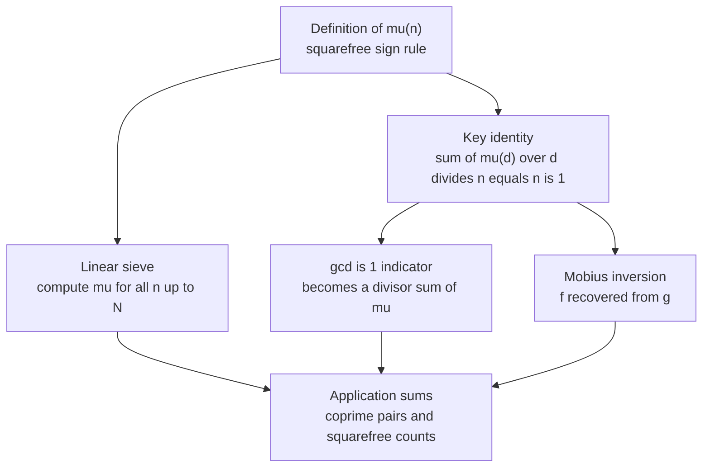

# Möbius Function and Möbius Inversion

The **Möbius function** $\mu(n)$ is one of the most useful tools in number theory for competitive programming. It turns awkward "for every pair count whether their gcd is 1" style problems into clean divisor sums, and it formalizes a powerful trick called **Möbius inversion** — recovering a function $f$ from its divisor-sum partner $g$.

This guide builds $\mu$ from its definition, computes it for all $n \le N$ with both a divisor sieve and the faster linear sieve, proves the cornerstone identity $\sum_{d \mid n} \mu(d) = [n = 1]$, states and uses Möbius inversion, and then applies everything to coprime-pair counting, squarefree counting, and divisor-sum manipulation.

## Table of Contents

1. [The Möbius Function](#the-möbius-function)
2. [Computing μ via a Divisor Sieve](#computing-μ-via-a-divisor-sieve)
3. [Computing μ via the Linear Sieve](#computing-μ-via-the-linear-sieve)
4. [The Key Identity](#the-key-identity)
5. [Möbius Inversion](#möbius-inversion)
6. [Application: Counting Coprime Pairs](#application-counting-coprime-pairs)
7. [Application: Counting Squarefree Numbers](#application-counting-squarefree-numbers)
8. [Divisor-Sum Manipulation Technique](#divisor-sum-manipulation-technique)
9. [Complexity Summary](#complexity-summary)
10. [Common Pitfalls](#common-pitfalls)
11. [Patterns](#patterns)

---

## The Möbius Function

For a positive integer $n$ with prime factorization $n = p_1^{a_1} p_2^{a_2} \cdots p_k^{a_k}$, the Möbius function is defined by

$$
\mu(n) =
\begin{cases}
1 & \text{if } n = 1, \\
(-1)^k & \text{if } n \text{ is a product of } k \text{ distinct primes (squarefree)}, \\
0 & \text{if } n \text{ is not squarefree (some } a_i \ge 2).
\end{cases}
$$

In words: $\mu(n)$ is $0$ whenever a squared prime divides $n$; otherwise it is $+1$ or $-1$ according to the parity of the number of prime factors.

A few values:

| $n$ | factorization | squarefree? | $\mu(n)$ |
| --- | --- | --- | --- |
| 1 | $1$ | yes | $+1$ |
| 2 | $2$ | yes | $-1$ |
| 3 | $3$ | yes | $-1$ |
| 4 | $2^2$ | no | $0$ |
| 6 | $2 \cdot 3$ | yes | $+1$ |
| 12 | $2^2 \cdot 3$ | no | $0$ |
| 30 | $2 \cdot 3 \cdot 5$ | yes | $-1$ |

$\mu$ is **multiplicative**: if $\gcd(a, b) = 1$ then $\mu(ab) = \mu(a)\,\mu(b)$. This is exactly the property that makes the linear sieve able to compute it.

A direct (per-number) computation by factorization:

```
function mobius(n):
    result = 1
    for each prime p dividing n:
        if p*p divides n: return 0   # not squarefree
        result = -result             # one more distinct prime
    return result
```

```python
def mobius(n: int) -> int:
    result = 1
    p = 2
    while p * p <= n:
        if n % p == 0:
            n //= p
            if n % p == 0:        # p^2 divides original n
                return 0
            result = -result      # one more distinct prime
        p += 1
    if n > 1:                     # a leftover prime factor
        result = -result
    return result
```

```cpp
int mobius(long long n) {
    int result = 1;
    for (long long p = 2; p * p <= n; ++p) {
        if (n % p == 0) {
            n /= p;
            if (n % p == 0) return 0;   // p^2 divides original n
            result = -result;           // one more distinct prime
        }
    }
    if (n > 1) result = -result;        // a leftover prime factor
    return result;
}
```

---

## Computing μ via a Divisor Sieve

When we need $\mu(n)$ for **all** $n \le N$, a sieve is far better than factoring each number. The simplest version mirrors the Sieve of Eratosthenes: start with $\mu[i] = 1$, and for every prime $p$, flip the sign of every multiple of $p$, then zero out every multiple of $p^2$.

```
mu[1..N] = 1
for p = 2..N:
    if p is prime:
        for multiple m = p, 2p, 3p, ... <= N:
            mu[m] *= -1                  # account for prime factor p
        for multiple m = p*p, 2*p*p, ... <= N:
            mu[m] = 0                    # p^2 | m  => not squarefree
```

```python
def mobius_sieve(N: int) -> list[int]:
    mu = [1] * (N + 1)
    is_prime = [True] * (N + 1)
    mu[0] = 0
    for p in range(2, N + 1):
        if is_prime[p]:
            for m in range(p, N + 1, p):
                if m != p:
                    is_prime[m] = False
                mu[m] *= -1               # one factor of p
            p2 = p * p
            for m in range(p2, N + 1, p2):
                mu[m] = 0                 # squared prime divides m
    return mu
```

```cpp
vector<int> mobius_sieve(int N) {
    vector<int> mu(N + 1, 1);
    vector<bool> is_prime(N + 1, true);
    mu[0] = 0;
    for (int p = 2; p <= N; ++p) {
        if (is_prime[p]) {
            for (int m = p; m <= N; m += p) {
                if (m != p) is_prime[m] = false;
                mu[m] *= -1;              // one factor of p
            }
            long long p2 = 1LL * p * p;
            for (long long m = p2; m <= N; m += p2)
                mu[m] = 0;                // squared prime divides m
        }
    }
    return mu;
}
```

This runs in $O(N \log \log N)$ time — perfectly fine up to $N \approx 10^7$.

---

## Computing μ via the Linear Sieve

The **linear sieve** computes $\mu$ (and the list of primes) in $O(N)$ by ensuring each composite is struck exactly once, by its smallest prime factor. The Möbius rules drop right out of multiplicativity:

- $\mu(1) = 1$.
- If $p$ is prime, $\mu(p) = -1$.
- When marking $m = p \cdot i$ where $p$ is the smallest prime factor:
  - if $p \mid i$, then $p^2 \mid m$, so $\mu(m) = 0$;
  - otherwise $\gcd(p, i) = 1$, so $\mu(m) = -\mu(i)$.

```
primes = []
mu[1] = 1
for i = 2..N:
    if i not marked: mu[i] = -1; primes.add(i)
    for each prime p in primes with p*i <= N:
        mark p*i
        if i % p == 0: mu[p*i] = 0; break     # smallest prime factor repeats
        else:          mu[p*i] = -mu[i]
```

```python
def linear_mobius(N: int) -> list[int]:
    mu = [0] * (N + 1)
    primes = []
    is_composite = [False] * (N + 1)
    mu[1] = 1
    for i in range(2, N + 1):
        if not is_composite[i]:
            primes.append(i)
            mu[i] = -1
        for p in primes:
            if i * p > N:
                break
            is_composite[i * p] = True
            if i % p == 0:
                mu[i * p] = 0            # p^2 divides i*p
                break
            else:
                mu[i * p] = -mu[i]       # one more distinct prime
    return mu
```

```cpp
vector<int> linear_mobius(int N) {
    vector<int> mu(N + 1, 0);
    vector<int> primes;
    vector<bool> is_composite(N + 1, false);
    mu[1] = 1;
    for (int i = 2; i <= N; ++i) {
        if (!is_composite[i]) {
            primes.push_back(i);
            mu[i] = -1;
        }
        for (int p : primes) {
            if (1LL * i * p > N) break;
            is_composite[i * p] = true;
            if (i % p == 0) {
                mu[i * p] = 0;           // p^2 divides i*p
                break;
            } else {
                mu[i * p] = -mu[i];      // one more distinct prime
            }
        }
    }
    return mu;
}
```

---

## The Key Identity

Everything Möbius-related rests on a single identity. For every positive integer $n$,

$$
\sum_{d \mid n} \mu(d) = [\,n = 1\,] =
\begin{cases}
1 & n = 1, \\
0 & n > 1.
\end{cases}
$$

**Why it holds.** If $n = 1$ the only divisor is $1$ and $\mu(1) = 1$. For $n > 1$, only squarefree divisors contribute (others have $\mu = 0$). Write the distinct primes of $n$ as $p_1, \dots, p_k$. The squarefree divisors correspond to subsets of these primes, and a subset of size $j$ contributes $(-1)^j$. Summing over all subsets:

$$
\sum_{d \mid n} \mu(d) = \sum_{j=0}^{k} \binom{k}{j} (-1)^j = (1 - 1)^k = 0.
$$

This is the engine behind the "$[\gcd = 1]$ becomes a divisor sum" trick:

$$
[\gcd(a, b) = 1] = \sum_{d \mid \gcd(a, b)} \mu(d) = \sum_{d \mid a,\; d \mid b} \mu(d).
$$

---

## Möbius Inversion

The identity generalizes into the **Möbius inversion formula**, which inverts divisor-sum relationships. If two arithmetic functions $f$ and $g$ satisfy

$$
g(n) = \sum_{d \mid n} f(d) \qquad \text{for all } n,
$$

then $f$ can be recovered from $g$:

$$
f(n) = \sum_{d \mid n} \mu(d)\, g\!\left(\frac{n}{d}\right) = \sum_{d \mid n} \mu\!\left(\frac{n}{d}\right) g(d).
$$

There is also a "summatory / over-multiples" form, frequently the one used in problems: if

$$
g(n) = \sum_{n \mid m} f(m) \quad\Longleftrightarrow\quad f(n) = \sum_{n \mid m} \mu\!\left(\frac{m}{n}\right) g(m).
$$

The diagram below ties the sieve, the key identity, and inversion together.



---

## Application: Counting Coprime Pairs

Given an array, how many ordered pairs $(i, j)$ have $\gcd(a_i, a_j) = 1$? Let $\text{cnt}[d]$ be the number of array elements divisible by $d$. Using the indicator trick:

$$
\sum_{i} \sum_{j} [\gcd(a_i, a_j) = 1]
= \sum_{i, j} \sum_{d \mid a_i,\; d \mid a_j} \mu(d)
= \sum_{d \ge 1} \mu(d) \cdot \text{cnt}[d]^2.
$$

The clean special case "how many coprime pairs $(i, j)$ with $1 \le i, j \le n$" replaces $\text{cnt}[d]$ with $\lfloor n/d \rfloor$:

$$
\sum_{i=1}^{n} \sum_{j=1}^{n} [\gcd(i, j) = 1] = \sum_{d=1}^{n} \mu(d) \left\lfloor \frac{n}{d} \right\rfloor^{2}.
$$

```python
def coprime_pairs_upto(n: int) -> int:
    mu = linear_mobius(n)
    total = 0
    for d in range(1, n + 1):
        if mu[d] != 0:
            q = n // d
            total += mu[d] * q * q
    return total
```

```cpp
long long coprime_pairs_upto(int n) {
    vector<int> mu = linear_mobius(n);
    long long total = 0;
    for (int d = 1; d <= n; ++d) {
        if (mu[d] != 0) {
            long long q = n / d;
            total += 1LL * mu[d] * q * q;
        }
    }
    return total;
}
```

---

## Application: Counting Squarefree Numbers

A number is squarefree when no $p^2$ divides it. The count of squarefree integers in $[1, n]$ is

$$
Q(n) = \sum_{d=1}^{\lfloor \sqrt{n} \rfloor} \mu(d) \left\lfloor \frac{n}{d^2} \right\rfloor.
$$

Intuition: $\lfloor n/d^2 \rfloor$ counts multiples of $d^2$; inclusion–exclusion over $d$ (weighted by $\mu(d)$) removes those divisible by some squared prime exactly once. Only $d \le \sqrt{n}$ matter since $d^2 \le n$.

```python
def count_squarefree(n: int) -> int:
    import math
    limit = int(math.isqrt(n))
    mu = linear_mobius(limit)
    total = 0
    for d in range(1, limit + 1):
        if mu[d] != 0:
            total += mu[d] * (n // (d * d))
    return total
```

```cpp
long long count_squarefree(long long n) {
    long long limit = (long long)sqrtl((long double)n);
    while ((limit + 1) * (limit + 1) <= n) ++limit;
    while (limit * limit > n) --limit;
    vector<int> mu = linear_mobius((int)limit);
    long long total = 0;
    for (long long d = 1; d <= limit; ++d) {
        if (mu[d] != 0)
            total += 1LL * mu[d] * (n / (d * d));
    }
    return total;
}
```

---

## Divisor-Sum Manipulation Technique

Many sums of the form $\sum_{i,j} h(\gcd(i, j))$ collapse with the same recipe:

1. Replace the gcd-dependent term by grouping pairs whose gcd is a fixed $g$.
2. Substitute $i = g\,i'$, $j = g\,j'$ with $\gcd(i', j') = 1$.
3. Expand the coprimality indicator $[\gcd(i', j') = 1] = \sum_{d \mid \gcd} \mu(d)$.
4. Swap the order of summation so $d$ is outermost, leaving simple floor-division counts.

For example, $\sum_{i=1}^{n}\sum_{j=1}^{n} \gcd(i, j)$ becomes

$$
\sum_{g=1}^{n} g \sum_{d=1}^{\lfloor n/g \rfloor} \mu(d) \left\lfloor \frac{n}{gd} \right\rfloor^{2},
$$

or, regrouping by $t = gd$ and using $\sum_{d \mid t} d\,\mu(t/d) = \varphi(t)$ (Euler's totient),

$$
\sum_{i=1}^{n}\sum_{j=1}^{n} \gcd(i, j) = \sum_{t=1}^{n} \varphi(t) \left\lfloor \frac{n}{t} \right\rfloor^{2}.
$$

That last identity — Möbius collapsing into the totient — is the single most reused fact in gcd-sum problems.

```python
def sum_gcd_pairs(n: int) -> int:
    # phi via linear sieve
    phi = list(range(n + 1))
    for p in range(2, n + 1):
        if phi[p] == p:               # p is prime
            for m in range(p, n + 1, p):
                phi[m] -= phi[m] // p
    total = 0
    for t in range(1, n + 1):
        q = n // t
        total += phi[t] * q * q
    return total
```

```cpp
long long sum_gcd_pairs(int n) {
    vector<long long> phi(n + 1);
    for (int i = 0; i <= n; ++i) phi[i] = i;
    for (int p = 2; p <= n; ++p) {
        if (phi[p] == p) {            // p is prime
            for (int m = p; m <= n; m += p)
                phi[m] -= phi[m] / p;
        }
    }
    long long total = 0;
    for (int t = 1; t <= n; ++t) {
        long long q = n / t;
        total += phi[t] * q * q;
    }
    return total;
}
```

---

## Complexity Summary

| Task | Time | Space |
| --- | --- | --- |
| Single $\mu(n)$ by trial division | $O(\sqrt{n})$ | $O(1)$ |
| Divisor sieve for all $\mu \le N$ | $O(N \log \log N)$ | $O(N)$ |
| Linear sieve for all $\mu \le N$ | $O(N)$ | $O(N)$ |
| Coprime pairs up to $n$ | $O(n)$ after sieve | $O(n)$ |
| Squarefree count in $[1, n]$ | $O(\sqrt{n})$ after sieve of $\sqrt{n}$ | $O(\sqrt{n})$ |
| Gcd-sum $\sum \gcd(i,j)$ via $\varphi$ | $O(n \log \log n)$ | $O(n)$ |

---

## Common Pitfalls

- **Off-by-one on $\mu[0]$.** $\mu$ is only defined for $n \ge 1$. Leave index $0$ as $0$ and never read it.
- **Sign initialization in the divisor sieve.** Start with $\mu[i] = 1$, flip per prime, then zero $p^2$ multiples. Doing the zeroing before the flips corrupts values.
- **Overflow.** $\text{cnt}[d]^2$ and $\lfloor n/d \rfloor^2$ can exceed 32 bits. Use `long long` in C++; Python is exact by default.
- **Iterating zero terms.** Skipping $d$ where $\mu(d) = 0$ is an easy constant-factor win and avoids accidental contributions.
- **Squarefree bound.** Only $d \le \lfloor \sqrt{n} \rfloor$ matter; looping to $n$ both wastes time and reads $\mu$ out of its sieved range.
- **Confusing inversion directions.** "Over divisors" ($g(n) = \sum_{d \mid n} f(d)$) and "over multiples" ($g(n) = \sum_{n \mid m} f(m)$) invert with $\mu$ placed differently. Pick the matching form.

---

## Patterns

- **Indicator-to-divisor-sum.** Replace $[\gcd = 1]$ with $\sum_{d \mid \gcd} \mu(d)$, then swap summation order so $d$ is outermost.
- **Count-by-divisor.** Precompute $\text{cnt}[d] = $ (#values divisible by $d$); many answers are $\sum_d \mu(d) \cdot \text{(function of cnt}[d])$.
- **Floor blocks.** $\lfloor n/d \rfloor$ takes only $O(\sqrt{n})$ distinct values; group equal blocks for $O(\sqrt n)$ evaluation of $\sum \mu(d) f(\lfloor n/d \rfloor)$.
- **Möbius ⇄ totient.** Recognize $\sum_{d \mid n} d\,\mu(n/d) = \varphi(n)$ to swap a double Möbius sum for a single totient sum.
- **Inclusion–exclusion in disguise.** $\mu$ is the sign-weighting of inclusion–exclusion over distinct prime factors; whenever you would write "subtract multiples of each prime, add back pairs…", $\mu$ packages it.
