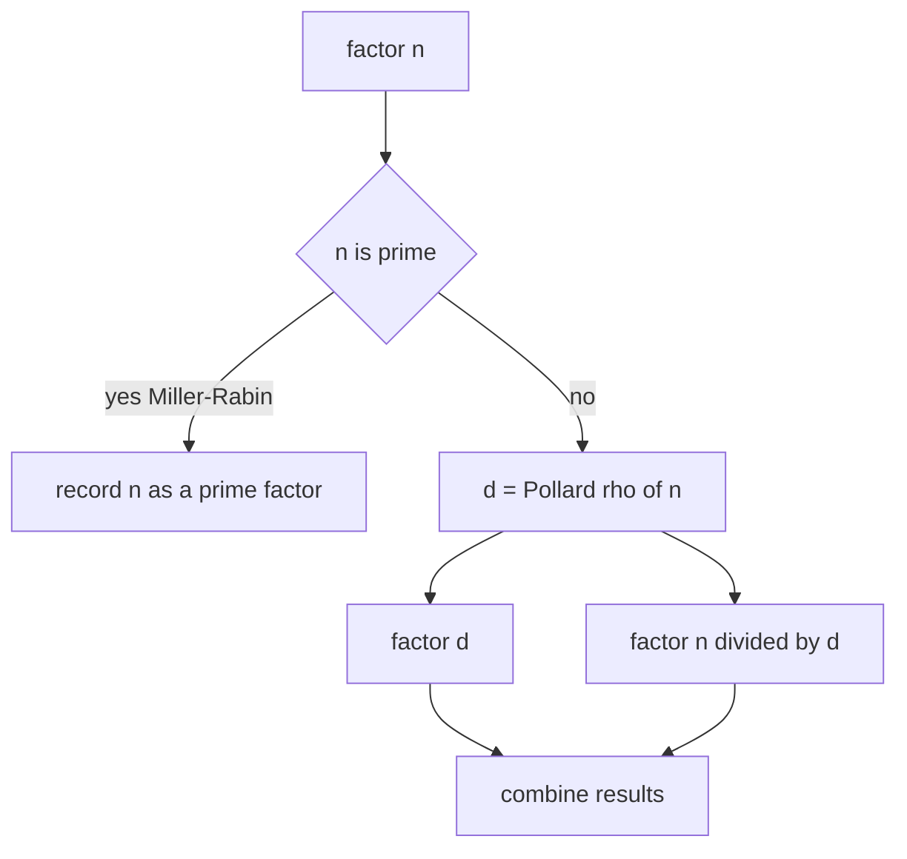
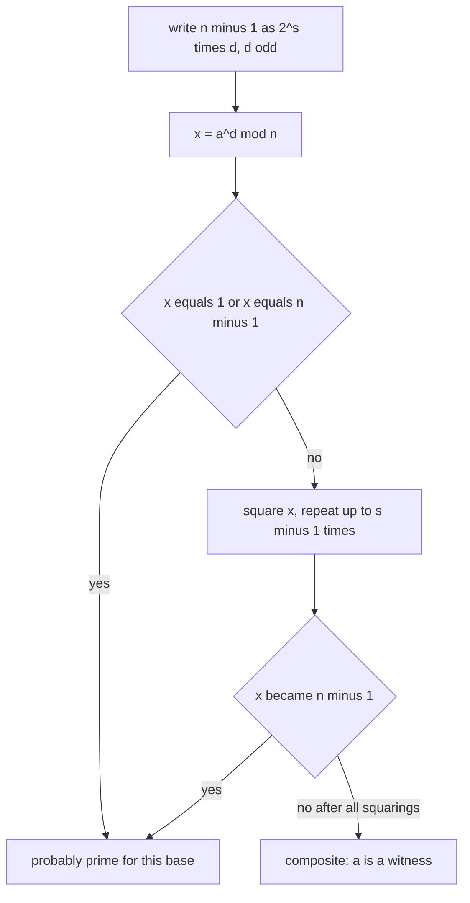
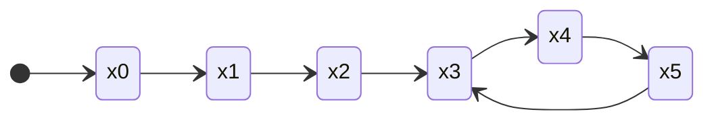
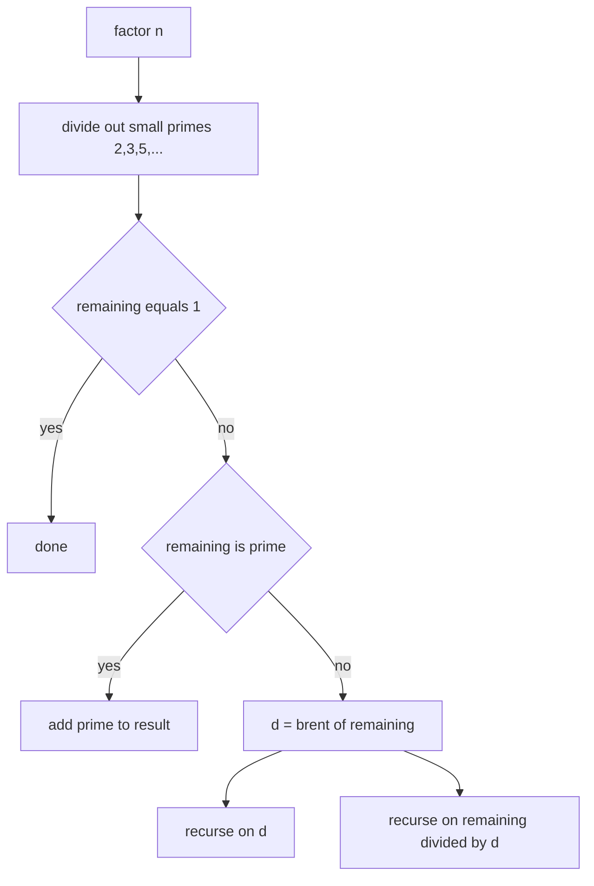

# Pollard's Rho Factorization (with Miller-Rabin Primality)

Factorizing a 64-bit integer is one of the great "looks impossible, is actually fast" results in competitive programming. A number $n$ as large as $10^{18}$ has a square root near $10^9$, so naive trial division is hopeless for many queries. Yet two probabilistic-but-practically-deterministic tools — **Miller-Rabin** for primality and **Pollard's rho** for finding a nontrivial factor — together factor such numbers in roughly $O(n^{1/4})$ time per factor.

This guide builds the full machinery from the ground up: fast modular multiplication for 64-bit operands, the deterministic Miller-Rabin test for $n < 2^{64}$, the rho cycle idea, Brent's batched-gcd improvement, and a recursive factorizer that ties everything together. Every code sample appears in **both Python and C++**.

## Table of Contents

- [Why Trial Division Fails](#why-trial-division-fails)
- [64-bit Modular Multiplication](#64-bit-modular-multiplication)
- [Fast Modular Exponentiation](#fast-modular-exponentiation)
- [Miller-Rabin Primality Test](#miller-rabin-primality-test)
- [Deterministic Witnesses for n < 2^64](#deterministic-witnesses-for-n--264)
- [Pollard's Rho: The Cycle Idea](#pollards-rho-the-cycle-idea)
- [Extracting a Factor with gcd](#extracting-a-factor-with-gcd)
- [Brent's Improvement](#brents-improvement)
- [Full Recursive Factorization](#full-recursive-factorization)
- [Complexity Summary](#complexity-summary)
- [Common Pitfalls](#common-pitfalls)
- [Patterns](#patterns)

## Why Trial Division Fails

To factor $n$ by trial division you test every candidate divisor up to $\sqrt n$. For $n \le 10^{18}$ that bound is $\sqrt n \le 10^9$. A single such factorization is already ~$10^9$ operations; with thousands of queries it is utterly hopeless.

Even the smallest-prime-factor sieve does not help: an SPF table of size $10^{18}$ cannot fit in memory. Sieves are for *ranges* of small numbers; here we have *individual* enormous numbers.

The way out is to separate two concerns:

1. **Is $n$ prime?** Answered in $O(\log^3 n)$ by Miller-Rabin — no factor needed.
2. **If composite, find *one* nontrivial factor.** Answered in expected $O(n^{1/4})$ by Pollard's rho.

Recursing on the factor found gives a full factorization.



## 64-bit Modular Multiplication

Both Miller-Rabin and Pollard's rho compute $a \cdot b \bmod n$ where $a, b$ can be close to $2^{64}$. The product $a \cdot b$ overflows 64 bits, so we need a wider intermediate type.

In C++ the cleanest tool is the compiler builtin `__int128`: cast to it, multiply, take the modulus, cast back. In Python integers are arbitrary precision, so `(a * b) % n` is already exact — but we still wrap it in a named function so the two languages mirror each other.

**Pseudocode**

```
mulmod(a, b, n):
    return (a * b) mod n     # computed in a 128-bit-wide intermediate
```

```python
def mulmod(a: int, b: int, n: int) -> int:
    # Python ints are arbitrary precision, so no overflow is possible.
    return (a * b) % n
```

```cpp
#include <cstdint>

using u64 = uint64_t;
using u128 = __uint128_t;

u64 mulmod(u64 a, u64 b, u64 n) {
    // Widen to 128 bits so a*b cannot overflow before the modulus.
    return (u64)((u128)a * b % n);
}
```

> If `__int128` is unavailable, an alternative is binary (Russian-peasant) multiplication, or the Montgomery / `__builtin` 128-bit emulation. On all mainstream judges `__int128` is available with GCC/Clang.

## Fast Modular Exponentiation

Miller-Rabin needs $a^d \bmod n$ for large $d$. Use binary exponentiation: square the base while walking the bits of the exponent, multiplying the result in whenever a bit is set. Every multiply routes through `mulmod`.

**Pseudocode**

```
powmod(a, e, n):
    result = 1
    a = a mod n
    while e > 0:
        if e is odd: result = mulmod(result, a, n)
        a = mulmod(a, a, n)
        e = e >> 1
    return result
```

```python
def powmod(a: int, e: int, n: int) -> int:
    result = 1
    a %= n
    while e > 0:
        if e & 1:
            result = mulmod(result, a, n)
        a = mulmod(a, a, n)
        e >>= 1
    return result


if __name__ == "__main__":
    print(powmod(2, 10, 1000))  # 24  (1024 mod 1000)
```

```cpp
#include <cstdint>

using u64 = uint64_t;
using u128 = __uint128_t;

u64 mulmod(u64 a, u64 b, u64 n) {
    return (u64)((u128)a * b % n);
}

u64 powmod(u64 a, u64 e, u64 n) {
    u64 result = 1;
    a %= n;
    while (e > 0) {
        if (e & 1ULL) result = mulmod(result, a, n);
        a = mulmod(a, a, n);
        e >>= 1;
    }
    return result;
}
```

> Python actually has `pow(a, e, n)` built in and it is faster than a hand-rolled loop. The explicit version above keeps the parallel with C++ clear; real Python solutions may simply call `pow`.

## Miller-Rabin Primality Test

Miller-Rabin is built on Fermat's little theorem and the fact that in a field the only square roots of $1$ are $\pm 1$.

Write $n - 1 = 2^s \cdot d$ with $d$ odd. For a base $a$ coprime to $n$, compute $x = a^d \bmod n$. If $x = 1$ or $x = n-1$, base $a$ is satisfied. Otherwise square $x$ up to $s-1$ times; if it ever becomes $n-1$, the base is satisfied. If we exhaust the squarings without hitting $n-1$, then $a$ is a **witness** that $n$ is composite.

The key algebra: if $n$ is prime, then $a^{n-1} \equiv 1$, and walking back the chain of square roots

$$
a^{2^{s}d},\; a^{2^{s-1}d},\; \dots,\; a^{d}
$$

must pass through a $1$ that has a square root other than $\pm 1$ only when $n$ is composite. A composite $n$ fails for at least $3/4$ of bases — so a handful of well-chosen bases makes the test deterministic in our range.



## Deterministic Witnesses for n < 2^64

For arbitrary $n < 2^{64}$, testing the fixed set of bases

$$
\{2,\,3,\,5,\,7,\,11,\,13,\,17,\,19,\,23,\,29,\,31,\,37\}
$$

is **provably deterministic** — no composite below $2^{64}$ passes all of them. (Even the first seven, $\{2,3,5,7,11,13,17\}$, suffice below $3.2 \times 10^{18}$, but the full twelve are safe everywhere in 64-bit.)

Handle a few base cases first: $n < 2$ is not prime; $n$ in the small-prime set is prime; any even $n > 2$ or multiple of a small base is composite.

**Pseudocode**

```
is_prime(n):
    if n < 2: return false
    for p in [2,3,5,7,11,13,17,19,23,29,31,37]:
        if n == p: return true
        if n % p == 0: return false
    d = n - 1; s = 0
    while d even: d /= 2; s += 1
    for a in witnesses:
        x = powmod(a, d, n)
        if x == 1 or x == n-1: continue
        composite = true
        repeat s-1 times:
            x = mulmod(x, x, n)
            if x == n-1: composite = false; break
        if composite: return false
    return true
```

```python
def _check_composite(n: int, a: int, d: int, s: int) -> bool:
    x = powmod(a, d, n)
    if x == 1 or x == n - 1:
        return False
    for _ in range(s - 1):
        x = mulmod(x, x, n)
        if x == n - 1:
            return False
    return True  # a is a witness => n is composite


def is_prime(n: int) -> bool:
    if n < 2:
        return False
    small_primes = (2, 3, 5, 7, 11, 13, 17, 19, 23, 29, 31, 37)
    for p in small_primes:
        if n == p:
            return True
        if n % p == 0:
            return False
    d, s = n - 1, 0
    while d % 2 == 0:
        d //= 2
        s += 1
    for a in small_primes:
        if _check_composite(n, a, d, s):
            return False
    return True


if __name__ == "__main__":
    print(is_prime(1_000_000_007))            # True
    print(is_prime(1_000_000_000_000_000_003)) # True
    print(is_prime(1_000_000_000_000_000_000)) # False
```

```cpp
#include <cstdint>
#include <array>

using u64 = uint64_t;
using u128 = __uint128_t;

u64 mulmod(u64 a, u64 b, u64 n) { return (u64)((u128)a * b % n); }

u64 powmod(u64 a, u64 e, u64 n) {
    u64 result = 1;
    a %= n;
    while (e > 0) {
        if (e & 1ULL) result = mulmod(result, a, n);
        a = mulmod(a, a, n);
        e >>= 1;
    }
    return result;
}

bool check_composite(u64 n, u64 a, u64 d, int s) {
    u64 x = powmod(a, d, n);
    if (x == 1 || x == n - 1) return false;
    for (int i = 0; i < s - 1; ++i) {
        x = mulmod(x, x, n);
        if (x == n - 1) return false;
    }
    return true;  // a is a witness => n is composite
}

bool is_prime(u64 n) {
    if (n < 2) return false;
    static const std::array<u64, 12> bases = {
        2, 3, 5, 7, 11, 13, 17, 19, 23, 29, 31, 37};
    for (u64 p : bases) {
        if (n == p) return true;
        if (n % p == 0) return false;
    }
    u64 d = n - 1;
    int s = 0;
    while ((d & 1ULL) == 0) { d >>= 1; ++s; }
    for (u64 a : bases) {
        if (check_composite(n, a, d, s)) return false;
    }
    return true;
}
```

## Pollard's Rho: The Cycle Idea

Suppose $n$ is composite with an unknown prime factor $p \le \sqrt n$. Pollard's rho generates a pseudo-random sequence

$$
x_{i+1} = f(x_i) = x_i^2 + c \pmod n
$$

for some constant $c$. Reduced modulo the hidden factor $p$, this same sequence must eventually **cycle** — and by the birthday paradox the cycle appears after about $\sqrt p \le n^{1/4}$ steps.

When two indices $i, j$ satisfy $x_i \equiv x_j \pmod p$ but $x_i \not\equiv x_j \pmod n$, the difference $x_i - x_j$ is a multiple of $p$ but not of $n$. Therefore

$$
\gcd(|x_i - x_j|,\, n)
$$

is a nontrivial factor of $n$. We never know $p$ in advance, but the gcd reveals it.

The sequence's shape — a tail leading into a loop — looks like the Greek letter $\rho$, which gives the algorithm its name.



To detect the cycle without storing all values, use **Floyd's tortoise and hare**: a slow pointer advances one step, a fast pointer two steps. They meet inside the loop. At each step compute $\gcd(|\text{slow} - \text{fast}|, n)$.

## Extracting a Factor with gcd

A naive Floyd-based rho:

**Pseudocode**

```
pollard_rho(n):
    if n even: return 2
    while true:
        c = random in [1, n-1]
        f(x) = (x*x + c) mod n
        x = y = 2
        d = 1
        while d == 1:
            x = f(x)
            y = f(f(y))
            d = gcd(abs(x - y), n)
        if d != n: return d   # success
        # d == n means failure; retry with a new c
```

```python
import random
from math import gcd


def pollard_rho(n: int) -> int:
    if n % 2 == 0:
        return 2
    while True:
        c = random.randrange(1, n)
        f = lambda x: (mulmod(x, x, n) + c) % n
        x = y = 2
        d = 1
        while d == 1:
            x = f(x)
            y = f(f(y))
            d = gcd(abs(x - y), n)
        if d != n:
            return d


if __name__ == "__main__":
    print(pollard_rho(91))  # 7 or 13
```

```cpp
#include <cstdint>
#include <numeric>
#include <random>

using u64 = uint64_t;
using u128 = __uint128_t;

u64 mulmod(u64 a, u64 b, u64 n) { return (u64)((u128)a * b % n); }

u64 pollard_rho(u64 n) {
    if (n % 2 == 0) return 2;
    static std::mt19937_64 rng(0xC0FFEE);
    while (true) {
        u64 c = rng() % (n - 1) + 1;
        auto f = [&](u64 x) { return (mulmod(x, x, n) + c) % n; };
        u64 x = 2, y = 2, d = 1;
        while (d == 1) {
            x = f(x);
            y = f(f(y));
            u64 diff = x > y ? x - y : y - x;
            d = std::gcd(diff, n);
        }
        if (d != n) return d;
    }
}
```

## Brent's Improvement

Two refinements make rho dramatically faster in practice:

1. **Brent's cycle detection** replaces the tortoise/hare with a geometric schedule: keep one fixed reference point, advance the other in powers of two, and you reach the meeting point with fewer $f$ evaluations.
2. **Batched gcd.** A `gcd` call is far costlier than a `mulmod`. Instead of one gcd per step, **accumulate the product** of many $|x - y|$ values modulo $n$ and take a single gcd of that product every ~128 steps. One gcd then "covers" a whole batch.

If the accumulated product ever becomes $0 \bmod n$ (overshooting the factor), back off and process the batch step by step.

**Pseudocode**

```
brent(n):
    if n even: return 2
    c = random; m = 128
    y = random; g = q = 1
    r = 1
    while g == 1:
        x = y
        repeat r times: y = f(y)
        k = 0
        while k < r and g == 1:
            ys = y
            for i in range(min(m, r - k)):
                y = f(y)
                q = mulmod(q, abs(x - y), n)
            g = gcd(q, n)
            k += m
        r *= 2
    if g == n:
        repeat: ys = f(ys); g = gcd(abs(x - ys), n) until g > 1
    return g
```

```python
import random
from math import gcd


def brent(n: int) -> int:
    if n % 2 == 0:
        return 2
    y = random.randrange(1, n)
    c = random.randrange(1, n)
    m = 128
    g = q = r = 1
    x = ys = y
    f = lambda v: (mulmod(v, v, n) + c) % n
    while g == 1:
        x = y
        for _ in range(r):
            y = f(y)
        k = 0
        while k < r and g == 1:
            ys = y
            for _ in range(min(m, r - k)):
                y = f(y)
                q = mulmod(q, abs(x - y), n)
            g = gcd(q, n)
            k += m
        r *= 2
    if g == n:  # batch overshot; redo step by step
        while True:
            ys = f(ys)
            g = gcd(abs(x - ys), n)
            if g > 1:
                break
    return g


if __name__ == "__main__":
    print(brent(10_000_000_019 * 3))  # a nontrivial factor
```

```cpp
#include <cstdint>
#include <numeric>
#include <random>
#include <algorithm>

using u64 = uint64_t;
using u128 = __uint128_t;

u64 mulmod(u64 a, u64 b, u64 n) { return (u64)((u128)a * b % n); }

static inline u64 absdiff(u64 a, u64 b) { return a > b ? a - b : b - a; }

u64 brent(u64 n) {
    if (n % 2 == 0) return 2;
    static std::mt19937_64 rng(0xBADC0DE);
    u64 y = rng() % (n - 1) + 1;
    u64 c = rng() % (n - 1) + 1;
    const u64 m = 128;
    u64 g = 1, q = 1, r = 1;
    u64 x = y, ys = y;
    auto f = [&](u64 v) { return (mulmod(v, v, n) + c) % n; };
    while (g == 1) {
        x = y;
        for (u64 i = 0; i < r; ++i) y = f(y);
        u64 k = 0;
        while (k < r && g == 1) {
            ys = y;
            for (u64 i = 0; i < std::min(m, r - k); ++i) {
                y = f(y);
                q = mulmod(q, absdiff(x, y), n);
            }
            g = std::gcd(q, n);
            k += m;
        }
        r *= 2;
    }
    if (g == n) {  // batch overshot; redo step by step
        do {
            ys = f(ys);
            g = std::gcd(absdiff(x, ys), n);
        } while (g == 1);
    }
    return g;
}
```

## Full Recursive Factorization

Now combine the pieces. To factor $n$:

1. Strip small primes (especially $2$) directly — they make rho misbehave and are cheap to remove.
2. If what remains is $1$, stop.
3. If it is prime (Miller-Rabin), record it.
4. Otherwise find a factor $d$ with rho, then recurse on $d$ and on $n/d$.

Because rho may return a *composite* factor, the recursion is essential — keep splitting until every piece is prime.



```python
import random
from collections import Counter
from math import gcd


def _factor(n: int, out: Counter) -> None:
    if n == 1:
        return
    if is_prime(n):
        out[n] += 1
        return
    d = brent(n)
    _factor(d, out)
    _factor(n // d, out)


def factorize(n: int) -> Counter:
    out: Counter[int] = Counter()
    for p in (2, 3, 5, 7, 11, 13, 17, 19, 23, 29, 31, 37):
        while n % p == 0:
            out[p] += 1
            n //= p
    _factor(n, out)
    return out


if __name__ == "__main__":
    print(dict(factorize(1_000_000_000_000_000_000)))  # {2: 18, 5: 18}
    print(dict(factorize(600_851_475_143)))            # {71: 1, 839: 1, 1471: 1, 6857: 1}
```

```cpp
#include <bits/stdc++.h>
using namespace std;

using u64 = uint64_t;
using u128 = __uint128_t;

u64 mulmod(u64 a, u64 b, u64 n) { return (u64)((u128)a * b % n); }
u64 powmod(u64 a, u64 e, u64 n) {
    u64 r = 1; a %= n;
    while (e) { if (e & 1) r = mulmod(r, a, n); a = mulmod(a, a, n); e >>= 1; }
    return r;
}
bool check_composite(u64 n, u64 a, u64 d, int s) {
    u64 x = powmod(a, d, n);
    if (x == 1 || x == n - 1) return false;
    for (int i = 0; i < s - 1; ++i) { x = mulmod(x, x, n); if (x == n - 1) return false; }
    return true;
}
bool is_prime(u64 n) {
    if (n < 2) return false;
    for (u64 p : {2, 3, 5, 7, 11, 13, 17, 19, 23, 29, 31, 37}) {
        if (n == p) return true;
        if (n % p == 0) return false;
    }
    u64 d = n - 1; int s = 0;
    while ((d & 1) == 0) { d >>= 1; ++s; }
    for (u64 a : {2, 3, 5, 7, 11, 13, 17, 19, 23, 29, 31, 37})
        if (check_composite(n, a, d, s)) return false;
    return true;
}
static inline u64 absdiff(u64 a, u64 b) { return a > b ? a - b : b - a; }
u64 brent(u64 n) {
    if (n % 2 == 0) return 2;
    static mt19937_64 rng(0xBADC0DE);
    u64 y = rng() % (n - 1) + 1, c = rng() % (n - 1) + 1;
    const u64 m = 128;
    u64 g = 1, q = 1, r = 1, x = y, ys = y;
    auto f = [&](u64 v) { return (mulmod(v, v, n) + c) % n; };
    while (g == 1) {
        x = y;
        for (u64 i = 0; i < r; ++i) y = f(y);
        u64 k = 0;
        while (k < r && g == 1) {
            ys = y;
            for (u64 i = 0; i < min(m, r - k); ++i) { y = f(y); q = mulmod(q, absdiff(x, y), n); }
            g = gcd(q, n);
            k += m;
        }
        r *= 2;
    }
    if (g == n) do { ys = f(ys); g = gcd(absdiff(x, ys), n); } while (g == 1);
    return g;
}
void factor_rec(u64 n, map<u64, int>& out) {
    if (n == 1) return;
    if (is_prime(n)) { out[n]++; return; }
    u64 d = brent(n);
    factor_rec(d, out);
    factor_rec(n / d, out);
}
map<u64, int> factorize(u64 n) {
    map<u64, int> out;
    for (u64 p : {2, 3, 5, 7, 11, 13, 17, 19, 23, 29, 31, 37})
        while (n % p == 0) { out[p]++; n /= p; }
    factor_rec(n, out);
    return out;
}

int main() {
    for (auto [p, e] : factorize(600851475143ULL))
        cout << p << "^" << e << " ";
    cout << "\n";  // 71^1 839^1 1471^1 6857^1
    return 0;
}
```

## Complexity Summary

Let $n$ be the number to factor.

| Operation | Time | Notes |
|---|---|---|
| `mulmod` (C++) | $O(1)$ | 128-bit intermediate |
| `powmod` | $O(\log n)$ | binary exponentiation |
| Miller-Rabin (one base) | $O(\log^2 n)$ multiplications | $s + \log n$ steps of `mulmod` |
| Miller-Rabin (deterministic) | $O(\log^3 n)$ | 12 fixed bases |
| Pollard's rho (one factor) | expected $O(n^{1/4})$ | birthday bound on smallest factor |
| Full factorization | expected $O(n^{1/4}\log n)$ | rho per factor + recursion |

The dominant cost is finding the *largest* prime factor's split; each split touches $\le n^{1/4}$ values of $f$.

## Common Pitfalls

- **Overflow in `mulmod`.** Multiplying two numbers near $2^{64}$ without a 128-bit intermediate silently wraps and corrupts both Miller-Rabin and rho. Always use `__int128` (or arbitrary-precision Python ints).
- **Forgetting to strip the factor 2.** Pollard's rho with $f(x)=x^2+c$ struggles on even numbers; remove $2$ (and ideally other small primes) before calling rho.
- **Returning a composite from rho and not recursing.** Pollard's rho gives *a* factor, not a *prime* factor. You must re-test with Miller-Rabin and recurse.
- **The $d = n$ failure case.** Floyd-based rho can collapse to $\gcd = n$. Detect it and retry with a fresh random $c$ (and start value); never loop forever on one $c$.
- **Using too few Miller-Rabin bases.** For full 64-bit safety use the 12-base set; truncated sets are only valid below specific thresholds.
- **`gcd` of $0$.** Batched-gcd can drive the product to $0 \bmod n$; handle the overshoot by replaying the batch step by step.
- **Perfect powers / small $n$.** Test tiny $n$ and prime $n$ before invoking rho so the loop has a real composite to crack.

## Patterns

- **"Factor a single huge number (up to $10^{18}$)"** → strip small primes, then Miller-Rabin + Pollard's rho recursion.
- **"Test primality of many 64-bit numbers"** → deterministic Miller-Rabin alone, no factoring needed.
- **"Number / sum of divisors of a large $n$"** → factor with rho, then $\prod (e_i + 1)$ for the count or $\prod \frac{p_i^{e_i+1}-1}{p_i-1}$ for the sum.
- **"Is $n$ a perfect power / does it have a small factor?"** → quick trial division by primes up to a few thousand first; rho only for the stubborn remainder.
- **"Euler's totient of a large $n$"** → factor with rho, then $\phi(n) = n \prod (1 - 1/p_i)$.
