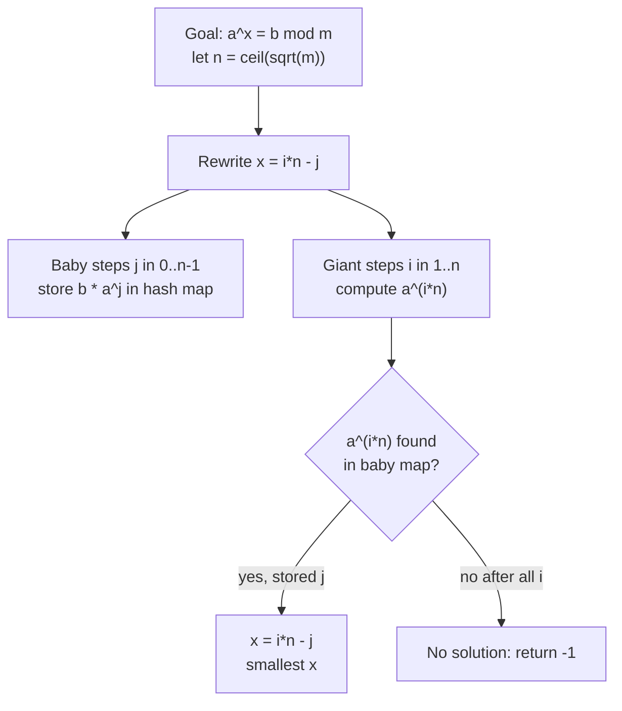
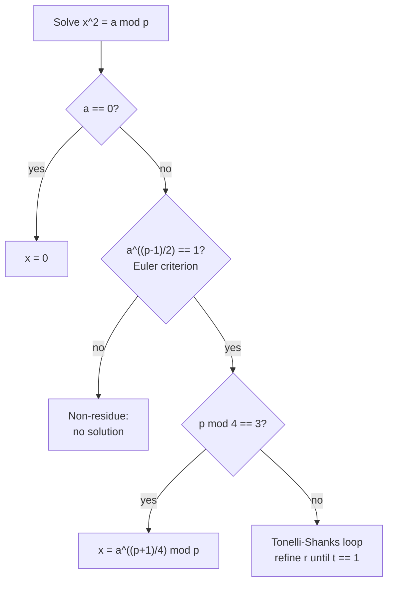

# Discrete Logarithm (Baby-Step Giant-Step) and Discrete Square Root (Tonelli–Shanks)

Two classic problems in modular arithmetic ask us to *invert* common operations modulo $m$:

- **Discrete logarithm**: given $a$, $b$, $m$, find $x$ such that $a^x \equiv b \pmod{m}$. This inverts exponentiation.
- **Discrete square root**: given $a$ and a prime $p$, find $x$ such that $x^2 \equiv a \pmod{p}$. This inverts squaring.

Both are "easy" in the forward direction (fast exponentiation, multiplication) but require clever algorithms to reverse. The discrete log is believed to be hard in general (its difficulty underpins Diffie–Hellman key exchange), yet **baby-step giant-step (BSGS)** solves it in $O(\sqrt{m})$ time. The discrete square root has an efficient randomized/deterministic solution via **Tonelli–Shanks**.

## Table of Contents

- [The Discrete Logarithm Problem](#the-discrete-logarithm-problem)
- [Baby-Step Giant-Step (Coprime Case)](#baby-step-giant-step-coprime-case)
- [Generalized BSGS (Non-Coprime Modulus)](#generalized-bsgs-non-coprime-modulus)
- [Quadratic Residues and the Euler Criterion](#quadratic-residues-and-the-euler-criterion)
- [Discrete Square Root via Tonelli–Shanks](#discrete-square-root-via-tonelli-shanks)
- [Complexity Summary](#complexity-summary)
- [Common Pitfalls](#common-pitfalls)
- [Patterns](#patterns)

## The Discrete Logarithm Problem

We want the smallest non-negative integer $x$ with

$$a^x \equiv b \pmod{m}.$$

A brute force scan tries $x = 0, 1, 2, \dots$ and stops when $a^x \equiv b$. Because the sequence of powers is eventually periodic with period at most $m$, we only need to check $x \in [0, m)$. That is $O(m)$ — too slow when $m$ is large (e.g. $m \approx 10^9$).

The key insight: we can **trade time for space** by splitting the exponent.

## Baby-Step Giant-Step (Coprime Case)

Assume $\gcd(a, m) = 1$ so $a$ is invertible modulo $m$. Write the unknown exponent as

$$x = i \cdot n - j, \qquad 0 \le j < n, \quad 1 \le i \le \lceil m / n \rceil,$$

where $n = \lceil \sqrt{m} \rceil$. Substituting,

$$a^{in - j} \equiv b \implies a^{in} \equiv b \cdot a^{j} \pmod{m}.$$

So we:

1. **Baby steps**: compute $b \cdot a^{j} \bmod m$ for $j = 0 \dots n-1$ and store each in a hash map `value -> j`.
2. **Giant steps**: let $g = a^{n} \bmod m$. Compute $g^{i} = a^{in} \bmod m$ for $i = 1 \dots \lceil m/n \rceil$ and look each up in the map. On a hit with stored $j$, the answer is $x = i \cdot n - j$.

Each side has $O(\sqrt{m})$ entries, giving $O(\sqrt{m})$ time (assuming $O(1)$ hash operations).

### Pseudocode

```
function BSGS(a, b, m):
    a %= m; b %= m
    n = ceil(sqrt(m))
    table = empty hash map
    cur = b
    for j in 0 .. n-1:
        table[cur] = j          # store b * a^j
        cur = cur * a % m
    g = a^n % m                 # giant stride
    cur = 1
    for i in 1 .. ceil(m/n):
        cur = cur * g % m       # cur = a^(i*n)
        if cur in table:
            return i*n - table[cur]
    return -1                   # no solution
```

Storing the **smallest** $j$ first (iterate $j$ ascending and only set if absent, or overwrite — overwriting with larger $j$ then taking the first giant hit still yields the minimal $x$ when handled carefully). The implementations below iterate $i$ ascending so the first match gives the minimal $x$.

```python
import math

def bsgs(a, b, m):
    """Smallest non-negative x with a^x == b (mod m), gcd(a, m) == 1. -1 if none."""
    a %= m
    b %= m
    if m == 1:
        return 0
    n = int(math.isqrt(m)) + 1
    # Baby steps: store b * a^j -> j (keep smallest j by writing only if absent).
    table = {}
    cur = b % m
    for j in range(n):
        if cur not in table:
            table[cur] = j
        cur = cur * a % m
    # Giant stride g = a^n.
    g = pow(a, n, m)
    cur = 1
    for i in range(1, n + 1):
        cur = cur * g % m
        if cur in table:
            x = i * n - table[cur]
            if x >= 0:
                return x
    return -1
```

```cpp
#include <bits/stdc++.h>
using namespace std;

// Smallest non-negative x with a^x == b (mod m), gcd(a, m) == 1. -1 if none.
long long bsgs(long long a, long long b, long long m) {
    a %= m;
    b %= m;
    if (m == 1) return 0;
    long long n = (long long)sqrt((double)m) + 1;
    // Baby steps: store b * a^j -> j (keep smallest j by writing only if absent).
    unordered_map<long long, long long> table;
    table.reserve(n * 2);
    long long cur = b % m;
    for (long long j = 0; j < n; ++j) {
        if (table.find(cur) == table.end()) table[cur] = j;
        cur = cur * a % m;
    }
    // Giant stride g = a^n.
    long long g = 1, base = a % m, e = n;
    while (e) {                 // g = a^n via fast exponentiation
        if (e & 1) g = g * base % m;
        base = base * base % m;
        e >>= 1;
    }
    cur = 1;
    for (long long i = 1; i <= n; ++i) {
        cur = cur * g % m;
        auto it = table.find(cur);
        if (it != table.end()) {
            long long x = i * n - it->second;
            if (x >= 0) return x;
        }
    }
    return -1;
}
```

### Mermaid: the Baby/Giant Split



## Generalized BSGS (Non-Coprime Modulus)

When $\gcd(a, m) \ne 1$, $a$ is not invertible and the rewrite above breaks. The fix is to **peel off the common factor repeatedly**.

Let $g = \gcd(a, m)$. If $g \nmid b$ then there is no solution **unless** $b = 1$ (which means $x = 0$). Otherwise divide through:

$$a^{x} \equiv b \pmod m \;\Longrightarrow\; \frac{a}{g}\, a^{x-1} \equiv \frac{b}{g} \pmod{\frac{m}{g}}.$$

We track a multiplier and reduce until $\gcd(a, m') = 1$, then run ordinary BSGS and add back the number of peeled steps. We also check small exponents directly so that solutions $x < \text{peels}$ are not missed.

### Pseudocode

```
function BSGS_general(a, b, m):
    a %= m; b %= m
    # Try small exponents first (covers x < number of reductions).
    cur = 1 % m
    for k in 0 .. 39:
        if cur == b: return k
        cur = cur * a % m
    # Peel out gcd until coprime.
    add = 0; mul = 1
    g = gcd(a, m)
    while g > 1:
        if b % g != 0: return -1
        b /= g; m /= g
        mul = mul * (a / g) % m
        add += 1
        g = gcd(a, m)
    # Now gcd(a, m) == 1. Solve mul * a^y == b (mod m), x = y + add.
    y = BSGS_coprime_with_prefix(a, b, m, mul)
    return (y == -1) ? -1 : y + add
```

```python
import math

def bsgs_general(a, b, m):
    """Smallest non-negative x with a^x == b (mod m), any m. -1 if none."""
    a %= m
    b %= m
    # Handle small x directly (covers x below the number of peels).
    cur = 1 % m
    for k in range(40):
        if cur == b % m:
            return k
        cur = cur * a % m
    add = 0
    mul = 1
    g = math.gcd(a, m)
    while g > 1:
        if b % g != 0:
            return -1
        b //= g
        m //= g
        mul = mul * (a // g) % m
        add += 1
        g = math.gcd(a, m)
    # Solve mul * a^y == b (mod m) with gcd(a, m) == 1.
    n = int(math.isqrt(m)) + 1
    table = {}
    cur = b % m
    for j in range(n):
        if cur not in table:
            table[cur] = j
        cur = cur * a % m
    gstride = pow(a, n, m)
    cur = mul % m
    for i in range(1, n + 1):
        cur = cur * gstride % m
        if cur in table:
            y = i * n - table[cur]
            if y >= 0:
                return y + add
    return -1
```

```cpp
#include <bits/stdc++.h>
using namespace std;

// Smallest non-negative x with a^x == b (mod m), any m. -1 if none.
long long bsgs_general(long long a, long long b, long long m) {
    a %= m;
    b %= m;
    // Handle small x directly (covers x below the number of peels).
    long long cur = 1 % m;
    for (long long k = 0; k < 40; ++k) {
        if (cur == b % m) return k;
        cur = cur * a % m;
    }
    long long add = 0, mul = 1;
    long long g = __gcd(a, m);
    while (g > 1) {
        if (b % g != 0) return -1;
        b /= g;
        m /= g;
        mul = mul * (a / g) % m;
        ++add;
        g = __gcd(a, m);
    }
    // Solve mul * a^y == b (mod m) with gcd(a, m) == 1.
    long long n = (long long)sqrt((double)m) + 1;
    unordered_map<long long, long long> table;
    table.reserve(n * 2);
    long long c = b % m;
    for (long long j = 0; j < n; ++j) {
        if (table.find(c) == table.end()) table[c] = j;
        c = c * a % m;
    }
    long long gstride = 1, base = a % m, e = n;
    while (e) {
        if (e & 1) gstride = gstride * base % m;
        base = base * base % m;
        e >>= 1;
    }
    c = mul % m;
    for (long long i = 1; i <= n; ++i) {
        c = c * gstride % m;
        auto it = table.find(c);
        if (it != table.end()) {
            long long y = i * n - it->second;
            if (y >= 0) return y + add;
        }
    }
    return -1;
}
```

## Quadratic Residues and the Euler Criterion

For an odd prime $p$ and $a \not\equiv 0 \pmod p$, $a$ is a **quadratic residue (QR)** if some $x$ satisfies $x^2 \equiv a \pmod p$. Exactly half of the non-zero residues are QRs.

**Euler's criterion** tests residuosity in $O(\log p)$:

$$a^{(p-1)/2} \equiv \begin{cases} +1 \pmod p & a \text{ is a quadratic residue},\\ -1 \pmod p & a \text{ is a non-residue}.\end{cases}$$

(The value is the Legendre symbol $\left(\frac{a}{p}\right)$.) The case $a \equiv 0$ is handled separately: $x = 0$.

```python
def is_quadratic_residue(a, p):
    """True if a is a QR mod odd prime p (a may be 0)."""
    a %= p
    if a == 0:
        return True
    return pow(a, (p - 1) // 2, p) == 1
```

```cpp
#include <bits/stdc++.h>
using namespace std;

long long power_mod(long long b, long long e, long long m) {
    long long r = 1 % m;
    b %= m;
    while (e) {
        if (e & 1) r = (__int128)r * b % m;
        b = (__int128)b * b % m;
        e >>= 1;
    }
    return r;
}

// True if a is a QR mod odd prime p (a may be 0).
bool is_quadratic_residue(long long a, long long p) {
    a %= p;
    if (a == 0) return true;
    return power_mod(a, (p - 1) / 2, p) == 1;
}
```

## Discrete Square Root via Tonelli–Shanks

Given a prime $p$ and a residue $a$ that is a QR, we want $x$ with $x^2 \equiv a \pmod p$. There are two square roots, $x$ and $p - x$.

### The $p \equiv 3 \pmod 4$ Shortcut

When $p \equiv 3 \pmod 4$, a closed form works:

$$x \equiv a^{(p+1)/4} \pmod p.$$

Check: $x^2 = a^{(p+1)/2} = a \cdot a^{(p-1)/2} \equiv a \cdot 1 = a$, using Euler's criterion ($a^{(p-1)/2} \equiv 1$ for a QR). One modular exponentiation suffices.

### The General Case (Tonelli–Shanks)

For $p \equiv 1 \pmod 4$ we use Tonelli–Shanks. Write $p - 1 = q \cdot 2^{s}$ with $q$ odd. Pick any quadratic **non-residue** $z$ (found by trial; about half of values qualify, so this is fast). Then iteratively refine a candidate root, lowering the "order" of an error term by squaring until it becomes $1$.

### Pseudocode

```
function tonelli_shanks(a, p):
    a %= p
    if a == 0: return 0
    if euler_criterion(a, p) != 1: return -1     # non-residue
    if p % 4 == 3: return a^((p+1)/4) mod p       # shortcut

    # Factor p-1 = q * 2^s, q odd.
    q = p - 1; s = 0
    while q even: q /= 2; s += 1

    # Find a non-residue z.
    z = 2
    while euler_criterion(z, p) != -1: z += 1

    m = s
    c = z^q mod p
    t = a^q mod p
    r = a^((q+1)/2) mod p
    while t != 1:
        # Find least i, 0 < i < m, with t^(2^i) == 1.
        i = 0; temp = t
        while temp != 1: temp = temp*temp mod p; i += 1
        b = c^(2^(m-i-1)) mod p
        m = i
        c = b*b mod p
        t = t*c mod p
        r = r*b mod p
    return r
```

```python
def tonelli_shanks(a, p):
    """A root x with x*x == a (mod p) for odd prime p, or -1 if a is a non-residue."""
    a %= p
    if a == 0:
        return 0
    if pow(a, (p - 1) // 2, p) != 1:
        return -1                       # non-residue
    if p % 4 == 3:
        return pow(a, (p + 1) // 4, p)  # shortcut

    # Factor p - 1 = q * 2^s with q odd.
    q = p - 1
    s = 0
    while q % 2 == 0:
        q //= 2
        s += 1

    # Find a quadratic non-residue z.
    z = 2
    while pow(z, (p - 1) // 2, p) != p - 1:
        z += 1

    m = s
    c = pow(z, q, p)
    t = pow(a, q, p)
    r = pow(a, (q + 1) // 2, p)
    while t != 1:
        # Smallest i with t^(2^i) == 1.
        i = 0
        temp = t
        while temp != 1:
            temp = temp * temp % p
            i += 1
        b = pow(c, 1 << (m - i - 1), p)
        m = i
        c = b * b % p
        t = t * c % p
        r = r * b % p
    return r
```

```cpp
#include <bits/stdc++.h>
using namespace std;

long long pmod(long long b, long long e, long long m) {
    long long r = 1 % m;
    b %= m;
    while (e) {
        if (e & 1) r = (__int128)r * b % m;
        b = (__int128)b * b % m;
        e >>= 1;
    }
    return r;
}

// A root x with x*x == a (mod p) for odd prime p, or -1 if a is a non-residue.
long long tonelli_shanks(long long a, long long p) {
    a %= p;
    if (a == 0) return 0;
    if (pmod(a, (p - 1) / 2, p) != 1) return -1;   // non-residue
    if (p % 4 == 3) return pmod(a, (p + 1) / 4, p); // shortcut

    // Factor p - 1 = q * 2^s with q odd.
    long long q = p - 1, s = 0;
    while (q % 2 == 0) { q /= 2; ++s; }

    // Find a quadratic non-residue z.
    long long z = 2;
    while (pmod(z, (p - 1) / 2, p) != p - 1) ++z;

    long long m = s;
    long long c = pmod(z, q, p);
    long long t = pmod(a, q, p);
    long long r = pmod(a, (q + 1) / 2, p);
    while (t != 1) {
        long long i = 0, temp = t;
        while (temp != 1) { temp = (__int128)temp * temp % p; ++i; }
        long long b = pmod(c, 1LL << (m - i - 1), p);
        m = i;
        c = (__int128)b * b % p;
        t = (__int128)t * c % p;
        r = (__int128)r * b % p;
    }
    return r;
}
```

### Mermaid: Choosing the Square-Root Path



## Complexity Summary

| Algorithm | Time | Space | Notes |
| --- | --- | --- | --- |
| Brute-force discrete log | $O(m)$ | $O(1)$ | Infeasible for large $m$ |
| BSGS (coprime) | $O(\sqrt{m})$ | $O(\sqrt{m})$ | Hash map of baby steps |
| Generalized BSGS | $O(\sqrt{m} + \log m)$ | $O(\sqrt{m})$ | $O(\log m)$ gcd peels |
| Euler criterion | $O(\log p)$ | $O(1)$ | One modular exponentiation |
| Tonelli–Shanks ($p\equiv3$) | $O(\log p)$ | $O(1)$ | Closed form $a^{(p+1)/4}$ |
| Tonelli–Shanks (general) | $O(\log^2 p)$ | $O(1)$ | Loop runs $\le s$ times |

## Common Pitfalls

- **Forgetting to reduce $a, b \bmod m$ first**, causing overflow or wrong matches.
- **Overflow in modular multiplication**: in C++ use `long long` and cast to `__int128` (or use a `mulmod`) when $m$ approaches $10^{18}$. For $m \le 10^9$ plain `long long` products are safe.
- **Assuming $\gcd(a,m)=1$**: plain BSGS silently fails for non-coprime moduli — use the generalized version and check small exponents first.
- **Missing the $x = 0$ solution** ($a^0 = 1$): always test $b \equiv 1$ / small exponents.
- **Tonelli–Shanks on a non-residue**: always verify with the Euler criterion before running, else the loop never terminates / returns garbage.
- **Not returning the smallest $x$**: store the smallest $j$ in the baby table and scan giant steps in increasing $i$.
- **Reporting only one square root**: remember $p - x$ is also a root; report both if the problem asks.

## Patterns

- **Meet in the middle on exponents**: BSGS is a meet-in-the-middle that balances $\sqrt{m}$ baby steps against $\sqrt{m}$ giant steps — the same idea reused whenever a search space factors as a product.
- **Test before you invert**: Euler's criterion is the cheap "does a solution exist?" gate before the expensive Tonelli–Shanks construction — mirror this "check feasibility, then construct" pattern.
- **Special-case the easy modulus**: $p \equiv 3 \pmod 4$ collapses square roots to a single exponentiation; always look for closed forms before general machinery.
- **Peel common factors**: when an operation is not invertible (non-coprime modulus), repeatedly divide out the gcd and track the offset — a recurring trick for linear congruences and CRT-style reductions.
