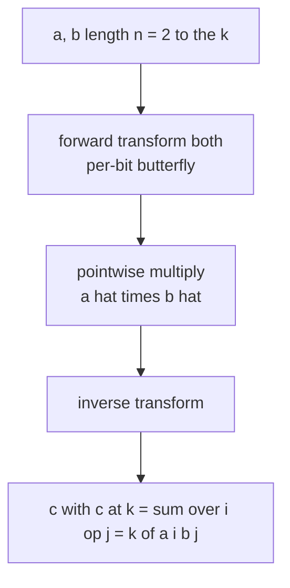
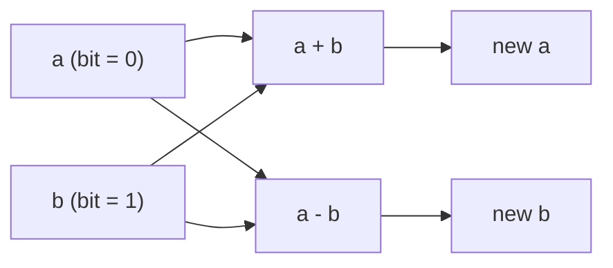

# FWHT: XOR / AND / OR Convolutions

Guide [12 (FFT/NTT)](12-fft-ntt-convolution.md) multiplies polynomials, i.e. it computes the **cyclic / additive** convolution $c_k = \sum_{i+j=k} a_i b_j$. But many problems ask for a *different* combining rule: instead of adding indices, we combine them with a **bitwise operation**:

$$c_k = \sum_{i \oplus j = k} a_i b_j \quad(\text{XOR}), \qquad c_k = \sum_{i \,\&\, j = k} a_i b_j \quad(\text{AND}), \qquad c_k = \sum_{i \mid j = k} a_i b_j \quad(\text{OR}).$$

These are convolutions over the group $\mathbb{Z}_2^k$ (the bit-vectors under XOR) and over the **subset lattice** (under AND/OR). The right transform is no longer the Fourier transform — it is the **Fast Walsh–Hadamard Transform (FWHT)** for XOR, and the **zeta/Möbius (SOS) transform** for AND/OR. The shape is identical to FFT, though: *transform both arrays, multiply pointwise, inverse transform*. This guide sits alongside guide 12 as the tool for a different kind of convolution.

## Table of Contents

- [Bitwise Convolutions](#bitwise-convolutions)
- [The Naive O(n^2) Algorithm](#the-naive-on2-algorithm)
- [Why a Transform Works: Diagonalizing the Group](#why-a-transform-works-diagonalizing-the-group)
- [The Walsh–Hadamard Transform for XOR](#the-walshhadamard-transform-for-xor)
- [The FWHT Butterfly](#the-fwht-butterfly)
- [Inverse FWHT and Full XOR Convolution](#inverse-fwht-and-full-xor-convolution)
- [AND and OR via SOS (Zeta / Möbius)](#and-and-or-via-sos-zeta--mobius)
- [FWHT Under a Modulus](#fwht-under-a-modulus)
- [When to Use FWHT vs FFT/NTT](#when-to-use-fwht-vs-fftntt)
- [Applications](#applications)
- [Complexity Summary](#complexity-summary)
- [Common Pitfalls](#common-pitfalls)
- [Patterns](#patterns)

## Bitwise Convolutions

Let $a$ and $b$ be arrays of length $n = 2^k$, indexed by the integers $0 \dots n-1$ (think of each index as a $k$-bit vector). For a binary operation $\circ \in \{\oplus, \&, \mid\}$, the **bitwise convolution** is

$$c_k = \sum_{i \circ j = k} a_i \, b_j.$$

For XOR, $i \oplus j = k$; for AND, $i \,\&\, j = k$; for OR, $i \mid j = k$. The output also has length $n$ (bitwise ops never produce an index outside $[0, n)$), so unlike polynomial multiplication there is **no growth** in length — the index set is closed under the operation.

A useful mental model: $a$ and $b$ are "distributions over bitmasks", and $c$ is the distribution of the result of combining one sample from each with $\circ$.

## The Naive O(n^2) Algorithm

The definition is a direct double loop. It works for all three operations by swapping the combiner.

```python
def xor_convolve_naive(a, b):
    n = len(a)
    c = [0] * n
    for i in range(n):
        for j in range(n):
            c[i ^ j] += a[i] * b[j]
    return c

def and_convolve_naive(a, b):
    n = len(a)
    c = [0] * n
    for i in range(n):
        for j in range(n):
            c[i & j] += a[i] * b[j]
    return c

def or_convolve_naive(a, b):
    n = len(a)
    c = [0] * n
    for i in range(n):
        for j in range(n):
            c[i | j] += a[i] * b[j]
    return c
```

```cpp
#include <bits/stdc++.h>
using namespace std;

vector<long long> xor_convolve_naive(const vector<long long>& a,
                                     const vector<long long>& b) {
    int n = (int)a.size();
    vector<long long> c(n, 0);
    for (int i = 0; i < n; ++i)
        for (int j = 0; j < n; ++j)
            c[i ^ j] += a[i] * b[j];
    return c;
}

vector<long long> and_convolve_naive(const vector<long long>& a,
                                     const vector<long long>& b) {
    int n = (int)a.size();
    vector<long long> c(n, 0);
    for (int i = 0; i < n; ++i)
        for (int j = 0; j < n; ++j)
            c[i & j] += a[i] * b[j];
    return c;
}

vector<long long> or_convolve_naive(const vector<long long>& a,
                                    const vector<long long>& b) {
    int n = (int)a.size();
    vector<long long> c(n, 0);
    for (int i = 0; i < n; ++i)
        for (int j = 0; j < n; ++j)
            c[i | j] += a[i] * b[j];
    return c;
}
```

This is $O(n^2)$. With $n = 2^{20} \approx 10^6$ it is hopeless. The transforms below make all three $O(n \log n)$.

## Why a Transform Works: Diagonalizing the Group

FFT works because the additive group $\mathbb{Z}_n$ has *characters* (the roots of unity) that turn convolution into pointwise multiplication. The same idea applies to **any finite abelian group**. The group here is $\mathbb{Z}_2^k$ — bit vectors under XOR. Its characters are the simplest possible: signs $\pm 1$.

Concretely, define the transform $\hat a$ so that the **convolution theorem** holds:

$$\widehat{(a \circ b)} = \hat a \cdot \hat b \quad(\text{pointwise}).$$

If we can compute $\hat a$ fast, then convolution is: transform, multiply pointwise, inverse transform. For XOR the right transform is Walsh–Hadamard; for AND/OR it is the superset/subset sum (SOS / zeta) transform. The three differ only in the $2 \times 2$ "butterfly" they apply per bit.



## The Walsh–Hadamard Transform for XOR

For XOR, the character of index $j$ evaluated at $i$ is $(-1)^{\langle i, j\rangle}$, where $\langle i, j\rangle = \operatorname{popcount}(i \,\&\, j) \bmod 2$ is the bitwise dot product. The **Walsh–Hadamard transform** is

$$\hat a_j = \sum_{i=0}^{n-1} (-1)^{\langle i, j\rangle} \, a_i.$$

Why does this linearize XOR? Because the characters are *multiplicative over XOR*:

$$(-1)^{\langle i_1, j\rangle}\,(-1)^{\langle i_2, j\rangle} = (-1)^{\langle i_1 \oplus i_2, j\rangle}.$$

So summing $a_{i_1} b_{i_2}$ over $i_1 \oplus i_2 = k$ becomes a plain product after transforming. Written as a matrix, $\hat a = H_n a$ where $H_n$ is the Hadamard matrix, built recursively as

$$H_1 = \begin{pmatrix} 1 \end{pmatrix}, \qquad H_{2m} = \begin{pmatrix} H_m & H_m \\ H_m & -H_m \end{pmatrix}.$$

This recursive block structure is exactly what gives an $O(n \log n)$ divide-and-conquer.

## The FWHT Butterfly

Splitting the array on the highest bit gives the recurrence. For each pair of indices that differ only in one bit — call the values $a$ (bit $=0$) and $b$ (bit $=1$) — the transform replaces them with their **sum and difference**:

$$(a, b) \longrightarrow (a + b,\; a - b).$$

We apply this butterfly for every bit position, sweeping the whole array $\log_2 n$ times. That is the entire algorithm.



Pseudocode for one forward pass (the inverse just divides by $n$ at the end):

```text
FWHT(arr):
    len = 1
    while len < n:
        for start in 0, 2*len, 4*len, ...:
            for k in 0 .. len-1:
                u = arr[start + k]
                v = arr[start + k + len]
                arr[start + k]       = u + v
                arr[start + k + len] = u - v
        len *= 2
```

```python
def fwht(a, invert=False):
    """In-place Walsh-Hadamard transform for XOR convolution."""
    n = len(a)
    length = 1
    while length < n:
        for start in range(0, n, length * 2):
            for k in range(start, start + length):
                u = a[k]
                v = a[k + length]
                a[k] = u + v
                a[k + length] = u - v
        length <<= 1
    if invert:
        for i in range(n):
            a[i] //= n   # exact when inputs are integers
    return a
```

```cpp
#include <bits/stdc++.h>
using namespace std;

void fwht(vector<long long>& a, bool invert) {
    int n = (int)a.size();
    for (int length = 1; length < n; length <<= 1) {
        for (int start = 0; start < n; start += length * 2) {
            for (int k = start; k < start + length; ++k) {
                long long u = a[k];
                long long v = a[k + length];
                a[k] = u + v;
                a[k + length] = u - v;
            }
        }
    }
    if (invert) {
        for (long long& x : a) x /= n;   // exact when inputs are integers
    }
}
```

## Inverse FWHT and Full XOR Convolution

The Hadamard matrix is symmetric and satisfies $H_n H_n = n I$. Therefore the **inverse transform is the same butterfly, then divide every entry by $n$**. (For AND/OR the inverse uses a different sign, shown below.) Full XOR convolution is the familiar three-step recipe:

```python
def xor_convolve(a, b):
    n = len(a)
    assert len(b) == n and (n & (n - 1)) == 0   # n must be a power of two
    fa, fb = a[:], b[:]
    fwht(fa, invert=False)
    fwht(fb, invert=False)
    for i in range(n):
        fa[i] *= fb[i]
    fwht(fa, invert=True)
    return fa
```

```cpp
#include <bits/stdc++.h>
using namespace std;

void fwht(vector<long long>& a, bool invert);   // as above

vector<long long> xor_convolve(vector<long long> a, vector<long long> b) {
    int n = (int)a.size();
    fwht(a, false);
    fwht(b, false);
    for (int i = 0; i < n; ++i) a[i] *= b[i];
    fwht(a, true);
    return a;
}
```

A worked example: with $a = [1, 0, 0, 0]$ (the identity for XOR convolution) and any $b$, the result is $b$ itself, because $0 \oplus j = j$.

## AND and OR via SOS (Zeta / Möbius)

AND and OR convolutions are diagonalized by the **subset-sum (zeta) transform** over the boolean lattice — the same engine behind **Sum over Subsets (SOS) DP**.

**OR convolution** (subset zeta).  $c_k = \sum_{i \mid j = k} a_i b_j$. Define the *subset sum* $\hat a_S = \sum_{T \subseteq S} a_T$. Then $\widehat{(a \mid b)} = \hat a \cdot \hat b$. The forward transform adds the lower index into the higher one along each bit; the inverse (Möbius) subtracts it.

$$\hat a_S = \sum_{T \subseteq S} a_T, \qquad a_S = \sum_{T \subseteq S} (-1)^{|S| - |T|}\, \hat a_T.$$

**AND convolution** (superset zeta).  $c_k = \sum_{i \,\&\, j = k} a_i b_j$. Use the *superset sum* $\hat a_S = \sum_{T \supseteq S} a_T$; the butterfly goes the other direction.

The butterfly differs from FWHT only in which neighbor receives the add:

| Convolution | Forward butterfly on bit pair $(a_{\text{lo}}, a_{\text{hi}})$ | Inverse |
| --- | --- | --- |
| XOR | $(a_{\text{lo}}+a_{\text{hi}},\; a_{\text{lo}}-a_{\text{hi}})$ | same, then $\div n$ |
| OR (subset) | $(a_{\text{lo}},\; a_{\text{hi}} + a_{\text{lo}})$ | $(a_{\text{lo}},\; a_{\text{hi}} - a_{\text{lo}})$ |
| AND (superset) | $(a_{\text{lo}} + a_{\text{hi}},\; a_{\text{hi}})$ | $(a_{\text{lo}} - a_{\text{hi}},\; a_{\text{hi}})$ |

```python
def or_transform(a, invert=False):
    n = len(a)
    length = 1
    while length < n:
        for start in range(0, n, length * 2):
            for k in range(start, start + length):
                if not invert:
                    a[k + length] += a[k]
                else:
                    a[k + length] -= a[k]
        length <<= 1
    return a

def and_transform(a, invert=False):
    n = len(a)
    length = 1
    while length < n:
        for start in range(0, n, length * 2):
            for k in range(start, start + length):
                if not invert:
                    a[k] += a[k + length]
                else:
                    a[k] -= a[k + length]
        length <<= 1
    return a

def or_convolve(a, b):
    fa, fb = a[:], b[:]
    or_transform(fa)
    or_transform(fb)
    for i in range(len(fa)):
        fa[i] *= fb[i]
    return or_transform(fa, invert=True)

def and_convolve(a, b):
    fa, fb = a[:], b[:]
    and_transform(fa)
    and_transform(fb)
    for i in range(len(fa)):
        fa[i] *= fb[i]
    return and_transform(fa, invert=True)
```

```cpp
#include <bits/stdc++.h>
using namespace std;

void or_transform(vector<long long>& a, bool invert) {
    int n = (int)a.size();
    for (int length = 1; length < n; length <<= 1)
        for (int start = 0; start < n; start += length * 2)
            for (int k = start; k < start + length; ++k) {
                if (!invert) a[k + length] += a[k];
                else         a[k + length] -= a[k];
            }
}

void and_transform(vector<long long>& a, bool invert) {
    int n = (int)a.size();
    for (int length = 1; length < n; length <<= 1)
        for (int start = 0; start < n; start += length * 2)
            for (int k = start; k < start + length; ++k) {
                if (!invert) a[k] += a[k + length];
                else         a[k] -= a[k + length];
            }
}

vector<long long> or_convolve(vector<long long> a, vector<long long> b) {
    int n = (int)a.size();
    or_transform(a, false);
    or_transform(b, false);
    for (int i = 0; i < n; ++i) a[i] *= b[i];
    or_transform(a, true);
    return a;
}

vector<long long> and_convolve(vector<long long> a, vector<long long> b) {
    int n = (int)a.size();
    and_transform(a, false);
    and_transform(b, false);
    for (int i = 0; i < n; ++i) a[i] *= b[i];
    and_transform(a, true);
    return a;
}
```

## FWHT Under a Modulus

When values are taken modulo a prime $p$, the only non-modular step in FWHT is the final division by $n = 2^k$ in the inverse. Replace it with multiplication by the modular inverse of $n$. Since $n$ is a power of two, $n^{-1} \equiv (2^{-1})^k \pmod p$, and $2^{-1} \equiv \tfrac{p+1}{2} \pmod p$ for odd $p$. The subtraction $u - v$ must be kept non-negative by adding $p$ before reducing.

```python
MOD = 998244353
INV2 = (MOD + 1) // 2   # inverse of 2 mod p

def fwht_mod(a, invert=False):
    n = len(a)
    length = 1
    while length < n:
        for start in range(0, n, length * 2):
            for k in range(start, start + length):
                u = a[k]
                v = a[k + length]
                a[k] = (u + v) % MOD
                a[k + length] = (u - v) % MOD
        length <<= 1
    if invert:
        inv_n = pow(n, MOD - 2, MOD)   # or pow(INV2, k, MOD)
        for i in range(n):
            a[i] = a[i] * inv_n % MOD
    return a

def xor_convolve_mod(a, b):
    n = len(a)
    fa, fb = a[:], b[:]
    fwht_mod(fa)
    fwht_mod(fb)
    for i in range(n):
        fa[i] = fa[i] * fb[i] % MOD
    return fwht_mod(fa, invert=True)
```

```cpp
#include <bits/stdc++.h>
using namespace std;

const long long MOD = 998244353;

long long power_mod(long long base, long long exp, long long mod) {
    long long result = 1 % mod;
    base %= mod;
    while (exp > 0) {
        if (exp & 1) result = result * base % mod;
        base = base * base % mod;
        exp >>= 1;
    }
    return result;
}

void fwht_mod(vector<long long>& a, bool invert) {
    int n = (int)a.size();
    for (int length = 1; length < n; length <<= 1)
        for (int start = 0; start < n; start += length * 2)
            for (int k = start; k < start + length; ++k) {
                long long u = a[k];
                long long v = a[k + length];
                a[k] = (u + v) % MOD;
                a[k + length] = (u - v % MOD + MOD) % MOD;
            }
    if (invert) {
        long long inv_n = power_mod(n, MOD - 2, MOD);
        for (long long& x : a) x = x * inv_n % MOD;
    }
}

vector<long long> xor_convolve_mod(vector<long long> a, vector<long long> b) {
    int n = (int)a.size();
    fwht_mod(a, false);
    fwht_mod(b, false);
    for (int i = 0; i < n; ++i) a[i] = a[i] * b[i] % MOD;
    fwht_mod(a, true);
    return a;
}
```

## When to Use FWHT vs FFT/NTT

The choice is dictated entirely by the **group structure of the indices** — i.e. *how do the indices combine?*

| Combining rule of indices | Group | Right transform |
| --- | --- | --- |
| $i + j$ (with carries / cyclic) | $\mathbb{Z}_n$ cyclic | FFT / NTT |
| $i \oplus j$ (XOR, no carries) | $\mathbb{Z}_2^k$ | FWHT (Walsh–Hadamard) |
| $i \mid j$ (OR, union of bits) | subset lattice | OR-zeta / Möbius (SOS) |
| $i \,\&\, j$ (AND, intersection) | superset lattice | AND-zeta / Möbius (SOS) |

Rule of thumb: if the natural operation is **addition** of indices (sums, polynomial powers, dice), use FFT/NTT. If it is **bitwise** (XOR pairs, subset unions, AND/OR DP over masks), use FWHT or the SOS transforms. The implementation effort is *lower* for FWHT — no roots of unity, just integer adds and subtracts.

## Applications

**Counting pairs by XOR.** Build a frequency array $f$ over values; the self XOR-convolution $f \star f$ gives, at index $v$, the number of ordered pairs whose XOR equals $v$. See [xor-convolution-fwht.md](../problems/xor-convolution-fwht.md).

**Subset-XOR counting / repeated convolution.** Counting subsets achieving each XOR value is repeated XOR-convolution; with the multiplicative property of the transform it can be batched. See [count-subsets-xor-target.md](../problems/count-subsets-xor-target.md).

**Bitmask DP speedups (AND/OR).** "Sum over subsets" and "sum over supersets" are the OR/AND zeta transforms; they accelerate DP where states are subsets and transitions union or intersect masks. See [and-or-convolution-sos.md](../problems/and-or-convolution-sos.md).

**Maximum/independent-set style counting** over $\mathbb{Z}_2^k$ and Grundy/Sprague–Grundy style XOR games also reduce to these transforms.

## Complexity Summary

| Operation | Naive | Transform |
| --- | --- | --- |
| XOR / AND / OR convolution | $O(n^2)$ | $O(n \log n)$ |
| Forward / inverse transform | $O(n^2)$ | $O(n \log n)$ |
| Pointwise multiply | — | $O(n)$ |
| $m$-fold XOR convolution (repeated) | $O(m n^2)$ | $O(n \log n + n\log m)$ via exponent in transform domain |

Here $n = 2^k$ is the array length and is **fixed** (bitwise ops don't grow the index set). Space is $O(n)$, in place.

## Common Pitfalls

- **Length must be a power of two.** Pad to $n = 2^{\lceil \log_2(\max\,\text{index}+1)\rceil}$. Both arrays must share the same $n$.
- **Forgetting the $\div n$ in the inverse FWHT.** XOR uses $H_n H_n = n I$, so the inverse butterfly is identical but you must divide every entry by $n$.
- **Wrong inverse for AND/OR.** The OR/AND inverse *subtracts* instead of divides — there is no $\div n$. Mixing up forward/inverse signs silently corrupts results.
- **Negative values under a modulus.** After $u - v$, add $p$ before reducing so entries stay in $[0, p)$.
- **Integer overflow.** Forward XOR values can reach $n \cdot \max|a_i|$; pointwise products can be huge. Use `long long` / take mod, or Python big ints.
- **Confusing AND vs superset / OR vs subset.** OR ↔ subset zeta (add lower into higher); AND ↔ superset zeta (add higher into lower). Picking the wrong direction gives the wrong operation.
- **Using FFT for XOR (or vice versa).** Wrong group → wrong answer. Match the transform to how indices combine.

## Patterns

- **Match the transform to the group.** Additive → FFT/NTT; XOR → FWHT; OR/AND → SOS zeta/Möbius. The convolution theorem holds for every finite abelian group.
- **Transform, multiply pointwise, invert.** The same three-step skeleton as FFT, with a cheaper integer butterfly.
- **Butterfly per bit.** All three transforms are "for each bit, combine the two halves" — only the $2\times 2$ combine changes.
- **Self-convolution counts pairs.** Squaring in the transform domain counts ordered pairs by combined value.
- **Repeat via the transform domain.** $k$-fold convolution is pointwise $k$-th power of the transform — turning repeated combining into a single exponentiation.
